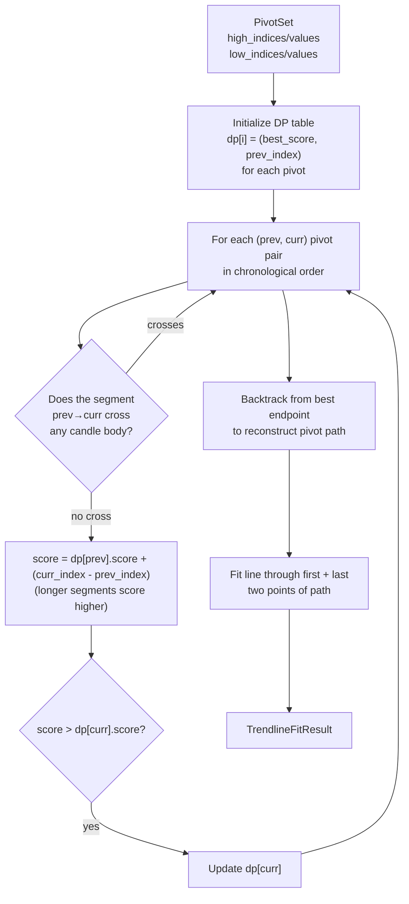
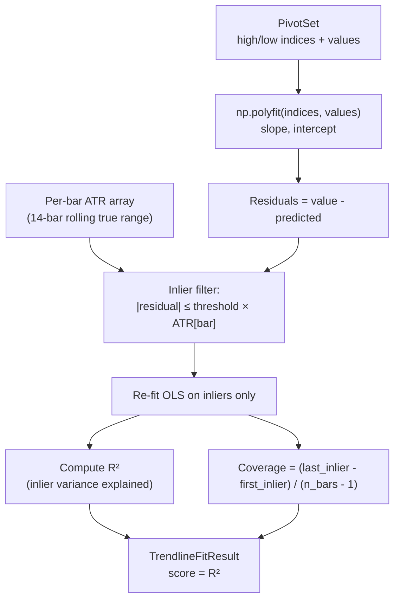
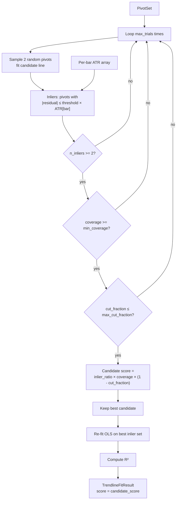

# Fitting

Trendline fitters take a `PivotSet` (and the raw OHLC DataFrame) and return a
`TrendlineFitResult` containing the best-fit support and resistance lines.

## Registry

```python
from libs.models.trendlines import build_fitter, list_fitters

list_fitters()   # ("pathfinding", "least_squares", "ransac")

fitter = build_fitter("pathfinding", pivot_window=5)
result = fitter.fit(df, pivots=pivot_set)
```

## Protocol (`fitting/base.py`)

All fitters implement `TrendlineFitter`:

```python
class TrendlineFitter(Protocol):
    def fit(
        self,
        df: pd.DataFrame,
        pivots: Optional[PivotSet] = None,
    ) -> TrendlineFitResult:
        ...
```

If `pivots=None`, the fitter runs its own extraction using a default `FractalPivotExtractor`
with `pivot_window`. Pass pre-computed pivots to decouple extraction from fitting.

## Adding a New Fitter

1. Create `app/trendlines/fitting/my_fitter.py`
2. Implement and decorate:
   ```python
   from libs.models.trendlines.fitting.base import register_fitter

   @register_fitter(
       name="my_fitter",
       search_grid=[
           {"fitter": {"name": "my_fitter", "params": {"threshold": v}}}
           for v in (0.3, 0.5, 0.8)
       ],
   )
   class MyFitter:
       def __init__(self, threshold: float = 0.5, pivot_window: int = 3):
           ...

       def fit(self, df, pivots=None) -> TrendlineFitResult:
           ...
   ```
3. Import in `fitting/__init__.py` to trigger registration

## Fitter 1 — Pathfinding (`fitting/pathfinding.py`) — Default

### Algorithm

Uses dynamic programming to find the longest valid trendline path through pivot points.
"Validity" means the proposed line does not cross any candle body between touches.



**Candle body crossing check:** For each bar between `prev` and `curr`, the proposed line value
`slope × bar + intercept` must not lie strictly between `open` and `close` (the body). Wick
penetrations are allowed.

**Scoring:** A segment's contribution to the DP score is its length in bars
(`curr_index - prev_index`). This biases toward lines that span as many bars as possible — the
"most persistent" structural levels.

**Coverage score:** Final `Trendline.score` = `(last_touch_index - first_touch_index) / (n_bars - 1)`.
A line spanning the full window gets score 1.0.

### Parameters

| Parameter | Default | Search Grid |
|-|-|-|
| `pivot_window` | `3` | `(2, 3, 5)` |

### Strengths / Trade-offs

- **Strengths**: Respects candle body integrity; finds globally optimal non-crossing path.
- **Trade-offs**: Greedy DP — sensitive to pivot ordering. Does not re-fit with OLS; slope is
  determined by the first and last two pivots on the path (not minimizing global residuals).

## Fitter 2 — Least Squares (`fitting/least_squares.py`)

### Algorithm

Fits an OLS regression line through all pivot points, then filters outliers by ATR-scaled
residuals to improve robustness.



**R² computation:** Uses the inlier set only. `R² = 1 - SS_res / SS_tot`. If `SS_tot < 1e-12`
(near-constant prices), R² is set to 1.0.

**Score:** `Trendline.score = R²`. Higher is better.

### Parameters

| Parameter | Default | Search Grid |
|-|-|-|
| `pivot_window` | `3` | `(2, 3, 5)` |
| `residual_threshold_atr` | `0.5` | `(0.3, 0.5, 0.8)` |
| `atr_window` | `14` | fixed |

### Strengths / Trade-offs

- **Strengths**: Globally minimizes residuals; handles noisy pivot sets well.
- **Trade-offs**: Does not check candle body violations. May produce lines that visually cross
  candle bodies if the OLS regression is pulled by outliers.

## Fitter 3 — RANSAC (`fitting/ransac.py`)

### Algorithm

Random consensus sampling: randomly samples pairs of pivots, fits candidate lines, evaluates
inlier quality, and selects the best candidate.



**Coverage:** `(last_inlier_index - first_inlier_index) / (n_bars - 1)`. Must be ≥ `min_coverage`.

**Cut fraction:** Fraction of bars between start and end where the candidate line lies strictly
inside a candle body (`open < line < close` or `close < line < open`). Must be ≤ `max_cut_fraction`.

**Re-fit:** After selecting the best pair, OLS is re-run on all inliers (not just the 2 seed
pivots) for the final `slope` and `intercept`.

### Parameters

| Parameter | Default | Search Grid |
|-|-|-|
| `pivot_window` | `3` | `(2, 3)` |
| `residual_threshold_atr` | `0.5` | `(0.3, 0.5)` |
| `max_trials` | `250` | fixed |
| `max_cut_fraction` | `0.15` | `(0.1, 0.2)` |
| `min_coverage` | `0.3` | fixed |
| `atr_window` | `14` | fixed |
| `seed` | `42` | fixed |

### Strengths / Trade-offs

- **Strengths**: Robust to outlier pivots; considers candle-body violations explicitly via
  `cut_fraction`; non-determinism controlled via fixed `seed`.
- **Trade-offs**: Higher computational cost (`O(max_trials × n_pivots)`). More hyperparameters.

## Algorithm Comparison

| Aspect | Pathfinding | Least Squares | RANSAC |
|-|-|-|-|
| Score metric | Coverage fraction | R² | Inlier × coverage × (1-cut) |
| Candle body check | Yes (explicit) | No | Via cut_fraction |
| Outlier resistance | High (path constraint) | Medium (ATR filter) | High (random consensus) |
| Deterministic | Yes | Yes | Yes (fixed seed) |
| Computational cost | O(n²) pivot pairs | O(n) | O(trials × n) |
| Best for | Clean structural levels | Noisy markets | Mixed signal-to-noise |

## TrendlineFitResult

```python
@dataclass
class TrendlineFitResult:
    support_lines:    List[Trendline]   # sorted by score descending
    resistance_lines: List[Trendline]
    is_valid: bool                      # True when both lists are non-empty
    metadata: dict                      # extractor_name, fitter_name, n_pivots, timing

    @property
    def best_support(self) -> Optional[Trendline]:
        """Trendline with highest score in support_lines."""

    @property
    def best_resistance(self) -> Optional[Trendline]:
        """Trendline with highest score in resistance_lines."""
```

`Trendline.metadata` (fitter-specific extras):

| Key | Set by | Description |
|-|-|-|
| `method` | all | Fitter name string |
| `inlier_ratio` | LS, RANSAC | Fraction of pivots that are inliers |
| `coverage` | all | Bar span fraction |
| `r_squared` | LS, RANSAC | OLS R² of inlier set |
| `n_trials` | RANSAC | Number of RANSAC iterations run |
