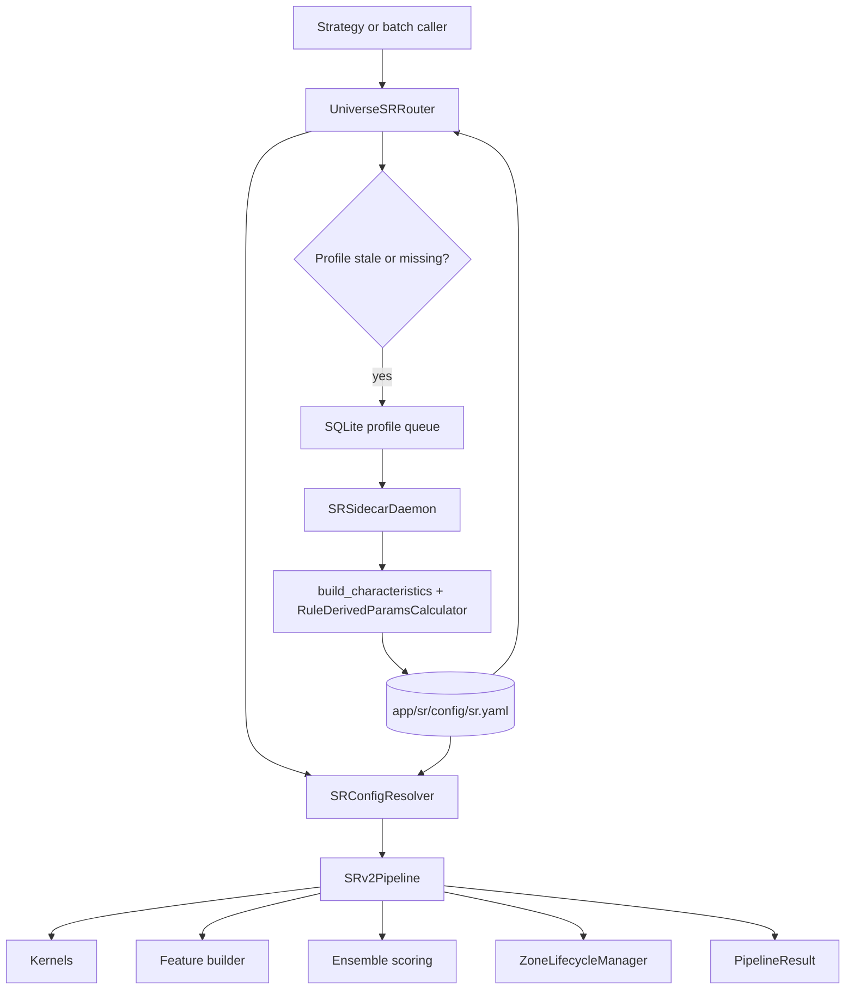
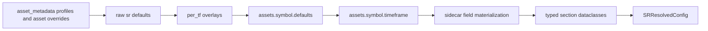
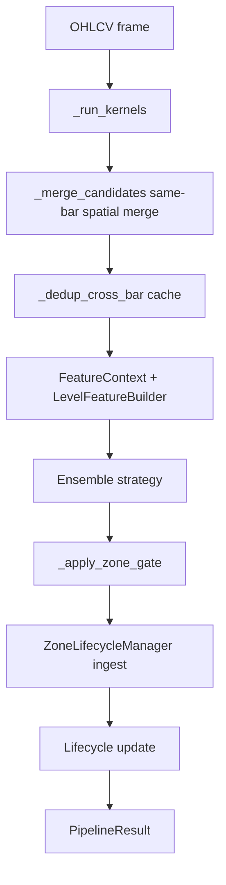
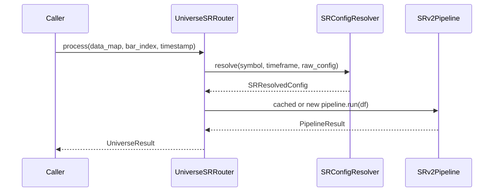
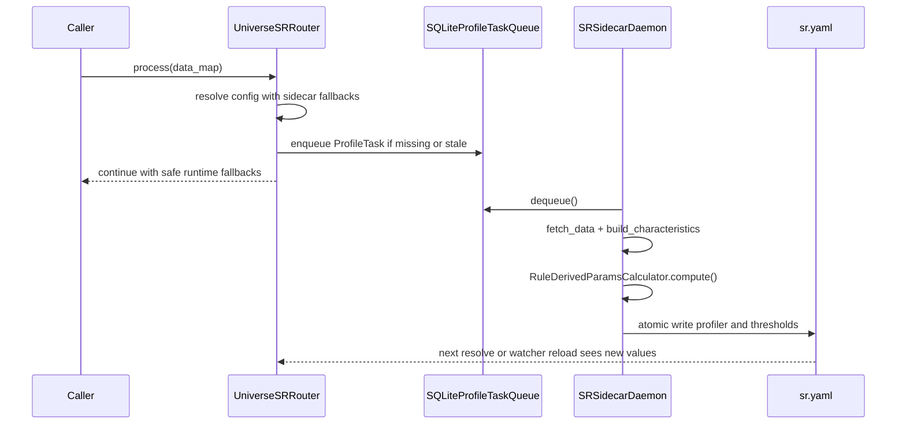

# S/R Architecture Deep Dive

Scope: live implementation snapshot as of 2026-05-08.

This document is the long-form runtime handoff for the Support/Resistance module under `app/sr/`. It is intentionally grounded in the current codebase rather than only the older rollout plans. Use this as the first architecture note when context is thin or when handing work to another agent.

For qualification and optimization details, continue with [QUALIFICATION_AND_OPTIMIZATION_DEEP_DIVE.md](QUALIFICATION_AND_OPTIMIZATION_DEEP_DIVE.md).

## 1. Reading Map

The primary live source files behind this document are:

- [app/sr/universe/router.py](../universe/router.py)
- [app/sr/universe/config.py](../universe/config.py)
- [app/sr/sidecar/daemon.py](../sidecar/daemon.py)
- [app/sr/sidecar/queue.py](../sidecar/queue.py)
- [app/sr/config_resolver.py](../config_resolver.py)
- [app/sr/config_schema.py](../config_schema.py)
- [app/sr/models.py](../models.py)
- [app/sr/pipeline.py](../pipeline.py)
- [app/sr/config/sr.yaml](../config/sr.yaml)
- [app/sr/tests/test_sidecar_daemon.py](../tests/test_sidecar_daemon.py)
- [app/sr/tests/test_integration_pipeline.py](../tests/test_integration_pipeline.py)

The older plan notes still matter because they explain intent, but the runtime truth now lives in code:

- [plan/architecture-sr-pipeline-upgrade-1.md](../../../plan/architecture-sr-pipeline-upgrade-1.md)
- [plan/architecture-sr-sidecar-optimizer-1.md](../../../plan/architecture-sr-sidecar-optimizer-1.md)

## 2. Executive Snapshot

The current S/R system is a layered structure engine, not a trade-decision engine.

Its runtime job is to:

- resolve typed config for one `(asset, timeframe)` pair,
- run stateless detection kernels,
- score candidate levels through a feature + ensemble pipeline,
- manage stateful zone lifecycle transitions over time,
- optionally enrich multi-asset optimization flows,
- and stay live even when sidecar-derived microstructure data is missing.

Its non-runtime job is to:

- profile asset microstructure asynchronously through the sidecar,
- qualify assets cross-sectionally before expensive optimization,
- optimize shared and per-asset parameters offline,
- and persist deterministic or optimized overrides back into YAML.

The most important architectural boundary is this:

- kernels are stateless,
- pipeline and lifecycle are stateful,
- sidecar performs heavy deterministic profiling outside the live hot path,
- optimization is offline and may write back configuration, but it is not part of the bar-by-bar runtime.

## 3. High-Level Design

At a high level:

- `UniverseSRRouter` owns orchestration, caching, optional sidecar queueing, and optional config hot reload.
- `SRConfigResolver` turns raw YAML plus per-call context into a typed `SRResolvedConfig`.
- `SRv2Pipeline` turns OHLCV input into `PipelineResult`.
- `SRSidecarDaemon` turns historical OHLCV into deterministic YAML overrides.
- the qualification and optimization stack sits beside this runtime, not inside it.

## 4. Core Contracts And Persistent Surfaces

### 4.1 Top-level YAML ownership

The active config surface in [app/sr/config/sr.yaml](../config/sr.yaml) is divided into four main layers:

- `asset_metadata`: market-structure defaults and per-asset metadata overrides.
- `sr`: global runtime defaults and optimizer/qualification defaults.
- `per_tf`: global timeframe-specific overlays.
- `assets`: per-asset and per-asset-per-timeframe overrides, including sidecar materialization and optimization metadata.

### 4.2 Primary dataclasses

The stable data contracts in [app/sr/models.py](../models.py) and [app/sr/config_schema.py](../config_schema.py) are:

- `AssetMetadata`: structural market facts such as sessions, gap policy, round-number mode, and lookback horizons.
- `AssetCharacteristics`: offline or analysis-time measurements such as `wick_p75_atr`, `body_p50_atr`, and `range_p90_atr`.
- `CandidateLevel`: immutable kernel output.
- `LevelFeatureVector`: typed features for one candidate.
- `ScoredLevel`: ensemble-scored candidate.
- `RuleDerivedParams`: typed bundle handed into kernels and lifecycle logic.
- `SRResolvedConfig`: frozen runtime config assembled by the resolver.

### 4.3 Runtime-only versus persisted data

Persisted YAML sections include:

- `_profiler_meta`: sidecar profiling timestamp and raw microstructure summary.
- `pipeline`, `lifecycle`, and `enhancement` overrides under `assets.{symbol}.{tf}`.
- `_optimization_meta`: per-asset optimization timestamp and characteristics snapshot.

Runtime-only state includes:

- `UniverseSRRouter._pipelines`
- `UniverseSRRouter._raw_configs`
- `UniverseSRRouter._profile_request_at`
- `SRv2Pipeline._candidate_cache`
- `ZoneLifecycleManager` state inside each pipeline instance

## 5. Config Resolution In Detail

The config cascade in [app/sr/config_resolver.py](../config_resolver.py) is the compatibility boundary for nearly everything else.

The resolver does four distinct jobs.

### 5.1 Metadata resolution

`_resolve_metadata()` maps asset profile defaults such as `crypto`, `equity`, and `fx` into a typed `AssetMetadata` object, then overlays per-asset metadata.

This is where session behavior, gap policy, and round-number mode are decided. The rest of the runtime should branch on these metadata fields, not on ad hoc asset-name checks.

### 5.2 Structural cascade merge

`_cascade_merge()` overlays:

- `sr`
- `per_tf.{timeframe}`
- `assets.{symbol}.defaults`
- `assets.{symbol}.{timeframe}`

This keeps the runtime shallow: one merged dict is produced before typed dataclass construction.

### 5.3 Sidecar field materialization

`_materialize_sidecar_fields()` is where the resolver projects sidecar-owned values into the live runtime surface.

It reads the asset/timeframe bucket and fills in:

- `pipeline.merge_threshold_pct_atr`
- `pipeline.dedup_proximity_atr`
- `pipeline.zone_half_width_atr`
- `lifecycle.breakout_atr_threshold`
- `lifecycle.touch_proximity_atr`
- `lifecycle.false_breakout_recovery_bars`
- `enhancement.volume_spike_threshold`

If those fields are absent, the resolver does not fail. Instead it:

- installs safe fallback defaults,
- marks `SRResolvedConfig.requires_sidecar_derivation = True`,
- and preserves whatever `_profiler_meta` exists.

This is what allows the runtime to keep running before the sidecar catches up.

### 5.4 Live rule-derived bundle

The current runtime does not compute full rule-derived params from fresh live `AssetCharacteristics` inside `resolve()`.

Instead, `_build_live_rule_derived_params()` builds a mixed bundle from:

- timeframe-based formulas,
- neutral defaults,
- already-materialized sidecar values,
- and explicit lifecycle/enhancement overrides.

Important nuance:

- `SRConfigResolver.resolve()` still accepts a `characteristics` argument,
- but the live path currently does not use that argument to recompute the runtime rule-derived surface,
- while `RuleDerivedParamsCalculator.compute()` is still actively used by the sidecar for offline materialization.

That means the current architecture is intentionally asymmetric:

- heavy data-derived math happens offline in the sidecar,
- the runtime consumes persisted values plus safe fallbacks.

### 5.5 Key formulas that the sidecar materializes

The deterministic microstructure mapping currently comes from `RuleDerivedParamsCalculator.compute()` in [app/sr/config_resolver.py](../config_resolver.py):

- `merge_threshold_pct_atr = max(0.15, wick_p75_atr * 0.5)`
- `dedup_proximity_atr = max(0.3, wick_p75_atr)`
- `zone_half_width_atr = max(0.05, wick_p75_atr * 0.25)`

These are persisted into YAML by the sidecar and then consumed by the runtime.

### 5.6 Tradeoff and rejected alternative

Current choice:

- keep the runtime path data-free and make the sidecar own expensive profiling.

Alternative:

- compute `AssetCharacteristics` inline inside `UniverseSRRouter` or `SRConfigResolver` on demand.

Why the current design wins:

- deterministic live latency,
- no historical warmup fetches in the hot path,
- no pipeline rebuild driven by late-arriving local data.

What it costs:

- the sidecar and YAML become part of the runtime control plane,
- and any mismatch between persisted YAML and profiler intent can linger until a new profile job runs.

## 6. Universe Router And Hot-Reload Layer

`UniverseSRRouter` in [app/sr/universe/router.py](../universe/router.py) is the runtime coordinator.

Its main responsibilities are:

- build raw config per `(asset, timeframe)` pair,
- cache `SRv2Pipeline` instances,
- enqueue profile work when sidecar data is stale or missing,
- optionally watch the YAML file and hot-reload pipelines,
- process a whole `data_map` across assets and timeframes.

### 6.1 What the router caches

The router maintains:

- `_pipelines`: one stateful pipeline per `asset:timeframe`.
- `_raw_configs`: the raw config used to build each pipeline.
- `_profile_request_at`: throttle guard so the same profile task is not enqueued repeatedly.

### 6.2 Sidecar-trigger logic

When sidecar mode is enabled, the router checks:

- `resolved.requires_sidecar_derivation`, or
- `_profile_is_stale(resolved)` based on `_profiler_meta.last_profiled_at` and `sidecar_stale_after_days`.

If one of those conditions holds, `_enqueue_profile_task_if_needed()` pushes a `ProfileTask` into the SQLite queue, but throttles repeated requests for the same key to once per hour.

### 6.3 Hot reload semantics

If `sidecar_watch_config` is enabled and `watchdog` is installed, the router watches `sr.yaml` and calls `_reload_pipelines_from_config()` after a real file modification.

Reload behavior is conservative:

- resolve a new config for each cached pipeline,
- if the resolved config is unchanged, keep the existing pipeline,
- otherwise create a new `SRv2Pipeline`,
- transplant `_candidate_cache` from the old pipeline,
- replace the cached pipeline atomically.

The cache handover matters because otherwise cross-bar dedup would forget recent event history after every hot reload.

### 6.4 Tradeoff and rejected alternative

Current choice:

- one cached stateful pipeline per `(asset, timeframe)` plus hot reload.

Alternative:

- rebuild a pipeline every call from scratch.

Why the current design wins:

- lifecycle state and cross-bar dedup survive across bars,
- config reload is local and cheap,
- router can stay parallel-friendly.

What it costs:

- pipeline cache semantics must be correct,
- reload logic must preserve the right state and not over-preserve stale state.

## 7. Sidecar Architecture

The sidecar runtime lives in:

- [app/sr/sidecar/queue.py](../sidecar/queue.py)
- [app/sr/sidecar/daemon.py](../sidecar/daemon.py)
- [app/sr/scripts/_utils.py](../scripts/_utils.py)

### 7.1 Queue layer

The queue is currently SQLite-only.

`SQLiteProfileTaskQueue` provides:

- `enqueue()`
- `dequeue()`
- `ack()`
- `requeue()`
- `list_pending()`

The schema stores:

- `symbol`
- `timeframe`
- `reason`
- `timestamp`
- `state`
- `attempts`

Enqueue semantics delete duplicate pending or processing rows for the same symbol/timeframe before inserting a fresh task. That means queue dedup happens at the transport layer before the daemon runs.

### 7.2 Daemon layer

`SRSidecarDaemon` performs:

1. read current YAML,
2. resolve metadata and base rule-derived config,
3. determine lookback horizon using `get_optimal_lookback_days(timeframe)` unless an override is supplied,
4. fetch historical OHLCV through `fetch_data`,
5. compute `AssetCharacteristics` via `build_characteristics`,
6. compute deterministic thresholds through `RuleDerivedParamsCalculator.compute()`,
7. write `_profiler_meta`, `pipeline`, `lifecycle`, and `enhancement` overrides back into YAML.

### 7.3 Write path and failure model

The daemon tries to use `ruamel.yaml` to preserve formatting and comments. If unavailable, it falls back to `yaml.safe_load` and `yaml.safe_dump`.

The actual file write is atomic:

- create temp file in the target directory,
- dump payload,
- `os.replace()` temp file onto the target.

If processing fails, the task is requeued instead of acknowledged.

### 7.4 Tradeoff and rejected alternative

Current choice:

- persist sidecar output into the same YAML that the runtime already consumes.

Alternative:

- persist into Redis or a database and have the resolver query that store.

Why the current design wins:

- one inspectable source of truth,
- easy to diff and review,
- compatible with the existing config cascade.

What it costs:

- YAML becomes both config and materialized-data store,
- file-watch and atomic-write correctness matter,
- merge conflicts are more plausible when humans and automation touch the same file.

## 8. Pipeline Internals

`SRv2Pipeline` in [app/sr/pipeline.py](../pipeline.py) is the per-asset/per-timeframe execution engine.

### 8.1 Kernel execution

Kernels are registry-backed and stateless. The pipeline hands each kernel a `KernelConfig` containing:

- kernel-specific params,
- asset metadata,
- the `RuleDerivedParams` bundle,
- timeframe,
- optional extras such as the asset name.

If one enabled kernel fails, `_run_kernels()` raises `PipelineKernelError` and aborts the run. This is deliberately fail-fast.

### 8.2 Same-bar spatial merge

`_merge_candidates()` removes collinear candidates within the same bar using `pipeline.merge_threshold_pct_atr` and the candidate ATR at detection.

Processing is separated by `LevelType` and keeps the highest raw-score candidate first.

### 8.3 Cross-bar dedup

`_dedup_cross_bar()` handles the classic stateless-kernel spam problem.

The key implementation detail is `_fingerprint()`:

- event-style kernels such as `fair_value_gap`, `order_block`, and `liquidity_sweep` fingerprint on kernel type plus absolute event timestamp,
- level-style kernels fingerprint on quantized price buckets.

This matters because sliding windows change relative indices, but absolute event timestamps remain stable.

Cache eviction is based on `candidate_dedup_staleness_bars`. Once a cached fingerprint is older than the staleness horizon, it is removed and allowed to emit again.

### 8.4 Feature and ensemble stages

After deduplication, the pipeline builds `FeatureContext` from:

- ATR,
- current price and volume,
- rolling average volume,
- metadata,
- optional regime signal from `RegimeGate`.

`LevelFeatureBuilder` then computes typed features for every candidate before the ensemble scores them.

### 8.5 Lifecycle stage

The pipeline builds a flattened lifecycle config from:

- resolved lifecycle config,
- resolved enhancement config,
- `RuleDerivedParams` fallbacks.

`ZoneLifecycleManager` then:

- ingests new scored levels,
- updates existing zones,
- emits lifecycle events,
- keeps active and historical zone sets.

### 8.6 Tradeoff and rejected alternative

Current choice:

- keep kernels stateless and move suppression/state into pipeline and lifecycle.

Alternative:

- let each kernel remember what it emitted on prior bars.

Why the current design wins:

- kernels remain pure and easier to test,
- state ownership is centralized,
- hot reload can preserve only the caches that matter.

What it costs:

- pipeline complexity increases,
- dedup fingerprint semantics are critical and subtle,
- more care is needed when replacing pipeline instances.

## 9. Runtime Data Travel

### 9.1 Fresh-profile path

### 9.2 Missing or stale profile path

### 9.3 What continues to work without sidecar data

The pipeline still runs when sidecar values are absent because the resolver injects safe fallback values and marks the config as needing sidecar derivation.

That is a deliberate design choice: stale structure is acceptable for a short time; blocked execution is not.

## 10. Known Architectural Boundaries

These are the rules that should remain true unless a deliberate redesign is approved.

- S/R is a structural-information provider, not a trade-entry engine.
- Qualification uses relative ranking, not absolute hard gates.
- Kernels should remain stateless.
- The live resolver should stay data-light and deterministic.
- The sidecar should remain the owner of expensive deterministic microstructure extraction.
- Missing sidecar or optimization metadata should degrade gracefully to fallbacks, not raise runtime-blocking exceptions.

## 11. Known Nuances And Risks In The Current Snapshot

These are not necessarily bugs, but they are important handoff facts.

- Older plan docs describe removing `RuleDerivedParamsCalculator` from the live path. Current code still keeps that calculator for the sidecar, while the runtime resolver uses a materialized live bundle.
- `resolve(..., characteristics=...)` still exists in the API surface, but the current runtime path is not driven by those characteristics.
- YAML now serves both as configuration and as a materialized-state store for sidecar and optimization metadata.
- The optional sidecar config watcher depends on `watchdog`; without it, profiling still works, but reload becomes pull-based on the next resolve rather than file-watch driven.

## 12. Where To Change What

Use this map when deciding the shallowest safe edit surface.

- Config semantics or backward compatibility: [app/sr/config_resolver.py](../config_resolver.py)
- Typed config defaults: [app/sr/config_schema.py](../config_schema.py)
- Persisted YAML contract: [app/sr/config/sr.yaml](../config/sr.yaml)
- Per-asset runtime orchestration and sidecar queueing: [app/sr/universe/router.py](../universe/router.py)
- Deterministic microstructure profiling: [app/sr/sidecar/daemon.py](../sidecar/daemon.py)
- Queue semantics: [app/sr/sidecar/queue.py](../sidecar/queue.py)
- Detection, merge, cross-bar dedup, feature, and lifecycle flow: [app/sr/pipeline.py](../pipeline.py)
- Qualification and optimization: [QUALIFICATION_AND_OPTIMIZATION_DEEP_DIVE.md](QUALIFICATION_AND_OPTIMIZATION_DEEP_DIVE.md)

## 13. Related Documents

- [QUALIFICATION_AND_OPTIMIZATION_DEEP_DIVE.md](QUALIFICATION_AND_OPTIMIZATION_DEEP_DIVE.md)
- [README.md](README.md)
- [OPTIMIZATION.md](OPTIMIZATION.md)
- [KERNEL_REFERENCE.md](KERNEL_REFERENCE.md)
- [SR_CONFIG_PLACEMENT_POLICY.md](SR_CONFIG_PLACEMENT_POLICY.md)