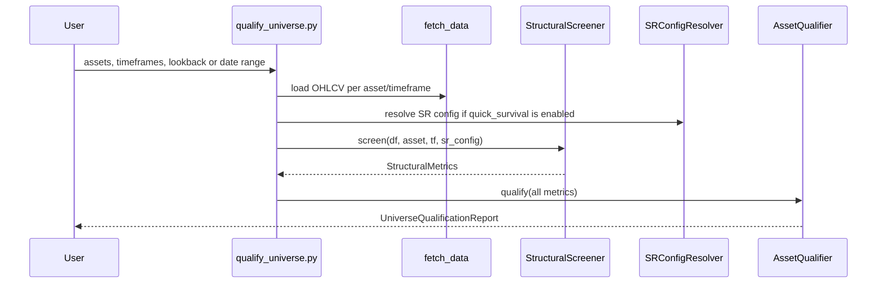
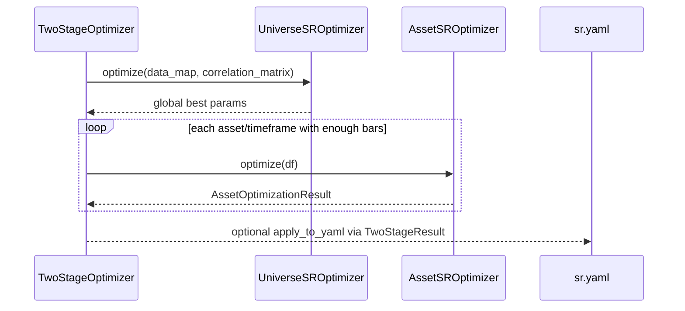

# S/R Qualification And Optimization Deep Dive

Scope: current qualification, Stage 1 optimization, Stage 2 optimization, and staleness snapshot as of 2026-05-08.

This document is the pre-optimization and offline-tuning companion to [ARCHITECTURE_DEEP_DIVE.md](ARCHITECTURE_DEEP_DIVE.md). It focuses on how assets are screened before optimization, how the two-stage optimizer is wired, what gets written back into YAML, and which implementation details matter for future changes.

## 1. Reading Map

Primary live source files:

- [app/sr/scripts/qualify_universe.py](../scripts/qualify_universe.py)
- [app/sr/qualification/screener.py](../qualification/screener.py)
- [app/sr/qualification/qualifier.py](../qualification/qualifier.py)
- [app/sr/optimization/universe_optimizer.py](../optimization/universe_optimizer.py)
- [app/sr/optimization/asset_optimizer.py](../optimization/asset_optimizer.py)
- [app/sr/optimization/two_stage_optimizer.py](../optimization/two_stage_optimizer.py)
- [app/sr/optimization/data_driven_bounds.py](../optimization/data_driven_bounds.py)
- [app/sr/optimization/multi_bar_runner.py](../optimization/multi_bar_runner.py)
- [app/sr/optimization/staleness_checker.py](../optimization/staleness_checker.py)
- [app/sr/config/sr.yaml](../config/sr.yaml)

Supporting reference docs:

- [OPTIMIZATION.md](OPTIMIZATION.md)
- [SCRIPTS.md](SCRIPTS.md)
- [plan/feature-sr-crossbar-dedup-adaptive-thresholds-1.md](../../../plan/feature-sr-crossbar-dedup-adaptive-thresholds-1.md)

## 2. System Intent

The optimization stack exists to answer a specific architectural problem:

- shared S/R semantics should be learned at the universe level,
- asset-specific residual behavior should be tuned locally,
- and neither should block or destabilize the live runtime.

This leads to four distinct layers before and around runtime:

- qualification,
- Stage 1 universe optimization,
- Stage 2 per-asset optimization,
- staleness-based re-entry decisions.

## 3. Qualification Before Optimization

The qualification flow is implemented by:

- [app/sr/scripts/qualify_universe.py](../scripts/qualify_universe.py)
- [app/sr/qualification/screener.py](../qualification/screener.py)
- [app/sr/qualification/qualifier.py](../qualification/qualifier.py)

### 3.1 Why qualification exists

Qualification is the cross-sectional pre-filter that decides which assets deserve optimization effort and how much trust downstream consumers should place in their structural zones.

Its governing philosophy is explicit in code:

- no absolute thresholds,
- relative ranking only,
- config-driven weights and tier boundaries,
- self-calibrating against the current universe.

This avoids magic gates like "only optimize assets with survival rate above X" that would break across market regimes.

### 3.2 Qualification sequence

### 3.3 Structural metrics

`StructuralScreener.screen()` currently computes three raw metrics:

- `poc_stability`: coefficient of variation of rolling VWAP-like POC proxy. Lower is better.
- `wick_body_ratio`: median wick-to-body ratio. Lower is cleaner and usually structurally better.
- `quick_survival`: short pipeline audit survival score using `MultiBarRunner`. Higher is better.

Important current default:

- `quick_survival` is disabled in the shipped YAML because it is expensive and can be biased by default runtime parameters if used too early.

### 3.4 Ranking and tiering

`AssetQualifier` turns raw metrics into:

- per-metric percentile ranks,
- weighted composite rank,
- quartile-style tier assignment,
- `confidence_weight`,
- `optimization_trials` allocation.

The active defaults come from `sr.qualification` in [app/sr/config/sr.yaml](../config/sr.yaml):

- tier boundaries: `[0.25, 0.50, 0.75]`
- confidence weights: `[1.0, 0.7, 0.4, 0.15]`
- optimization trials: `[150, 100, 50, 0]`

### 3.5 Tradeoff and rejected alternative

Current choice:

- rank assets relative to the current universe.

Alternative:

- fixed gates such as minimum volume, maximum wick ratio, or minimum survival.

Why the current design wins:

- resilient to regime shifts,
- naturally allocates budget across the actual current opportunity set,
- hard to game with a single fixed metric.

What it costs:

- qualification scores are only meaningful relative to the selected universe,
- a degraded universe can still produce a "best quartile" even when the whole set is mediocre.

## 4. Stage 1 Universe Optimization

Stage 1 is centered on [app/sr/optimization/universe_optimizer.py](../optimization/universe_optimizer.py).

### 4.1 Purpose

Stage 1 learns the shared parameter surface that should generalize across the entire universe instead of overfitting one asset.

It operates on canonical dotted config identities, such as:

- `ensemble.structural_vs_micro_ratio`
- `lifecycle.age_lambda`
- `pipeline.merge_threshold_pct_atr`
- kernel-specific strictness params like `kernels.order_block.displacement_atr`

### 4.2 How Stage 1 evaluates a trial

Stage 1 builds trial configs, runs the universe through `UniverseSRRouter`, then evaluates quality through the same temporal lifecycle lens used later in Stage 2.

Key collaborators are:

- `UniverseSRRouter`
- `MultiBarRunner`
- `ZoneQualityEvaluator`
- `CrossAssetSRAnalyzer`
- `CrossAssetBenchmark`

The intended top-level objective is:

- `total_score = avg_quality * (1 - tier6_weight) + cross_asset_score * tier6_weight`

Where:

- `avg_quality` is the mean per-asset lifecycle quality score,
- `cross_asset_score` is the Tier 6 cross-asset benchmark when a correlation matrix is available,
- `tier6_weight` is configured under `sr.optimization`.

### 4.3 Search surface shape

The default Stage 1 surface is intentionally narrower than the full possible configuration space.

The code separates:

- global-only parameters,
- kernel high-tune parameters,
- metadata-gated parameters such as session-gap thresholds.

This keeps Stage 1 searching over the parts of the surface that are expected to generalize.

### 4.4 Tradeoff and rejected alternative

Current choice:

- learn shared structure first at the universe level.

Alternative:

- jump directly to independent per-asset optimization for every symbol/timeframe.

Why the current design wins:

- provides a structural center for later per-asset regularization,
- reduces the chance that one noisy asset dominates the search surface,
- allows shared parameters to stay semantically consistent.

What it costs:

- Stage 1 can underfit a universe with genuinely heterogeneous subfamilies,
- and shared defaults may still need significant Stage 2 correction for some assets.

## 5. Stage 2 Asset Optimization

Stage 2 is centered on [app/sr/optimization/asset_optimizer.py](../optimization/asset_optimizer.py).

### 5.1 Purpose

Stage 2 refines the per-asset/per-timeframe surface around the Stage 1 center without allowing unrestricted drift.

Its job is not to relearn the entire architecture. Its job is to capture local residual behavior safely.

### 5.2 Inputs

The asset optimizer is initialized with:

- `asset`
- `timeframe`
- `global_best_params`
- `base_raw_config`
- `AssetOptimizationConfig`

The optimizer then computes additional analysis-time context from the asset's own data:

- `AssetCharacteristics`
- data-driven bounds
- kernel screening results

### 5.3 Data-driven search-space narrowing

Before trials start, `_apply_data_driven_bounds()` intersects the generic search surface with empirical bounds from [app/sr/optimization/data_driven_bounds.py](../optimization/data_driven_bounds.py).

The current derivations cover:

- `kernels.fair_value_gap.gap_min_atr`
- `kernels.order_block.displacement_atr`
- `kernels.liquidity_sweep.max_pierce_atr`
- `kernels.liquidity_sweep.sweep_lookback`
- `kernels.order_block.imbalance_ratio`
- `kernels.regression_band.band_width_sigma`
- `pipeline.merge_threshold_pct_atr`

The merge-threshold derivation is explicitly tied to wick structure:

- estimate wick ratios,
- take the 75th percentile,
- define a baseline around `max(0.15, p75 * 0.5)`,
- then optimize inside a bounded window around that baseline.

### 5.4 Kernel screening and subset selection

If kernel selection is enabled, `KernelScreener` scores kernels individually and builds a set of candidate kernel subsets before the main Optuna loop.

That means Stage 2 can optimize not only parameter values but also choose among pre-screened kernel bundles.

### 5.5 Fold evaluation logic

The main fold-level evaluation happens in `_evaluate_fold()`:

1. build a pipeline from params,
2. run `MultiBarRunner` over the fold,
3. compute lifecycle quality metrics,
4. apply a zone-count gate,
5. apply a minimum-survival constraint,
6. subtract a regularization penalty away from the Stage 1 center.

Conceptually, the fold score is:

- `score = raw_quality * gate_multiplier * constraint_multiplier - regularization_penalty`

Where:

- zone-count gate is controlled by `min_zone_count_gate` and `gate_penalty`,
- minimum survival constraint is controlled by `min_survival_rate_constraint` and `constraint_penalty_floor`,
- regularization keeps local params near the global optimum.

### 5.6 Walk-forward structure

The optimizer uses the SR-owned `WalkForwardValidator` and evaluates bar-by-bar with `MultiBarRunner`.

This is a deliberate design choice: single-bar quality is not enough to judge S/R behavior. The lifecycle needs time to express itself.

### 5.7 Acceptance and fallback logic

After Optuna finishes, Stage 2 compares train and validation means.

The current acceptance rule is:

- accept if `mean_val >= mean_train * (1 - validation_drop_threshold)`
- otherwise fall back to the global per-asset parameter center

If a result is rejected:

- `accepted = False`
- `fallback_to_global = True`

### 5.8 YAML persistence

`AssetOptimizationResult.apply_to_yaml()` writes:

- best per-asset params into `assets.{symbol}.{timeframe}`
- selected kernels into `pipeline.enabled_kernels`
- `_optimization_meta` containing
  - `last_optimized`
  - `train_score`
  - `val_score`
  - `n_folds`
  - `characteristics_snapshot`

### 5.9 Current implementation nuance

Two details matter for future work:

- `_build_pipeline()` still passes `characteristics=self._characteristics` into the resolver, but the current live resolver path does not materially recompute the rule-derived surface from that argument.
- `_train_val_scores()` currently uses the same `fold_stride` subsampling strategy as the trial loop, so the final validation pass is still strided rather than exhaustive.

The code comments describe an intent to evaluate all folds after Optuna, but the current implementation still strides.

### 5.10 Tradeoff and rejected alternative

Current choice:

- local tuning with gates, constraints, regularization, and walk-forward validation.

Alternative:

- unconstrained per-asset Bayesian search over a wide open surface.

Why the current design wins:

- better protection against curve fit,
- retains a stable center from Stage 1,
- lifecycle quality is evaluated through time instead of at a single snapshot.

What it costs:

- slower evaluation,
- more moving parts,
- and some approximation because fold striding trades accuracy for runtime.

## 6. Two-Stage Orchestration

The orchestrator in [app/sr/optimization/two_stage_optimizer.py](../optimization/two_stage_optimizer.py) ties the pieces together.

### 6.1 Stage boundaries

The orchestrator does the following:

- run Stage 1 once,
- skip Stage 2 for assets without enough data,
- run Stage 2 independently per asset/timeframe,
- collect accepted or fallback results,
- emit a combined `TwoStageResult`.

### 6.2 Result-emission nuance

`TwoStageResult._write_to_cfg()` has a subtle but important behavior:

- if per-asset results exist, Stage 1 globals are written into each optimized asset/timeframe bucket before Stage 2 overlays are applied,
- only when no per-asset results exist does it fall back to writing globals into `sr.*`.

This avoids polluting global defaults but means the applied YAML can become more explicit and more local than a naive reader expects.

### 6.3 Tradeoff and rejected alternative

Current choice:

- one orchestrator that keeps Stage 1 and Stage 2 results together.

Alternative:

- separate scripts with ad hoc handoff artifacts.

Why the current design wins:

- one combined result object,
- one persistence path,
- and one place to describe what was optimized, accepted, skipped, or rejected.

What it costs:

- more coupling between result-writing semantics and optimization logic,
- and more care needed when deciding whether a parameter belongs globally or locally.

## 7. Staleness And Re-entry

The current staleness helper lives in [app/sr/optimization/staleness_checker.py](../optimization/staleness_checker.py).

It checks three conditions:

- age of optimization result,
- drift in `wick_body_ratio`,
- drift in `atr_pct`,
- drift in `hurst`.

The output is a `StalenessResult` with:

- `stale`
- `reason`
- `age_days`
- `wick_drift`
- `atr_drift`

Important current snapshot detail:

- the staleness checker exists as a reusable component,
- but it is not currently wired directly into `UniverseSRRouter.process()`.

So optimization freshness is available for schedulers, scripts, or orchestration layers, but it is not yet an automatic runtime re-optimization trigger inside the router.

That distinction matters in handoff discussions.

## 8. Operational Boundaries

These constraints should remain true unless a redesign is explicitly approved.

- Qualification should stay relative and cross-sectional.
- Stage 1 should keep ownership of the shared structural center.
- Stage 2 should remain a constrained local refinement, not a fresh unconstrained search.
- The live runtime should not invoke Optuna.
- `_optimization_meta` should remain sufficient to support age and drift checks without needing to replay old datasets.

## 9. Known Implementation Nuances

These are the main details that another agent is most likely to miss.

- Qualification can run without quick survival, and the shipped config currently defaults that metric off.
- Asset optimizer characteristics are heavily used for bounds and snapshots, but not currently to recompute the runtime rule-derived surface during resolve.
- Final train/validation scoring is still strided in the current implementation.
- `TwoStageResult` localizes Stage 1 globals into asset/timeframe buckets when per-asset results are present.
- Optimization staleness logic exists but is not automatically enforced by the live router.

## 10. Where To Change What

- Qualification metrics or ranking logic: [app/sr/qualification/screener.py](../qualification/screener.py), [app/sr/qualification/qualifier.py](../qualification/qualifier.py)
- Qualification CLI behavior: [app/sr/scripts/qualify_universe.py](../scripts/qualify_universe.py)
- Stage 1 search surface or objective: [app/sr/optimization/universe_optimizer.py](../optimization/universe_optimizer.py)
- Stage 2 gates, constraints, or persistence: [app/sr/optimization/asset_optimizer.py](../optimization/asset_optimizer.py)
- Data-driven bounds: [app/sr/optimization/data_driven_bounds.py](../optimization/data_driven_bounds.py)
- Orchestration and YAML emission: [app/sr/optimization/two_stage_optimizer.py](../optimization/two_stage_optimizer.py)
- Staleness thresholds: [app/sr/optimization/staleness_checker.py](../optimization/staleness_checker.py)

## 11. Related Documents

- [ARCHITECTURE_DEEP_DIVE.md](ARCHITECTURE_DEEP_DIVE.md)
- [OPTIMIZATION.md](OPTIMIZATION.md)
- [SCRIPTS.md](SCRIPTS.md)
- [KERNEL_REFERENCE.md](KERNEL_REFERENCE.md)
