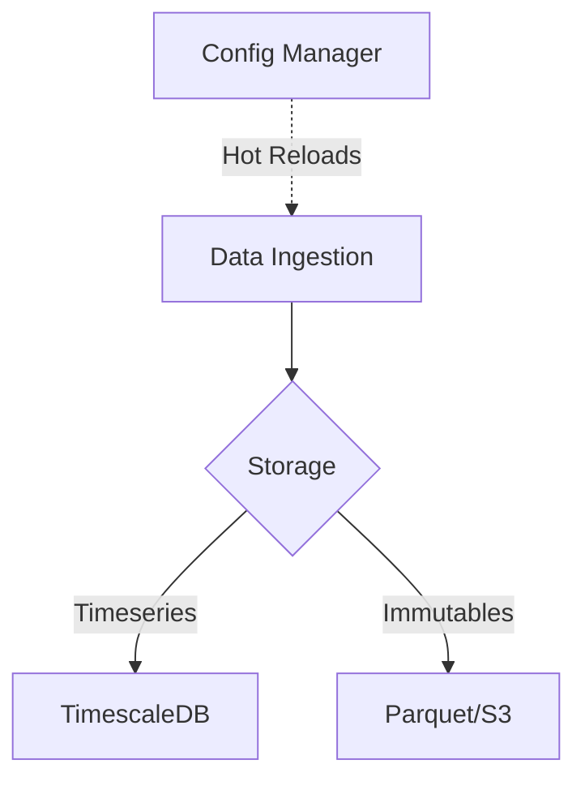

# Architecture Decision Records (ADRs)

This directory contains our architectural decisions documented as ADRs. We use ADRs to keep track of the context and consequences of major structural choices we make.

## What is an ADR?

An Architecture Decision Record (ADR) is a short text file in a format similar to an Alexandrian pattern that describes a set of forces and a single decision in response to those forces.

## Current Decisions

* **ADR-001**: [Data Ingestion Extensibility (Draft)](#)
* **ADR-002**: [Zero-Dependency Logging Engine](../best_practices.md) (See Best Practices)

### Example Mermaid Diagram for Architecture

