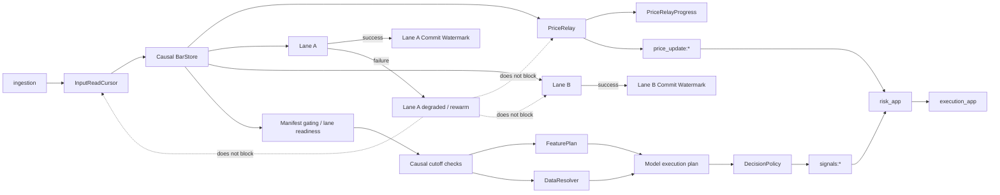

# `decision_app` architecture freeze

Status: D0 architecture is frozen and the approved D9D implementation is
current. D10 certifies the current bounded core envelope; final model-mix
resource recertification remains required after model integration.

`decision_app` is a single runtime application that evaluates an explicit catalog
of model plugins over causal market context. It is not a new market-data source,
not a replacement for risk or execution, and not a collection of model services.
The application owns decision formation only. `ingestion` remains the canonical
OHLCV authority, `risk_app` remains responsible for risk and position policy, and
`execution_app` remains responsible for order execution.

The approved implementation currently covers D9A startup reconstruction, D9B's
direct-cursor live transaction, D9C's ASGI-owned service/lifecycle/control
shell, and D9D's model-independent PriceRelay/risk-continuity path. This
document remains the source of truth for those semantics.

## Scope and ownership

The runtime accepts finalized canonical candles from `ingestion`, reconstructs a
bounded causal view, resolves the data required by the configured model bindings,
evaluates a small same-lane dependency plan, applies a lane-local decision policy,
and publishes at most one authoritative trade signal for each `(asset, decision
timeframe, market_as_of)`. The independently configured `PriceRelay` publishes
the price cadence required by downstream risk monitoring even when no model is
ready or a model evaluation fails.

The ownership boundary is:

| Concern | Owner | D0 rule |
| --- | --- | --- |
| Canonical candles and ordinary HTFs | `ingestion` | One canonical venue/instrument/timeframe history; no local re-aggregation in the decision hot path. |
| Causal bar history | `decision_app` `BarStore` | Bounded, shared views driven by `InputReadCursor` and explicit lane cutoffs; no model-owned copies of the full history. |
| Model graph and parameters | `decision_app` configuration | Static for a running process; lifecycle does not rewrite topology. |
| External data acquisition | `DataResolver` | Models request semantic concepts; models never access DB, Valkey, HTTP, or scraper clients. |
| Decision composition | Lane-local `DecisionPolicy` | Normalization, gating, and weighting are explicit; raw scores are not assumed comparable. |
| Price monitoring input | `PriceRelay` | Independent from model evaluation and policy success. |
| Risk, sizing, SL/TP, positions | `risk_app` | Downstream authority; not moved into `decision_app`. |
| Orders and fills | `execution_app` | Downstream execution authority. |

The canonical configuration boundary is now reserved and partially materialized:
the global file carries the already-approved live-input/publication settings,
while concrete production asset files remain intentionally absent until reviewed
models are integrated:

```text
configs/decision/global.yaml
configs/decision/assets/{MANIFEST_ASSET}.yaml
```

Global policy controls runtime bounds, price relay, shared-feature allow/deny,
data-source routing, publication limits, and concurrency. Asset configuration
declares model bindings, plugin names, parameters, lane policy, dependencies,
and stable `risk_profile_key` values. Model code owns intrinsic capabilities and
safe defaults. There is no inheritance/template/expression language and no hot
graph mutation in V1.

## Runtime topology



Progress is deliberately split. `InputReadCursor` belongs to the canonical stream
reader and shared `BarStore`; it advances as observations are accepted and never
waits for a model publication. Each lane owns its `LaneCommitWatermark`, which may
lag the input cursor while that lane retries, degrades, or causally re-warms.
`PriceRelayProgress` is independent of both and records PriceRelay handling and
continuity evidence. A degraded lane cannot block input reading, PriceRelay, or
unrelated lanes.

The physical transport names above describe the existing downstream boundary;
the decision contracts use explicit typed fields and do not inherit an ambiguous
numeric timestamp convention.

## Asset availability and lanes

There is no required concrete `AssetRuntime` actor or class. The approved D9C
implementation expresses the per-asset lifecycle boundary through authoritative
ingestion manifest gating, static lane plans, generation rebuilds, and lane
readiness. An ingestion manifest/lifecycle event can make a configured asset
available, paused, or removing, but it cannot add a model, change a model
timeframe, or invent a worker. Unconfigured ingestion assets never create
decision lanes.

Each `DecisionLane` is identified by a stable asset and decision-timeframe
identity. It declares its trigger timeframe, required canonical context, feature
plan, data requirements, model bindings, policy, and output authority. V1
dependencies are static, named, acyclic, and confined to the same lane. A lane
may have analytical or predictive models that emit artifacts without emitting a
trade signal. Only the lane policy may publish the authoritative signal.

One authoritative lane owns a given `(asset, decision timeframe)` output. Shadow
or research lanes may calculate results, but they cannot publish to the
authoritative `signals:*` stream.

## Causal bars, progress, and readiness

The shared `BarStore` stores bounded canonical observations keyed by lane
identity and timeframe. It exposes views at a causal cutoff, not merely the last
arrival, and continues advancing from `InputReadCursor` when an individual lane
is degraded. A lane is ready only when every required input is complete through
its cutoff and all required dependencies/data snapshots are resolved.

Arrival ordering is not causal ordering. If a 1h trigger arrives while a required
4h context is not complete, the lane performs a bounded wait and an explicitly
bounded historical resolution attempt. It then evaluates only if the required
causal cutoff is reached. It never silently substitutes an older HTF observation.
Missing required data, an unavailable dependency, a causal gap, or a model
exception fails the affected evaluation closed. For a stateful binding, the
binding becomes `DEGRADED`/`INVALID` and must causally re-warm to a newer safe
cutoff before it can be `LIVE`; it may not continue from stale committed state.
The affected lane's `LaneCommitWatermark` remains unchanged while input reading,
BarStore advancement, PriceRelay, and unrelated lanes continue.

In the current D9C service, `RECONSTRUCTION_REQUIRED` is a lane-local
fail-closed condition. It marks the service degraded in place and does not
automatically rebuild the whole generation, so healthy input streams and lanes
continue. Explicit manual `reconnect()`/`resume()` and authoritative lifecycle
reconciliation are the current full-generation reconstruction boundaries.

## FeaturePlan and policy

Feature computation has three categories:

1. shared canonical features, calculated once per relevant lane/as-of when both a
   model requires them and operator feature policy allows them;
2. model-private deterministic transforms, kept inside the model plugin; and
3. disabled or unavailable features, which make a binding unavailable when the
   requirement is required and otherwise are represented as absent optional data.

There is no universal always-on feature vector and no internal feature stream in
the new hot path. The plan is bounded and keyed by causal `market_as_of`.

## DataResolver and external data

Models express semantic demand such as `OPEN_INTEREST`, `BTC_DOMINANCE`, or
`LIQUIDATION_HEATMAP`. They do not name tables, keys, URLs, physical source
allow-lists, or scraper classes. `DataResolver`/`DataPolicy` determines physical
source routing and records the resolver's capability classification. A live
request may use runtime cache, then a PIT database, then one permitted bounded
scraper request. Replay may use PIT durable sources only; it never invokes live
scraper acquisition. One bounded request phase runs before model evaluation, and
equivalent requests for the same lane/as-of are deduplicated/single-flight.

Every snapshot separates `event_time`, `available_at`, and `fetched_at`; the final
policy result/output additionally records `decision_ready_at`. A resolver marks a
source `LIVE_AND_REPLAY`, `LIVE_ONLY`, or `UNAVAILABLE` only after resolving its
capability. For V1, a stateful binding may not consume `LIVE_ONLY` external data
at all: every external input it consumes must be replayable from durable,
point-in-time-safe data.

The resolver must reject a snapshot whose represented observation/window extends
past `market_as_of`, including a future item returned by a cache's "latest"
lookup. Replay may select only information whose historical `available_at` is no
later than the simulated knowledge cutoff. `fetched_at` is never evidence of
historical availability.

## Model execution and state

The explicit plugin catalog loads model classes without import-time I/O or
infrastructure side effects. A plugin declares its intrinsic capability and
requirements, receives a complete `DecisionContext`, receives already-resolved
upstream artifacts, and returns a `ModelOutcome`. It cannot mutate committed
runtime state during `evaluate()`.

For a stateful binding:

```text
committed state + complete causal context
    -> outcome + proposed next state
    -> policy
    -> successful idempotent publication (or final no-signal result)
    -> commit proposed next state
    -> advance affected LaneCommitWatermark
```

The runtime commits proposed state only after successful idempotent publication
or a final no-signal disposition. It then advances only the affected lane's
`LaneCommitWatermark`. A publication failure or conflict leaves committed state
and that lane's `LaneCommitWatermark` unchanged; it does not roll back
`InputReadCursor` or `BarStore` progress. A missed required transition never advances from the old
state; causal re-warm is required.
Stateful V1 models must be reconstructable by replaying the same causal execution
chain: bar views, shared features, replay-safe external snapshots, upstream
dependencies in topological order, then the stateful model. Publication is
suppressed during this reconstruction. There is no generic checkpoint framework
or live training in V1.

## PriceRelay progress and downstream continuity

`PriceRelay` consumes eligible canonical observations from the shared `BarStore`
without depending on model evaluation. Its `PriceRelayProgress` is separate from
both `InputReadCursor` and every lane's `LaneCommitWatermark`. A model or policy
failure therefore cannot stop price handling, input reading, or unrelated lanes.

PriceRelay must not silently claim continuous coverage after detecting a gap.
Because current `risk_app` uses `PriceUpdate.high`/`low` for SL/TP monitoring,
D9D catches up exact canonical closed bars oldest-first, bounded by the live
input batch size. Missing history, downstream conflicts, and retention overflow
remain explicit `UNRESOLVED` evidence. PriceRelay runs in the existing bounded
market poll; it does not own a task, queue, database table, or separate worker.

## Decision policy and publication

`DecisionPolicy` is lane-local. It consumes model artifacts and optional model
decisions, applies explicit gating/normalization/weighting, and returns either no
decision or one authoritative result for the lane/as-of. A boundary or analytical
model therefore need not invent direction. A composed lane must declare how
unlike scores become comparable; raw scores are never implicitly comparable.

Stable identities are derived from canonical configuration/model identity and
deterministic configuration fingerprints:

```text
lane_id       = canonical asset + decision timeframe + lane identity
binding_config_fingerprint = SHA-256(canonical binding parameters + runtime binding)
binding_id    = lane_id + binding slot + plugin/version + binding_config_fingerprint
lane_revision = SHA-256(canonical effective lane + policy configuration)
decision_id   = lane_id + lane_revision + canonical market_as_of
```

The authoritative publication entry uses a deterministic stream identity derived
from `market_as_of`, not wall-clock completion time. Repeating the same identity
with the same payload is success after an existing-entry identity/payload check;
repeating it with a different payload is a deterministic conflict and fails
closed. Raw Valkey XADD rejects a duplicate explicit ID, so the publication
adapter must perform this lookup before treating an exact retry as success.
`TradeSignal.idempotency_key` remains the downstream execution idempotency
identity. The exact serialization adapter for existing numeric downstream fields
is a later coordinated implementation gate because the current signal/risk path
does not use one consistent unit.

## Timing contract

D0 freezes the new decision contract around explicit UTC instants:

- `bar_open_at`: UTC start of the canonical candle interval;
- `bar_close_at`: UTC exclusive end of that interval;
- `market_as_of`: the causal market cutoff. For a closed decision bar this is
  `bar_close_at`; for a projected view it is the latest included source close,
  never the unobserved projected bucket end;
- `signal_time`: the market identity of the decision, equal to `market_as_of`,
  not the time the process finished publishing;
- `decision_ready_at`: UTC wall-clock time at which all required data and model
  dependencies completed and the decision became publishable.

External data additionally carries `event_time`, `available_at`, and `fetched_at`.
All fields are timezone-aware UTC values in the conceptual contract; serialized
adapters must use one documented canonical representation and must not infer
seconds versus milliseconds from magnitude.

The current repository audit found the following compatibility issue: ingestion
decodes candle open/close as UTC epoch seconds, `FeaturePipeline` converts the
feature and price timestamps to epoch milliseconds, and risk compares a signal
timestamp against `time.time()` seconds for staleness. D0 does not copy that
ambiguity. A coordinated downstream adapter and contract-test change is required
before `decision_app` publishes into the existing risk boundary.

## Startup, restart, and broker gaps

Startup captures input progress first:

1. resolve required streams and the static lane graph;
2. capture `InputReadCursor`, stream tails, and canonical candle cutoffs;
3. fetch Timescale warmup through those cutoffs;
4. build shared `BarStore` views;
5. replay the same causal execution chain with publication suppressed: bar views,
   shared features, replay-safe external data, upstream dependencies in
   topological order, then stateful bindings;
6. verify history and every reconstructed binding reach each captured cutoff;
7. begin live reads after the captured stream IDs;
8. process only post-cutoff events.

During a temporary broker interruption, the runtime resumes from its in-memory
`InputReadCursor` when the stream is continuous. If retention exposes a detectable
stream gap, the affected input/lane remains fail-closed in the current generation
and the service is degraded; it does not silently rewrite causal history or start
an automatic global rebuild. An explicit reconnect or authoritative lifecycle
reconciliation starts fresh D9A reconstruction, captures new progress positions,
and only then resumes input reading. A full process restart reconstructs state and
resumes input reading; it does not replay stale historical trading decisions from
a persistent PEL in V1.

## Lifecycle, control, and observability

The application exposes readiness/liveness and bounded runtime status. Lifecycle
events from `ingestion` control asset availability only. `PAUSED` stops decision
evaluation according to the configured asset policy while preserving explicit
position/risk handoff requirements; `REMOVING` stops the asset runtime and emits
the removal transition, but does not invent a new risk liquidation policy. A
model/lane can be disabled independently of asset availability. PriceRelay policy
is explicit and independently operable. D9D owns the model-independent price
continuity path and publishes `price_update:*` while preserving risk and
execution mathematics. Operator `PAUSED` keeps canonical input and PriceRelay
active while suppressing model evaluation and signal finalization.

Observability records `InputReadCursor`, per-lane `LaneCommitWatermark` values, PriceRelay
progress/continuity, readiness reasons, data provenance, evaluation latency,
dependency failures, state transitions, publication conflicts, and price-relay
health. Controls are bounded and auditable; there is no hot graph mutation or live
training control surface.

## Resource envelope

The core target is an 8 GiB RAM / 4 CPU host. Normal core trading operation
targets a roughly 5 GiB-class working set and sustained CPU well below total
4-core saturation. The current V1 runtime evaluates serially in the market
loop: no bounded CPU executor is implemented or required absent measured
evidence. Shared bounded bar stores, shared feature computation, shared data
snapshots, bounded lane state, and the two-task service shell keep ownership
explicit without model-per-process or worker-per-relay fan-out. D10 measures the
current core envelope; the selected final model mix requires
`FINAL_MODEL_MIX_RESOURCE_RECERTIFICATION_REQUIRED` after model refactoring and
integration.

## Non-goals and future extensions

D0 did not implement the application, models, configuration, adapters, or
migrations. The approved D9A-D9C implementation now realizes the bounded startup,
live transaction, and service shell described above. It does not add a model
process architecture, actor/workflow/DAG framework, universal feature store,
direct model infrastructure access, hot graph
reload, generic checkpoints, live training, cross-asset/cross-lane dependencies,
GPU/process isolation, active-active sharding, or a durable decision journal.

Those may be future extensions only after evidence: durable decision journal or
outbox, state checkpoints, incremental feature engines, cross-lane dependencies,
cross-asset artifacts, GPU/process isolation, asset sharding, active/standby
runtime, and a direct risk price feed. None is a V1 commitment.
