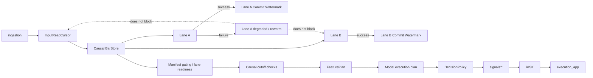

# `decision_app` architecture freeze

Status: D0 architecture is frozen; the approved D9A-D9C, DA-1 availability,
and DA-2 skip-forward/freshness behavior is implemented. D10 certifies the
current bounded core envelope; final model-mix resource recertification remains
required after model integration.

`decision_app` is a single runtime application that evaluates an explicit catalog
of model plugins over causal market context. It is not a new market-data source,
not a replacement for risk or execution, and not a collection of model services.
The application owns decision formation only. `ingestion` remains the canonical
OHLCV authority, `risk_app` remains responsible for risk and position policy, and
`execution_app` remains responsible for order execution.

The approved implementation covers D9A startup reconstruction, D9B's
direct-cursor live transaction, D9C's ASGI-owned service/lifecycle/control
shell, and DA-1's lane-isolated availability, bounded generation recovery, and
honest readiness. DA-2 adds restart skip-forward, stale-result suppression, and
per-lane momentum history. PriceRelay and external-data resolution are not part
of the active Decision runtime.

## Scope and ownership

The runtime accepts finalized canonical candles from `ingestion`, reconstructs a
bounded causal view, evaluates a small same-lane dependency plan, applies a
lane-local decision policy, and publishes at most one fresh authoritative trade
signal for each `(asset, decision timeframe, market_as_of)`.

The ownership boundary is:

| Concern | Owner | D0 rule |
| --- | --- | --- |
| Canonical candles and ordinary HTFs | `ingestion` | One canonical venue/instrument/timeframe history; no local re-aggregation in the decision hot path. |
| Causal bar history | `decision_app` `BarStore` | Bounded, shared views driven by `InputReadCursor` and explicit lane cutoffs; no model-owned copies of the full history. |
| Model graph and parameters | `decision_app` configuration | Static for a running process; lifecycle does not rewrite topology. |
| Decision composition | Lane-local `DecisionPolicy` | Normalization, gating, and weighting are explicit; raw scores are not assumed comparable. |
| Risk, sizing, SL/TP, positions | `risk_app` | Downstream authority; not moved into `decision_app`. |
| Orders and fills | `execution_app` | Downstream execution authority. |

The current Decision configuration has one global file and two concrete asset
files for BTC and ETH. The earlier D0 statement that production asset files were
intentionally absent is historical, not current state:

```text
configs/decision/global.yaml
configs/decision/assets/{MANIFEST_ASSET}.yaml
```

Global policy controls runtime bounds, shared-feature allow/deny, the 300-second
signal freshness threshold, and publication limits. Asset configuration
declares model bindings, plugin names, parameters, lane policy, dependencies,
and stable `risk_profile_key` values. Model code owns intrinsic capabilities and
safe defaults. There is no inheritance/template/expression language and no hot
graph mutation in V1.

## Runtime topology


```mermaid
flowchart LR
    ING["ingestion"] --> I["InputReadCursor"]

    I --> B["Causal BarStore"]
    B --> L1["Lane A"]
    B --> L2["Lane B"]
    L1 -->|success| W1["Lane A Commit Watermark"]
    L2 -->|success| W2["Lane B Commit Watermark"]
    L1 -->|failure| D1["Lane A degraded / rewarm"]
    D1 -. does not block .-> I
    D1 -. does not block .-> L2

    B --> ASSET["Manifest gating / lane readiness"]
    ASSET --> READY["Causal cutoff checks"]

    READY --> FEATURES["FeaturePlan"]
    FEATURES --> MODELS["Model execution plan"]

    MODELS --> POLICY["DecisionPolicy"]
    POLICY --> SS["signals:*"]

    SS --> RISK
    RISK --> EXEC["execution_app"]
```

Progress is deliberately split. `InputReadCursor` belongs to the canonical stream
reader and shared `BarStore`; it advances as observations are accepted and never
waits for a model publication. Each lane owns its `LaneCommitWatermark`, which may
lag the input cursor while that lane retries, degrades, or causally re-warms. A
degraded lane cannot block input reading or unrelated lanes. Decision does not
currently produce `price_update:*`; downstream price monitoring requires a
separately approved risk-side feed change.

The physical transport names above describe the existing downstream boundary;
the decision contracts use explicit typed fields and do not inherit an ambiguous
numeric timestamp convention.

## Asset availability and lanes

There is no required concrete `AssetRuntime` actor or class. The approved D9C
implementation expresses the per-asset lifecycle boundary through authoritative
ingestion manifest gating, static lane plans, generation rebuilds, and lane
readiness. An ingestion manifest/lifecycle event can make a configured asset
available, paused, or removing, but it cannot add a model, change a model
timeframe, or invent a worker. Unconfigured ingestion assets never create
decision lanes.

Each `DecisionLane` is identified by `lane_id`, which is `<decision asset>:<config
key>` (the lane's key in its asset file); it has no timeframe component, and the
decision and trigger timeframes are lane properties. It declares its trigger timeframe, required canonical context, feature
plan, model bindings, policy, and output authority. V1
dependencies are static, named, acyclic, and confined to the same lane. A lane
may have analytical or predictive models that emit artifacts without emitting a
trade signal. Only the lane policy may publish the authoritative signal.

One authoritative lane owns a given `(asset, decision timeframe)` output. A lane
is configured as either authoritative or shadow (`authority` is a required lane
setting). Shadow or research lanes may calculate results, but they cannot publish to the
authoritative `signals:*` stream.

## Causal bars, progress, and readiness

The shared `BarStore` stores bounded canonical observations keyed by market
series (asset, venue, instrument, timeframe) and shared across lanes, not keyed
by lane. It exposes views at a causal cutoff, not merely the last
arrival, and continues advancing from `InputReadCursor` when an individual lane
is degraded. A lane is ready only when every required canonical input is complete
through its cutoff. Dependencies are resolved statically by the planner; readiness
does not report missing dependencies.

Arrival ordering is not causal ordering. If a 1h trigger arrives while a required
4h context is not complete, readiness (a pure evaluation of the `BarStore` at the
cutoff) reports the lane as warming or degraded, and the lane evaluates only if
the required causal cutoff is reached. Readiness itself performs no wait and no
repair; the live runtime's bounded context repair in `runtime/live.py` is a
separate mechanism. It never silently substitutes an older HTF observation.
An unavailable dependency, a causal gap, or a model exception fails the affected
evaluation closed. For a stateful binding, the
binding becomes `DEGRADED`/`INVALID` and must causally re-warm to a newer safe
cutoff before it can be `LIVE`; it may not continue from stale committed state.
The affected lane's `LaneCommitWatermark` remains unchanged while input reading,
BarStore advancement, and unrelated lanes continue.

At startup, a series capture/history error, manifest read error, or lane
reconstruction error blocks only the affected series, asset, or lane. Other
ready lanes are installed and continue operating. The service is `DEGRADED` and
schedules generation-level `AUTOMATIC_RECOVERY` for blocked startup lanes; it
does not make the whole ASGI lifespan fail. First-generation static plan/config
errors and resource-construction failures remain fatal.

Generic lane-level `RECONSTRUCTION_REQUIRED` remains lane-local and degraded;
malformed/conflicting input and halted/invalid lanes remain fail-closed. A proven
direct-cursor retention gap is distinct: only an input result with disposition
`RECONSTRUCTION_REQUIRED` and exact reason `forward canonical market gap` requests
`INPUT_RECONSTRUCTION`. The market loop builds one replacement through the
normal D9A path, which reloads durable canonical history and checkpoints,
performs publication-suppressed state reconstruction, captures fresh stream
tails, and installs the replacement before further live reads. Other service
recovery and lifecycle transitions retain their existing ownership and
precedence.

On process restart, each lane validates its required history at the latest
retained trigger cutoff `R`; it does not search backward for an older ready
cutoff. Startup probes the exact first unaccounted publication ID. A matching
current-identity entry reconciles an already-committed effect; a foreign entry is
recorded as `foreign_entry` and is not republished. Stateless missed cutoffs are
recorded as one compact `restart` skip range, and only `R` may be evaluated live
if it passes the freshness gate. Stateful lanes rewarm every required transition
through `R` with publication suppressed, record a `restart_rewarm` range, then
resume at the next trigger. Skip reasons and ranges are stored in the append-only
`decision.lane_effect_skips` table; latest effect progress remains one row per
lane and uses NULL disposition for skipped work.

Readiness remains degraded-ready while at least one configured lane is live.
When the service is running with one or more configured lanes but no lane has
been `LIVE` for more than 300 seconds, `/health/ready` returns 503 with
`reason=no_lane_live`; no installed generation returns `reason=no_generation`.
The no-live-lane timeout is not applied while desired state is `PAUSED` or when
the configuration has zero lanes. `PAUSED` still follows the existing
control-plane readiness policy; zero-lane plans are exempt from this timeout.
Liveness remains independent. Runtime status exposes the no-live duration and
pending rebuild source, attempt, and due time.

A poisoned storage repository (history, checkpoint, shadow-progress or
effect-skips) is terminal for the process. The generation factory raises
`GenerationFenced`; the service enters `ERROR`, drops the generation, schedules
no retry, rejects later manual, lifecycle and automatic rebuild requests without a
build attempt, logs one ERROR (`decision.rebuild.failed`, `fenced=true`) and
reports `fenced_reason` in `/runtime`. `/health/ready` returns 503 with
`reason=dependency_poisoned`. Recovery is a process restart.

## FeaturePlan and policy

Feature computation has three categories:

1. shared canonical features, calculated once per relevant lane/as-of when both a
   model requires them and operator feature policy allows them;
2. model-private deterministic transforms, kept inside the model plugin; and
3. disabled or unavailable features, which make a binding unavailable when the
   requirement is required and otherwise are represented as absent optional data.

There is no universal always-on feature vector and no internal feature stream in
the new hot path. The plan is bounded and keyed by causal `market_as_of`.
Momentum history is route-specific: BTC 1h requires 136 bars, BTC 4h requires 272,
and ETH 4h requires 544. A route's history change does not expand another lane's
feature-plan identity or retained store. A lane's feature-plan fingerprint does
include the global feature allowlist and the feature policy name and version
(`features/planning.py`), so those inputs are shared by every lane.

## External-data contract types (inactive)

The shared `DataRequest`, `DataSnapshot`, `DataMode`, and
`ResolvedCapability` contract types remain available to avoid an unrelated
shared-library break. They are not wired into the Decision runtime. The planner
rejects any model with non-empty `intrinsic_data_requirements`, and runtime model
contexts receive `external_data={}`. No resolver, source catalog, acquisition
phase, or external-data capability claim is active. Any future activation needs
a separately approved design that preserves event/availability/fetch timestamps
and point-in-time replay rules.

## Model execution and state

The explicit plugin catalog loads model classes without import-time I/O or
infrastructure side effects. A plugin declares its intrinsic capability and
requirements, receives a complete `DecisionContext`, receives already-resolved
upstream artifacts, and returns a `ModelOutcome`. It cannot mutate committed
runtime state during `evaluate()`.

For a stateful binding:

```text
committed state + complete causal context
    -> outcome + proposed next state
    -> policy
    -> successful idempotent publication, final no-signal, or explicit skip
    -> commit proposed next state
    -> advance affected LaneCommitWatermark
```

The runtime commits proposed state only after successful idempotent publication,
a final no-signal disposition, or an explicit stale-effect skip. It then advances only the affected lane's
`LaneCommitWatermark`. A publication failure or conflict leaves committed state
and that lane's `LaneCommitWatermark` unchanged; it does not roll back
`InputReadCursor` or `BarStore` progress. A missed required transition never
advances from the old state; causal re-warm is required. Stale authoritative
signals and all stale shadow observations use `skipped`: proposed state and the
lane watermark advance, publication does not occur, and an append-only skip row
records the cutoff. Freshness uses `decision_ready_at - market_as_of`; exactly
300 seconds is still fresh. Stateful V1 models are reconstructable by replaying
the same causal execution chain: bar views, shared features, upstream dependencies
in topological order, then the stateful model. Publication is suppressed during
this reconstruction. There is no generic checkpoint framework or live training
in V1.

## Downstream price continuity

Decision no longer owns or publishes a `PriceRelay` stream. Risk-side stop-loss,
take-profit, and mark-to-market consumers that require a dedicated price cadence
need a separately approved downstream feed change; this DA-2 scope does not
change Risk, Execution, or Portfolio contracts.

## Decision policy and publication

`DecisionPolicy` is lane-local. It consumes model artifacts and optional model
decisions, applies explicit gating/normalization/weighting, and returns either no
decision or one authoritative result for the lane/as-of. A boundary or analytical
model therefore need not invent direction. A composed lane must declare how
unlike scores become comparable; raw scores are never implicitly comparable.

Stable identities are derived from canonical configuration/model identity and
deterministic configuration fingerprints:

```text
lane_id       = <decision asset>:<lane config key>
binding_config_fingerprint = SHA-256(canonical binding parameters + runtime binding)
binding_id    = lane_id + binding slot + plugin/version + binding_config_fingerprint
LaneExecutionIdentity = (lane_id, effective_lane_revision, feature_plan_fingerprint)
decision_execution_revision = SHA-256(lane + base revision + feature plan + policy)
decision_id   = lane_id + decision_execution_revision + canonical market_as_of
```

The physical `data_plan_fingerprint` columns remain for database compatibility
and are written as `none`; they are excluded from runtime identity.

Operator note on identity coupling: editing `decision.feature_policy.allowed_features`,
or the feature policy name or version, changes the feature-plan fingerprint of
every lane, and therefore every lane's decision IDs and signal idempotency keys
from the next restart. Changing a lane's `authority` or `risk_profile_key`
changes that lane's revision and its decision IDs. A parameter written as `70`
and as `70.0` hashes differently, so the spelling of a numeric parameter is part
of the identity.

The authoritative publication entry uses an explicit millisecond stream ID
derived from `market_as_of`; `TradeSignal.timestamp` remains epoch seconds.
Repeating the same identity
with the same payload is success after an existing-entry identity/payload check;
repeating it with a different payload is a deterministic conflict and fails
closed. Raw Valkey XADD rejects a duplicate explicit ID, so the publication
adapter must perform this lookup before treating an exact retry as success.
`TradeSignal.idempotency_key` remains the downstream execution idempotency
identity. The publication adapter owns this seconds-versus-milliseconds
distinction; Risk compares the seconds-valued signal timestamp with wall-clock
seconds.

## Timing contract

D0 freezes the new decision contract around explicit UTC instants:

- `bar_open_at`: UTC start of the canonical candle interval;
- `bar_close_at`: UTC exclusive end of that interval;
- `market_as_of`: the causal market cutoff. For a closed decision bar this is
  `bar_close_at`; for a projected view it is the latest included source close,
  never the unobserved projected bucket end;
- `signal_time`: the market identity of the decision, equal to `market_as_of`,
  not the time the process finished publishing;
- `decision_ready_at`: UTC wall-clock time at which all required data and model
  dependencies completed and the decision became publishable.

External data additionally carries `event_time`, `available_at`, and `fetched_at`.
All fields are timezone-aware UTC values in the conceptual contract; serialized
adapters must use one documented canonical representation and must not infer
seconds versus milliseconds from magnitude.

The active signal adapter serializes `TradeSignal.timestamp` as epoch seconds,
derived from `market_as_of`; Risk compares that field with wall-clock seconds.
The explicit Valkey stream entry ID remains epoch milliseconds derived from the
same `market_as_of`. Decision does not publish the separate `PriceUpdate` type;
Risk converts a `PriceUpdate` bar-open timestamp from milliseconds to seconds.

## Startup, restart, and broker gaps

Startup captures input progress first:

1. resolve required streams and the static lane graph;
2. capture `InputReadCursor`, stream tails, and the latest retained trigger cutoff `R`;
3. validate each lane's required history at `R`;
4. probe the exact first-unaccounted publication ID;
5. rewarm stateful bindings through `R` with publication suppressed;
6. record missed ranges as compact skip evidence rather than replaying stale stateless effects;
7. install the generation and begin live reads after captured stream IDs;
8. evaluate only the stateless cutoff `R` live, and only if fresh.

During a temporary broker interruption, the runtime resumes from its in-memory
`InputReadCursor` when the stream is continuous. If retention exposes the
specific detectable `forward canonical market gap`, the current generation is
failed closed and the market loop requests bounded `INPUT_RECONSTRUCTION`; the
same D9A startup path reloads durable state, suppresses historical publication,
captures fresh progress positions, and only then resumes input reading. Other
`RECONSTRUCTION_REQUIRED` causes remain lane-local degraded conditions and do
not trigger that automatic global rebuild. A full process restart reconstructs
state and resumes input reading; it does not replay stale historical trading
decisions from a persistent PEL. A matching exact-ID entry reconciles the
in-flight effect; an entry owned by an older execution identity is recorded as a
`foreign_entry` skip. Stateless skipped cutoffs use `restart`; stateful
publication-free reconstruction uses `restart_rewarm`. The skip trail is
append-only in `decision.lane_effect_skips`, while latest effect progress remains
compact.

## Lifecycle, control, and observability

The application exposes readiness/liveness and bounded runtime status. Lifecycle
events from `ingestion` control asset availability only. An asset whose ingestion
manifest state is not `LIVE` is installed as inactive when a generation is built;
there is no configured per-asset `PAUSED` policy. `REMOVING` stops the asset
runtime and emits the removal transition, but does not invent a new risk
liquidation policy. Only an asset has an `enabled` flag (`DecisionAssetSettings`);
a lane or model cannot be disabled independently of its asset. Decision does
not own or publish `price_update:*`; a Risk-owned price continuity feed is a
separate downstream contract. Operator `PAUSED` keeps canonical input active
while suppressing model evaluation and signal finalization.

Structured logs include `decision.startup.lane`, `decision.lane.halted`,
`decision.lane.unblocked`, `decision.input.blocked`, and rebuild requested,
completed, and failed events. Startup outcomes are emitted once per generation;
lane halt and input-block events are transition/first-block only. Observability
also records `InputReadCursor`, per-lane `LaneCommitWatermark` and effect progress,
skip ranges, readiness reasons, dependency failures, state
transitions, and publication conflicts. Controls are bounded and auditable; there
is no hot graph mutation or live training control surface.

Operator note on silent series: Decision does not consume ingestion's
`excluded_lanes` or `degraded` readiness. When a series goes silent, check
ingestion `GET /runtime` for that series.

Operator note on control endpoints: `POST /runtime/pause`, `/runtime/resume` and
`/runtime/reconnect` have no authentication. `docker-compose.yml` publishes the
Decision port on `127.0.0.1` only, but other containers on the compose network
can reach it.

## Runtime deadlines and ownership

The approved implementation carries one explicit bounded envelope around
resource construction, live control, and teardown. These bounds constrain
waiting and ownership; they do not change the causal identity, lane progress,
publication, or downstream risk contracts above.

The numeric defaults in this table are approved values sourced from
`configs/decision/global.yaml`; the architecture catalog mirrors them for
discovery and is not a configuration authority.

| Phase | Bound | Ownership rule |
| --- | --- | --- |
| Initial resources and first generation | One absolute 120-second deadline | A late candidate is not installed. |
| Valkey commands and DB acquisition | 5 seconds | Native driver budgets remain explicit. |
| Canonical history and checkpoint/effect SQL | One remaining 15-second operation budget | Each statement/transaction phase cannot restart the operation clock. |
| Control admission and effect-task drain | 30 seconds | HTTP disconnect/caller cancellation does not prematurely cancel admitted publication work. |
| Cleanup and teardown | One lazy aggregate budget of 5 seconds | The clock starts when cleanup begins, including after the 30-second drain. |

Startup failure shares its lazy cleanup budget across candidate cleanup, partial
DB construction, schema/lease release, and final owned-resource teardown; its
expiry is capped by the startup deadline plus the cleanup allowance. Successful
startup establishes a fresh lazy final-shutdown budget rather than reusing a
consumed startup-failure budget.

Decision closes only resources it owns. Borrowed pools/clients are not closed by
the application. If release or cleanup cannot be confirmed within the aggregate
budget, ownership is retained and reuse is fenced. `STOPPED` describes quiescent
owned service tasks; a clean lifespan additionally requires confirmed teardown of
owned resources, so a resource cleanup failure may leave the service `STOPPED`
while application shutdown is unclean. This section describes the implementation
envelope, not final certification or soak readiness.

## Resource envelope

The core target is an 8 GiB RAM / 4 CPU host. Normal core trading operation
targets a roughly 5 GiB-class working set and sustained CPU well below total
4-core saturation. The current V1 runtime evaluates serially in the market
loop: no bounded CPU executor is implemented or required absent measured
evidence. Shared bounded bar stores, shared feature computation, shared data
snapshots, bounded lane state, and the two-task service shell keep ownership
explicit without model-per-process or worker-per-relay fan-out. D10 measures the
current core envelope; the selected final model mix requires
`FINAL_MODEL_MIX_RESOURCE_RECERTIFICATION_REQUIRED` after model refactoring and
integration.

## Non-goals and future extensions

D0 did not implement the application, models, configuration, adapters, or
migrations. The approved D9A-D9C implementation now realizes the bounded startup,
live transaction, and service shell described above. It does not add a model
process architecture, actor/workflow/DAG framework, universal feature store,
direct model infrastructure access, hot graph
reload, generic checkpoints, live training, cross-asset/cross-lane dependencies,
GPU/process isolation, active-active sharding, or a durable decision journal.

Those may be future extensions only after evidence: durable decision journal or
outbox, state checkpoints, incremental feature engines, cross-lane dependencies,
cross-asset artifacts, GPU/process isolation, asset sharding, active/standby
runtime, and a direct risk price feed. None is a V1 commitment.
