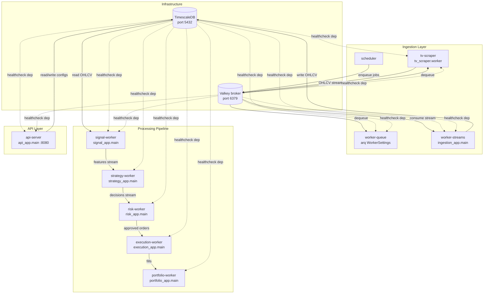
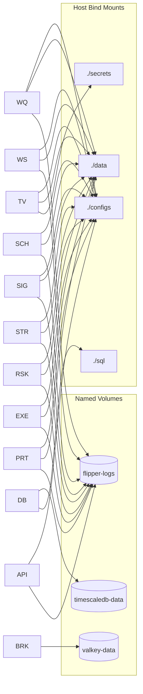
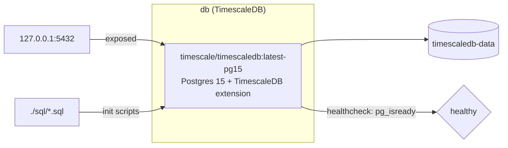
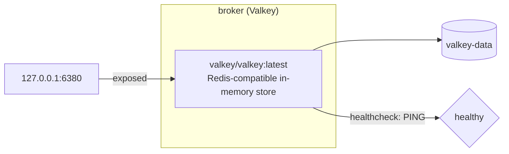
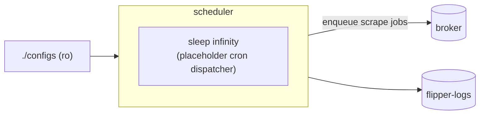
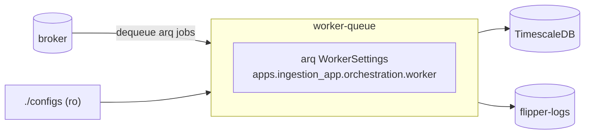
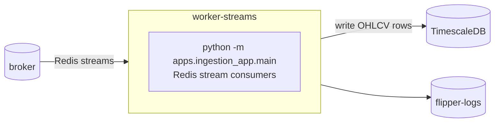
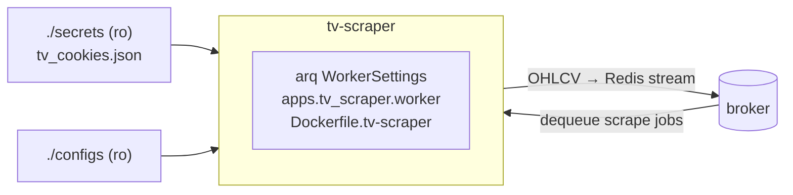
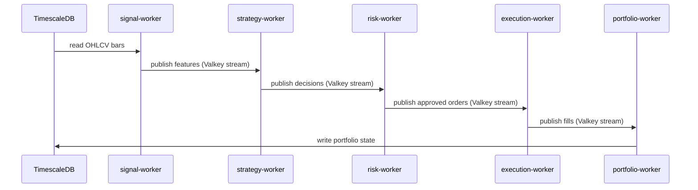
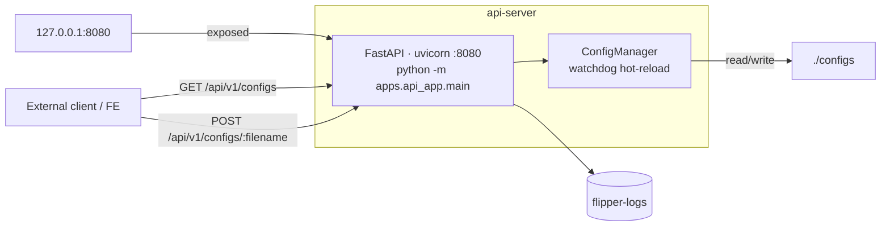

# Docker Topology

This page documents the full container topology for **flipperAgent**, derived directly from `docker-compose.yml`.

---

## High-Level Architecture

All containers share a single bridge network (`flipper-net`). Infrastructure services are health-checked before any app container starts. The data flow runs in one direction: scrape → ingest → signal → strategy → risk → execution → portfolio.

---

## Volume & Mount Map

> **Note:** `./configs` is mounted **read-only** on all workers and tv-scraper, but **read-write** on `api-server` so the config hot-reload API can write back changes.

---

## Component Contexts

### Infrastructure

#### `db` — TimescaleDB

| Property | Value |
|---|---|
| Image | `timescale/timescaledb:latest-pg15` |
| Exposed port | `127.0.0.1:5432:5432` |
| Volume | `timescaledb-data:/var/lib/postgresql/data` |
| Init scripts | `./sql` → `/docker-entrypoint-initdb.d` (ro) |
| Resources | 1 G RAM · 0.5 CPU |
| Healthcheck | `pg_isready -U flipper` every 10 s |

---

#### `broker` — Valkey

| Property | Value |
|---|---|
| Image | `valkey/valkey:latest` |
| Exposed port | `127.0.0.1:6380:6379` |
| Volume | `valkey-data:/data` |
| Resources | 256 M RAM · 0.5 CPU |
| Healthcheck | `valkey-cli ping` every 10 s |
| Role | arq job queue + Redis streams bus |

---

### Ingestion Layer

#### `scheduler`

| Property | Value |
|---|---|
| Image | `Dockerfile` (shared app image) |
| Command | `sleep infinity` — placeholder; replace with APScheduler/cron |
| Depends on | `db` healthy, `broker` healthy |
| Resources | 512 M RAM · 0.5 CPU |
| Mounts | `./configs` ro · `./data` · `flipper-logs` |

---

#### `worker-queue`

| Property | Value |
|---|---|
| Command | `arq apps.ingestion_app.orchestration.worker.WorkerSettings` |
| Role | Pulls scrape jobs from Valkey queue, orchestrates ingestion tasks |
| Depends on | `db` healthy, `broker` healthy |
| Resources | 512 M RAM · 0.5 CPU |
| Security | `read_only: true` · `no-new-privileges` |

---

#### `worker-streams`

| Property | Value |
|---|---|
| Command | `python -m apps.ingestion_app.main` |
| Port | `8002:8001` (internal management) |
| Role | Consumes OHLCV from Redis streams, persists to TimescaleDB |
| Depends on | `db` healthy, `broker` healthy |
| Resources | 512 M RAM · 0.5 CPU |
| Security | `read_only: true` · `no-new-privileges` |

---

#### `tv-scraper`

| Property | Value |
|---|---|
| Dockerfile | `Dockerfile.tv-scraper` (separate, heavier image with browser deps) |
| Command | `arq apps.tv_scraper.worker.WorkerSettings` |
| Role | Scrapes OHLCV from TradingView, publishes to broker stream |
| Secrets | `./secrets/tv_cookies.json` (ro) |
| Resources | 1 G RAM · 0.5 CPU |
| **No** `read_only` | Requires writable fs for browser/scraper temp files |

---

### Processing Pipeline

The pipeline workers are all built from the same `Dockerfile`, run as read-only containers, and communicate exclusively via Valkey streams + TimescaleDB reads.

#### `signal-worker`

| Property | Value |
|---|---|
| Command | `python -m apps.signal_app.main` |
| Role | Reads OHLCV from TimescaleDB, computes indicators & features via `FeatureManager`, publishes feature vectors to broker |
| Extra env | `NUMBA_CACHE_DIR=/tmp/numba_cache` |
| Resources | 512 M RAM · 0.5 CPU |

#### `strategy-worker`

| Property | Value |
|---|---|
| Command | `python -m apps.strategy_app.main` |
| Role | Consumes feature vectors, runs `ModelManager` scoring + regime overlay, publishes trade decisions |
| Resources | 512 M RAM · 0.5 CPU |

#### `risk-worker`

| Property | Value |
|---|---|
| Command | `python -m apps.risk_app.main` |
| Role | Applies position sizing, drawdown limits, and exposure checks; approves or rejects orders |
| Resources | 512 M RAM · 0.5 CPU |

#### `execution-worker`

| Property | Value |
|---|---|
| Command | `python -m apps.execution_app.main` |
| Role | Submits approved orders to broker/exchange, tracks fill lifecycle |
| Resources | 512 M RAM · 0.5 CPU |

#### `portfolio-worker`

| Property | Value |
|---|---|
| Command | `python -m apps.portfolio_app.main` |
| Role | Aggregates fills into positions, computes realised/unrealised PnL, publishes portfolio state |
| Resources | 512 M RAM · 0.5 CPU |

---

### API Layer

#### `api-server`

| Property | Value |
|---|---|
| Command | `python -m apps.api_app.main` |
| Port | `127.0.0.1:8080:8080` |
| `./configs` mount | **read-write** (only container with write access) |
| Role | Serves config read/write API; `ConfigManager` watches for changes and notifies all subscribers |
| Resources | 256 M RAM · 0.5 CPU |
| Security | `read_only: true` · `no-new-privileges` |

**Endpoints:**

| Method | Path | Description |
|---|---|---|
| `GET` | `/api/v1/configs` | Returns `AllConfigsResponse` — list of `{fileName, filePath, contents}` |
| `POST` | `/api/v1/configs/{filename}` | Deep-merges `{"updates": {...}}` into named YAML, triggers watchdog reload |
| `GET` | `/health` | Liveness check |

---

## Security Posture

| Container | `read_only` | `no-new-privileges` | Secrets mount |
|---|---|---|---|
| db | — | — | env vars only |
| broker | — | — | — |
| worker-queue | ✅ | ✅ | — |
| worker-streams | ✅ | ✅ | — |
| scheduler | ✅ | ✅ | — |
| tv-scraper | ❌ | — | `./secrets` ro |
| signal-worker | ✅ | ✅ | — |
| strategy-worker | ✅ | ✅ | — |
| risk-worker | ✅ | ✅ | — |
| execution-worker | ✅ | ✅ | — |
| portfolio-worker | ✅ | ✅ | — |
| api-server | ✅ | ✅ | — |

All app containers use `tmpfs` for `/tmp` so ephemeral writes don't touch the host filesystem.
