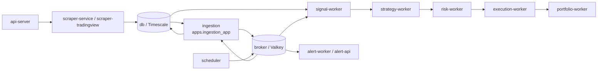

# Docker topology

All application services share `flipper-net`. Timescale is the canonical
storage dependency; Valkey is the bounded live transport and control-state
dependency.



## Relevant services

| Service | Role |
| --- | --- |
| `db` | TimescaleDB canonical candles, outbox, and shared market-data tables |
| `broker` | Valkey live streams, lifecycle projections, and application state |
| `ingestion` | WebSocket/recovery runtime, canonical commit, HTF aggregation, outbox publisher |
| `signal-worker` | Eight configured signal pairs; all OHLCV sources are ingestion |
| `strategy-worker`, `risk-worker`, `execution-worker`, `portfolio-worker` | Downstream trading pipeline |
| `alert-worker`, `alert-api` | Lifecycle/failure/health alerting |
| `scraper-service`, `scraper-tradingview` | Research and auxiliary market-data scraping |
| `api-server` | Central API and scraper compatibility bridge |
| `scheduler` | Generic scheduled application support; not an ingestion runtime |

The former legacy ingestion services and their ARQ/WebSocket runtime were
removed in N3B. They are intentionally absent from Compose.

## Ingestion runtime contract

```text
ingestion -> ingestion.candles
ingestion -> ingestion.outbox -> stream:ohlcv:ingestion:*
Timescale history + ingestion streams -> signal-worker
```

The production implementation package is `apps.ingestion_app`. Durable table names,
stream keys, and lifecycle source identity remain unchanged.

## Operations

Start the canonical data path with:

```bash
docker compose up -d db broker ingestion signal-worker
```

Keep trading services stopped during operational certification. See
[`ingestion_operations.md`](ingestion_operations.md) for health,
restart, retention, and destructive-Valkey recovery procedures.

Authority-aware Decision/Strategy promotion and rollback are documented in
[`decision_authority_operations.md`](decision_authority_operations.md). Do not
blindly restart the default topology during a handoff; `prepare` and the
post-stop boundary/Risk ordering are required.
