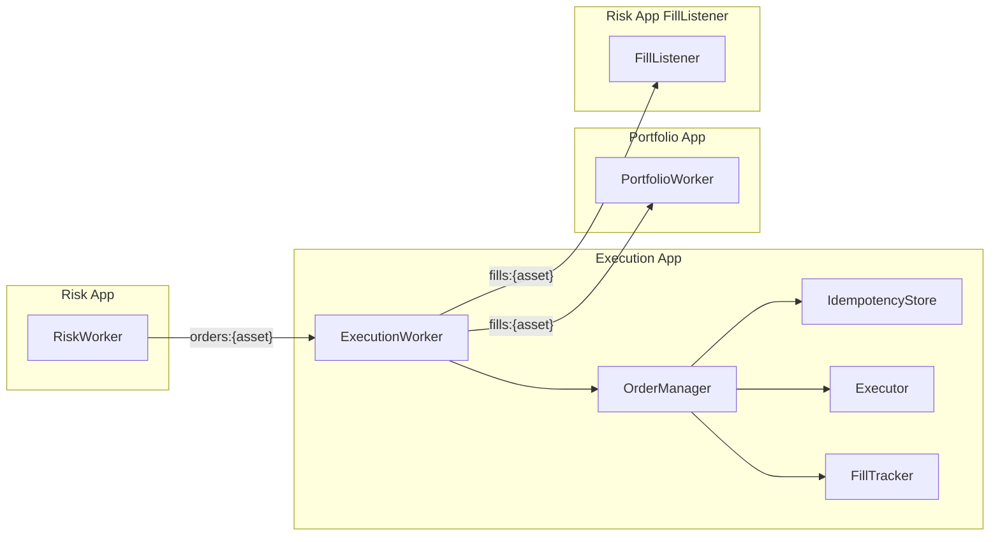
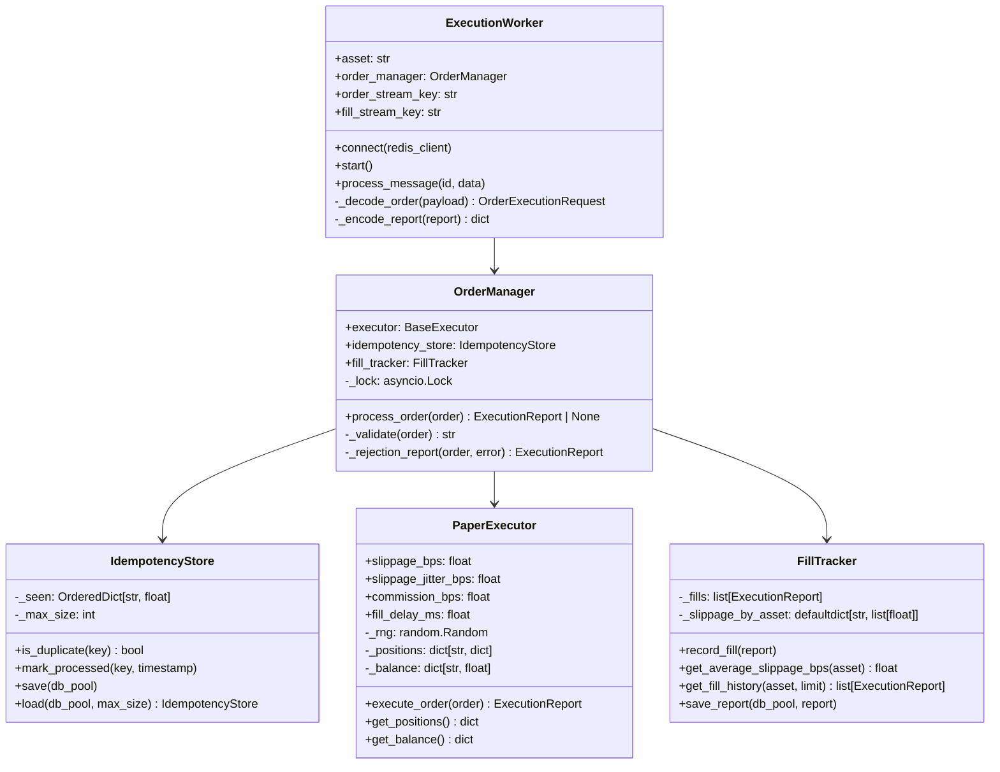
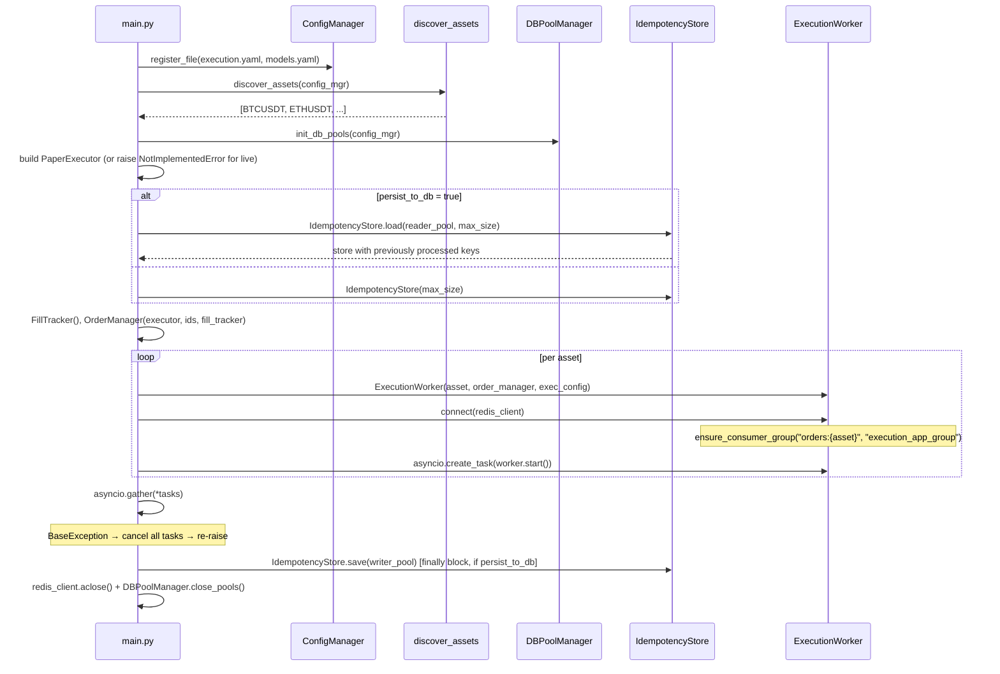
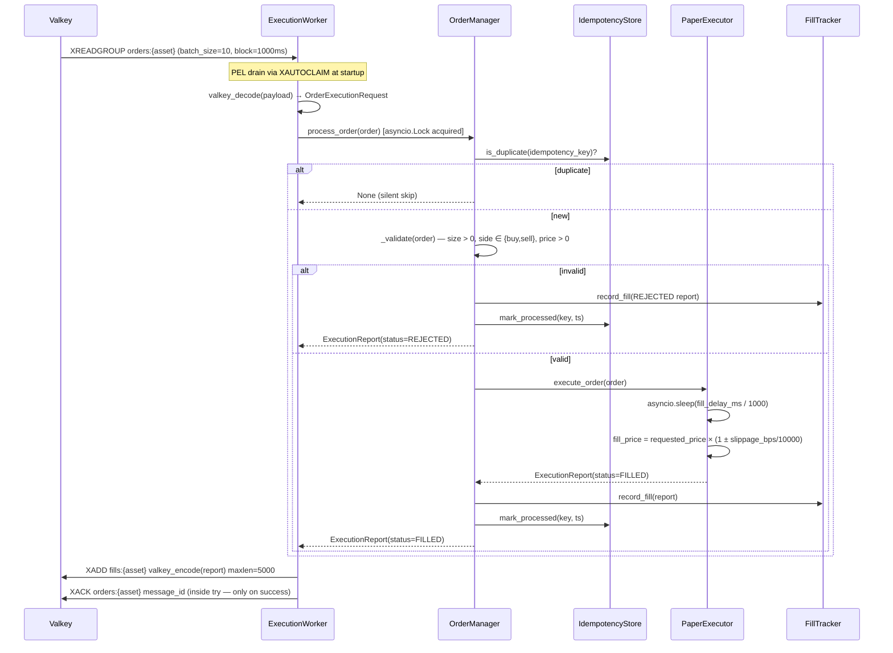
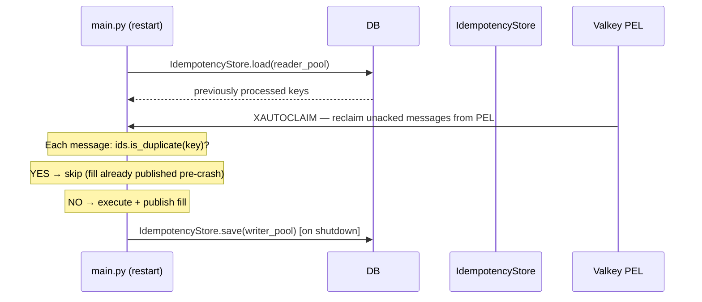

# Execution App — Technical Documentation

## 1. Overview

The **Execution App** is the order execution and fill-reporting layer in the flipperAgent pipeline. It sits between the risk layer and the portfolio layer, consuming `OrderExecutionRequest` payloads from Valkey streams, executing them via a pluggable executor (paper or live), and publishing `ExecutionReport` fills downstream.

**Single Responsibility:** Execute every incoming order exactly once, simulate or route it to an exchange, and publish a structured fill report for downstream consumers (risk_app FillListener, portfolio_app).

---

## 2. High-Level Design (HLD)

### 2.1 Position in Pipeline



### 2.2 Design Principles

| Principle | Implementation |
|---|---|
| **Decoupled via streams** | No imports from `risk_app` or `portfolio_app` — Valkey streams are the only boundary |
| **Exactly-once semantics** | `IdempotencyStore` LRU dedup + `persist_to_db` prevents duplicate fills on PEL replay after restart |
| **Pluggable executor** | `BaseExecutor` ABC — `PaperExecutor` for simulation, `BinanceExecutor` stub for live (not yet implemented) |
| **Shared `OrderManager`** | Single `OrderManager` instance shared across all per-asset workers — serializes execution behind an `asyncio.Lock` |
| **PEL drain on boot** | `BaseStreamConsumer.run()` calls `XAUTOCLAIM` at startup to reprocess any messages unacked at crash time |
| **Idempotency persist/load** | At startup: `IdempotencyStore.load(reader_pool)` restores previously processed keys. At shutdown: `IdempotencyStore.save(writer_pool)` persists the current set |

### 2.3 Key Contracts

| Contract | Direction | Schema |
|---|---|---|
| **Order input** | Valkey `XREADGROUP` from `orders:{asset}` | `OrderExecutionRequest`: `{asset, side, size, order_type, requested_price, stop_loss_price, take_profit_price, model_name, source_timeframe, idempotency_key}` |
| **Fill output** | Valkey `XADD` to `fills:{asset}` | `ExecutionReport`: `{order_id, asset, side, requested_size, filled_size, requested_price, average_fill_price, status, fills, slippage_bps, stop_loss_price, take_profit_price, idempotency_key, error_message, metadata}` |

---

## 3. Low-Level Design (LLD)

### 3.1 Component Architecture



### 3.2 File Structure

```
src/
├── apps/
│   └── execution_app/
│       ├── main.py              # Entrypoint — builds shared components, spawns workers
│       ├── execution_worker.py  # Per-asset BaseStreamConsumer subclass
│       └── __init__.py
└── libs/
    └── execution/
        ├── executor_base.py     # BaseExecutor ABC
        ├── paper_executor.py    # PaperExecutor — slippage simulation
        ├── binance_executor.py  # BinanceExecutor stub (not yet implemented)
        ├── order_manager.py     # OrderManager — dedup, validate, execute, track
        ├── idempotency.py       # IdempotencyStore — LRU dedup with DB persistence
        └── fill_tracker.py      # FillTracker — in-memory fill history + slippage
```

---

## 4. Boot Sequence



---

## 5. Order Processing Flow



---

## 6. PaperExecutor Slippage Model

Direction-aware slippage — buys fill worse (above), sells fill worse (below):

$$\text{fill\_price} = \begin{cases}
P_{\text{req}} \times \left(1 + \frac{s_{\text{bps}} + j}{10000}\right) & \text{buy} \\
P_{\text{req}} \times \left(1 - \frac{s_{\text{bps}} + j}{10000}\right) & \text{sell}
\end{cases}$$

Where $j \sim \text{Uniform}(0, \text{jitter\_bps})$ with seeded RNG (`seed=42` by default).

Commission is deducted from balance:

$$\text{commission} = \text{size} \times \text{fill\_price} \times \frac{c_{\text{bps}}}{10000}$$

Signed slippage in the report:

$$\text{slippage\_bps} = \frac{\text{fill\_price} - P_{\text{req}}}{P_{\text{req}}} \times 10000$$

Positive = worse for buyer, negative = better for buyer (i.e., favourable slippage on sells).

### 6.1 Paper position tracking

`PaperExecutor` maintains internal `_positions` and `_balance` dicts for `get_positions()` / `get_balance()` observability:

| Side | Long open | Long close/reduce | Short open | Short reduce/close |
|---|---|---|---|---|
| **Buy** | VWAP avg_price updated | — | — | Short size reduced |
| **Sell** | — | Long size decremented (deleted if ≤1e-12) | Negative size entry created, VWAP updated | Short size decremented |

Short positions are represented as `size < 0` in `_positions[asset]`.

---

## 7. IdempotencyStore

Bounded LRU `OrderedDict` mapping `idempotency_key → timestamp`. Evicts oldest entries when `max_size` is reached (default: `10_000`).

### 7.1 Exactly-once guarantee across restarts



Without `persist_to_db: true`, PEL replay after restart would re-execute every order unacked at crash time, publishing duplicate fills to `fills:{asset}`.

---

## 8. Error Handling

| Scenario | Behaviour |
|---|---|
| Duplicate `idempotency_key` | Silently skipped — `process_order` returns `None`; no fill published |
| Invalid order (size ≤ 0, bad side, price ≤ 0) | `REJECTED` `ExecutionReport` published to `fills:{asset}`; idempotency key marked |
| Executor exception | Logged at ERROR; `REJECTED` report generated with error message; key marked |
| Message decode failure | Exception propagates up to `BaseStreamConsumer` — message stays in PEL (not acked), retried on next boot |
| Worker task crash | `BaseException` handler in `main.py` cancels all peer tasks before re-raising |
| IdempotencyStore DB load failure | Warning logged; execution continues with empty in-memory store |
| IdempotencyStore DB save failure | Warning logged on shutdown; in-flight processed keys are lost but fills were already published |
| Consumer group already exists | Silently ignored (`BUSYGROUP` swallowed by `ensure_consumer_group`) |
| `mode: live` configured | `NotImplementedError` raised at startup — app refuses to start |

---

## 9. Configuration Reference (`execution.yaml`)

```yaml
execution:
  mode: paper   # "paper" or "live" (live raises NotImplementedError)

  paper:
    slippage_bps: 5.0            # Base slippage applied to every fill
    slippage_jitter_bps: 2.0     # Additional random component (Uniform[0, jitter])
    commission_bps: 4.0          # Round-trip commission per fill
    fill_delay_ms: 50            # Simulated exchange latency
    partial_fill_probability: 0.0  # Not yet wired — always full fills

  live:
    api_key_path: secrets/binance_api_key
    api_secret_path: secrets/binance_api_secret
    testnet: true
    recv_window: 5000

  order_defaults:
    default_type: market
    timeout_seconds: 30

  rate_limiting:
    orders_per_second: 5         # Not yet enforced — no rate limiter wired
    burst_size: 10

  idempotency:
    max_memory_keys: 10000       # LRU eviction threshold
    persist_to_db: true          # Load on boot, save on shutdown

  slippage_tracking:
    enabled: true
    alert_threshold_bps: 20.0   # FillTracker tracks this; no alert emitted yet

  reconciliation:
    enabled: false
    interval_seconds: 300

  assets:
    BTCUSDT:
      rate_limit_override:
        orders_per_second: 3
    ETHUSDT: {}
    default: {}
```

---

## 10. API Observability

`GET /execution/fills` — latest `ExecutionReport` per asset from `fills:{asset}`.

**Response shape per asset:**

```json
{
  "BTCUSDT": {
    "stream": "fills:BTCUSDT",
    "message_id": "1234567890123-0",
    "timestamp": 1717000000.0,
    "lag_ms": 800,
    "status": "ok",
    "order_id": "a1b2c3d4e5f6",
    "side": "buy",
    "requested_size": 0.012345,
    "filled_size": 0.012345,
    "requested_price": 67450.5,
    "average_fill_price": 67453.9,
    "fill_status": "filled",
    "slippage_bps": 0.50,
    "stop_loss_price": 65800.0,
    "take_profit_price": 69200.0,
    "idempotency_key": "abc123...",
    "error_message": null
  }
}
```

`status` values: `ok`, `no_data`, `error`.

---

## 11. Known Gaps / Future Work

| Gap | Description |
|---|---|
| **`FillTracker.save_report` never called** | Fills persist only in-memory and are lost on restart. `save_report(db_pool, report)` exists but `ExecutionWorker` has no `db_pool` reference and never calls it. Requires wiring `writer_pool` into the worker. |
| **Rate limiting not enforced** | `rate_limiting.orders_per_second` is declared in config but no token bucket or semaphore is wired anywhere. A high-frequency signal storm would send uncapped orders to the exchange. |
| **`partial_fill_probability` silently ignored** | `paper.partial_fill_probability: 0.0` is in config but `PaperExecutor.__init__` does not accept it. Partial fill simulation never triggers even if set > 0. |
| **`BinanceExecutor` is a stub** | `mode: live` raises `NotImplementedError`. No live execution path exists. |
| **Fill publish atomicity** | `xadd fills:{asset}` succeeds before `xack` of the order message. On PEL re-delivery the idempotency key dedupes correctly → `process_order` returns `None` → no second `xadd`. The fill is not republished on replay. Consumers depending on exactly-once fill receipt from the stream must tolerate at-most-once delivery on the fill side. |
| **No `/execution/status` endpoint** | No endpoint exposes `PaperExecutor.get_positions()` or `get_balance()`, or per-asset fill counts and average slippage from `FillTracker`. |
