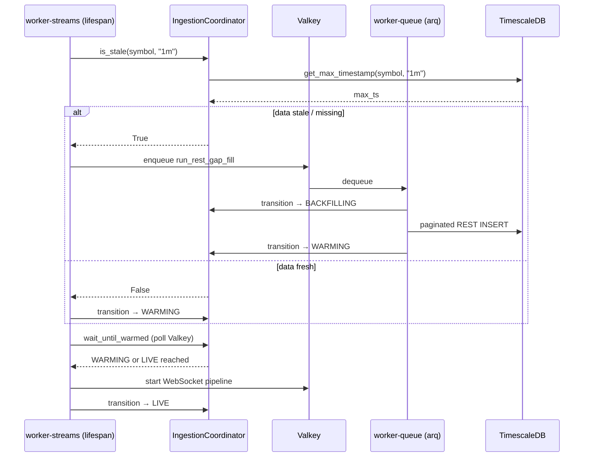

# Ingestion App

The Ingestion App is the pipeline entry point: it owns all market data acquisition, normalises it into a canonical OHLCV schema, persists it in TimescaleDB, and publishes closed-bar events downstream over Valkey streams for consumption by the Signal App.

---

## High-Level Design (HLD)

### System Context

```mermaid
flowchart TD
    subgraph External [External Data Sources]
        BinanceWS[Binance USD-M Futures WebSocket]
        BinanceREST[Binance REST API]
        CCXT[CCXT-Unified REST]
    end

    subgraph IngestionApp [Ingestion App]
        WorkerStreams[worker-streams\nFastAPI / uvicorn]
        WorkerQueue[worker-queue\nARQ / cron]
        Coordinator[IngestionCoordinator\nValkey state machine]
    end

    subgraph Infra [Infrastructure]
        Valkey[(Valkey\nstate + streams + task queue)]
        TimescaleDB[(TimescaleDB\nohlcv hypertable)]
    end

    subgraph Downstream [Downstream]
        SignalApp[Signal App]
    end

    BinanceWS -->|kline stream| WorkerStreams
    BinanceREST -->|historical klines| WorkerStreams
    CCXT -->|paginated REST| WorkerQueue

    WorkerStreams <-->|state read/write| Coordinator
    WorkerQueue <-->|state read/write| Coordinator
    Coordinator <-->|ingestion:state:{sym}:{tf}| Valkey

    WorkerQueue -->|enqueue gap-fill| Valkey
    Valkey -->|dequeue| WorkerQueue

    WorkerStreams -->|INSERT closed 1m candles| TimescaleDB
    WorkerQueue -->|INSERT backfill candles| TimescaleDB

    WorkerStreams -->|XADD stream:ohlcv:{sym}:{tf}| Valkey
    Valkey -->|XREAD| SignalApp
```

### Two-Service Architecture

The ingestion app runs as **two separate processes** that cannot be merged:

| Service | Runtime | Owns | Why separate |
|---|---|---|---|
| `worker-streams` | FastAPI + uvicorn | WebSocket daemons, Valkey stream publishing | FastAPI/uvicorn owns the asyncio event loop for unbounded long-lived coroutines |
| `worker-queue` | ARQ worker | REST gap-fill jobs, cron scheduling | ARQ owns the event loop for bounded, retriable, queued tasks |

Both services share the same Valkey instance and TimescaleDB, coordinated via `IngestionCoordinator`.

### Boot Sequence



---

## Low-Level Design (LLD)

### Component Breakdown

#### `coordination.py` — IngestionCoordinator

Single source of truth for per-asset ingestion state. Both containers write to the same Valkey keys.

**State machine:**

```
COLD → BACKFILLING → WARMING → LIVE
                             ↘ ERROR
```

| State | Set by | Meaning |
|---|---|---|
| `COLD` | default (key absent) | No data, no activity |
| `BACKFILLING` | `worker-queue` on gap-fill start | REST fetch in progress |
| `WARMING` | `worker-queue` on gap-fill complete | DB caught up, WS may connect |
| `LIVE` | `worker-streams` after WS connects | Streaming active |
| `ERROR` | either service on unrecoverable failure | Gap-fill or WS failed |

**Key methods:**

| Method | Description |
|---|---|
| `get_state(symbol, tf)` | `GET ingestion:state:{symbol}:{tf}` → `IngestionState` |
| `transition(symbol, tf, state)` | `SET` + structured log |
| `is_stale(symbol, tf)` | `get_max_timestamp` vs `now - warmup_threshold_ms`; returns `True` if data is missing or old |
| `wait_until_warmed(symbol, tf)` | Polls Valkey until `WARMING`/`LIVE`; raises `asyncio.TimeoutError` after `warmup_timeout_seconds` (default 600s); returns `False` on `ERROR` |

Config keys consumed: `ingestion.websocket.warmup_threshold_ms`, `ingestion.websocket.warmup_timeout_seconds`, `ingestion.websocket.verification_sleep_seconds`.

---

#### `adapters/binance_native.py` — BinanceNativeAdapter

Wraps the `binance-futures-connector` library for both REST and WebSocket access to Binance USD-M Futures.

| Method | Transport | Description |
|---|---|---|
| `get_historical_ohlcv(symbol, tf, since, until, limit)` | REST | Calls `UMFutures.klines()` in a thread pool (`asyncio.to_thread`) to avoid blocking the event loop. Returns a normalised `pd.DataFrame` with `OHLCV_COLUMNS`. |
| `stream_multiplex_socket(symbols_timeframes, loop, queue)` | WebSocket | Opens a combined `UMFuturesWebsocketClient` stream, bridges the thread-safe `on_message` callback into an `asyncio.Queue`, and yields raw JSON messages as an async generator. Supports multiple symbols × timeframes in a single socket connection. |

Credentials are read from `ingestion.credentials.api_key` / `ingestion.credentials.api_secret` in `base.yaml` (no `os.getenv`).

---

#### `adapters/crypto_ccxt.py` — CCXTAdapter

Provides a unified CCXT interface for historical REST fetches used by the gap-fill worker.

- `get_historical_ohlcv(symbol, tf, since, limit)` → `pd.DataFrame`
- Used exclusively by `_fetch_asset_gap` in `tasks.py`; not used for live streaming.

---

#### `orchestration/controller.py` — worker-streams entrypoint

FastAPI app with a `lifespan` context manager that orchestrates the boot sequence and runs the WebSocket pipeline.

**`lifespan(app)`**

1. Initialises DB pools (`DBPoolManager.init_pools`)
2. Creates ARQ pool and Valkey client
3. Instantiates `IngestionCoordinator`
4. For each asset in `ingestion.assets.target_list`:
   - Calls `coordinator.is_stale()` → enqueues `run_rest_gap_fill` or transitions directly to `WARMING`
   - Spawns `verify_and_launch_ws()` as an asyncio task

**`verify_and_launch_ws(symbol, publish_timeframes, arq_pool, coordinator)`**

- Awaits `coordinator.wait_until_warmed()` (blocks until `WARMING`/`LIVE` or timeout)
- On success: spawns `run_websocket_pipeline()` as a background task

**`run_websocket_pipeline(symbol, publish_timeframes, arq_pool, coordinator)`**

- Outer `while True` reconnect loop
- Transitions to `LIVE` before entering the message loop
- On each closed `1m` kline: writes to TimescaleDB via `TimescaleWriter`
- On each closed kline in `publish_timeframes`: `XADD stream:ohlcv:{symbol.lower()}:{tf}` to Valkey (consumed by Signal App)
- On `CancelledError`: transitions to `COLD`, exits cleanly
- On exception: transitions to `COLD`, enqueues gap-fill, sleeps `reconnect_sleep_seconds`, reconnects

Stream payload fields: `exchange`, `symbol`, `timeframe`, `timestamp`, `open`, `high`, `low`, `close`, `volume`, `bar_closed`, `ingestion_timestamp`.

---

#### `orchestration/tasks.py` — worker-queue tasks

**`run_rest_gap_fill(ctx, assets, exchange)`**

Entrypoint for the ARQ gap-fill job. For each asset (bounded by `asyncio.Semaphore(gap_fill_limit)`):

1. Transitions asset to `BACKFILLING`
2. Calls `_fetch_asset_gap(ctx, ccxt_adapter, symbol)`
3. On success: transitions to `WARMING`
4. On failure: transitions to `ERROR`

**`_fetch_asset_gap(ctx, ccxt_adapter, symbol)`**

Paginated REST backfill with `tenacity` retry (5 attempts, exponential backoff 4–60s) on `RateLimitExceeded`, `RequestTimeout`, `NetworkError`.

- Reads `get_max_timestamp` from TimescaleDB to find the gap start
- `TimescaleWriter` instantiated once before the pagination loop (not per-page)
- Inserts each page of `OHLCVRecord` objects via `ts_writer.insert_ohlcv()`
- Exits when `len(df) < limit` (last page)

**`poll_binance_ohlcv(ctx, symbol, timeframe)`** — cron task (every 15m), currently a stub for supplemental polling.

**`scheduled_gap_fill(ctx)`** — cron wrapper; reads `target_list` from config, delegates to `run_rest_gap_fill`.

---

#### `orchestration/worker.py` — ARQ worker settings

Defines the ARQ `WorkerSettings` class consumed by the `arq` CLI.

- `startup`: initialises `BinanceNativeAdapter`, `CCXTAdapter`, `DBPoolManager`, Valkey client, and `IngestionCoordinator`; stores all in `ctx`
- `shutdown`: closes Valkey client and DB pools
- Credentials: `ingestion.credentials.api_key/api_secret` from ConfigManager (no `os.getenv`)

---

#### `orchestration/schedules.py` — IngestionScheduler

Extends `BaseScheduler` to return the ARQ `cron` job list.

| Cron job | Schedule | Config key |
|---|---|---|
| `scheduled_gap_fill` | every 5 minutes | `ingestion.orchestration.schedules.gap_fill_minutes` |
| `poll_binance_ohlcv` | every 15 minutes | `ingestion.orchestration.schedules.ohlcv_minutes` |

---

#### `models/tick_models.py` — Data models

| Model | Fields | Notes |
|---|---|---|
| `OHLCVRecord` | `symbol`, `timestamp`, `open`, `high`, `low`, `close`, `volume`, `is_closed` | Timestamp auto-coerced from ms epoch or `datetime`. Validates `high >= low`. |
| `TickRecord` | `symbol`, `price`, `size`, `side` | Used for raw tick ingestion (future use). |
| `OIRecord` | `symbol`, `open_interest`, `timestamp` | Open interest (future use). |

All models inherit `BaseDataModel` which normalises `timestamp` to UTC `datetime` from ms-epoch integers.

---

#### `storage/timescale_writer.py` — TimescaleWriter

Bulk-inserts `OHLCVRecord` lists into the `ohlcv` hypertable.

- Pool acquired from `DBPoolManager.get_writer_pool()`
- Used in both `controller.py` (per-reconnect cycle, instantiated once) and `tasks.py` (per gap-fill, instantiated once before pagination loop)

---

### Configuration Reference

All config under `configs/base.yaml`. No `os.getenv` anywhere in the app.

| Key | Default | Description |
|---|---|---|
| `ingestion.assets.target_list` | `[BTCUSDT, ...]` | Assets to ingest |
| `ingestion.assets.publish_timeframes` | `{BTCUSDT: [30m, 1h, 4h], ...}` | Per-asset Valkey publish timeframes |
| `ingestion.assets.historical_backfill_days` | `2` | REST backfill window |
| `ingestion.timeframes.base_gap_fill` | `1m` | TimescaleDB write timeframe |
| `ingestion.credentials.api_key/api_secret` | `""` | Binance API credentials |
| `ingestion.websocket.stream_url` | `wss://fstream.binancefuture.com` | WS endpoint |
| `ingestion.websocket.warmup_threshold_ms` | `300000` | Staleness threshold (5 min) |
| `ingestion.websocket.warmup_timeout_seconds` | `600` | Max wait for WARMING state |
| `ingestion.websocket.reconnect_sleep_seconds` | `5` | WS reconnect delay |
| `ingestion.concurrency.gap_fill_limit` | `5` | Max concurrent REST fetches |
| `ingestion.concurrency.gap_fill_sleep_seconds` | `0.5` | Delay between REST pages |
| `logging.level` | `INFO` | Log level |
| `logging.console_format` | `json` | `json` or `color` |

---

### Downstream Interface

The Signal App consumes Valkey streams published by `worker-streams`:

- **Stream key**: `stream:ohlcv:{symbol_lower}:{timeframe}` (e.g. `stream:ohlcv:btcusdt:1h`)
- **Trigger**: closed candle on a configured `publish_timeframe`
- **Fields**: `exchange`, `symbol`, `timeframe`, `timestamp` (float seconds), `open`, `high`, `low`, `close`, `volume`, `bar_closed` (`"True"`), `ingestion_timestamp` (ms epoch string)

---

### E2E Docker Testing Strategy

```
db (TimescaleDB) + broker (Valkey)
  -> worker-streams (FastAPI) + worker-queue (ARQ)
  -> signal-worker + strategy-worker + risk-worker + execution-worker + portfolio-worker
```

- **`docker-compose.yml`**: local multi-service topology for ingestion plus downstream consumers
- **`run_e2e_tests.sh`**:
  - tears down any previous Docker state with `docker-compose down -v`
  - boots `db` and `broker`
  - waits for PostgreSQL readiness via `pg_isready`
  - waits for Valkey readiness via `redis-cli ping`
  - relies on `docker-entrypoint-initdb.d` for initial SQL bootstrap
  - boots `worker-streams`, `worker-queue`, `signal-worker`, `strategy-worker`, `risk-worker`, `execution-worker`, and `portfolio-worker`
  - waits 15 seconds for worker stabilization
  - runs `PYTHONPATH=src .venv/bin/python -m pytest tests/e2e/test_docker_integration.py`
  - passes `--timeout=300` only when the `pytest-timeout` plugin is available
  - dumps targeted service logs on failure, then cleans up with `docker-compose down -v`
- **Assertions**:
  - Gap-fill check: polls `ohlcv` hypertable for inserted rows from the ARQ worker
  - WS handoff check: `MAX(timestamp)` lag falls below `warmup_threshold_ms`, confirming `LIVE` state reached

### Docker Validation Notes

- Validation command used: `bash tests/e2e/run_e2e_tests.sh`
- Validation environment: local `.venv` test runner against Docker Compose services
- Most recent observed harness issue: the script previously hard-coded `--timeout=300`, which fails in environments where `pytest-timeout` is not installed. The runner now detects support before adding that flag.
- Focused ingestion validation steps used on `2026-06-02`:
  - `docker-compose down -v`
  - `docker-compose up -d --build db broker`
  - wait for `pg_isready` on `db`
  - wait for `redis-cli ping` on `broker`
  - `docker-compose up -d --build worker-streams worker-queue`
  - wait 15 seconds for ingestion startup and warmup
  - run:
    - `PYTHONPATH=src .venv/bin/python -m pytest tests/e2e/test_docker_integration.py::test_timescaledb_initialization_and_gap_fill tests/e2e/test_docker_integration.py::test_websocket_live_streaming tests/e2e/test_docker_integration.py::test_continuous_aggregates_exist -vv -s`
  - `docker-compose down -v`
- Focused ingestion validation result on `2026-06-02`: `3 passed`
- Additional E2E harness issue found during Docker validation: session-scoped async fixtures in `tests/e2e/conftest.py` shared `asyncpg` and Valkey clients across different pytest event loops, which caused false-negative `RuntimeError` and `InterfaceError` failures. The fixtures were narrowed to function scope to keep Docker validation stable and truthful.
