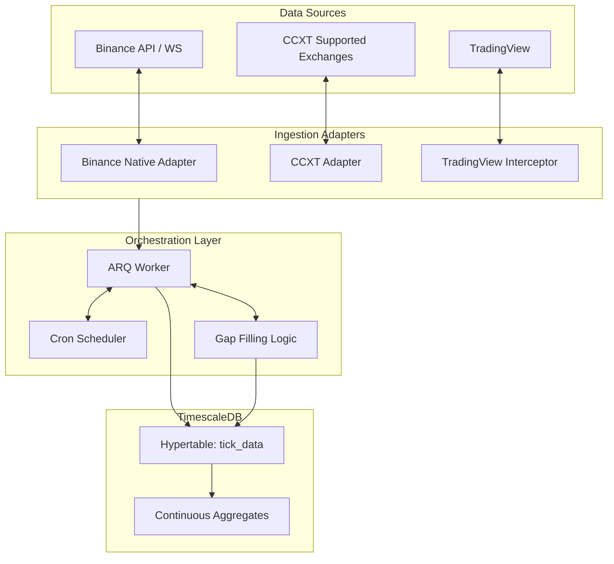

# Ingestion Module

The Ingestion Module abstracts data retrieval behind modular Adapters and manages continuous real-time streams and historical gap-filling through orchestration.

## High-Level Design (HLD)

## Orchestration & Gap Filling

The orchestration system manages data ingestion lifecycles across multiple exchanges, ensuring robust and backfill-capable historical data aggregation. It uses a layered defense mechanism to safely fetch data while adhering to rate limits.

### Layered Defense Mechanism

The "Gap Filling" logic retrieves historical REST data whenever the continuous real-time stream disconnects or falls behind. This guarantees data contiguousness spanning months or years. To ensure data is safely extracted without hitting exchange bans, a layered approach is used:

1. **ARQ Cron Scheduling**  
   Background workers are organized utilizing ARQ (Redis queues). They check database buckets periodically using Cron-like scheduling, looking for discrepancies or missing ticks inside timescales. By decoupling requests, the gap checker performs independently of the websocket consumer.

2. **Semaphore Concurrency Limits**  
   When missing data is identified for hundreds of assets, firing requests simultaneously is naive. The system employs `asyncio.Semaphore` arrays to enforce maximum limits on concurrent data-fetching loops (e.g., typically capped to 5 active tasks per worker). This drastically lowers bursting capabilities against rate-limit buckets.

3. **Request Sleep Pacing**  
   Regardless of concurrency controls, rapid consecutive calls often trigger soft rate-limit tripwires. The application imposes a micro-sleep (`await asyncio.sleep(...)`) instantly after any REST call finalizes. It spaces out individual request batches inside the same worker, giving external endpoint token buckets time to replenish.

4. **Tenacity Exponential Backoff**  
   If requests still fail due to HTTP 429 schemas or transient networking blips, `tenacity` wraps the underlying HTTP transport logic. The agent employs configurable exponential backoff strategies, introducing progressively longer pauses upon retries before failing completely.

5. **Pydantic Normalization**  
   Raw JSON structures returned from various exchanges undergo uncompromising strict validations and typecasting through pure Pydantic mappings. Any malformed bars resulting from dirty rest responses are dropped or corrected directly, ensuring standard formatting prior to datastore interaction.

6. **TimescaleDB Ingestion**  
   The fully validated rows are sent to TimescaleDB's chunked hypertables. Timescale cleanly resolves updates upon duplicate constraints by executing ON CONFLICT protocols, seamlessly sewing freshly downloaded gaps straight into continuous aggregate materializations without overlap errors.

## Ingestion Adapters

The `flipperAgent` abstracts data retrieval behind a system of modular *Adapters*, all inheriting from `BaseExchangeAdapter`. This ensures downstream orchestration workflows operate seamlessly regardless of the data source.

### 1. CCXT Adapter (`CCXTAdapter`)
- **Adapter Path:** `src/flipper_agent/ingestion/adapters/crypto_ccxt.py`
- **Usage:** Standardized REST polling for historical OHLCV data using the unified [CCXT](https://docs.ccxt.com/) library. Pass the `exchange_id` (e.g., `bybit`, `okx`, `kraken`) upon instantiation.
- **Capabilities:** Wide exchange support. Provides `get_historical_ohlcv(symbol, timeframe, since, until, limit)`.
- **Limitations:** Dependent on CCXT's unified API which sometimes abstracts away deep exchange-specific options. Does not currently implement websocket streaming multiplexing due to the overhead/complexity of CCXT Pro vs native solutions.

### 2. Binance Native Adapter (`BinanceNativeAdapter`)
- **Adapter Path:** `src/flipper_agent/ingestion/adapters/binance_native.py`
- **Usage:** High-performance REST fetching and Websocket multiplexing specifically for Binance USD-M Futures using the official `binance-futures-connector`.
- **Capabilities:** Fast implementation for `get_historical_ohlcv` containing exact mappings (e.g., subsetting the 12-column Binance payload into standard OHLCV fields natively). Handles native `stream_multiplex_socket` linking multiple assets asynchronously to an `asyncio.Queue` using `ThreadedWebsocketManager`.
- **Limitations:** Tightly coupled to Binance Futures explicitly. Not extensible to spot or other exchanges.

### 3. TradingView Interceptor (`TradingViewInterceptor`)
- **Adapter Path:** `src/flipper_agent/ingestion/adapters/tradingview_socket_interceptor.py`
- **Usage:** Ingests chart data dynamically by orchestrating a headless browser via the `scrapling` package up against `tradingview.com` and intercepting the underlying `timescale_update` JSON websocket frames. Optionally injects authenticated sessions via local cookie injection.
- **Capabilities:** Can fetch data for non-crypto assets (Equities, Forex) or custom synthetics available exclusively on TradingView without requiring expensive institutional data feeds.
- **Limitations:** 
  - Substantially heavier compute footprint (requires a headless Chromium process).
  - High brittleness: extremely susceptible to upstream DOM/Websocket protocol changes pushed by TradingView.
  - Slower execution compared to REST endpoints (requires DOM load and sleep offsets).
