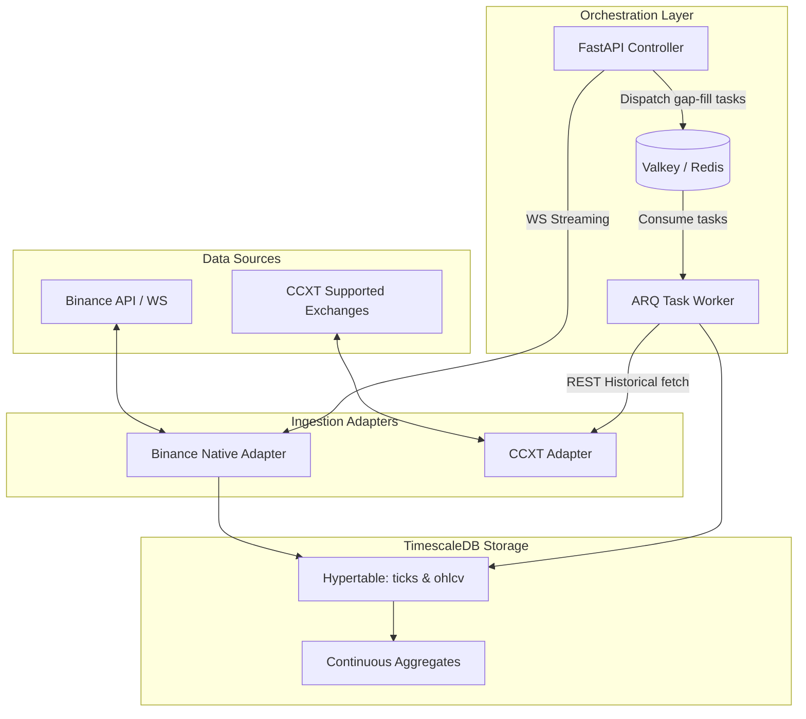

# Ingestion Module (HLD & LLD)

The Ingestion Module abstracts data retrieval behind modular Adapters and manages continuous real-time streams and historical gap-filling through orchestration.

## High-Level Design (HLD)

## Low-Level Design (LLD)

### 1. Valkey (Redis-compatible) & ARQ Background Task Queues
To manage long-running data backfills (which can take minutes or hours for large datasets) without blocking the main event loops, the ingestion engine utilizes **ARQ** for distributed background task queues. 
- **Valkey Broker**: A Redis-compatible high-performance in-memory datastore serves as the message broker (`valkey:latest` inside Docker Compose).
- **FastAPI Controller (`controller.py`)**: Acts as the system orchestrator. Through its FastApi lifespan hooks, it checks the database on boot. If data is stale or missing, it enqueues a background `run_rest_gap_fill` job to the Valkey queue.
- **Worker (`worker.py`)**: Subscribes to the Valkey queues. Concurrently processes REST gap-filling using `asyncio.Semaphore` logic to prevent rate-limiting against the CCXT exchange adapters.

### 2. WebSocket Streaming vs Historical CCXT Polling
The system explicitly divides data retrieval into two modes:
- **WebSocket Live Streaming**: Once the asynchronous Controller identifies that the TimescaleDB dataset is fully caught up (via the "Verification Gate"), it automatically launches a persistent, multiplexed WebSocket stream through the Binance Native Adapter. Ticks go straight into the database for sub-second latency.
- **Historical Gap Filling (via CCXT)**: To bridge any missing holes from offline periods, the ARQ worker fetches REST data using the unified `CCXT Adapter`. `tenacity` provides exponential backoff, preventing HTTP 429 bans while looping backwards through time safely enforcing API rate limits.

### 3. Configurable Publish Timeframes & Write Optimization
To provide flexible triggers for downstream strategies without creating data bloat, the pipeline supports configurable target timeframes:
- **Baseline 1m Storage**: The system subscribes to 1-minute streams universally as a baseline rule. Only closed `1m` candles are inserted into TimescaleDB, ensuring storage remains atomic, standardized, and protected from write amplification.
- **Selective Valkey Publishing**: Users configure specific `publish_timeframes` per asset (e.g. `1h`, `4h`) in `base.yaml`. The WebSocket multiplexes subscriptions to capture official Binance closed-candle events across all configured limits. Internal pipeline routing filters these streams—forwarding the high-granularity official exchange closes directly onto the Valkey Pub/Sub bus orchestrating downstream workers instantly, entirely bypassing database storage to preserve efficiency.

### 4. TimescaleDB Continuous Aggregates Schema
Our persistence layer resides in **TimescaleDB** using efficient, chunked hypertables and continuous aggregates defined in `schema.sql`.
- **Raw Hypertables**: Incoming WebSocket ticks (`ticks`) and Gap-filled candle bars (`ohlcv`) stream directly into hypertables sharded intelligently by `timestamp` indexing.
- **Continuous Aggregates**: The `market_1m_bars` layout acts as a Continuous Materialized View spanning the `ticks` hypertable. It rolls continuous records into clean 1-minute bars (`open`, `high`, `low`, `close`, `volume`) directly inside the database kernel natively.
- **Refresh Policies & Retention**: PostGIS/Timescale automatically refreshes `market_1m_bars` in the background (configured for a 1-minute schedule increment). Older tick limits are bounded by a 30-day Retention Policy protecting storage capacity against unbounded log expansion.

### 5. End-to-End (E2E) Docker Testing Strategy
Testing an asynchronous architecture encompassing WS, background workers, Redis, and Postgres natively requires high fidelity staging:
- **Topology (`docker-compose.yml`)**: Deploys `db` (Timescale), `broker` (Valkey), `worker-queue` (ARQ), and `worker-streams` (FastAPI Controller) as separate containers representing perfect production symmetry.
- **Bootstrapping (`run_e2e_tests.sh`)**: The bash orchestrator handles the startup race conditions. Post spinning up containers, it repeatedly executes `pg_isready` polling until the DB is live, pushes `schema.sql` directly into Timescale, and evaluates `pytest` integration targets.
- **Integration Assertions (`test_docker_integration.py`)**: The test suite confirms the system behavior purely through datastore output reflection:
  - **Gap Fill Check**: Polls the `ohlcv` hypertable ensuring that records actively insert from the decoupled ARQ queue workers.
  - **WebSocket Live Hand-off Check**: Evaluates if the `MAX(timestamp)` divergence relative to wall-clock time shrinks beneath the `warmup_threshold_ms`, proving the Verification Gate transferred ingestion logic from REST gap-filling successfully over to the persistent Live WebSockets.
