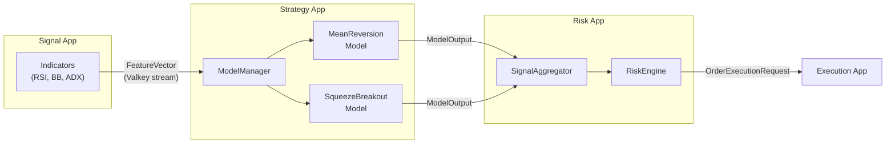
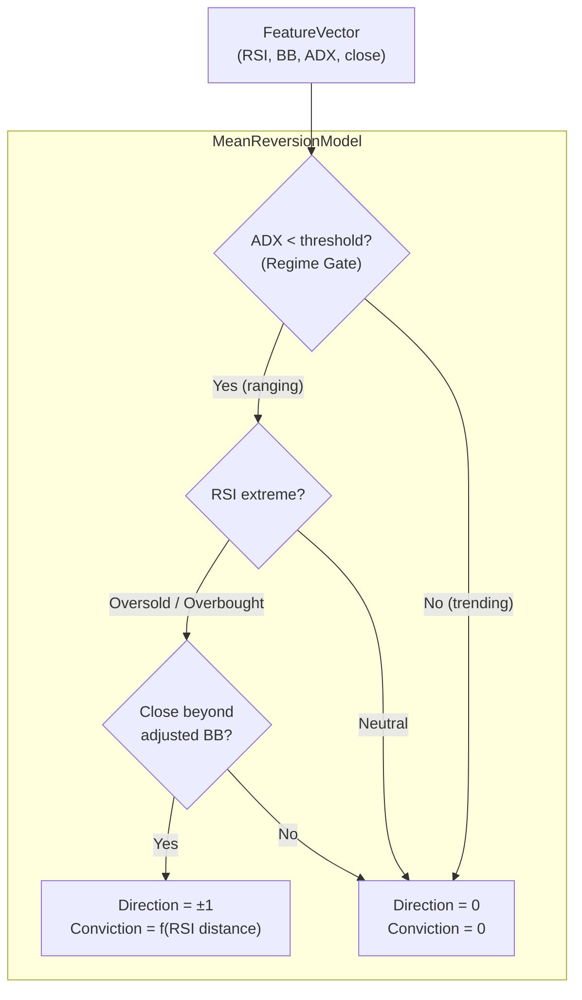
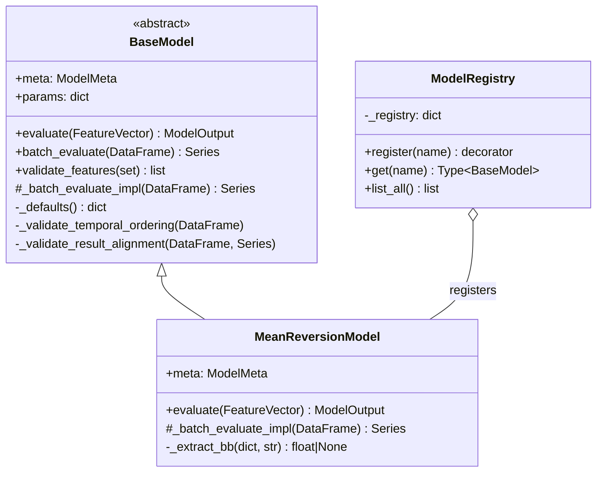
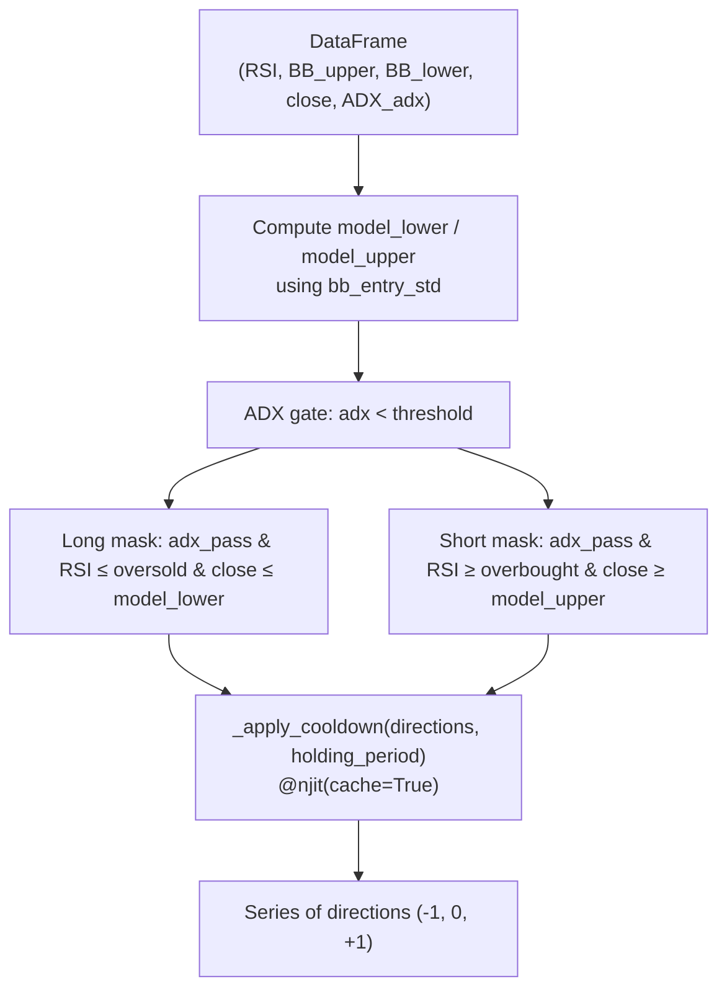
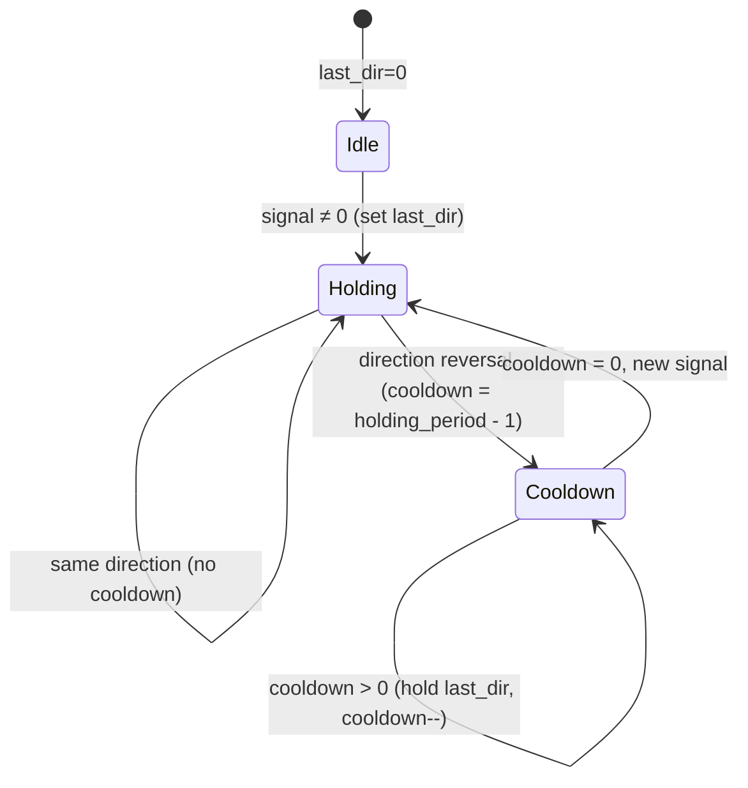
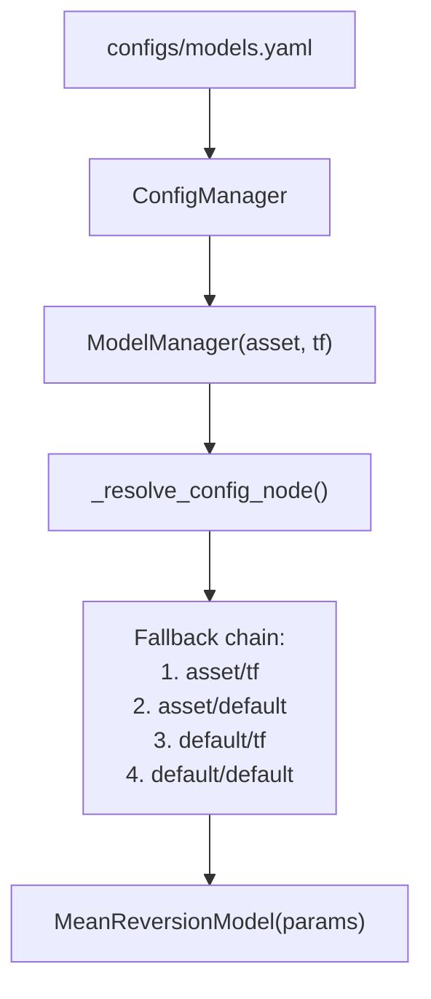
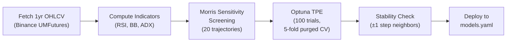
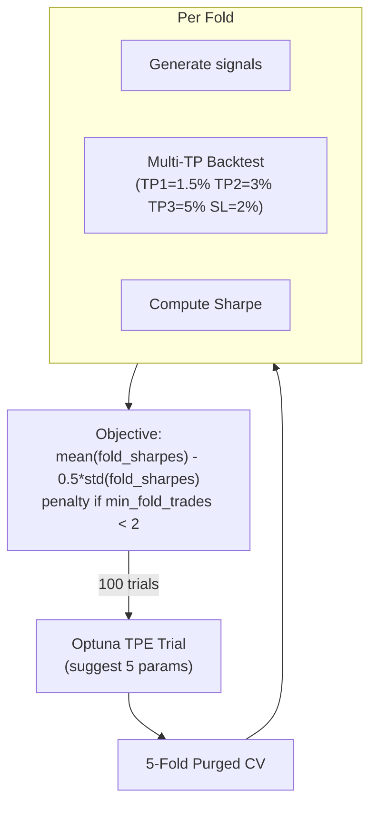
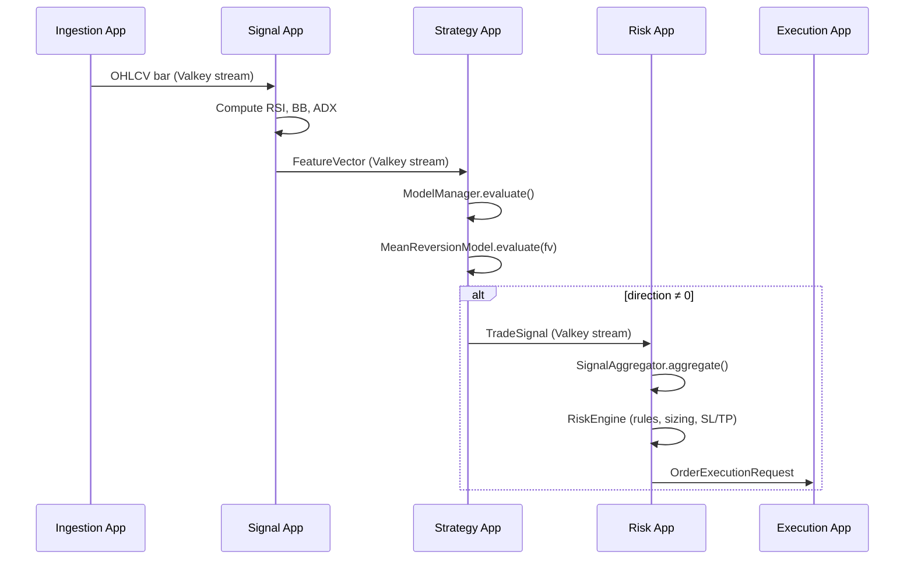
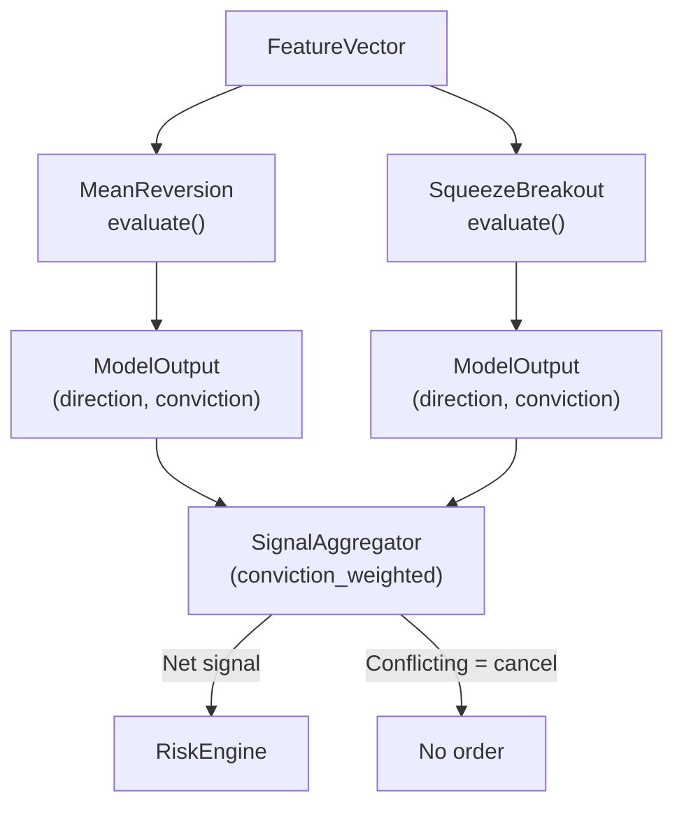

# MeanReversion Model — Technical Documentation

## 1. Overview

The **MeanReversion** model is a counter-trend trading strategy that identifies overbought/oversold conditions in ranging markets. It complements the momentum-based **SqueezeBreakout** model by capturing profit when price reverts to the mean after reaching statistical extremes.

**Core thesis:** When a market is not trending (low ADX), RSI extremes combined with Bollinger Band touches indicate unsustainable price extensions that tend to revert.

---

## 2. High-Level Design (HLD)

### 2.1 Position in Pipeline



### 2.2 Model Architecture



### 2.3 Design Rationale

| Decision | Choice | Reasoning |
|---|---|---|
| Indicator set | RSI + BB + ADX | v1 used 7 indicators (CCI, MFI, A/D, Momentum, LinReg) — optimizer stripped them all on every asset |
| Gate type | ADX < threshold | Mean reversion only works in ranging markets; trending markets invalidate the thesis |
| Confirmation style | AND gate (all 3) | Fewer false positives than OR; 3 conditions are tractable for optimizer |
| Conviction formula | Linear RSI distance | Simple, monotonic, interpretable |
| Signal strength voters | Removed | v1 had 5 SS voters — optimizer universally set `ss_threshold=0` |

---

## 3. Low-Level Design (LLD)

### 3.1 Class Hierarchy



### 3.2 Hyperparameter Schema

| Parameter | Type | Default | Range | Step | Purpose |
|---|---|---|---|---|---|
| `rsi_oversold` | int | 30 | 15–40 | 1 | RSI level below which price is considered oversold (long entry) |
| `rsi_overbought` | int | 70 | 60–85 | 1 | RSI level above which price is considered overbought (short entry) |
| `bb_entry_std` | float | 2.0 | 1.0–3.0 | 0.1 | Bollinger Band width multiplier for entry threshold |
| `adx_regime_threshold` | float | 25.0 | 15.0–40.0 | 1.0 | ADX must be strictly below this for signals (ranging market gate) |
| `holding_period` | int | 5 | 1–20 | 1 | Minimum bars between direction reversals (whipsaw cooldown) |

### 3.3 Signal Logic — `evaluate()` (Single Tick)

```
Input:  FeatureVector { RSI, BollingerBands{upper, lower}, ADX{adx}, bar_data{close} }

1. Extract: rsi_value, bb_upper, bb_lower, close, adx_val
2. Compute adjusted bands:
     bb_mid    = (bb_upper + bb_lower) / 2
     ratio     = bb_entry_std / 2.0
     model_lower = bb_mid - ratio * (bb_mid - bb_lower)
     model_upper = bb_mid + ratio * (bb_upper - bb_mid)
3. Regime gate: adx_pass = (adx_val < adx_regime_threshold)
4. If adx_pass AND rsi <= rsi_oversold AND close <= model_lower:
     direction  = +1 (LONG)
     conviction = min(1.0, (rsi_oversold - rsi) / rsi_oversold)
5. Elif adx_pass AND rsi >= rsi_overbought AND close >= model_upper:
     direction  = -1 (SHORT)
     conviction = min(1.0, (rsi - rsi_overbought) / (100 - rsi_overbought))
6. Else:
     direction  = 0, conviction = 0.0

Output: ModelOutput { direction, conviction, metadata{rsi_value, close, adx, trigger} }
```

### 3.4 Signal Logic — `_batch_evaluate_impl()` (Vectorized)



The batch path is functionally equivalent to `evaluate()` but uses vectorized pandas operations for performance, followed by a Numba JIT-compiled cooldown pass.

### 3.5 Cooldown State Machine (`_apply_cooldown`)



The `_apply_cooldown` function is JIT-compiled with `@njit(cache=True)` for performance. It suppresses direction flips within `holding_period` bars by maintaining the previous direction during cooldown.

### 3.6 Required Indicators & Features

| Indicator | Config Key | Output Fields Used | Fixed Period |
|---|---|---|---|
| RSI | `RSI` | `RSI` (scalar or `{value}` dict) | 14 |
| BollingerBands | `BollingerBands` | `BollingerBands_upper`, `BollingerBands_lower` | 20, 2σ |
| ADX | `ADX` | `ADX` (`{adx, plus_di, minus_di}` dict) | 14 |

Minimum history bars: **20** (driven by BB period).

---

## 4. Config Management

### 4.1 Config Hierarchy



### 4.2 models.yaml Structure

```yaml
models:
  assets:
    XRPUSDT:
      timeframes:
        1h:
          MeanReversion:
            enabled: true        # Set false to disable without removing
            params:
              rsi_oversold: 17
              rsi_overbought: 61
              bb_entry_std: 2.1
              adx_regime_threshold: 15.0
              holding_period: 13
    default:
      timeframes:
        default:
          MeanReversion:
            enabled: true
            params: {}           # Falls back to schema defaults
```

### 4.3 Config Resolution Flow

1. `ModelManager.__init__(asset, timeframe)` calls `_resolve_config_node("models")`
2. Merges config nodes with specificity priority: `asset/tf > asset/default > default/tf > default/default`
3. For each model entry with `enabled: true`:
   - Looks up class via `ModelRegistry.get(name)`
   - Merges `params` with `hyperparameter_schema` defaults
   - Instantiates model
4. At boot, `validate_feature_coverage()` checks that `features.yaml` provides all `required_indicators`

### 4.4 Currently Deployed Configurations

| Asset | Timeframe | Status | Key Params |
|---|---|---|---|
| XRPUSDT | 1h | **Optimized** | rsi_os=17, rsi_ob=61, bb=2.1, adx=15.0, hp=13 |
| BNBUSDT | 30m | **Optimized** | rsi_os=36, rsi_ob=78, bb=2.0, adx=30.0, hp=8 |
| BTCUSDT | 1h | Default | rsi_os=30, rsi_ob=70, bb=2.0, hp=5 |
| BTCUSDT | 4h | Default | rsi_os=25, rsi_ob=75, bb=2.5, hp=3 |
| ETHUSDT | 4h | Default | rsi_os=25, rsi_ob=75, bb=2.5, hp=3 |

---

## 5. Optimization Pipeline

### 5.1 Workflow Overview



### 5.2 Anti-Overfit Guardrails

| Guardrail | Method | Threshold |
|---|---|---|
| Cross-validation | 5-fold purged time-series CV | — |
| Regularized objective | `mean_sharpe - 0.5 * std_sharpe` | Positive required |
| Minimum trades | Per-fold trade count | ≥ 2 per fold |
| Sensitivity screening | Morris elementary effects | mu* ≥ 12% of max |
| Param stability | ±1 step neighbor scores | Score range < 0.5 |
| FS vs CV gap | Full-sample Sharpe vs CV mean | Gap < 0.5 = CONSISTENT |

### 5.3 Morris Sensitivity Screening

Runs **before** Optuna to identify which parameters materially affect performance. Parameters below the threshold are fixed at defaults to reduce search space.

```
For each of 20 trajectories:
  1. Random starting point in param space
  2. Perturb each param by ¼ of its range
  3. Measure elementary effect = Δ(reg_score) / Δ(normalized_param)
  4. mu* = mean(|effects|), sigma = std(effects)

Result: All 5 MR params are sensitive (mu* ≥ 0.364)
  rsi_oversold (3.035) > bb_entry_std (2.603) > rsi_overbought (2.496)
  > adx_regime_threshold (2.470) > holding_period (0.773)
```

### 5.4 Optuna Optimization



### 5.5 Backtester (Multi-TP)

The backtester uses a tiered take-profit exit strategy shared with SqueezeBreakout:

| Level | Target | Portion Closed | Action on Hit |
|---|---|---|---|
| TP1 | +1.5% | 40% | Move SL to breakeven |
| TP2 | +3.0% | 30% | — |
| TP3 | +5.0% | Remaining | Close fully |
| SL | -2.0% | 100% | Close fully |

Commission: 0.04% per trade (entry + exit).

### 5.6 v2 Optimization Results

| Asset-TF | Reg Score | Trades | Win Rate | Full-Sample Sharpe | Stability | Verdict |
|---|---|---|---|---|---|---|
| BNBUSDT 30m | **+1.710** | 143 | 66% | +1.973 | All stable | **DEPLOYED** |
| DOGEUSDT 4h | +1.834 | 30 | 74% | +2.285 | 2 unstable | HOLD |
| BTCUSDT 15m | +1.745 | 39 | 72% | +2.211 | 1 unstable | DEFERRED |
| DOGEUSDT 1h | +1.739 | 23 | 83% | +1.853 | 1 unstable | DEFERRED |
| XRPUSDT 1h | **+1.290** | 22 | 75% | +1.772 | All stable | **DEPLOYED** |
| BTCUSDT 30m | +1.020 | 113 | 63% | +1.034 | 2 unstable | DEFERRED |
| SOLUSDT 1h | +0.212 | 17 | 70% | +1.362 | 1 unstable | HOLD |
| BTCUSDT 1h | -0.467 | 14 | 57% | +0.069 | 2 unstable | NEGATIVE |

---

## 6. Live Inference Flow

### 6.1 End-to-End Signal Path



### 6.2 Multi-Model Coexistence

When MeanReversion and SqueezeBreakout both run on the same asset/timeframe:



The `SignalAggregator` supports four conflict resolution strategies:
- **`conviction_weighted`** (default): Net direction = sign of conviction-weighted sum
- **`higher_tf_priority`**: Higher timeframe wins
- **`cancel_on_conflict`**: Opposing signals cancel out
- **`independent`**: Each signal generates its own order

---

## 7. Testing

### 7.1 Test Structure

| Test File | Scope | Tests |
|---|---|---|
| `tests/test_mean_reversion_model.py` | Unit tests for MR model | 30+ tests across 12 classes |
| `tests/models/test_models.py` | Cross-model integration | Registry, temporal guard, batch eval |

### 7.2 Test Coverage Matrix

| Area | What's Tested |
|---|---|
| Registry | Registration, lookup, class identity |
| Defaults | Schema defaults match, 5 params, required indicators |
| Long signal | RSI oversold + BB lower touch, conviction scaling |
| Short signal | RSI overbought + BB upper touch, conviction scaling |
| ADX gate | Blocks in trending market, boundary behavior (≥ vs <) |
| BB entry std | Tight vs wide bands, signal suppression |
| Neutral RSI | No signal in mid-range |
| Metadata | RSI value, ADX, trigger field |
| Feature validation | All-present, missing indicators |
| Batch evaluation | Result alignment, temporal guard, long/short/neutral, ADX gate |
| Holding period | Cooldown suppression, hp=1 allows all |
| Model output | Contract compliance, conviction bounds, zero on flat |

---

## 8. File Reference

| File | Purpose |
|---|---|
| `src/libs/models/mean_reversion/model.py` | Model implementation |
| `src/libs/models/mean_reversion/__init__.py` | Re-export for auto-registration |
| `src/libs/models/base.py` | `BaseModel` ABC and `ModelMeta` |
| `src/libs/models/registry.py` | `ModelRegistry` (decorator-based) |
| `src/apps/strategy_app/model_manager.py` | Config-driven model loading |
| `src/apps/strategy_app/strategy_worker.py` | Valkey consumer → model evaluation → signal publish |
| `configs/models.yaml` | Per-asset model enable/disable and hyperparameters |
| `configs/features.yaml` | Indicator configuration (RSI, BB, ADX periods) |
| `tests/test_mean_reversion_model.py` | Dedicated MR unit tests |
| `tests/models/test_models.py` | Cross-model integration tests |

---

## 9. Evolution History

| Version | Date | Changes |
|---|---|---|
| v1 (enhanced) | May 2026 | 13 params, 7 indicators, 5 SS voters, multi-confirmation AND gate |
| v2 (simplified) | May 2026 | Stripped to 5 params (RSI+BB+ADX). Optimizer proved CCI/MFI/SS useless for crypto MR. Deployed to XRPUSDT 1h and BNBUSDT 30m. |
