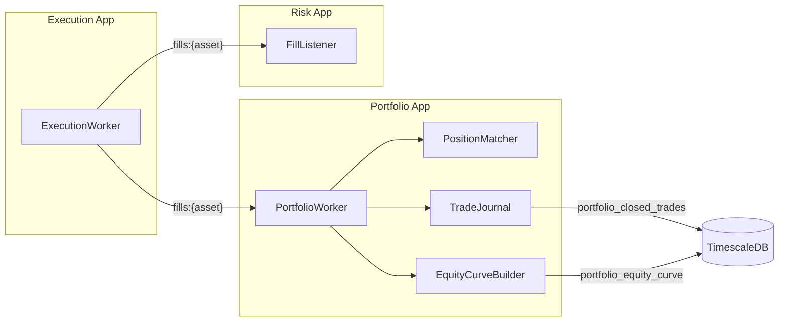
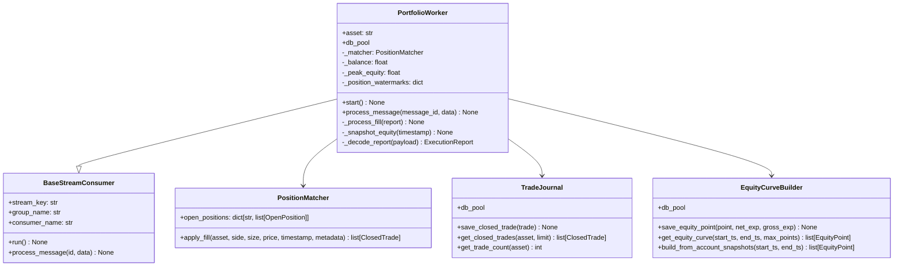
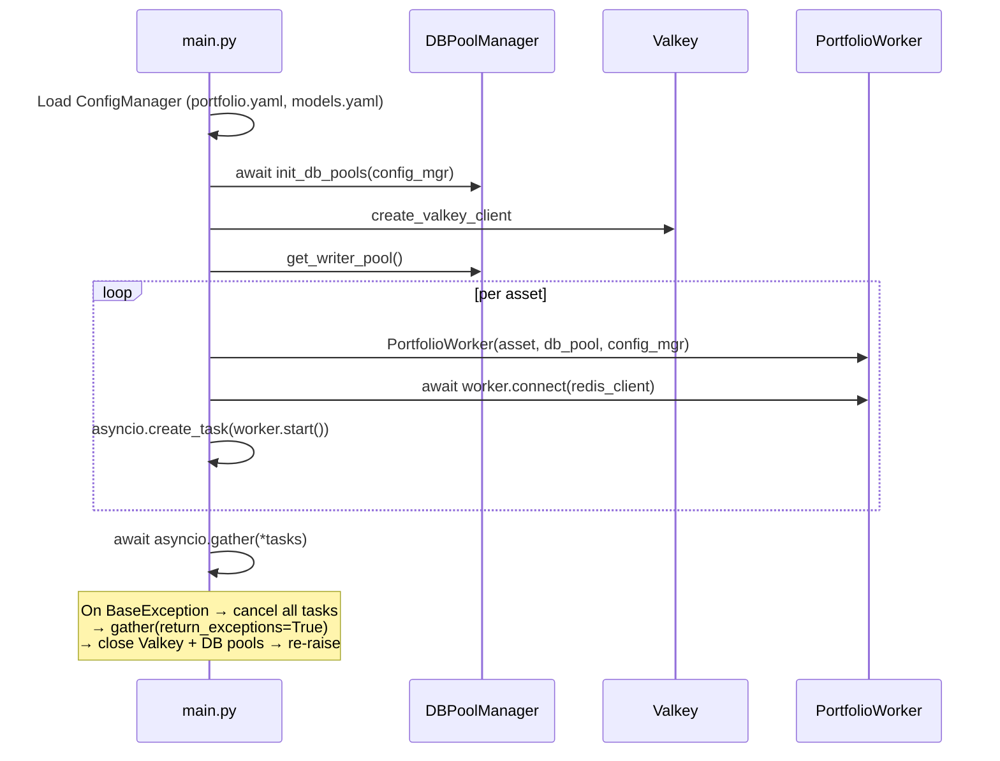
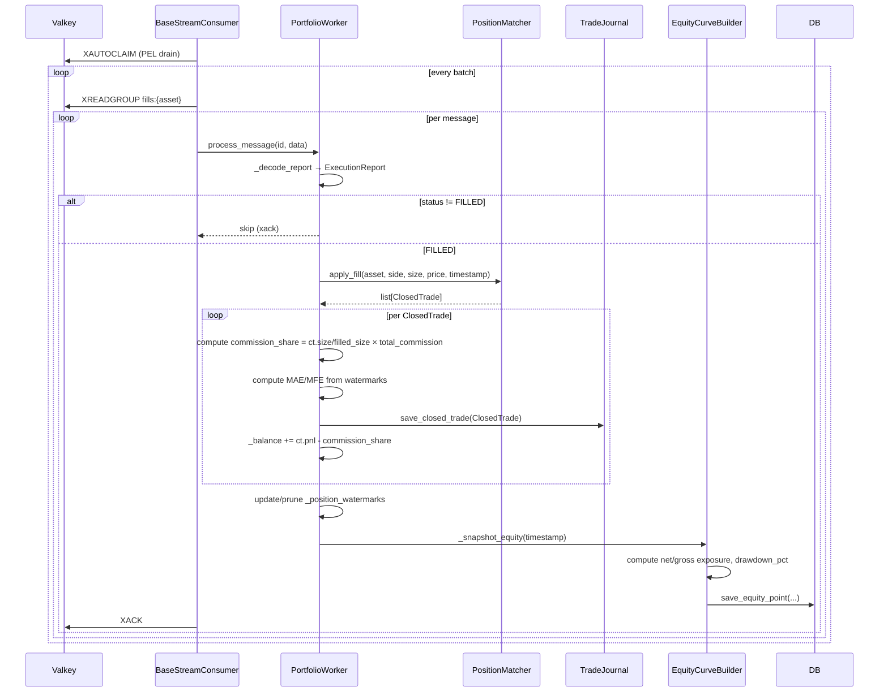

# Portfolio App — Technical Documentation

## 1. Overview

The **Portfolio App** is the analytics and accounting layer in the flipperAgent pipeline. It consumes every `ExecutionReport` fill from Valkey streams, applies FIFO position matching, records closed trades to the database, and continuously snapshots the equity curve.

**Single Responsibility:** Transform raw fill events into durable trade records and equity curve snapshots, providing the data foundation for performance measurement (Sharpe, Sortino, Calmar, drawdown, attribution).

---

## 2. High-Level Design (HLD)

### 2.1 Position in Pipeline



> **Note:** Both `portfolio_app` and `risk_app.FillListener` consume the `fills:{asset}` streams independently via separate consumer groups. They each get a full copy of every fill.

### 2.2 Design Principles

| Principle | Implementation |
|---|---|
| **Decoupled via streams** | No imports from `risk_app` or `execution_app` — Valkey streams are the only boundary |
| **FIFO position matching** | `PositionMatcher` (shared with risk_app) applies FIFO lot matching for accurate per-lot cost basis and PnL |
| **Proportional commission** | When one fill closes multiple FIFO entries, each entry bears only its size-weighted share of total commission |
| **Net-of-commission balance** | `_balance` deducts `commission_share` at every close so the equity curve reflects true net returns |
| **PEL drain on boot** | `BaseStreamConsumer.run()` calls `XAUTOCLAIM` at startup to reprocess any messages unacked at crash time |
| **Per-worker isolation** | Each asset gets its own `PortfolioWorker` instance with independent `PositionMatcher` and watermark state |

### 2.3 Key Contracts

| Contract | Direction | Schema |
|---|---|---|
| **Fill input** | Valkey `XREADGROUP` from `fills:{asset}` | `ExecutionReport`: `{order_id, asset, side, filled_size, average_fill_price, status, fills, slippage_bps, idempotency_key, ...}` |
| **Closed trade output** | DB `INSERT` into `portfolio_closed_trades` | `ClosedTrade`: `{trade_id, asset, direction, entry_price, exit_price, size, realized_pnl, commission_total, mae_pct, mfe_pct, ...}` |
| **Equity snapshot output** | DB `INSERT/UPSERT` into `portfolio_equity_curve` | `EquityPoint`: `{timestamp, equity, balance, unrealized_pnl, drawdown_pct, open_position_count}` + `net_exposure_pct`, `gross_exposure_pct` |

---

## 3. Low-Level Design (LLD)

### 3.1 Class Diagram



### 3.2 File Structure

```
src/
├── apps/
│   └── portfolio_app/
│       ├── main.py              # Entrypoint: asset discovery, worker spawn
│       └── portfolio_worker.py  # PortfolioWorker: fill consumer, trade recording
└── libs/
    ├── portfolio/
    │   ├── trade_journal.py     # TradeJournal: DB reads/writes for closed trades
    │   ├── equity_curve.py      # EquityCurveBuilder: equity_curve DB reads/writes
    │   ├── metrics.py           # Sharpe, Sortino, Calmar, drawdown, trade stats
    │   ├── returns.py           # Return series resampling (LOCF), log/simple returns
    │   ├── attribution.py       # PnL attribution by asset/model/timeframe
    │   └── benchmark.py        # Alpha, beta, correlation vs benchmark
    └── common/
        └── position_matcher.py  # Shared FIFO lot matching (also used by risk_app)
```

---

## 4. Boot Sequence



---

## 5. Fill Processing Flow



---

## 6. FIFO Position Matching

`PositionMatcher` (in `libs/common/position_matcher.py`) applies FIFO lot accounting, matching exit fills against the oldest open lots first.

| Scenario | Behaviour |
|---|---|
| **Open long** | New `buy` fill with no prior positions → adds `OpenPosition(side="buy", ...)` |
| **Open short** | New `sell` fill with no prior positions → adds `OpenPosition(side="sell", ...)` |
| **Close long (full)** | `sell` fill fully consumes oldest buy lot → returns 1 `ClosedTrade` |
| **Close long (partial)** | `sell` fill smaller than lot → reduces lot size, partial `ClosedTrade` |
| **Multiple lots** | `sell` fill spans multiple buy lots → returns N `ClosedTrade` objects, one per lot consumed |

### PnL Formula

For a long trade:
$$\text{pnl} = (\text{exit\_price} - \text{entry\_price}) \times \text{size}$$

For a short trade:
$$\text{pnl} = (\text{entry\_price} - \text{exit\_price}) \times \text{size}$$

### Commission Allocation

When one fill closes $N$ FIFO lots, each lot bears a proportional share:

$$\text{commission\_share}_i = \frac{\text{size}_i}{\text{filled\_size}} \times \text{total\_commission}$$

This prevents $N\times$ overcounting when a single fill exits multiple prior entries.

---

## 7. MAE / MFE Watermarks

Maximum Adverse Excursion (MAE) and Maximum Favorable Excursion (MFE) are tracked in-memory per open position, updated on every fill that touches the same asset.

```
_position_watermarks: dict[(asset, entry_timestamp, entry_price) → {worst_price, best_price}]
```

| Event | Action |
|---|---|
| New open position detected | Initialize `worst_price = best_price = entry_price` |
| Subsequent fill for same asset (long) | `worst_price = min(worst_price, fill_price)`, `best_price = max(best_price, fill_price)` |
| Subsequent fill for same asset (short) | `worst_price = max(worst_price, fill_price)`, `best_price = min(best_price, fill_price)` |
| Position fully closed | Remove watermark entry |

> **Known gap:** Watermarks only update at fill events. Intra-fill price excursions (e.g. high/low candle data) are not captured. MAE/MFE values represent fill-to-fill extremes only.

---

## 8. Equity Snapshots

`_snapshot_equity(timestamp)` runs after every fill, computing:

| Field | Formula |
|---|---|
| `equity` | `_balance` (realised balance, net of all closed PnL and commissions) |
| `drawdown_pct` | $(\text{peak\_equity} - \text{equity}) / \text{peak\_equity} \times 100$ |
| `long_notional` | $\sum_{\text{buy pos}} \text{entry\_price} \times \text{size}$ |
| `short_notional` | $\sum_{\text{sell pos}} \text{entry\_price} \times \text{size}$ |
| `net_exposure_pct` | $(\text{long} - \text{short}) / \text{equity} \times 100$ |
| `gross_exposure_pct` | $(\text{long} + \text{short}) / \text{equity} \times 100$ |

> **Known gap:** `unrealized_pnl` is stored as `0.0` in every snapshot because portfolio_app does not receive live price ticks — only fills. True mark-to-market unrealised PnL requires a separate price feed.

---

## 9. Analytics Library

### 9.1 `metrics.py` — Performance Ratios

| Function | Description |
|---|---|
| `compute_sharpe(returns, rf, periods_per_year)` | Annualised Sharpe from regular-interval log returns |
| `compute_sortino(returns, rf, periods_per_year)` | Sortino using downside deviation over **all** periods (not just down periods) |
| `compute_max_drawdown(equity_points)` | Returns `(max_dd_pct, max_dd_duration_seconds)`. Duration is the longest time spent below a prior peak |
| `compute_calmar(returns, equity_points, periods_per_year)` | CAGR / max_drawdown_pct |
| `compute_trade_stats(trades)` | Win rate, profit factor, expectancy, payoff ratio, avg duration |
| `compute_rolling_sharpe(returns, timestamps, window)` | Sliding window Sharpe; returns `list[(timestamp, sharpe)]` |
| `compute_performance(trades, returns, equity_curve, ...)` | Aggregate into `PerformanceSummary` |

### 9.2 `returns.py` — Return Series

| Function | Description |
|---|---|
| `resample_equity_curve(points, interval_s)` | Resample to fixed interval using LOCF (last-observation-carried-forward) |
| `compute_log_returns(points)` | $\ln(E_i / E_{i-1})$, skips non-positive prior equity |
| `compute_simple_returns(points)` | $(E_i - E_{i-1}) / E_{i-1}$ |

### 9.3 `attribution.py` — PnL Attribution

`attribute_pnl(trades, group_by)` groups closed trades by `"asset"`, `"model"`, or `"timeframe"` and returns a `list[PnLAttribution]` with per-group PnL, trade count, win/loss breakdown, and share of total PnL.

### 9.4 `benchmark.py` — Benchmark Comparison

`compute_benchmark_comparison(strategy_returns, benchmark_returns, periods_per_year)` computes Jensen's alpha (annualised), beta, Pearson correlation, tracking error, and information ratio.

---

## 10. Error Handling

| Scenario | Behaviour |
|---|---|
| Fill with `status != FILLED` | Silently skipped — no trade record written, xack still sent |
| Empty `fills` list on report | `total_commission = 0` — no division errors; commission_share = 0 |
| `report.filled_size == 0` | `commission_share = 0` (guard in place) |
| DB write failure (save_closed_trade) | Exception propagates to `BaseStreamConsumer` — message is **not** xacked; will be redelivered from PEL on next boot |
| Worker crash (non-CancelledError) | `main.py` cancels all peer workers, awaits them, then closes connections cleanly before re-raising |

---

## 11. Configuration Reference (`portfolio.yaml`)

```yaml
portfolio:
  # Starting balance for portfolio accounting (not persisted across restarts)
  initial_balance: 10000.0

  # Equity curve snapshot interval (seconds, independent of fills)
  snapshot_interval_seconds: 300

  returns:
    # Resample interval for Sharpe/Sortino return series (seconds)
    resample_interval_seconds: 3600  # 1h — recommended for 24/7 crypto
    # Minimum points before ratio computation is valid
    min_points: 24

  benchmark:
    asset: BTCUSDT
    strategy: buy_hold  # buy_hold or custom

  metrics:
    risk_free_rate: 0.0                 # Annualised decimal for Sharpe/Sortino
    trading_days_per_year: 365          # 365 for 24/7 crypto
    min_trades_for_ratios: 5            # Guard against noisy early-session ratios

  equity_curve:
    max_points: 10000                   # Max rows returned from a single curve query

  trade_journal:
    default_page_size: 100
    max_page_size: 1000

  consumer:
    group_name: portfolio_app_fills_group
    batch_size: 10
    block_ms: 2000
    periodic_snapshot_seconds: 60       # Periodic equity snapshot independent of fills
```

---

## 12. API Observability

### `GET /portfolio/summary`

Returns the latest equity snapshot and recent trade statistics aggregated from the database.

**Response shape:**

```json
{
  "equity": {
    "timestamp": 1748390400.0,
    "lag_ms": 312,
    "equity": 10847.23,
    "balance": 10847.23,
    "unrealized_pnl": 0.0,
    "drawdown_pct": 1.43,
    "open_position_count": 2,
    "net_exposure_pct": 34.2,
    "gross_exposure_pct": 34.2,
    "status": "ok"
  },
  "trades": {
    "sample_size": 47,
    "total_pnl": 847.23,
    "win_rate_pct": 61.7,
    "avg_pnl": 18.03,
    "avg_win": 62.14,
    "avg_loss": -31.77,
    "avg_duration_seconds": 14400,
    "avg_slippage_bps": 2.1,
    "status": "ok"
  }
}
```

| Field | Source |
|---|---|
| `equity.*` | Latest row from `portfolio_equity_curve` (ORDER BY timestamp DESC LIMIT 1) |
| `trades.*` | Aggregated from last 200 rows of `portfolio_closed_trades` |
| `lag_ms` | `(now() - snapshot_timestamp) * 1000` |

---

## 13. Known Gaps

| Gap | Impact | Notes |
|---|---|---|
| `_balance` and `_peak_equity` not persisted across restarts | Equity curve resets to `initial_balance` on every restart; drawdown tracking loses history | Requires a startup DB read of the last `portfolio_equity_curve` row |
| `unrealized_pnl` always `0.0` | Equity curve does not include mark-to-market PnL | Requires a live price feed (separate ticker consumer) |
| MAE/MFE only at fill events | Intra-fill price extremes not captured | Would require candle high/low data |
| Entry commission not tracked | `commission_total` only captures exit fill commission; entry commission is not available from the `ExecutionReport` | Entry fill commission would need to be passed through from the order open |
| No trade deduplication | If a fill message is redelivered from PEL and the DB write already succeeded (partial ack failure), `save_closed_trade` uses `ON CONFLICT DO NOTHING` for safety, but `_balance` and `_position_watermarks` will still be updated again | True idempotency requires a fill-level dedup key checked before `apply_fill` |
| `periodic_snapshot_seconds` config key unused | Periodic snapshotting independent of fills is not implemented; snapshots only occur on fill events | Requires a background asyncio task in `PortfolioWorker` |
