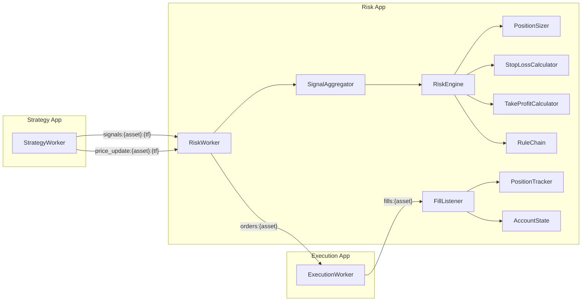
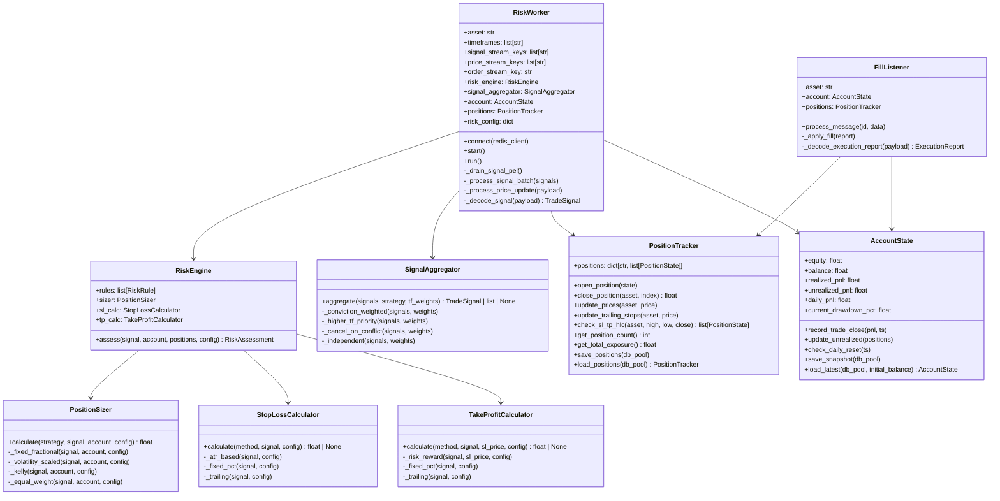
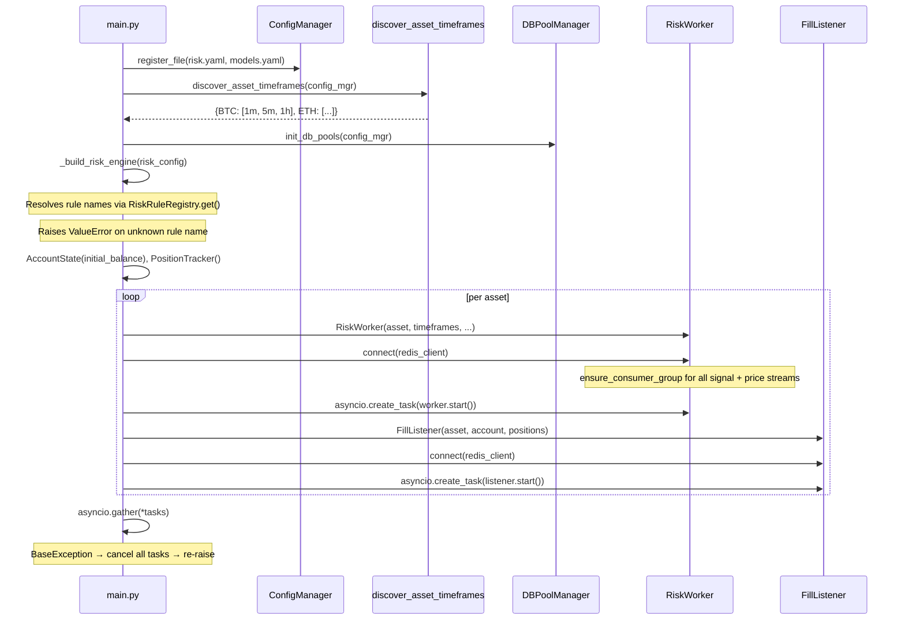
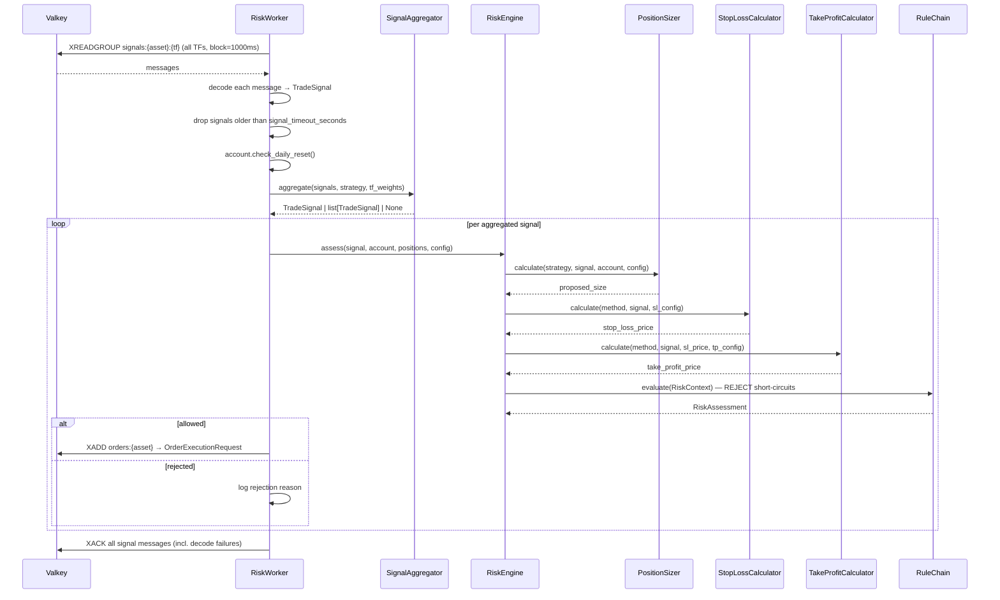
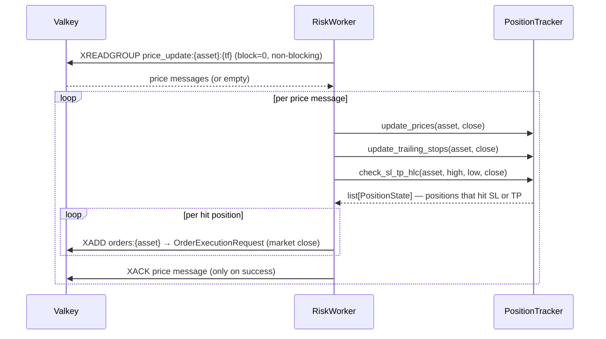
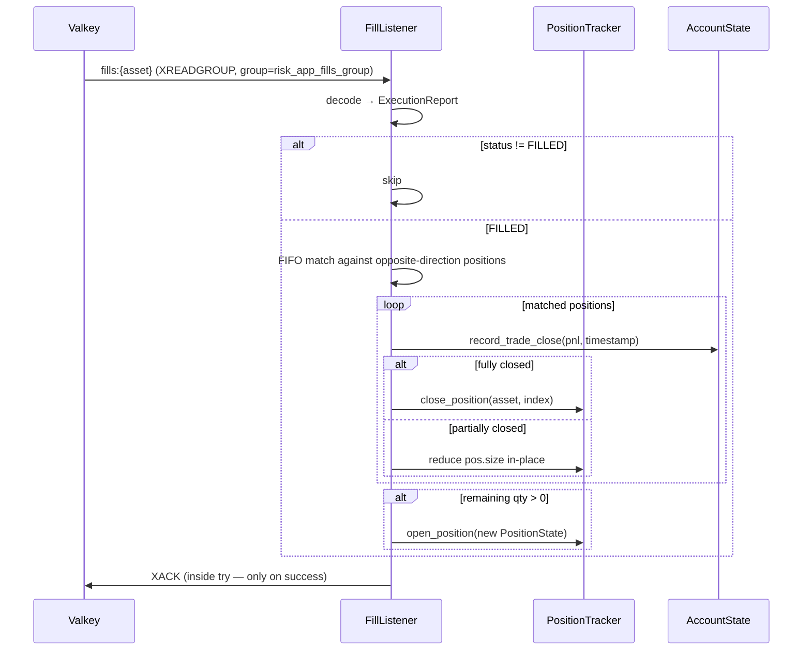

# Risk App — Technical Documentation

## 1. Overview

The **Risk App** is the position-sizing, rule enforcement, and SL/TP monitoring layer in the flipperAgent pipeline. It sits between the strategy layer and the execution layer, consuming `TradeSignal` payloads from Valkey streams, running them through a configurable rule chain and position sizer via the `RiskEngine`, and publishing `OrderExecutionRequest` payloads for execution.

**Single Responsibility:** Assess every signal for risk compliance, size the position, attach SL/TP levels, and emit execution-ready orders.

---

## 2. High-Level Design (HLD)

### 2.1 Position in Pipeline



### 2.2 Design Principles

| Principle | Implementation |
|---|---|
| **Decoupled via streams** | No imports from `strategy_app` or `execution_app` — Valkey streams are the only integration boundary |
| **Config-driven rules** | `risk.yaml` declares which rule classes run and in which order; registry loads them by name |
| **Registry pattern** | `RiskRuleRegistry` auto-discovers rule classes via `@RiskRuleRegistry.register()` decorators |
| **Shared state** | `AccountState` and `PositionTracker` are passed into every worker — no per-worker isolation |
| **MTF batching** | One `RiskWorker` per asset reads ALL timeframe streams and batches signals into a single `SignalAggregator.aggregate()` call |
| **Heartbeat SL/TP** | `price_update:{asset}:{tf}` streams drive SL/TP monitoring on every bar — independent of signal arrival |
| **PEL drain on boot** | Signal streams are reclaimed via `XAUTOCLAIM` at startup to reprocess any messages unacked at crash time |

### 2.3 Key Contracts

| Contract | Direction | Schema |
|---|---|---|
| **Signal input** | Valkey `XREADGROUP` from `signals:{asset}:{tf}` | `TradeSignal`: `{asset, timeframe, timestamp, direction, conviction, price, idempotency_key, metadata}` |
| **Price input** | Valkey `XREADGROUP` from `price_update:{asset}:{tf}` | `PriceUpdate`: `{asset, timeframe, timestamp, open, high, low, close, volume}` |
| **Fill input** | Valkey `XREADGROUP` from `fills:{asset}` | `ExecutionReport`: `{asset, side, filled_size, average_fill_price, status, stop_loss_price, take_profit_price, metadata}` |
| **Order output** | Valkey `XADD` to `orders:{asset}` | `OrderExecutionRequest`: `{asset, side, size, order_type, requested_price, stop_loss_price, take_profit_price, idempotency_key}` |

---

## 3. Low-Level Design (LLD)

### 3.1 Component Architecture



### 3.2 File Structure

```
src/
├── apps/
│   └── risk_app/
│       ├── main.py              # Entrypoint — discovers assets, boots workers
│       ├── risk_worker.py       # Per-asset multi-stream consumer
│       ├── fill_listener.py     # Fill consumer — updates PositionTracker/AccountState
│       └── __init__.py
└── libs/
    └── risk/
        ├── engine.py             # RiskEngine — sizes, SL/TP, rule chain
        ├── sizer.py              # PositionSizer — 4 strategies
        ├── stop_loss.py          # StopLossCalculator — 3 methods
        ├── take_profit.py        # TakeProfitCalculator — 3 methods
        ├── position_tracker.py   # PositionTracker — in-memory state + DB
        ├── account_state.py      # AccountState — balance/equity/PnL/drawdown
        ├── mtf/
        │   └── aggregator.py     # SignalAggregator — 4 MTF strategies
        └── rules/
            ├── base.py           # RiskRule ABC, RiskContext, RiskRuleRegistry
            ├── max_exposure.py   # MaxExposureRule
            ├── max_positions.py  # MaxPositionsRule
            ├── max_drawdown.py   # MaxDrawdownRule
            ├── daily_loss.py     # DailyLossLimitRule
            └── cooldown.py       # CooldownAfterLossRule
```

---

## 4. Boot Sequence



---

## 5. Signal Processing Flow

### 5.1 Per-bar signal batch pipeline



### 5.2 MTF conflict resolution strategies

| Strategy | Behaviour | Returns |
|---|---|---|
| `conviction_weighted` | Net direction = sign(Σ direction × conviction × tf_weight). Net conviction = \|weighted_sum\| / Σ weights. | `TradeSignal \| None` |
| `higher_tf_priority` | Take the signal from the highest timeframe (lowest BARS_PER_YEAR). | `TradeSignal` |
| `cancel_on_conflict` | If any two signals disagree on direction, return None. | `TradeSignal \| None` |
| `independent` | Pass all signals through without aggregation — each assessed by RiskEngine separately. | `list[TradeSignal]` |

Default configured in `risk.yaml`: `conviction_weighted`.

### 5.3 Signal staleness filtering

Before aggregation, every signal is age-checked against wall clock:

```
if now - signal.timestamp > signal_timeout_seconds → drop
```

Stale signals (from backpressure or consumer lag) are discarded with a warning log. Configured under `risk.mtf.signal_timeout_seconds` (default: `300`).

---

## 6. Price Heartbeat / SL-TP Flow



`check_sl_tp_hlc` uses intrabar extremes:
- **Long SL**: triggered if `low ≤ stop_loss_price`
- **Long TP**: triggered if `high ≥ take_profit_price`
- **Short SL**: triggered if `high ≥ stop_loss_price`
- **Short TP**: triggered if `low ≤ take_profit_price`

When both SL and TP are hit on the same bar, TP takes priority.

---

## 7. Fill Listener Flow



FillListener uses its own consumer group (`risk_app_fills_group`) independent from `portfolio_app`. Both apps receive every fill independently.

---

## 8. RiskEngine — Rule Chain

```mermaid
flowchart TD
    A[assess(signal)] --> B[PositionSizer.calculate()]
    B --> C[StopLossCalculator.calculate()]
    C --> D[TakeProfitCalculator.calculate()]
    D --> E[Build RiskContext]
    E --> F{Rule 1: evaluate}
    F -- REJECT --> Z[Return RiskAssessment allowed=False]
    F -- MODIFY --> G[Update proposed_size in context]
    F -- ALLOW --> H{Rule 2: evaluate}
    G --> H
    H -- REJECT --> Z
    H -- ... --> I{Rule N: evaluate}
    I -- ALLOW --> J[Return RiskAssessment allowed=True]
```

- `REJECT` short-circuits immediately — remaining rules are not evaluated.
- `MODIFY` updates `proposed_size` in the shared `RiskContext` — downstream rules see the adjusted size.

### 8.1 Registered rules (default order from `risk.yaml`)

| Rule | Config path | Rejects when |
|---|---|---|
| `MaxExposureRule` | `global_limits.max_total_exposure_pct` | Total notional > equity × limit |
| `MaxPositionsRule` | `global_limits.max_concurrent_positions` | Open position count ≥ limit |
| `MaxDrawdownRule` | `global_limits.max_drawdown_pct` | Current drawdown % > limit |
| `DailyLossLimitRule` | `global_limits.daily_loss_limit_pct` | Daily loss % of equity > limit |
| `CooldownAfterLossRule` | `global_limits.cooldown_after_loss_seconds` | Time since last losing trade < cooldown |

---

## 9. Position Sizing Strategies

| Strategy | Formula | Config key |
|---|---|---|
| `fixed_fractional` | `(equity × risk_pct/100) / (price × stop_pct/100)` | `position_sizing.fixed_fractional` |
| `volatility_scaled` | `(equity × target_risk_pct/100) / (ATR × atr_multiplier)` | `position_sizing.volatility_scaled` |
| `kelly` | `fraction × (win_rate − (1−win_rate)/rr) × equity / price` | `position_sizing.kelly` |
| `equal_weight` | `equity / (max_positions × price)` | `position_sizing.equal_weight` |

`volatility_scaled` and `kelly` fall back to `fixed_fractional` when required metadata (`ATR`, `win_rate`, `rr_ratio`) is absent.

---

## 10. Stop-Loss and Take-Profit Methods

### Stop-loss methods

| Method | Formula | Notes |
|---|---|---|
| `atr_based` | Long: `price − ATR × multiplier` / Short: `price + ATR × multiplier` | Falls back to None if ATR missing |
| `fixed_pct` | Long: `price × (1 − pct/100)` / Short: `price × (1 + pct/100)` | Always produces a value |
| `trailing` | Same initial formula as `atr_based`; PositionTracker updates it per bar | Trailing updates via `update_trailing_stops()` |

### Take-profit methods

| Method | Formula | Notes |
|---|---|---|
| `risk_reward` | `sl_distance × ratio` from entry | Requires a valid SL price; returns None if SL is None |
| `fixed_pct` | Long: `price × (1 + pct/100)` / Short: `price × (1 − pct/100)` | Always produces a value |
| `trailing` | Same initial formula as ATR-based; PositionTracker updates it per bar | |

---

## 11. Configuration Reference (`risk.yaml`)

```yaml
risk:
  account:
    initial_balance: 10000      # Starting paper balance (USDT)
    currency: USDT
    leverage_limit: 5.0

  global_limits:
    max_total_exposure_pct: 80  # % of equity
    max_concurrent_positions: 10
    max_drawdown_pct: 15        # % from peak equity
    daily_loss_limit_pct: 5     # % of equity
    cooldown_after_loss_seconds: 0

  rules:                        # Evaluated in order; first REJECT wins
    - MaxExposureRule
    - MaxPositionsRule
    - MaxDrawdownRule
    - DailyLossLimitRule
    - CooldownAfterLossRule

  position_sizing:
    default_strategy: volatility_scaled
    fixed_fractional:
      risk_per_trade_pct: 2.0
    volatility_scaled:
      target_risk_pct: 1.0
      atr_multiplier: 2.0
    kelly:
      fraction: 0.5
    equal_weight: {}

  stop_loss:
    default_method: atr_based
    atr_based:
      multiplier: 2.0
    fixed_pct:
      pct: 2.0
    trailing:
      atr_multiplier: 2.0

  take_profit:
    default_method: fixed_pct
    risk_reward:
      ratio: 2.0
    fixed_pct:
      pct: 1.5
    trailing:
      atr_multiplier: 3.0

  mtf:
    default_conflict_resolution: conviction_weighted
    signal_timeout_seconds: 300  # Drop signals older than this (wall clock)
    timeframe_weights:
      1m: 0.25
      5m: 0.5
      15m: 0.75
      1h: 1.0
      4h: 1.5
      1d: 2.0
```

---

## 12. Error Handling

| Scenario | Behaviour |
|---|---|
| Price update processing exception | Logged at ERROR level; message stays in PEL (not acked) — retried on next boot via `XAUTOCLAIM` |
| Signal decode failure | Logged at ERROR level; message acked (corrupt bytes are unrecoverable) |
| Signal too old (`> signal_timeout_seconds`) | Warning logged; signal dropped before aggregation |
| MTF aggregation cancels (conflict/neutral) | Debug logged; no order published |
| Signal REJECTED by rule | Info logged with rule name + reason; no order published |
| Unknown sizing strategy | Warning logged; falls back to `fixed_fractional` |
| ATR missing for `volatility_scaled` sizing | Debug logged; falls back to `fixed_fractional` |
| SL price None for `risk_reward` TP | None returned; no take-profit attached to order |
| Boot with unknown rule name in config | Raises `ValueError` — app refuses to start |
| Worker or listener task crash | `BaseException` handler cancels all peer tasks before re-raising; `redis_client.aclose()` + `DBPoolManager.close_pools()` always called in `finally` |
| Consumer group already exists | Silently ignored (`BUSYGROUP` exception swallowed by `ensure_consumer_group`) |

---

## 13. Known Gaps / Future Work

| Gap | Description |
|---|---|
| **State not recovered on restart** | `AccountState` and `PositionTracker` always initialize fresh. `load_positions()` and `AccountState.load_latest()` exist but are not called at startup. After crash/redeploy: open positions are invisible to risk rules, SL/TP won't fire, daily PnL resets to zero. Requires deliberate recovery strategy before enabling in production. |
| **No `/risk/status` API endpoint** | Unlike `ingestion_app` and `signal_app`, there is no observability endpoint for current positions, account equity, or drawdown. |
| **`AccountState.update_unrealized` not called periodically** | Unrealized PnL is only updated when fills arrive. Between fills, `equity` and `current_drawdown_pct` may be stale, causing `MaxDrawdownRule` and `DailyLossLimitRule` to evaluate against outdated figures. |
