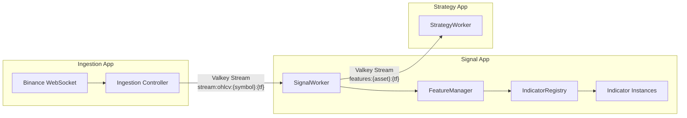
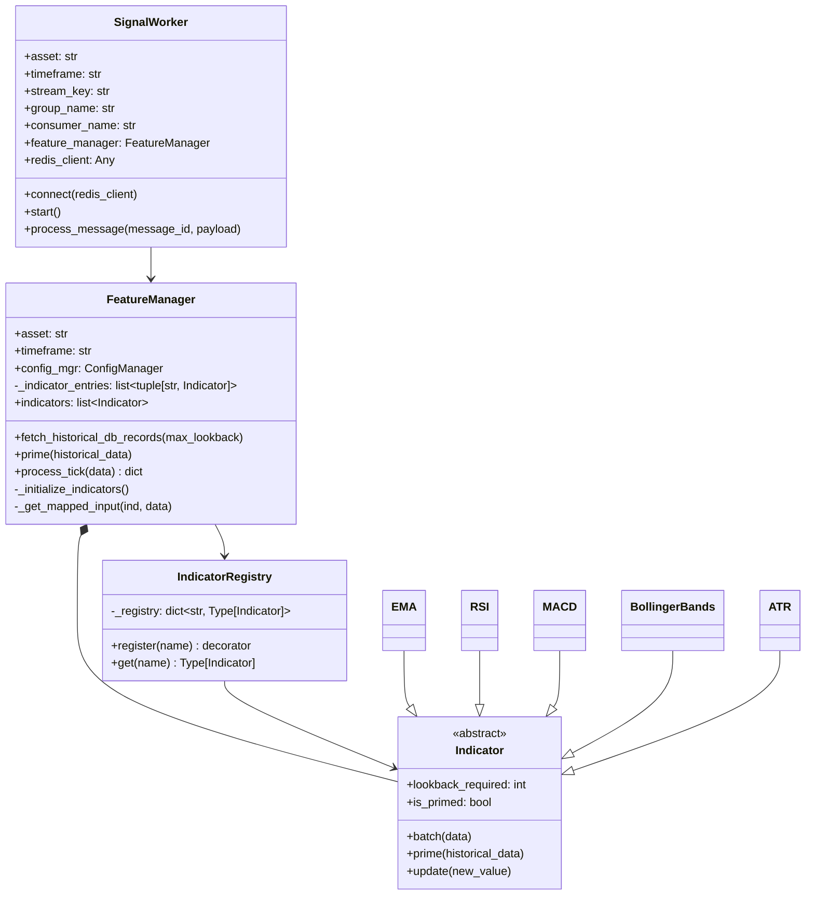
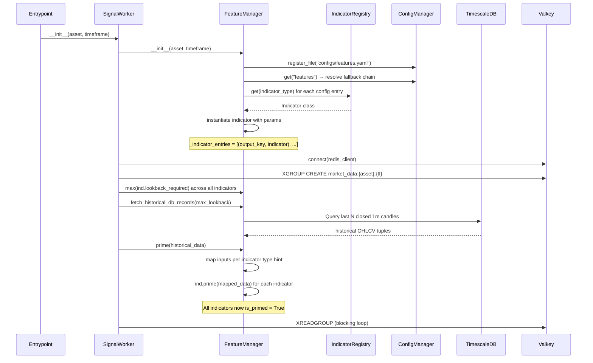
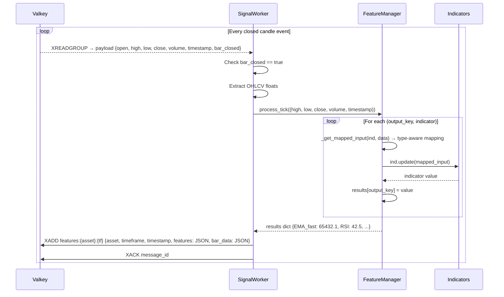
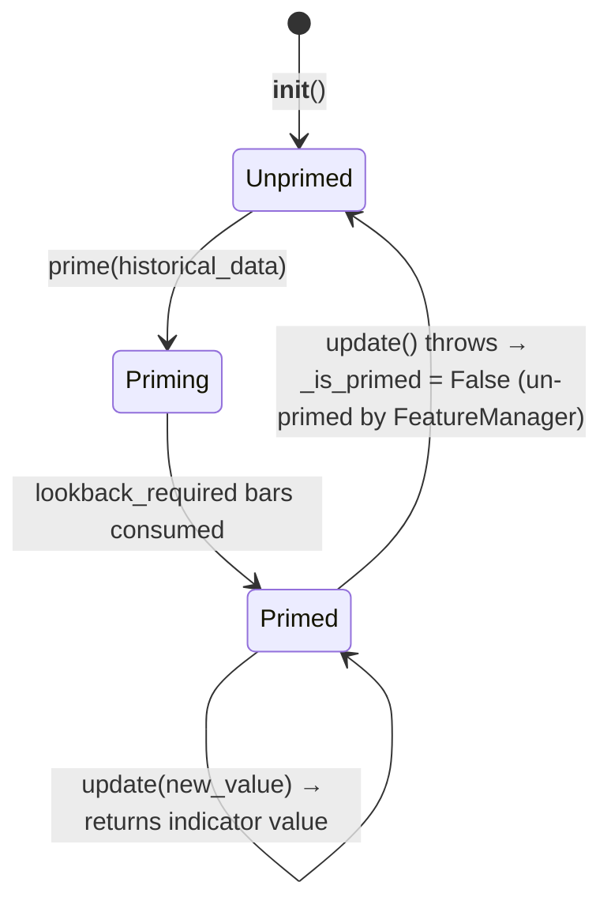

# Signal App — Technical Documentation

## 1. Overview

The **Signal App** is the feature computation layer in the flipperAgent pipeline. It sits between the ingestion layer and the strategy layer, consuming raw OHLCV candle events from Valkey streams, computing technical indicator values via the `FeatureManager`, and publishing structured `FeatureVector` payloads downstream for model consumption.

**Single Responsibility:** Transform raw market data into computed feature vectors.

---

## 2. High-Level Design (HLD)

### 2.1 Position in Pipeline



### 2.2 Design Principles

| Principle | Implementation |
|---|---|
| **Decoupled via streams** | No imports from `ingestion_app` or `strategy_app` — Valkey streams are the only integration boundary |
| **Config-driven indicators** | `features.yaml` defines which indicators run per asset/timeframe via fallback chain |
| **Registry pattern** | `IndicatorRegistry` auto-discovers indicator classes via decorators |
| **Multi-instance aliasing** | Same indicator type can appear multiple times with different params (e.g., `EMA_fast`, `EMA_slow`) |
| **Stateful priming** | Indicators are pre-warmed with historical data before live processing |

### 2.3 Key Contracts

| Contract | Direction | Schema |
|---|---|---|
| **Input** | Valkey `XREADGROUP` from `stream:ohlcv:{asset}:{timeframe}` | Raw OHLCV fields: `open`, `high`, `low`, `close`, `volume`, `timestamp`, `bar_closed` |
| **Output** | Valkey `XADD` to `features:{asset}:{timeframe}` | `FeatureVector`: `{asset, timeframe, timestamp, features: dict, bar_data: dict}` |

---

## 3. Low-Level Design (LLD)

### 3.1 Component Architecture



### 3.2 File Structure

```
src/apps/signal_app/
├── signal_worker.py          # Valkey consumer — orchestrates lifecycle
└── feature_manager.py        # Config-driven indicator loading + tick dispatch

src/libs/features/
├── __init__.py
└── indicators/
    ├── __init__.py            # Auto-imports for registry self-registration
    ├── base.py                # Indicator ABC (Generic[TInput, TOutput])
    ├── registry.py            # IndicatorRegistry (decorator-based)
    ├── trend/
    │   └── ema.py             # EMA indicator
    ├── momentum/
    │   ├── rsi.py             # RSI indicator
    │   └── macd.py            # MACD indicator
    ├── volatility/
    │   ├── bollinger.py       # Bollinger Bands
    │   └── atr.py             # Average True Range
    └── volume/                # (placeholder for future volume indicators)
```

### 3.3 Configuration — `features.yaml`

```yaml
features:
  assets:
    BTCUSDT:                    # Asset-specific overrides
      timeframes:
        1h:
          MACD: { fast_period: 12, signal_period: 9, slow_period: 26 }
          RSI: { period: 14 }
    default:                    # Fallback for any unspecified asset
      timeframes:
        default:                # Fallback for any unspecified timeframe
          ATR: { period: 14 }
          BollingerBands: { period: 20, num_std: 2.0 }
          EMA_fast: { type: EMA, period: 12 }   # Multi-instance alias
          EMA_slow: { type: EMA, period: 26 }   # Multi-instance alias
          MACD: { fast_period: 12, signal_period: 9, slow_period: 26 }
          RSI: { period: 14 }
```

**Fallback chain:** `asset/timeframe` → `asset/default` → `default/timeframe` → `default/default`

**Multi-instance aliasing:** When a YAML key contains a `type` field, the key becomes the output alias and `type` specifies the indicator class. Without `type`, the YAML key is both the class name and the output key.

---

## 4. Pipeline Flow — Top-Down View

### 4.1 Boot Sequence



### 4.2 Live Processing Loop



### 4.3 Input Mapping Logic

`FeatureManager._get_mapped_input()` inspects each indicator's `update()` type hint to determine what data to pass:

| Type Hint | Mapped Input | Example Indicators |
|---|---|---|
| `float` | `data[2]` (close price) | EMA, RSI |
| `Tuple[float, float, float]` (HLC) | `(data[0], data[1], data[2])` | BollingerBands |
| `Tuple[float, float, float, float, float]` (full candle) | `data` (entire tuple) | ATR |
| Fallback | `data[2]` (close price) | — |

---

## 5. Valkey Stream Protocol

### 5.1 Input Stream

- **Key:** `stream:ohlcv:{asset}:{timeframe}` (e.g., `stream:ohlcv:btcusdt:1h`)
- **Consumer group:** `signal_app_group`
- **Consumer name:** `signal_worker_{asset}_{timeframe}`
- **Payload fields:**

| Field | Type | Description |
|---|---|---|
| `open` | string/float | Open price |
| `high` | string/float | High price |
| `low` | string/float | Low price |
| `close` | string/float | Close price |
| `volume` | string/float | Volume |
| `timestamp` | string/float | Candle timestamp |
| `bar_closed` | string/bool | `"true"` / `"True"` / `"1"` / `True` |

### 5.2 Output Stream

- **Key:** `features:{asset}:{timeframe}` (e.g., `features:BTCUSDT:1h`)
- **Payload fields:**

| Field | Type | Description |
|---|---|---|
| `asset` | string | Asset symbol |
| `timeframe` | string | Timeframe |
| `timestamp` | string | Candle timestamp |
| `features` | JSON string | `{"EMA_fast": 65432.1, "RSI": 42.5, ...}` |
| `bar_data` | JSON string | `{"open": 65000.0, "high": 65500.0, ...}` |

> **Note:** `bar_data` includes the full OHLCV bar so downstream consumers (StrategyWorker) have price context without a separate DB query.

---

## 6. Indicator Lifecycle



### 6.1 Indicator ABC Contract

```python
class Indicator(ABC, Generic[TInput, TOutput]):
    lookback_required: int      # Minimum historical bars for valid output
    is_primed: bool             # Whether indicator has enough state
    batch(data) → Sequence      # Vectorized for backtesting
    prime(historical_data)      # Pre-warm live state from history
    update(new_value) → TOutput # Single-tick update for live trading
```

### 6.2 Registered Indicators

| Name | Class | Input Type | Key Params |
|---|---|---|---|
| `EMA` | `EMA` | `float` (close) | `period` |
| `RSI` | `RSI` | `float` (close) | `period` |
| `MACD` | `MACD` | `float` (close) | `fast_period`, `slow_period`, `signal_period` |
| `BollingerBands` | `BollingerBands` | `(H, L, C)` tuple | `period`, `num_std` |
| `ATR` | `ATR` | `(H, L, C, V, T)` full candle | `period` |

---

## 7. Error Handling

| Scenario | Behavior |
|---|---|
| Indicator not found in registry | Logged as warning, skipped during init |
| Indicator instantiation fails | Logged as error, skipped |
| No history for priming | Logged as warning, indicators remain unprimed |
| Unprimed indicator on tick | Skipped with warning — no output for that indicator |
| Indicator throws on `update()` | Logged as error, indicator un-primed (`_is_primed = False`) |
| No redis client | Runs in mock mode — processes but doesn't publish |
| Consumer group already exists | `BUSYGROUP` exception silently caught |

---

## 8. Known Integration Notes

1. **bytes vs str:** SignalWorker handles both `bytes` and `str` keys/values from Valkey (depends on client `decode_responses` setting).
2. **Only closed bars:** `process_message()` filters on `bar_closed == true` — partial/open candles are ignored.
3. **No `main.py` entrypoint:** Signal App currently has no boot/discovery mechanism. `SignalWorker` must be instantiated externally (e.g., from a shared orchestrator or a future `main.py`).
