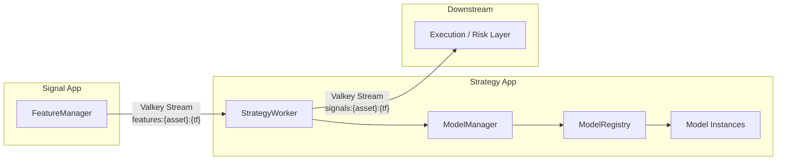
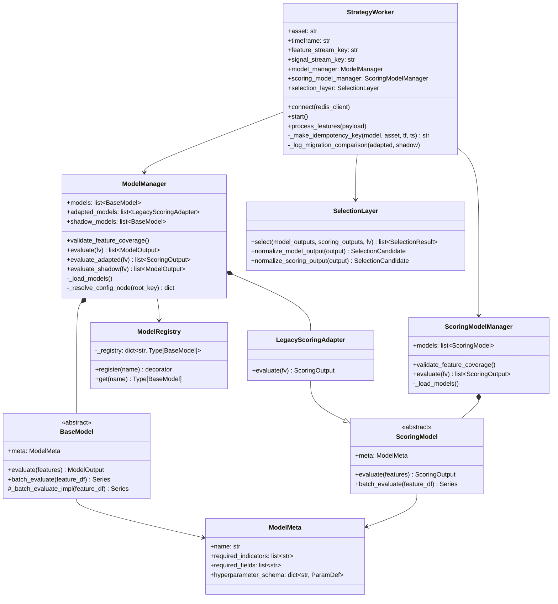
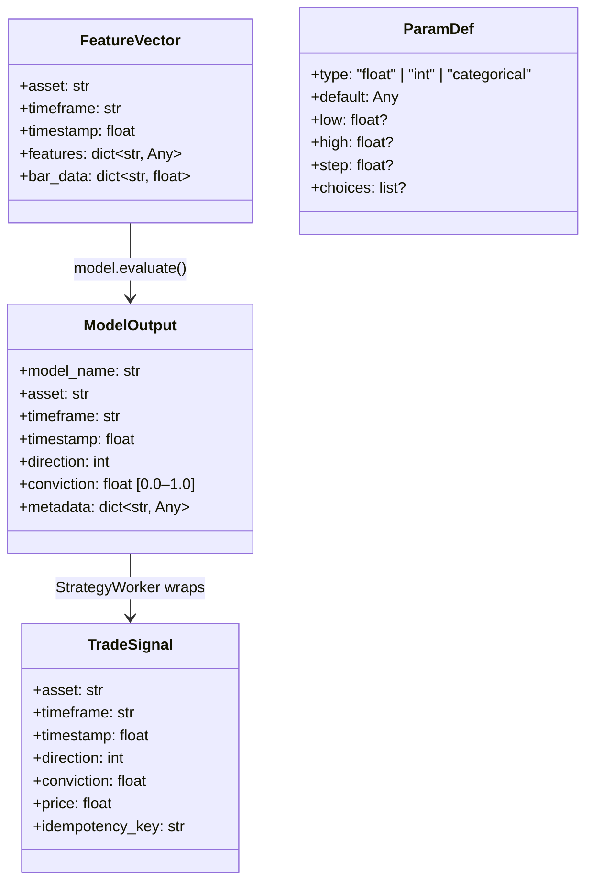
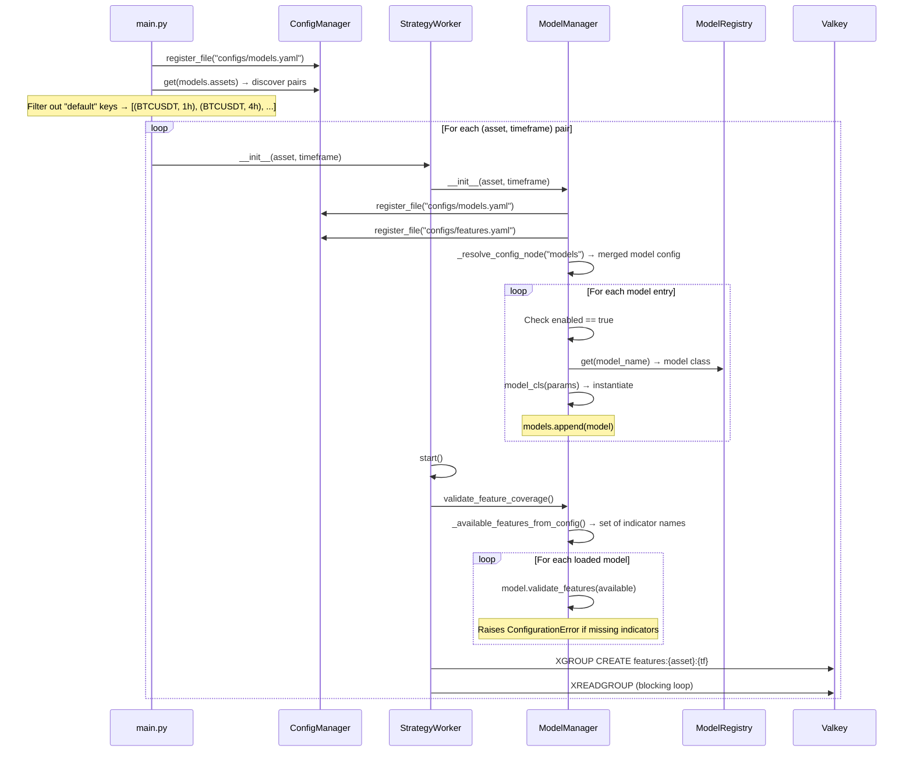
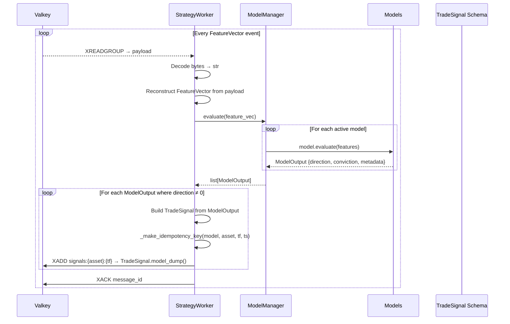
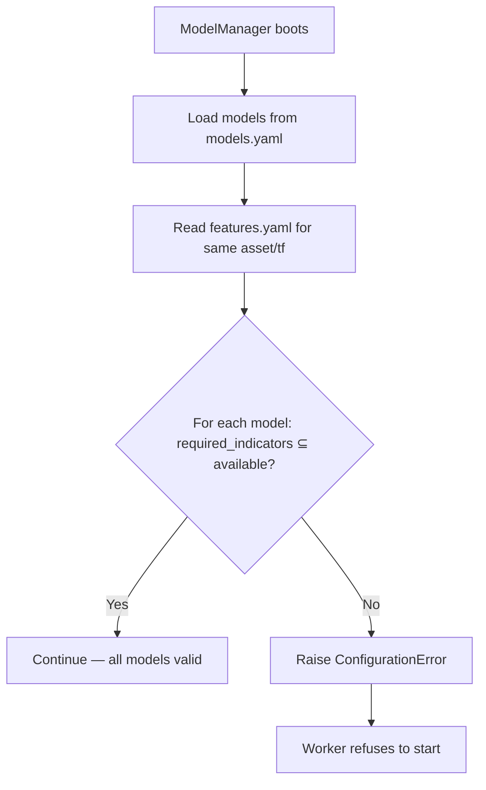
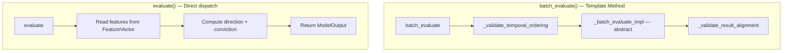
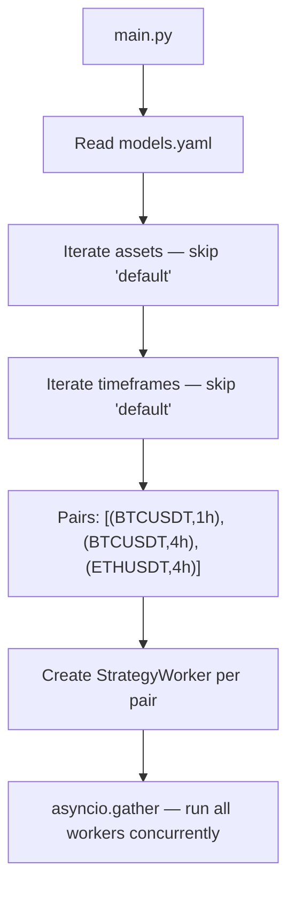
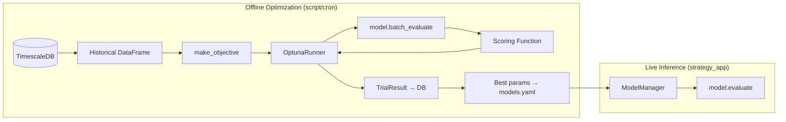
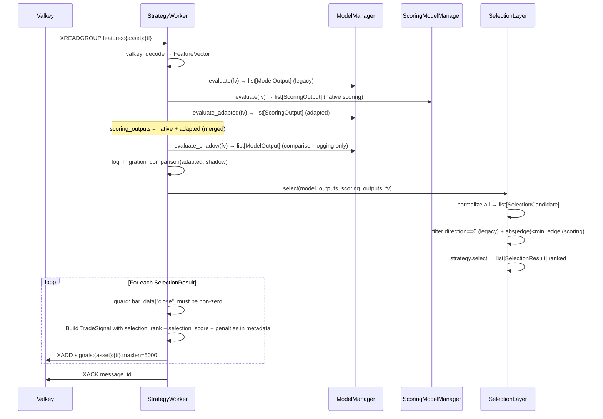

# Strategy App — Technical Documentation

## 1. Overview

The **Strategy App** is the model inference and signal generation layer in the flipperAgent pipeline. It sits between the feature computation layer (Signal App) and the downstream execution layer, consuming computed `FeatureVector` payloads from Valkey streams, running them through config-driven quantitative models via the `ModelManager`, and publishing `TradeSignal` payloads for downstream consumption.

**Single Responsibility:** Evaluate models on incoming features and emit actionable trade signals.

---

## 2. High-Level Design (HLD)

### 2.1 Position in Pipeline



### 2.2 Design Principles

| Principle | Implementation |
|---|---|
| **Decoupled via streams** | No imports from `signal_app` or any downstream app — Valkey streams are the only boundary |
| **Config-driven models** | `models.yaml` defines which models run per asset/timeframe with fallback chain |
| **Registry pattern** | `ModelRegistry` auto-discovers model classes via decorators |
| **Boot-time validation** | `ModelManager.validate_feature_coverage()` ensures all required indicators exist in `features.yaml` before accepting traffic |
| **Idempotent signals** | Deterministic `idempotency_key` (SHA-256 of model+asset+timeframe+timestamp) prevents duplicate downstream processing |
| **Flat-signal suppression** | `direction == 0` (flat) signals are never published — only actionable long/short signals reach the stream |

### 2.3 Key Contracts

| Contract | Direction | Schema |
|---|---|---|
| **Input** | Valkey `XREADGROUP` from `features:{asset}:{timeframe}` | `FeatureVector`: `{asset, timeframe, timestamp, features: dict, bar_data: dict}` |
| **Output** | Valkey `XADD` to `signals:{asset}:{timeframe}` | `TradeSignal`: `{asset, timeframe, timestamp, direction, conviction, price, idempotency_key}` |

---

## 3. Low-Level Design (LLD)

### 3.1 Component Architecture



### 3.2 Pydantic Contracts



### 3.3 File Structure

```
src/apps/strategy_app/
├── __init__.py
├── main.py                    # Entrypoint — discovers pairs, boots workers, cancels all on boot failure
├── strategy_worker.py         # Valkey consumer — 3-path evaluation + SelectionLayer + publish
├── model_manager.py           # Legacy + adapted + shadow model loading
└── scoring_model_manager.py   # Native ScoringModel loading

src/libs/models/
├── __init__.py                # Auto-imports for registry self-registration (7 models)
├── base.py                    # BaseModel ABC + ModelMeta dataclass
├── scoring_base.py            # ScoringModel ABC
├── registry.py                # ModelRegistry (decorator-based)
├── scoring_registry.py        # ScoringModelRegistry (decorator-based)
├── legacy_adapter.py          # LegacyScoringAdapter — wraps BaseModel → ScoringOutput
├── mean_reversion/            # RSI + BollingerBands model
├── trend_following/           # EMA crossover + MACD + ATR model
├── momentum/                  # RSI directional bias + MACD histogram
├── squeeze_breakout/          # Squeeze momentum breakout (migration_mode: adapted)
├── regime_pullback/           # Regime-aware pullback model
├── divergence_edge/           # Divergence detection model
└── regime_relative_value/     # Relative-value under regime model

src/libs/selection/
├── __init__.py
├── base.py                    # SelectionStrategy ABC
├── selection_layer.py         # SelectionLayer — normalize + strategy dispatch
└── strategies.py              # ConvictionWeightedStrategy, OverlapPenalizedStrategy, TopKStrategy

src/libs/contracts/
├── signal.py                  # FeatureVector, ModelOutput, TradeSignal, ScoringOutput,
│                              # SelectionCandidate, SelectionResult, ParamDef
└── schemas.py                 # Re-export hub (wildcard imports from all contract modules)
```

### 3.4 Configuration — `models.yaml`

```yaml
models:
  assets:
    BTCUSDT:
      timeframes:
        1h:
          MeanReversion:
            enabled: true
            params:
              rsi_oversold: 30
              rsi_overbought: 70
              bb_entry_std: 2.0
              holding_period: 5
          TrendFollowing:
            enabled: true
            params:
              ema_fast_period: 12
              ema_slow_period: 26
              require_macd_confirm: true
              atr_conviction_scale: 1.0
          Momentum:
            enabled: true
            params:
              rsi_long_threshold: 55
              rsi_short_threshold: 45
        4h:
          MeanReversion:
            enabled: true
            params:
              rsi_oversold: 25
              rsi_overbought: 75
    default:
      timeframes:
        default:
          MeanReversion:
            enabled: true
            params: {}
```

**Fallback chain:** `asset/timeframe` → `asset/default` → `default/timeframe` → `default/default`
**Merge priority:** Specific nodes override general nodes (last-write-wins via `dict.update()`)

---

## 4. Pipeline Flow — Top-Down View

### 4.1 Boot Sequence



### 4.2 Live Processing Loop



### 4.3 Feature Coverage Validation

At boot, `ModelManager.validate_feature_coverage()` cross-references each model's `meta.required_indicators` against the indicators configured in `features.yaml` for the same asset/timeframe. This catches configuration drift before any traffic flows.



---

## 5. Model Architecture

### 5.1 BaseModel Template Method



- **`evaluate()`** — Single-tick live inference. Stateless. Used by `StrategyWorker`.
- **`batch_evaluate()`** — Vectorized batch over a DataFrame. Used by optimization/backtesting. Template Method enforces temporal ordering and result alignment.

### 5.2 Registered Models

| Model | Registry Key | Required Indicators | Hyperparameters | Signal Logic |
|---|---|---|---|---|
| **MeanReversion** | `MeanReversion` | RSI, BollingerBands | `rsi_oversold`, `rsi_overbought`, `bb_entry_std`, `holding_period` | Long when RSI < oversold AND close < lower band; Short when RSI > overbought AND close > upper band |
| **TrendFollowing** | `TrendFollowing` | EMA_fast, EMA_slow, MACD, ATR | `ema_fast_period`, `ema_slow_period`, `require_macd_confirm`, `atr_conviction_scale` | Long when EMA_fast > EMA_slow (+ optional MACD confirm); ATR-scaled conviction |
| **Momentum** | `Momentum` | RSI, MACD | `rsi_long_threshold`, `rsi_short_threshold`, `require_macd_positive`, `histogram_min_abs` | Long when RSI > threshold AND MACD histogram positive; Short inverse |

### 5.3 Model Output Flow

```
Model.evaluate(FeatureVector)
    → ModelOutput(direction=1/-1/0, conviction=0.0-1.0, metadata={...})
        → if direction ≠ 0:
            → TradeSignal(direction, conviction, price=close, idempotency_key=sha256)
                → XADD signals:{asset}:{timeframe}
```

### 5.4 Hyperparameter Schema

Each model declares its tunable parameters via `ModelMeta.hyperparameter_schema: dict[str, ParamDef]`. This schema drives:
1. **Default values** — `BaseModel._defaults()` extracts defaults at construction
2. **Config override** — `models.yaml` `params:` block overrides defaults
3. **Optimization** — `libs/optimization/objective.py` reads the schema to build Optuna search spaces

---

## 6. Valkey Stream Protocol

### 6.1 Input Stream

- **Key:** `features:{asset}:{timeframe}` (e.g., `features:BTCUSDT:1h`)
- **Consumer group:** `strategy_app_group`
- **Consumer name:** `strategy_worker_{asset}_{timeframe}`
- **Payload fields:**

| Field | Type | Description |
|---|---|---|
| `asset` | string | Asset symbol |
| `timeframe` | string | Timeframe |
| `timestamp` | string | Candle timestamp |
| `features` | JSON string | `{"EMA_fast": 65432.1, "RSI": 42.5, ...}` |
| `bar_data` | JSON string | `{"open": 65000, "high": 65500, ...}` |

### 6.2 Output Stream

- **Key:** `signals:{asset}:{timeframe}` (e.g., `signals:BTCUSDT:1h`)
- **Payload fields (Pydantic `model_dump()`):**

| Field | Type | Description |
|---|---|---|
| `asset` | string | Asset symbol |
| `timeframe` | string | Timeframe |
| `timestamp` | float | Signal timestamp |
| `direction` | int | `1` (long) or `-1` (short) — `0` never published |
| `conviction` | float | `[0.0, 1.0]` — model confidence |
| `price` | float | Close price at signal time |
| `idempotency_key` | string | SHA-256 hash (first 16 chars) for dedup |

---

## 7. Entrypoint — `main.py`

### 7.1 Pair Discovery

`main.py` reads `models.yaml` and discovers all `(asset, timeframe)` pairs (excluding `default` keys). Each pair gets its own `StrategyWorker` instance running as an `asyncio.Task`.



### 7.2 Concurrency Model

- One `StrategyWorker` per `(asset, timeframe)` pair
- All workers run as concurrent `asyncio.Task`s in a single process
- Each worker has its own `ModelManager` with its own set of model instances
- Workers are isolated — no shared state between different asset/timeframe workers

---

## 8. Error Handling

See [Section 12](#12-updated-error-handling) for the complete and current table (updated to reflect scoring pipeline and post-review fixes).

---

## 9. Optimization Integration

The `libs/optimization/` layer is designed to drive models in batch mode for hyperparameter tuning:



- **Single-objective:** `TPESampler` (e.g., maximize Sharpe)
- **Multi-objective:** `NSGAIISampler` (Pareto front, e.g., Sharpe vs drawdown)
- **Schedule:** Configurable cron (daily/weekly/biweekly/monthly) to handle param drift

---

## 10. Comparison: Signal App vs Strategy App

| Dimension | Signal App | Strategy App |
|---|---|---|
| **Purpose** | Compute features from raw OHLCV | Generate trade signals from features |
| **Input** | Raw candle data (OHLCV) | Computed feature vectors |
| **Output** | `FeatureVector` | `TradeSignal` |
| **Core logic** | `FeatureManager` + `IndicatorRegistry` | `ModelManager` + `ModelRegistry` |
| **Config** | `features.yaml` | `models.yaml` |
| **Stateful** | Yes — indicators maintain internal state | No — models are stateless per-tick |
| **Priming** | Required — historical data pre-warms indicators | Not required — boot-time validation only |
| **Suppression** | Unprimed indicators skipped | Flat signals (direction=0) not published |
| **Valkey streams** | Reads `market_data:*`, writes `features:*` | Reads `features:*`, writes `signals:*` |

---

## 11. Scoring Pipeline (ScoringModel + SelectionLayer)

### 11.1 Overview

strategy_app runs **three parallel evaluation paths** per feature vector, then merges results through the `SelectionLayer` before publishing signals:

| Path | Manager | Base class | Output type | Purpose |
|---|---|---|---|---|
| **Legacy** | `ModelManager.evaluate()` | `BaseModel` | `ModelOutput` (direction + conviction) | Original threshold models |
| **Adapted** | `ModelManager.evaluate_adapted()` | `LegacyScoringAdapter` wrapping `BaseModel` | `ScoringOutput` | Legacy models migrated to scoring API |
| **Native scoring** | `ScoringModelManager.evaluate()` | `ScoringModel` | `ScoringOutput` | New continuous-edge models |

Adapted outputs are merged into the scoring outputs list before SelectionLayer runs, so the SelectionLayer sees a unified `list[ScoringOutput]`.

### 11.2 ScoringModel Contract

`ScoringModel` is the base class for models that emit a continuous edge score instead of a binary direction:

```python
class ScoringOutput(BaseModel):
    model_name: str
    asset: str
    timeframe: str
    timestamp: float
    edge_score: float        # Continuous, unbounded — positive = long bias, negative = short
    conviction: float        # [0.0, 1.0] — model self-confidence
    metadata: dict[str, Any]
```

Direction is recovered in `SelectionLayer.normalize_scoring_output()` via `sign(edge_score)`.

### 11.3 LegacyScoringAdapter

`LegacyScoringAdapter` wraps any `BaseModel` to participate in the scoring pipeline without rewriting the model:

```
BaseModel.evaluate() → ModelOutput(direction=1, conviction=0.8)
    ↓ LegacyScoringAdapter
ScoringOutput(edge_score = direction × conviction = 0.8, conviction=0.8)
```

A model is loaded as adapted by setting `migration_mode: adapted` in `models.yaml`. If `comparison_logging: true` is also set, a shadow instance is loaded separately — its raw `ModelOutput` is compared to the adapted `ScoringOutput` and logged for regression tracking.

### 11.4 SelectionLayer

The `SelectionLayer` normalizes all outputs to `SelectionCandidate` and applies a config-driven ranking strategy:

```mermaid
flowchart TD
    A[list[ModelOutput]] --> B[normalize_model_output\nedge_score = direction × conviction]
    C[list[ScoringOutput]] --> D[normalize_scoring_output\ndirection = sign(edge_score)]
    B --> E[list[SelectionCandidate]]
    D --> E
    E --> F{strategy}
    F -- conviction_weighted --> G[Sort by abs(edge_score) × conviction desc]
    F -- overlap_penalized --> H[Sort by base score, penalize same-asset same-direction duplicates]
    F -- overlap_penalized_top_k --> I[overlap_penalized → truncate to top_k]
    F -- top_k --> J[conviction_weighted → truncate to top_k]
    G & H & I & J --> K[list[SelectionResult] with rank + selection_score + penalties]
```

**Config (`configs/selection.yaml`):**

```yaml
selection:
  assets:
    default:
      timeframes:
        default:
          strategy: overlap_penalized_top_k
          top_k: 3
          min_edge_threshold: 0.0    # Scoring outputs with abs(edge_score) ≤ this are dropped
          same_direction_penalty: 0.3
          max_penalty: 0.8
```

**Fallback chain** mirrors `models.yaml`: `asset/tf` → `asset/default` → `default/tf` → `default/default`.

### 11.5 Updated File Structure

```
src/apps/strategy_app/
├── __init__.py
├── main.py                        # Entrypoint — discovers pairs, boots workers, cancels on error
├── strategy_worker.py             # Valkey consumer — 3-path evaluation + SelectionLayer + publish
├── model_manager.py               # Legacy + adapted + shadow model loading
└── scoring_model_manager.py       # Native ScoringModel loading

src/libs/models/
├── __init__.py                    # Auto-imports for registry self-registration (7 models)
├── base.py                        # BaseModel ABC + ModelMeta dataclass
├── scoring_base.py                # ScoringModel ABC
├── registry.py                    # ModelRegistry (decorator-based)
├── scoring_registry.py            # ScoringModelRegistry (decorator-based)
├── legacy_adapter.py              # LegacyScoringAdapter — wraps BaseModel → ScoringOutput
├── mean_reversion/                # RSI + BollingerBands model
├── trend_following/               # EMA crossover + MACD + ATR model
├── momentum/                      # RSI directional bias + MACD histogram
├── squeeze_breakout/              # Squeeze momentum breakout (migration_mode: adapted)
├── regime_pullback/               # Regime-aware pullback model
├── divergence_edge/               # Divergence detection model
└── regime_relative_value/         # Relative-value under regime model

src/libs/selection/
├── __init__.py
├── base.py                        # SelectionStrategy ABC
├── selection_layer.py             # SelectionLayer — normalize + strategy dispatch
└── strategies.py                  # ConvictionWeightedStrategy, OverlapPenalizedStrategy, TopKStrategy

src/libs/contracts/
├── signal.py                      # FeatureVector, ModelOutput, TradeSignal, ScoringOutput,
│                                  # SelectionCandidate, SelectionResult, ParamDef
└── schemas.py                     # Re-export hub (wildcard imports from all contract modules)
```

### 11.6 Updated Pipeline Flow



---

## 12. Updated Error Handling

| Scenario | Behavior |
|---|---|
| Model not found in registry | Logged as warning, skipped during `_load_models()` |
| Model disabled (`enabled: false`) | Logged as info, skipped |
| Unknown `migration_mode` value | Logged as warning, defaults to `legacy` |
| `migration_mode: native_scoring` in models section | Logged as info, skipped (expected in `scoring_models` config) |
| Feature coverage validation fails | `ConfigurationError` raised — worker refuses to start |
| Feature payload deserialization fails | Logged as error, message skipped (corrupt bytes are unrecoverable) |
| Model throws during `evaluate()` | Logged as error, model output skipped — other models still run |
| `bar_data["close"]` missing or zero | Logged as error, entire signal publication skipped — prevents zero-price signals reaching risk/execution |
| `direction == 0` (flat, legacy model) | Not added to SelectionLayer candidate list |
| `abs(edge_score) ≤ min_edge_threshold` | Scoring candidate filtered by SelectionLayer before ranking |
| No redis client | Runs in mock mode — evaluates but doesn't publish |
| Consumer group already exists (`BUSYGROUP`) | Silently caught in `ensure_consumer_group()` |
| Worker task raises on boot failure | All peer tasks cancelled via `except BaseException` before `redis_client.aclose()` — prevents zombie tasks against closed client |
| Temporal ordering violation (batch) | `ValueError` raised — prevents look-ahead bias |
| Result length mismatch (batch) | `ValueError` raised — catches subclass implementation bugs |
