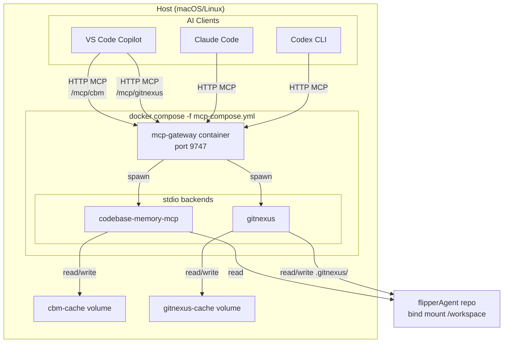

# MCP Gateway for flipperAgent

Containerized, multi-backend MCP router for flipperAgent code intelligence.

## Architecture



## How it works

1. `mcp-gateway` runs as a single container on `localhost:9747`.
2. It spawns `codebase-memory-mcp` and `gitnexus` as stdio child processes.
3. Clients connect to direct backend routes:
   - `http://localhost:9747/mcp/cbm` → codebase-memory-mcp
   - `http://localhost:9747/mcp/gitnexus` → gitnexus
4. Tool schemas stay unchanged; agents call the same tools they would over stdio.
5. `docker compose down` terminates the whole process tree, eliminating dangling stdio processes.

## Advantages over conventional stdio MCP

| Concern | Conventional stdio MCP | Containerized mcp-gateway |
|---|---|---|
| **Process lifecycle** | Child of IDE/agent; leaks when parent crashes | Contained by Docker; `compose down` kills everything |
| **Dangling processes** | Common after IDE/agent restarts | Not possible; the container owns the tree |
| **Multi-agent sharing** | Each agent spawns its own processes | One shared HTTP endpoint per backend |
| **Observability** | Hard to inspect stdio streams | Unified gateway logs, `/health`, `/metrics` |
| **Health monitoring** | None built in | Built-in health checks + circuit breakers |
| **Client config** | Per-agent stdio commands | Single HTTP URL per backend |
| **Tool-list token overhead** | Every tool loaded into every context | Direct routes keep original schemas; optional meta-MCP off |

## Known limitations

### 1. codebase-memory-mcp cannot index the full repo in one pass

`research/` contains large JSON/JSONL/CSV files that exceed cbm's per-worker memory budget (~1 GB on this Docker host). The failure is a SIGKILL from cbm's supervisor/OOM watchdog, not a parser bug.

**Mitigation:** `mcp/scripts/mcp-index.sh` indexes code directories separately:
- `flipperAgent-src`
- `flipperAgent-tests`
- `flipperAgent-conductor`
- `flipperAgent-scripts`
- `flipperAgent-docs`
- `flipperAgent-plans`

GitNexus still indexes the **entire repo**, so full-repo structural queries work there.

### 2. GitNexus writes into the repo working tree

GitNexus stores its index at `.gitnexus/` inside the repository. The container mounts the repo read-write to allow this, and `gitnexus analyze --index-only` is used so it only creates `.gitnexus/` and does not modify `AGENTS.md` or `CLAUDE.md`.

`.gitnexus/` is already ignored in `.gitignore`.

### 3. Docker Desktop memory cap

This host's Docker Desktop is capped at ~3.8 GB, which limits cbm's per-worker memory budget. Raising Docker Desktop's memory limit would allow a single full-repo cbm index.

### 4. License scope

Both `gitnexus` and `mcp-gateway` default to PolyForm Noncommercial licenses. Commercial quant use requires paid licenses. Prefer `codebase-memory-mcp` (MIT) as the primary code-intelligence source.

## Quick commands

```bash
# Start
docker compose -f mcp-compose.yml up -d

# Check health and indexes
./mcp/scripts/mcp-status.sh

# Re-index after code changes
./mcp/scripts/mcp-index.sh

# Stop cleanly (no dangling processes)
docker compose -f mcp-compose.yml down

# Emergency cleanup (legacy local processes + container stop)
./mcp/scripts/mcp-cleanup.sh
```

There is no local stdio fallback. Both `codebase-memory-mcp` and `gitnexus` run only
inside the container.
