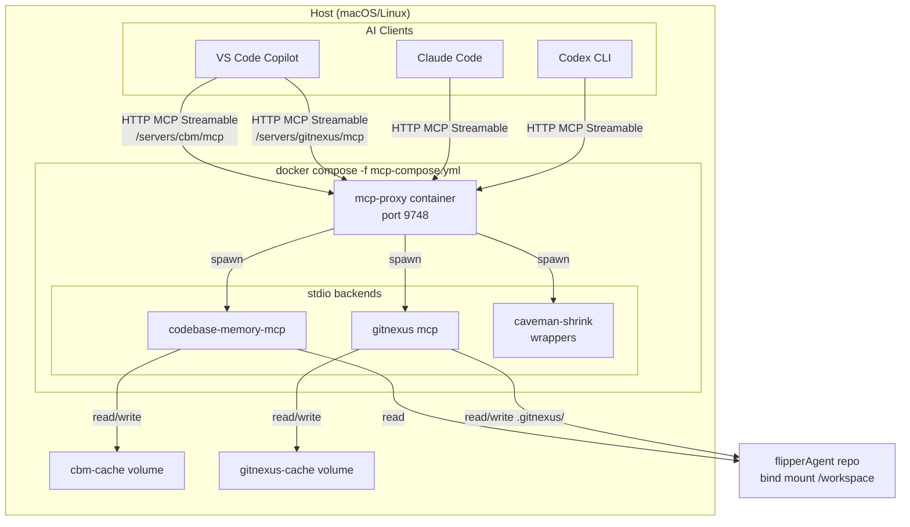

# MCP Container for flipperAgent

Containerized, standard MCP Streamable HTTP access to `codebase-memory-mcp`,
`gitnexus`, and optional `caveman-shrink` wrappers for both. Legacy SSE endpoints
are also exposed for ad-hoc testing.

## Architecture



## How it works

1. `mcp-proxy` runs as a single container on `localhost:9748`.
2. It spawns `codebase-memory-mcp` and `gitnexus mcp` as stdio child processes.
3. Clients connect to named Streamable HTTP endpoints:
   - `http://localhost:9748/servers/cbm/mcp` → codebase-memory-mcp
   - `http://localhost:9748/servers/gitnexus/mcp` → gitnexus
   - `http://localhost:9748/servers/caveman-shrink/mcp` → caveman-shrink wrapping cbm
   - `http://localhost:9748/servers/gitnexus-shrink/mcp` → caveman-shrink wrapping gitnexus
4. Tool schemas stay unchanged; agents call the same tools they would over stdio.
5. The container also exposes legacy SSE endpoints at `/servers/{name}/sse` for
   ad-hoc testing, but VS Code and Codex use the `/mcp` Streamable HTTP paths.
6. `docker compose down` terminates the whole process tree, eliminating dangling stdio processes.

## Why mcp-proxy

`mcp-gateway` is a Meta-MCP router: it intentionally hides backend tools behind `gateway_search_tools` / `gateway_invoke`. That breaks the standard MCP HTTP transport and does not handle `codebase-memory-mcp`'s paginated tool list.

`mcp-proxy` is a stdio → HTTP bridge. It exposes each backend under its own
Streamable HTTP path with original tool names, which is exactly what VS Code and
Codex expect.

## Advantages over conventional stdio MCP

| Concern | Conventional stdio MCP | Containerized mcp-proxy |
|---|---|---|
| **Process lifecycle** | Child of IDE/agent; leaks when parent crashes | Contained by Docker; `compose down` kills everything |
| **Dangling processes** | Common after IDE/agent restarts | Not possible; the container owns the tree |
| **Multi-agent sharing** | Each agent spawns its own processes | One shared proxy serves all clients |
| **Client config** | Per-agent stdio commands | Single HTTP URL per backend |
| **Transport** | stdio only | Standard MCP Streamable HTTP / SSE |

## Known limitations

### 1. codebase-memory-mcp cannot index the full repo in one pass

`research/` contains large JSON/JSONL/CSV files that exceed cbm's per-worker memory budget (~1 GB on this Docker host). The failure is a SIGKILL from cbm's supervisor/OOM watchdog, not a parser bug.

**Mitigation:** `mcp/scripts/mcp-index.sh` indexes code directories separately:
- `flipperAgent-src`
- `flipperAgent-tests`
- `flipperAgent-scripts`
- `flipperAgent-docs`
- `flipperAgent-plans`

GitNexus still indexes the **entire repo**, so full-repo structural queries work there.

### 2. GitNexus writes into the repo working tree

GitNexus stores its index at `.gitnexus/` inside the repository. The container mounts the repo read-write to allow this, and `gitnexus analyze --index-only` is used so it only creates `.gitnexus/` and does not modify `AGENTS.md` or `CLAUDE.md`.

`.gitnexus/` is already ignored in `.gitignore`.

### 3. Docker Desktop memory cap

This host's Docker Desktop is capped at ~3.8 GB, which limits cbm's per-worker memory budget. Raising Docker Desktop's memory limit would allow a single full-repo cbm index.

### 4. License scope

`gitnexus` defaults to a PolyForm Noncommercial license. Commercial quant use requires a paid license. Prefer `codebase-memory-mcp` (MIT) as the primary code-intelligence source.

## Caveman-shrink wrappers

The container bundles [`caveman-shrink`](https://www.npmjs.com/package/caveman-shrink)
(MIT) — an MCP middleware that compresses tool descriptions and other prose fields
using the same rules as the `caveman` skill. This reduces token usage when the
model reads the tool catalog.

Two additional named servers are exposed:

- `http://localhost:9748/servers/caveman-shrink/mcp` — wraps `codebase-memory-mcp`
- `http://localhost:9748/servers/gitnexus-shrink/mcp` — wraps `gitnexus`

They expose the **same tool names and semantics** as the direct backends; only the
descriptions are compressed. Enabling both the direct and shrunk versions at the
same time will create duplicate tool catalogs, so pick one set per client.

To use the shrunk versions by default, disable the direct servers in
`.codex/config.toml` and `.vscode/mcp.json` (or vice versa).

## Implementation notes

`mcp-proxy` 0.12.0 does not forward the `cursor` parameter in `tools/list` by
default, which means paginated backends like `codebase-memory-mcp` only expose
their first page of tools. The container image patches `mcp_proxy/proxy_server.py`
to pass `req.params.cursor` through to the stdio backend, so all tools are
discoverable by standard MCP clients.

## Quick commands

```bash
# Start
docker compose -f mcp-compose.yml up -d

# Check health and indexes
./mcp/scripts/mcp-status.sh

# Re-index after code changes
./mcp/scripts/mcp-index.sh

# Stop cleanly (no dangling processes)
docker compose -f mcp-compose.yml down

# Emergency cleanup (legacy local processes + container stop)
./mcp/scripts/mcp-cleanup.sh
```

There is no local stdio fallback. Both `codebase-memory-mcp` and `gitnexus` run only
inside the container.
