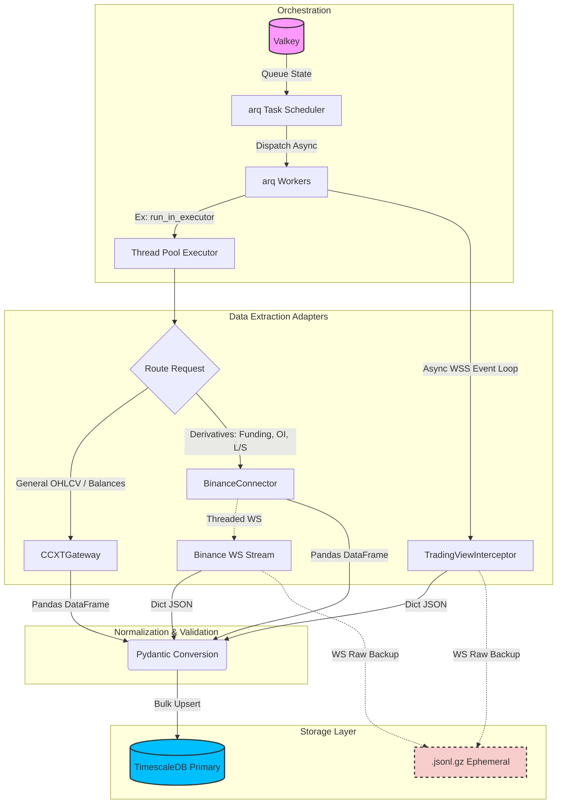

# Ingestion Engine Architecture (V1)

## Executive Summary
This document outlines the architecture for the `flipper_agent` data ingestion engine. The pipeline focuses on lightweight concurrency, robust validation, and optimized time-series storage. 

**Key Shifts in V1:**
- **Task Orchestration:** Transitioned to **Valkey + `arq`** for simple, high-performance async job queueing and background workers.
- **Storage Strategy:** Direct load to **TimescaleDB**. 
- **Deprecation Notice:** **Parquet is strictly deprecated** in the raw ingestion zone to minimize intermediate state complexity.
- **Socket Backups:** Raw WebSocket streams utilize compressed `.jsonl.gz` files strictly for ephemeral, short-term disaster recovery.

---

## 1. High-Level Design (HLD)

The ingestion pipeline relies on decoupled async workers orchestrated by Valkey via the `arq` library. The system extracts data from multiple sources, normalizes it using rigorous Pydantic schemas, and loads it directly into TimescaleDB.

### Core Components
1. **Scheduler & Queue (Valkey + arq):** Dispatches polling tasks based on predefined cron schedules. Because our existing connectors are primarily synchronous, `arq` workers will dispatch these via `asyncio.to_thread` (ThreadPoolExecutor) to prevent blocking the asynchronous event loop.
2. **Extraction Adapters:**
   - **`CCXTGateway` (Singleton):** Configuration-driven, unified multi-exchange REST extraction. It features intelligent URL rewriting to handle unsupported Sandbox endpoints without leaking to real API environments. Emits typed `pandas.DataFrame`.
   - **`BinanceConnector`:** Native `binance.um_futures.UMFutures` integration handling deep pagination for complex derivatives metrics (`funding_rate`, `openInterestHist`, `globalLongShortAccountRatio`). Also handles threaded WebSockets. Emits typed `pandas.DataFrame`.
   - **`TradingViewSocketInterceptor`:** Covert WebSocket interceptor to scrape and parse proprietary TradingView charting data streams.
3. **Data Normalization:** DataFrames are converted natively into dictionaries and immediately passed through Pydantic models. This guarantees strict type coercion, point-in-time correctness, and timezone (UTC) consistency before database insertion.
4. **Primary Storage (TimescaleDB):** Normalized records are bulk-upserted into hypertable-backed TimescaleDB instances for instantaneous availability to the quant research engine.
5. **Ephemeral Backup:** Live WebSocket adapters output to rolling `.jsonl.gz` files as a stopgap against downstream database failures.

### Pipeline Diagram



---

## 2. Low-Level Design (LLD)

### 2.1 Repository Structure
The ingestion module is structured to separate orchestration logic from the underlying protocol adapters and storage clients.

```text
src/flipper_agent/ingestion/
├── __init__.py
├── orchestration/             # Valkey + arq definitions
│   ├── worker.py              # arq worker configuration and startup
│   ├── schedules.py           # cron-like job scheduling rules
│   └── queues.py              # Queue bindings for high/low priority tasks
├── adapters/                  # Exchange/Source Connections
│   ├── base.py                # Abstract Base Adapter
│   ├── crypto_ccxt.py         # CCXTGateway implementation
│   ├── binance_native.py      # BinanceConnector (REST/WS, FOI/Funding)
│   └── tradingview_socket_interceptor.py # Covert TV interceptor
├── models/                    # Validation phase
│   ├── base_models.py         # Point-in-time constraints
│   └── tick_models.py         # Pydantic schemas for OHLCV, ticks, OI
└── storage/                   # Database interaction
    ├── timescaledb_client.py  # asyncpg hypertable upserts
    └── ephemeral_writer.py    # Rolling .jsonl.gz appenders for WS
```

### 2.2 Module Responsibilities & Task Definitions

#### Orchestration (`arq`)
- **Workers:** Configure `arq.Worker` settings and manage the connection pool to Valkey and TimescaleDB. Database connections are initialized in the `startup` coroutine and stored in a shared `ctx` dictionary.
- **Async Bridging:** Given that `CCXTGateway` and `BinanceConnector` operate synchronously and return `pandas.DataFrame`, `arq` functions will wrap these calls inside `asyncio.to_thread` or standard `ThreadPoolExecutor` bindings to prevent stalling the async IO loop.
- **Periodic Tasks:** Configure `cron` tasks in `arq` to trigger at exact boundaries (e.g., `minute={0, 15, 30, 45}` for 15m candle updates).

#### Adapters
- **`BinanceConnector` (`binance_native.py`):** 
  - Manages native `UMFutures` client endpoints securely. 
  - Exposes `pandas.DataFrame` returning methods using safe auto-pagination specifically targeting deep history: `fetch_funding_rate_history`, `fetch_oi_history`, and `fetch_long_short_ratio`.
  - Spawns background threaded WS connections (`_create_websocket_connection`) capable of handling constant stream volume.
- **`CCXTGateway` (`crypto_ccxt.py`):** 
  - Singleton-based unified fetcher for fallback generic API endpoints (OHLCV, execution tracking, standard balances) utilizing `ConfigLoader`.
  - Features fail-safe logic for isolated Testnet/Sandbox domain overriding.
- **`TradingViewSocketInterceptor` (`tradingview_socket_interceptor.py`):** 
  - Mimics web client handshakes to connect to underlying indicator data feeds. Maintains stealth and parses custom framed WebSocket packets.

#### Validation & Storage
- **Pydantic Validation (`models/`):** 
  - Ensures every record has a well-formed UTC `timestamp` (the primary hypertable partition key), standardizing datatypes to float/integer. Drops invalid payloads instantly while raising a standardized ingest exception.
- **TimescaleDB Client (`timescaledb_client.py`):**
  - Executes batch `INSERT ... ON CONFLICT DO UPDATE` queries using `asyncpg`. Guarantees idempotency.

---

## 3. Storage Paradigm & Constraints

1. **Database as Single Source of Truth:** 
   TimescaleDB completely replaces flat files for raw data availability. The schema relies heavily on Timescale hypertables chunked by the `timestamp` column for hyper-fast aggregate access.
2. **Ephemeral Sinks Constraint (.jsonl.gz only):**
   Raw WebSocket payloads are piped asynchronously to local `.jsonl.gz` files. These files are rotated hourly/daily and strictly pruned after 72 hours. Their sole purpose is replayability if `arq` drops a task or TimescaleDB suffers an outage.
3. **No Parquet in Ingestion:**
   Parquet is highly inefficient for live appending. It has been strictly deprecated from the raw extraction and ingestion tier. Parquet may be utilized downstream by the quant team for compiled backtest extracts, but will never be generated by real-time adapters. 
