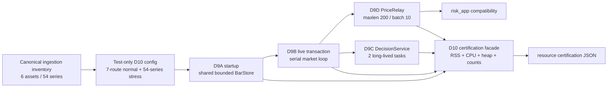

# D10 decision_app resource / capacity certification

## 1. Starting state

Work only in the existing cumulative isolated worktree:

`/Users/kajukatli/projects/flipperAgent/.worktrees/decision-app-d0`

Starting programme state:

```text
D0-D9C                         APPROVED
Pre-D9D architecture hardening APPROVED
D9D PriceRelay / risk continuity APPROVED
D10                            NOT STARTED
D11+                           NOT STARTED
model-family refactoring       DEFERRED
```

D9D approval record:

`plans/orchestrator-decision-decision-app-d9d-price-relay-risk-continuity-v1.md`

The currently approved architecture is one `decision_app` process with exactly:

```text
1 market-loop task
1 lifecycle-loop task
```

and no model-per-process, worker-per-lane, PriceRelay task, actor system, workflow/DAG framework, consumer-group market input, or background training runtime.

Do not commit, merge, push, switch branches, reset, restore, modify the primary checkout, or start D11+ work.

---

# 2. Objective

D10 is a **measurement-first certification package**.

Its purpose is to answer, with reproducible evidence:

```text
Can the currently approved fused decision runtime operate within the frozen
8 GiB RAM / 4 CPU host envelope while preserving every D0-D9D boundedness,
causality, failure-isolation, and downstream-continuity invariant?
```

D10 is **not** an optimization phase.

Do not add concurrency, executors, sharding, batching frameworks, worker pools, caches, journals, resource managers, or new runtime knobs merely because the architecture documents once mentioned them.

Measure the current simpler implementation first.

If a resource gate fails, report the measured bottleneck and stop unless the defect is a small local boundedness bug with an obvious correction that does not alter architecture.

Architecture-level remediation such as executor introduction, partitioning, sharding, process isolation, or a new persistence layer requires a new reviewed plan.

---

# 3. Frozen resource envelope

The D0 architecture froze:

```text
host memory target:          8 GiB hard envelope
normal working-set target:   roughly 5 GiB-class
host CPU target:             4 CPU cores
```

Do not invent a different target.

Interpretation for D10:

```text
current/core workload peak RSS < 5 GiB
    -> normal working-set target met

5 GiB <= current/core peak RSS < 8 GiB
    -> host may fit, but D0 normal working-set target is not met
    -> D10 is NOT approved without remediation/review

any certified workload peak RSS >= 8 GiB
    -> hard resource envelope failed

sustained measured process CPU / wall-time core-equivalent > 4
    -> 4-CPU envelope failed
```

Do not create a tighter arbitrary CPU percentage such as 50%, 60%, or 70%.
Report observed headroom instead.

The 8 GiB / 4 CPU values are certification targets here; D10 does **not** register a Compose service or container resource block yet.

Deployment application of those limits remains a later service/cutover step after the decision service receives an approved production configuration and port.

---

# 4. Important scope clarification — model mix is not final yet

The user explicitly deferred remaining model/plugin refactoring until after the core runtime architecture is complete.

Therefore D10 must distinguish:

```text
A. core fused-runtime certification
   InputReadCursor
   BarStore
   startup/reconstruction
   PriceRelay
   service/lifecycle/control shell
   publication/checkpoint plumbing
   current representative SR seam only where useful as existing evidence

B. final production model-mix certification
   DEFERRED until selected models are refactored and actually integrated
```

D10 may use the already-existing reviewed SR adapter as a **representative reference**, but:

```text
NO new model plugin
NO Momentum/D7B
NO additional model integration
NO model-family refactor
NO extrapolation that one SR lane represents final model CPU/RAM
```

The final handoff must explicitly carry:

`FINAL_MODEL_MIX_RESOURCE_RECERTIFICATION_REQUIRED`

before authoritative shadow/cutover of the actual selected model set.

D10 approval therefore certifies the **core runtime envelope and current representative path**, not every future model.

---

# 5. Verified current scale — use this, do not invent synthetic asset counts

Current canonical ingestion inventory is the natural D10 upper-envelope workload:

```text
enabled canonical assets: 6
    BNB
    BTC
    DOGE
    ETH
    SOL
    XRP

canonical timeframes per instrument: 9
    1m
    15m
    30m
    1h
    4h
    6h
    12h
    1d
    1w

configured canonical series: 54
```

Current approved decision globals:

```yaml
decision:
  live_input:
    batch_size: 10
    block_ms: 1000
  signal_publication:
    stream_maxlen: 1000
    stream_approximate: true
  price_relay:
    stream_maxlen: 200
    stream_approximate: true
```

The current risk compatibility graph is smaller:

```text
BTCUSDT   1h,4h
ETHUSDT   4h
XRPUSDT   1h
SOLUSDT   1h
BNBUSDT   30m
DOGEUSDT  4h
```

Do not invent projected 100/500/1000-asset workloads in D10.

Use:

```text
normal current-risk relay envelope = 7 price routes
full current canonical envelope     = 54 series
retention-edge relay history        = 200 bars per relay series
```

The full current canonical retention edge therefore contains at most:

```text
54 * 200 = 10,800 closed-bar PriceUpdate observations
```

This is a real configured upper-envelope stress input, not a future-scale claim.

---

# 6. Architecture decision — certification harness stays outside production runtime

Prefer one facade script:

`scripts/certify_decision_runtime_d10.py`

and focused certification tests, preferably:

`tests/decision/certification/test_d10_resource_capacity.py`

Do **not** create a generic benchmarking package or resource framework.

The script may contain the small deterministic fake stream/history resources necessary to exercise the real decision runtime boundaries.

Production changes under `src/apps/decision_app/` should be **zero by default**.

Only modify production code if the certification exposes a real boundedness/correctness defect and the fix is local and architecture-neutral.

Do not add runtime-only metrics or `/metrics` routes merely for D10 if the certification harness can measure externally.

The existing cached `/runtime` surfaces remain authoritative operational status; D10 measurement data belongs in the certification artifact, not a new API.

---

# 7. Certification artifact

Generate one deterministic evidence artifact:

`artifacts/decision_d10/d10_resource_capacity_certification.json`

The artifact must be written atomically by the facade script.

Recommended top-level structure:

```text
schema_version
status
created_at
source_base
worktree
python
platform
host
resource_target
current_inventory
scenarios
structural_boundedness
static_guards
validation
limitations
carry_forward
```

Do not store unbounded logs, per-bar traces, or every publication in the artifact.

Keep only bounded aggregate evidence and representative first/last IDs where useful.

Required host/resource metadata:

```text
platform.system
platform.machine
Python version
os.cpu_count
8 GiB hard target
5 GiB normal working-set target
4 CPU target
```

Do not treat the developer machine's total RAM/CPU count as the target; record it only as execution context.

---

# 8. Measurement methodology

Use standard-library measurement only where possible.

Do not add `psutil`, `memory_profiler`, `pytest-benchmark`, or another dependency solely for D10.

Use:

```text
time.perf_counter()
time.process_time()
tracemalloc
resource.getrusage(resource.RUSAGE_SELF)
threading.active_count()
asyncio task inventory
```

Normalize `ru_maxrss` correctly across platforms:

```text
macOS: ru_maxrss is bytes
Linux: ru_maxrss is KiB -> multiply by 1024
```

Add an explicit tested helper for this normalization inside the certification script/module.

Record per scenario:

```text
wall_seconds
process_cpu_seconds
cpu_core_equivalent = process_cpu_seconds / wall_seconds
tracemalloc_peak_bytes
process_peak_rss_bytes at scenario completion
Python thread count before/after
asyncio task count before/peak/after where applicable
stream call counts
history call counts
retained object/count evidence
correctness assertions
```

Do not fail on absolute wall-clock latency: CI/developer hardware speed is not a stable acceptance boundary.

CPU and RSS are resource gates; latency is observational evidence for later comparison.

---

# 9. Resource measurement isolation

The certification facade should run in a fresh Python process.

One process may execute all scenarios sequentially; do not build a subprocess orchestration framework unless required.

Because `ru_maxrss` is a process high-water mark, record the high-water mark after each ordered scenario and clearly identify that it is cumulative.

Use `tracemalloc` independently around each scenario for scenario-local Python heap peaks.

Scenario ordering should move from normal to stress so cumulative RSS remains interpretable:

```text
1 structural/import baseline
2 current-risk relay steady boundary
3 representative service lifecycle
4 full 54-series boundary
5 full retention-edge catch-up
6 existing representative SR reference
```

If a scenario cannot be executed because it requires live infrastructure, record it separately as environment-blocked rather than contaminating the offline evidence.

---

# 10. Scenario A — structural baseline

Measure and prove the architecture before load.

Required assertions:

```text
exactly 2 long-lived decision service create_task sites
no ThreadPoolExecutor
no ProcessPoolExecutor
no asyncio.to_thread
no run_in_executor
no decision-side XREADGROUP/XACK/XAUTOCLAIM/PEL
no model-per-process / worker-per-lane task creation
no dynamic model discovery
no legacy signal_app/strategy_app runtime import
```

Do not add a CPU executor because the D0 prose mentioned one.

Current runtime evaluation is serial in the market loop. D10 must update architecture prose to reflect reality:

```text
V1 currently uses serial bounded evaluation.
A bounded CPU executor is not implemented and is not required absent measured evidence.
```

This is an intentional simplification, not a missing feature.

---

# 11. Scenario B — current risk relay steady boundary

Build a test-only relay-only `DecisionConfig` representing the current seven downstream risk routes.

Use real:

```text
DecisionStartupCoordinator
PriceRelay
LiveDecisionRuntime
DecisionService where needed
```

with deterministic in-memory/fake canonical history and Valkey transport.

At one aligned closed-bar boundary, feed exactly one new canonical observation for every configured risk route.

Prove:

```text
all expected InputReadCursor values advance exactly once
all 7 PriceUpdate streams receive exactly one canonical update
no model lane/plugin is required
all relay progress becomes CONTINUOUS
no stream exceeds configured maxlen
no extra task is created
no thread is created by decision runtime
```

Record the current/core process RSS after this scenario.

Hard D10 normal-envelope gate:

`rss_after_current_risk_scenario < 5 GiB`

This is the D0 normal working-set target.

---

# 12. Scenario C — service/control lifecycle boundedness

Exercise actual `DecisionService` with the current-risk relay-only generation.

Prove:

```text
start -> RUNNING
pause -> PAUSED/PAUSED while PriceRelay/input continue
resume -> fresh generation
lifecycle rebuild -> one fresh generation
stop -> both long-lived tasks terminate
```

Record:

```text
max asyncio task count
final asyncio task count
Python thread count before/after
number of generations built
old generation not used again after replacement
```

Do not add a resource supervisor to observe this.

At the end of `stop()` there must be no decision-owned market/lifecycle task left running.

A deterministic resource test should also confirm no per-relay/per-series task appears when seven relays are configured.

---

# 13. Scenario D — full current canonical boundary: 54 series

Construct a test-only relay-only config from the **actual canonical ingestion YAML inventory**.

Do not duplicate the list manually if it can be loaded through existing decision/ingestion config parsing.

Compile exactly the current 54 canonical relay series.

At an alignment point where all configured timeframes may be represented as closed bars, feed one canonical closed bar per series.

The fixture may choose a common aligned UTC boundary consistent with the existing `TimeframeGrid`/ingestion alignment origin.

Prove:

```text
54 relay plans
54 canonical input streams
54 accepted observations
54 exact PriceUpdate publications
54 CONTINUOUS relay progress entries
no lane required
one market runtime, no task fan-out
BarStore retained capacity for relay-only series remains 1 each
```

Instrument the fake history/stream adapters with in-flight counters and prove current implementation does not create concurrent external I/O fan-out:

```text
max in-flight canonical history operations <= 1
max in-flight PriceRelay XADD operations <= 1
```

These are statements about the current serial architecture, not configurable limits.

If code is later intentionally made concurrent, final model-mix recertification must update these proofs rather than weakening them silently.

---

# 14. Scenario E — retention-edge PriceRelay catch-up

This is the main D10 stress scenario.

Use all 54 current canonical relay series.

For each relay:

```text
published baseline = bar 0
retained target backlog = exactly 200 missing canonical bars
PriceRelay stream maxlen = 200
live_input.batch_size = 10
```

This exercises:

```text
54 series * 200 missing bars = 10,800 canonical price observations
```

Do not materialize unnecessary duplicate histories in memory.

Prefer a deterministic generated history repository that can return the requested canonical interval on demand.

Its own bookkeeping must remain bounded; do not make the test harness the source of an artificial memory leak.

Expected bounded catch-up math:

```text
max publications per relay per reconcile = 10
number of reconciliation passes to drain 200 bars = 20
max total publications in one all-relay reconciliation = 54 * 10 = 540
final total publications = 54 * 200 = 10,800
```

Prove exactly:

```text
no relay skips an interval
per-series publication IDs strictly follow canonical close order
no per-poll relay exceeds batch_size=10
deterministic fake transport remains bounded to the configured logical maxlen
all XADD calls preserve maxlen=200 / approximate=true compatibility
all 54 relays finish CONTINUOUS
all pending targets clear after completion
all input-failure maps remain empty
idle reconciliation after completion publishes 0 new messages
```

Measure:

```text
scenario wall time
scenario process CPU time
cpu_core_equivalent
tracemalloc peak
process high-water RSS
```

Hard gates:

```text
peak RSS after stress < 8 GiB
cpu_core_equivalent <= 4.0
```

If the wall interval is too small for a numerically meaningful CPU ratio, report the ratio but do not manufacture an alternative threshold. The 10,800-publication workload should normally be large enough to measure.

---

# 15. Scenario F — BarStore and service-memory structural boundedness

In addition to existing unit tests, explicitly certify that runtime-owned retained structures scale with configured series/lanes, not historical event count.

Inspect/prove:

```text
BarStore uses deque(maxlen=capacity)
relay _progress count <= relay plan count
relay _pending_targets count <= relay plan count
relay _input_failures count <= relay plan count
service _last_lane_transactions count <= lane count
service keeps only one _last_poll_result
lifecycle reader keeps one cursor/current bounded result, not event history
input reader keeps one cursor/block reason per configured stream
```

Do not add public properties purely to inspect private maps if direct test-only introspection is sufficient and stable.

No unbounded historical failure journal may appear.

Add/keep architecture guardrails preventing:

```text
append-only runtime event ledgers
unbounded list of poll results
unbounded relay failure history
unbounded input cursor history
```

Avoid generic regex that produces false positives on bounded deque/list locals.

---

# 16. Scenario G — current representative SR reference only

Do **not** add/refactor a model.

Use the already-existing reviewed SR adapter only as a reference measurement.

Reuse the existing long-horizon fixture semantics where possible:

```text
1,000 SR evaluations
max_active_zones = existing config value
ATR/shared-feature contract unchanged
```

Record:

```text
wall time
process CPU time
tracemalloc peak
serialized proposed-state size at start/end/max
projected artifact zone count max
```

Important interpretation:

This scenario is **diagnostic**, not a certification claim for the final production model mix.

If SR's model-owned state grows with terminal historical records, report that explicitly as model-specific carry-forward:

`MODEL_STATE_RESOURCE_REVIEW_REQUIRED_DURING_MODEL_REFACTOR`

Do not redesign SR in D10.

Do not fail the core runtime certification solely because a representative legacy/research model seam has model-owned growth that is already scheduled for refactoring, unless it causes the overall 8 GiB hard process envelope to fail during the defined 1,000-step reference workload.

---

# 17. CPU / thread fan-out certification

Static and dynamic evidence must agree.

Static scan decision runtime for:

```text
ThreadPoolExecutor
ProcessPoolExecutor
asyncio.to_thread
run_in_executor
multiprocessing
joblib parallelism
```

Expected V1 result: zero current decision-runtime matches.

Dynamic evidence:

```text
Python thread count does not increase because of decision runtime workload
DecisionService still owns exactly two long-lived asyncio tasks
```

Do not globally mutate user shell environment or machine configuration.

Record any existing BLAS/OpenMP environment variables in the artifact if present:

```text
OMP_NUM_THREADS
OPENBLAS_NUM_THREADS
MKL_NUM_THREADS
NUMEXPR_NUM_THREADS
VECLIB_MAXIMUM_THREADS
```

Do not add new thread-control configuration to decision YAML in D10.

Future numerical model integration must rerun D10/model-mix recertification and may then justify explicit BLAS/thread controls.

---

# 18. Database / Valkey resource ownership evidence

D10 must document current physical ownership without changing it:

```text
one shared async Valkey client per decision service lifespan
DBPoolManager reader pool
DBPoolManager writer pool
```

Current shared DB pool defaults are:

```text
postgres.pool.min_size = 2
postgres.pool.max_size = 10
```

Do not add decision-specific pool-size knobs merely because the current market loop is serial.

Without live `.env`, exact DB socket/RSS cost cannot be certified here.

Offline tests should prove resource construction remains singular and does not create one Valkey/DB client per asset/lane/relay.

If `.env` becomes available in the worktree during execution, an optional local-infrastructure probe may record:

```text
reader pool min/max
writer pool min/max
Valkey connectivity
startup/rebuild wall time
process RSS after actual client/pool initialization
```

It must not write external signal/price/order state.

If `.env` remains absent, record exactly:

`LOCAL_INFRASTRUCTURE_RESOURCE_PROBE_BLOCKED_ENVIRONMENT`

This is not by itself a core offline D10 blocker.

---

# 19. Do not select new resource/concurrency knobs in D10

Do not add configuration such as:

```text
decision.runtime.max_parallel_lanes
decision.runtime.executor_workers
decision.runtime.max_threads
decision.runtime.max_inflight_models
decision.runtime.resource_poll_interval
memory_high_watermark
cpu_threshold
```

unless an already-approved config contract exists. It does not.

Current serial execution is the default certified architecture.

If later model integration proves serial evaluation insufficient, that is a new architecture decision based on measured evidence.

---

# 20. Production code change policy

D10 starts with **measurement/test/docs only**.

Allowed production fixes without a new architecture review are limited to defects like:

```text
an accidentally unbounded collection
retained stale generation references
duplicate full-history copies where one bounded view already exists
an unintended per-series resource client
an obvious missing close/release causing a leak
```

If such a defect is found:

1. document the pre-fix measurement;
2. make the smallest correction;
3. add a focused regression;
4. rerun the complete D10 certification;
5. include before/after evidence in handoff.

Do not change model math, decision semantics, stream contracts, state-commit ordering, PIT semantics, PriceRelay semantics, or risk behavior to improve benchmark numbers.

---

# 21. Documentation refresh

Update `docs/architecture/decision_app/README.md` only where necessary to match the approved D9D/D10 reality.

At minimum correct stale statements that say D9C does not yet own PriceRelay/D9D is next.

Update the resource-envelope paragraph from speculative architecture to measured/current semantics.

Explicitly state:

```text
current V1 runtime evaluates serially in the market loop
no bounded CPU executor is currently implemented
D10 measured the current core envelope
final selected model mix requires recertification after model refactoring/integration
```

Do not create or regenerate diagrams unless their topology is actually stale.

The D9D diagrams already show the independent PriceRelay path.

---

# 22. Certification status model

The facade result should use a small explicit status vocabulary, for example:

```text
APPROVED
BLOCKED_RESOURCE_ENVELOPE
BLOCKED_INVARIANT
BLOCKED_ENVIRONMENT
```

Do not create a generic result framework.

For this phase, overall `APPROVED` requires all **offline core** gates to pass.

An absent `.env` may appear as a nested infrastructure probe status without forcing the entire offline certification to `BLOCKED_ENVIRONMENT`.

However, if a required offline workload cannot run because of missing code/config—not external credentials—that is a D10 blocker.

---

# 23. Required D10 functional/capacity proofs

Add focused tests proving at least:

## 23.1 Inventory / workload derivation

```text
canonical inventory derives exactly 6 enabled assets
canonical inventory derives exactly 54 configured series
normal risk compatibility derives exactly 7 relay routes
price relay maxlen = 200
live batch size = 10
```

Do not hard-code a second canonical asset catalog if existing configuration parsing can derive it.

## 23.2 54-series config

```text
relay-only config compiles with 54 plans
all plan source identities match canonical ingestion series
all 54 BarStore relay capacities are exactly 1 absent lane/feature demand
```

## 23.3 retention-edge catch-up

```text
54 * 200 exact canonical bars
20 bounded reconcile passes
<=10 publications per relay per pass
<=540 publications total per pass
10,800 total successful publications
deterministic certification fake retains <=200 entries per relay to keep the harness bounded
all publication calls carry maxlen=200 and approximate=true; do not claim real Redis approximate trim is exactly 200 without live evidence
final all CONTINUOUS
idle next pass = 0 publications
```

## 23.4 memory structural bounds

```text
relay progress/pending/failure maps never exceed plan count
input cursors/block reasons never exceed configured stream count
BarStore never exceeds compiled capacity
service task count stays bounded
```

## 23.5 lifecycle/resource ownership

```text
start has exactly market + lifecycle long-lived tasks when lifecycle enabled
pause adds no task
resume/rebuild adds no permanent task
stop leaves no decision-owned long-lived task
one Valkey client / one reader pool / one writer pool composition path
```

## 23.6 serial I/O

```text
max in-flight history calls == 1 under current runtime
max in-flight price publication calls == 1 under current runtime
```

## 23.7 resource measurements

Certification script creates a valid artifact containing:

```text
RSS
tracemalloc
CPU process/wall metrics
scenario counts
resource-envelope decision
```

Tests should validate artifact schema and deterministic non-timing fields without asserting a specific millisecond runtime.

---

# 24. Existing regression gates

D10 must not regress D0-D9D.

Run at minimum:

```text
all focused D10 certification tests
all focused D9D tests
tests/decision
non-research SR compatibility relevant to existing adapter
risk + signals/integration + commons + execution compatibility
canonical ingestion config/lifecycle/HTF/publication/provenance relevant slices
```

Use focused tests first, then cumulative suites.

Do not require the known frozen SR research artifacts that are absent from this worktree.

If a broad SR research collection fails only because historical frozen research assets are unavailable, report that as existing research-asset limitation rather than changing model code.

---

# 25. Static / anti-overengineering guards

Keep all existing Pre-D9D architecture guardrails.

Add D10-specific guards only if simple and robust.

Prove no introduction of:

```text
ThreadPoolExecutor / ProcessPoolExecutor in decision_app
asyncio.to_thread / run_in_executor in generic decision runtime
new worker/task per asset/lane/relay
new resource supervisor
new benchmark framework dependency
psutil dependency
new decision resource knobs
model plugin integration
D11/D12/D13 implementation
main.py / production port / Compose decision service registration
production decision asset YAML
```

Do not forbid future extension names globally outside decision_app.

---

# 26. Artifact integrity

The artifact must include a SHA-256 digest of its canonical measurement payload or an adjacent manifest digest if the repo's established artifact style makes that cleaner.

Do not hash wall-clock `created_at` into a value that is expected to reproduce bit-for-bit across runs unless the artifact explicitly separates run metadata from deterministic inventory.

At minimum prove:

```text
inventory/config fingerprint stable for identical config
scenario identity stable
resource target stable
artifact JSON contains no NaN/Infinity
```

Do not create a general artifact-signing framework.

---

# 27. Expected output files

Expected new/updated files should remain small in count.

Preferred inventory:

```text
scripts/certify_decision_runtime_d10.py

tests/decision/certification/__init__.py              # only if package import needs it
tests/decision/certification/test_d10_resource_capacity.py

artifacts/decision_d10/d10_resource_capacity_certification.json

docs/architecture/decision_app/README.md

plans/coder-to-orchestrator-decision-app-d10-resource-capacity-certification-v1.md
```

If the script can be tested without an `__init__.py`, do not add one merely for structure.

Do not split the certification into many helper modules unless file size becomes genuinely unmanageable.

One facade is preferred.

---

# 28. Execution order

Implement in this order:

```text
1. Reconfirm D9D approval + clean D10 starting diff scope.
2. Derive current canonical inventory and resource target from existing config/docs.
3. Add certification facade measurement helpers.
4. Add deterministic current-risk and 54-series relay fixtures.
5. Add retention-edge 10,800-observation scenario.
6. Add service task/resource ownership scenario.
7. Add structural boundedness checks.
8. Add representative existing SR diagnostic scenario.
9. Generate certification artifact.
10. Add tests for facade/artifact/resource decisions.
11. Run focused D10.
12. Run D9D/decision/downstream/ingestion compatibility.
13. Run Ruff/format/compile/diff/static guards.
14. Update README resource/D9D status text.
15. Two-pass self-review.
16. Write coder-to-orchestrator handoff.
17. STOP. Do not start model integration or D11.
```

---

# 29. Failure handling

If any hard offline resource gate fails:

```text
peak normal/current-risk RSS >= 5 GiB
peak stress RSS >= 8 GiB
sustained stress CPU core-equivalent > 4
structural boundedness invariant violated
resource/task/client count grows with history instead of configured topology
```

stop and report:

`DECISION_APP_D10_RESOURCE_CAPACITY_BLOCKED`

Include exact scenario and measurements.

Do not automatically add concurrency or optimize model algorithms.

If a small local leak/boundedness bug is fixed, rerun from a fresh certification process and preserve before/after numbers in the handoff.

If only live infrastructure is unavailable because `.env` is absent:

```text
core offline certification may proceed
live infrastructure probe = LOCAL_INFRASTRUCTURE_RESOURCE_PROBE_BLOCKED_ENVIRONMENT
```

Do not create/copy `.env`, credentials, or external test streams.

---

# 30. Two-pass coder self-review

## Pass 1 — resource/correctness

Verify:

```text
measurement helpers use correct units
macOS/Linux ru_maxrss normalization correct
CPU ratio uses process_time / perf_counter wall time
no machine-speed latency threshold
5 GiB normal and 8 GiB hard memory targets exact
4 CPU hard target exact
54-series inventory derived from canonical config
10,800 catch-up derived from 54*200
batch bound derived from existing batch_size=10
no hidden history copy in test harness
no causal/PIT/PriceRelay behavior changed for benchmark convenience
artifact accurately reflects measured result
```

## Pass 2 — anti-overengineering

Verify:

```text
no executor added
no resource manager added
no worker/task fan-out
no generic benchmark framework
no new dependency
no new production config knob
no new model/plugin
no production asset YAML
no service/deployment registration
no D11+ work
minimal production diff (prefer zero)
```

---

# 31. Validation commands / evidence

Use the repository interpreter:

`/Users/kajukatli/projects/flipperAgent/.venv/bin/python`

At minimum capture:

```text
focused D10 test count
focused D9D test count
complete tests/decision count
downstream compatibility counts
ingestion affected-slice count
non-research SR relevant count
Ruff result
format result
compileall result
git diff --check
architecture/static scans
no-network decision import smoke
artifact path + SHA256
resource scenario table
.env/live-infra probe status
```

Use `PYTHONDONTWRITEBYTECODE=1` for import/static smoke where practical so review does not leave cache residue.

Remove generated `.pytest_cache`/`__pycache__` before handoff if created by validation.

---

# 32. Handoff

Create/update:

`plans/coder-to-orchestrator-decision-app-d10-resource-capacity-certification-v1.md`

Include:

```text
files changed
why production code changed, if any
current canonical inventory
scenario definitions
resource target
measurement method and unit handling
scenario metrics table
normal working-set decision
8 GiB hard-envelope decision
4 CPU decision
task/thread/client ownership evidence
54-series proof
10,800-bar retention-edge proof
artifact path + SHA256
representative SR diagnostic and explicit model-mix limitation
focused/cumulative test counts
Ruff/format/compile/diff/static evidence
live infrastructure probe status
residual risks
FINAL_MODEL_MIX_RESOURCE_RECERTIFICATION_REQUIRED
Pass 1 review
Pass 2 anti-overengineering review
git status/diff summary
```

If all required offline gates pass, stop with exactly:

`DECISION_APP_D10_RESOURCE_CAPACITY_CERTIFICATION_READY_FOR_REVIEW`

If a hard core resource/invariant gate fails, stop with exactly:

`DECISION_APP_D10_RESOURCE_CAPACITY_BLOCKED`

Do not start model-family refactoring, model integration, D11 shadow parity, D12 cutover, or D13 retirement automatically.

---

# 33. Architecture summary



D10 should leave the approved runtime architecture **simpler than it found it**: measured, documented, and guarded, but not expanded with speculative resource-management machinery.
