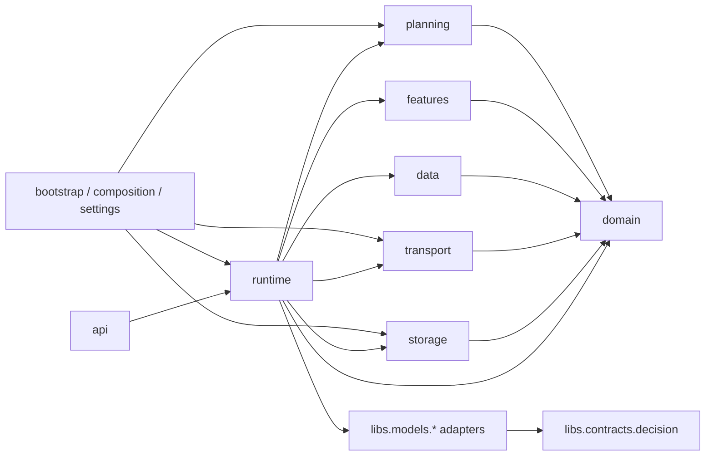

# Decision app R0 — package-structure refactor

## 1. Objective

Refactor the current flat `src/apps/decision_app/` package into clear package boundaries before Momentum integration or any production cutover work.

This is a **mechanical architecture refactor only**.

It must preserve:

- all D0-D10 decision semantics;
- all existing public decision contracts;
- point-in-time behavior and cutoff rules;
- deterministic identities/fingerprints;
- state transaction semantics;
- feature/data planning behavior;
- signal publication compatibility;
- price relay/risk continuity behavior;
- current SR adapter behavior;
- `configs/decision/global.yaml` values;
- the D10 certification artifact unchanged.

Do not change quantitative behavior.

Do not begin Momentum work.

Do not remove or disable `signal_app` or `strategy_app` in this package.

Do not commit, merge, push, or modify the primary checkout unless the orchestrator/user explicitly requests it after review.

---

## 2. Verified starting state

Base:

`97ea09ab347a7b45ba25e3b054db512dc3852bf3`

Current decision package has 39 Python/SQL files and is mostly flat outside `api/` and `storage/`.

The repository's canonical ingestion app already uses coarse ownership boundaries such as:

```text
api/
domain/
runtime/
services/
publication/
storage/
providers/
```

Decision R0 should follow the same level of granularity rather than inventing deep framework layers.

Fresh R0 baseline in the isolated worktree:

```text
tests/decision
+ tests/risk/test_d9d_price_relay_risk.py
+ tests/risk/test_risk_worker.py
+ tests/models/sr/test_import_boundaries.py

390 passed
```

The worktree was clean before this handoff was written.

---

## 3. Current problem

The current package layout reflects implementation milestones D0-D10 rather than long-term ownership:

```text
catalog.py
contracts.py
data.py
feature_engine.py
features.py
finalization.py
identity.py
ingestion_input.py
lifecycle.py
live_input.py
live_runtime.py
market_state.py
model_runtime.py
planner.py
policy.py
price_relay.py
publication.py
readiness.py
real_features.py
runtime_plugins.py
service.py
signal_transport.py
startup.py
state.py
view.py
```

The modules themselves are already reasonably separated. The defect is primarily namespace/package ownership, not a need to rewrite their internals.

R0 therefore moves existing modules into stable coarse namespaces and updates imports/tests/scripts.

---

## 4. Selected target structure

Use this exact high-level structure:

```text
src/apps/decision_app/
├── __init__.py
├── bootstrap.py
├── composition.py
├── settings.py
│
├── api/
│   ├── __init__.py
│   ├── app.py
│   ├── dependencies.py
│   └── routes.py
│
├── domain/
│   ├── __init__.py
│   ├── contracts.py
│   ├── identity.py
│   ├── market_state.py
│   ├── state.py
│   └── view.py
│
├── planning/
│   ├── __init__.py
│   ├── catalog.py
│   ├── planner.py
│   └── readiness.py
│
├── features/
│   ├── __init__.py
│   ├── definitions.py
│   ├── engine.py
│   └── planning.py
│
├── data/
│   ├── __init__.py
│   └── resolver.py
│
├── runtime/
│   ├── __init__.py
│   ├── finalization.py
│   ├── lifecycle.py
│   ├── live.py
│   ├── models.py
│   ├── plugins.py
│   ├── policy.py
│   ├── service.py
│   └── startup.py
│
├── transport/
│   ├── __init__.py
│   ├── ingestion.py
│   ├── live_input.py
│   ├── price_relay.py
│   ├── publication.py
│   └── signals.py
│
└── storage/
    ├── __init__.py
    ├── bootstrap.py
    ├── checkpoints.py
    ├── market_history.py
    ├── schema.sql
    └── state_codec.py
```

Keep `bootstrap.py`, `composition.py`, and `settings.py` at package root because they are application composition/configuration roots, matching `ingestion_app` style.

Do **not** add a `main.py` in R0. Current decision config has no reviewed server host/port contract; adding an executable entrypoint would require inventing deployment/server semantics. Production entrypoint + Docker wiring belongs to the later runtime-cutover package.

---

## 5. Exact move map

Perform real moves/renames; do not keep permanent compatibility shims at the old flat paths.

```text
catalog.py            -> planning/catalog.py
planner.py            -> planning/planner.py
readiness.py          -> planning/readiness.py

contracts.py          -> domain/contracts.py
identity.py           -> domain/identity.py
market_state.py       -> domain/market_state.py
state.py              -> domain/state.py
view.py               -> domain/view.py

features.py           -> features/planning.py
feature_engine.py     -> features/engine.py
real_features.py      -> features/definitions.py

data.py               -> data/resolver.py

model_runtime.py      -> runtime/models.py
runtime_plugins.py    -> runtime/plugins.py
finalization.py       -> runtime/finalization.py
policy.py             -> runtime/policy.py
startup.py            -> runtime/startup.py
live_runtime.py       -> runtime/live.py
lifecycle.py          -> runtime/lifecycle.py
service.py            -> runtime/service.py

ingestion_input.py    -> transport/ingestion.py
live_input.py         -> transport/live_input.py
signal_transport.py   -> transport/signals.py
publication.py        -> transport/publication.py
price_relay.py        -> transport/price_relay.py
```

Leave these in place:

```text
bootstrap.py
composition.py
settings.py
api/**
storage/**
__init__.py
```

Add only the minimal `__init__.py` files required for new packages.

Do not create broad re-export facades. New `__init__.py` modules should be empty/minimal unless one existing import contract demonstrably requires a small explicit export.

---

## 6. Target dependency direction

The restructuring should make ownership visible without changing semantics.



Rules:

1. `domain/` must not import `runtime/`, `transport/`, `storage/`, `api/`, or infrastructure clients.
2. `planning/` may depend on `domain/` and `libs.contracts.decision`, but not live runtime/service/transport.
3. `features/` may depend on domain/planning and pure model/feature contracts; it must not own I/O.
4. `data/` owns semantic data policy/resolution behavior already present in current `data.py`; do not move physical DB/Valkey ownership into it.
5. `runtime/` may orchestrate planning/features/data/transport/storage.
6. `transport/` owns stream/envelope/relay boundaries, not model semantics.
7. `storage/` remains persistence-only.
8. Model plugin code remains under `src/libs/models/**`; do not move SR or future Momentum code into `decision_app`.

Do not refactor internal algorithms merely to satisfy an aesthetic dependency diagram. If the existing reviewed semantics require a small direction exception, preserve behavior and document it rather than redesign D0-D10 in R0.

---

## 7. Import migration scope

Update all internal `apps.decision_app.*` imports to the new canonical paths.

At minimum this affects:

- `src/apps/decision_app/**`;
- `tests/decision/**`;
- `scripts/certify_decision_runtime_d10.py`;
- `tests/risk/test_d9d_price_relay_risk.py` where applicable;
- any other source/test discovered by a full-repo import scan.

The pre-refactor scan found 35 files outside `src/apps/decision_app/` importing decision modules, primarily `tests/decision/**` plus the D10 certification script.

After migration, run a full-repo scan proving no stale imports remain for the moved flat paths.

Do not leave dual import namespaces such as both:

```text
apps.decision_app.model_runtime
apps.decision_app.runtime.models
```

The new namespace must be canonical.

---

## 8. Test organization

R0 does not require moving `tests/decision/` into mirrored subdirectories. Test-file relocation would add noise without runtime value.

Keep existing test filenames and update their imports.

Add/adjust architecture guardrail coverage so it understands the new package paths and still proves:

- decision app does not import `signal_app` or `strategy_app`;
- generic decision runtime modules do not import concrete model implementations except the explicit composition boundary already approved;
- no plugin discovery framework is introduced;
- no executor/thread/process fan-out is introduced;
- no physical I/O enters pure domain contracts.

If path-sensitive tests currently assert old filenames, update them mechanically to the new paths without weakening their semantic assertions.

---

## 9. D10 certification preservation

`artifacts/decision_d10/d10_resource_capacity_certification.json` is protected evidence.

Do not edit or regenerate it in R0.

The artifact SHA-256 entering R0 is:

`2382c92cd83bb29cbab2800c5687ec102d53fe37b213925fa174852a2caa0459`

After structural changes, verify this file hash is unchanged.

Update `scripts/certify_decision_runtime_d10.py` import paths only. Do not change workload definitions, thresholds, scenario logic, or evidence semantics.

Do not claim the historical D10 artifact was generated from the new namespace. It remains historical approved evidence from the pre-R0 layout; R0 validation proves behavior preservation separately.

---

## 10. Legacy `signal_app` / `strategy_app` handling

R0 must not delete, modify, disable, or rename either legacy app.

Verified blockers to physical retirement remain:

```text
docker-compose.yml launches strategy_app and signal_app
api_app imports both legacy API/control surfaces
ingestion certification scripts import signal_app
libs.optim_utils.scoring_feature_pipeline imports signal_app pipeline code
libs.regime.optimization.downstream_backtest imports strategy_app model managers
legacy app tests still exercise both packages
decision_app has not yet integrated a real decision-capable plugin
```

Therefore R0 terminal status must not claim either app is retired.

Carry forward:

```text
SIGNAL_APP_RUNTIME_RETIREMENT_PENDING_DECISION_CUTOVER
STRATEGY_APP_RUNTIME_RETIREMENT_PENDING_DECISION_CUTOVER
LEGACY_APP_SOURCE_DELETION_PENDING_ZERO_DEPENDENCY_PROOF
```

The later retirement sequence remains:

```text
R0 package structure
-> Momentum plugin refactor
-> Momentum decision integration + RSI/MACD features
-> LIVE/REPLAY/end-to-end decision certification
-> decision service deployment wiring
-> disable legacy signal/strategy runtimes
-> zero-dependency audit
-> source deletion
```

---

## 11. Explicit non-goals

Do not in R0:

- integrate Momentum;
- add RSI/MACD decision feature definitions;
- alter SR adapter semantics;
- add/remove model bindings;
- change policy behavior;
- change feature/data planning semantics;
- change state/checkpoint formats;
- change Valkey stream keys;
- change risk/execution contracts;
- change asset/timeframe configuration;
- edit `configs/decision/global.yaml` values;
- create production decision asset YAML;
- add Docker/Compose decision service;
- add server host/port defaults;
- remove signal/strategy Docker services;
- remove signal/strategy API routes;
- migrate research tooling from signal/strategy yet;
- start D11/shadow/cutover;
- introduce new dependencies;
- create generic repository/service/base-class frameworks.

---

## 12. Implementation order

Use small move batches and test after each ownership boundary.

### R0.1 — domain + planning

Move:

```text
contracts
identity
market_state
state
view
catalog
planner
readiness
```

Update internal/test imports.

Run focused domain/planner/readiness/view/state tests.

### R0.2 — features + data

Move:

```text
features -> features/planning
feature_engine -> features/engine
real_features -> features/definitions
data -> data/resolver
```

Update imports.

Run feature/data/SR adapter tests.

### R0.3 — runtime

Move:

```text
model_runtime
runtime_plugins
finalization
policy
startup
live_runtime
lifecycle
service
```

Update imports.

Run model runtime/state rewarm/finalization/policy/startup/live/service tests.

### R0.4 — transport

Move:

```text
ingestion_input
live_input
signal_transport
publication
price_relay
```

Update imports.

Run D9A/D9B/D9D + risk continuity tests.

### R0.5 — composition/bootstrap/API + certification imports

Update root composition/bootstrap/API imports and D10 script imports.

Do not add production runtime wiring.

### R0.6 — global stale-path scan and full validation

Prove no old flat import path remains for moved modules.

---

## 13. Required validation

### Baseline parity

Fresh pre-refactor baseline:

`390 passed`

using:

```text
tests/decision
tests/risk/test_d9d_price_relay_risk.py
tests/risk/test_risk_worker.py
tests/models/sr/test_import_boundaries.py
```

Post-refactor, the same exact selector must pass.

### Broader compatibility

Also run affected decision downstream compatibility proportional to actual diff, including at minimum:

```text
tests/commons where decision/TradeSignal contracts are touched by imports
tests/execution only if a changed import path reaches execution-facing compatibility
relevant signal/risk integration tests if publication/risk continuity imports changed
```

No live provider/network test is required for a namespace-only refactor.

### Static checks

Run:

```text
ruff check on changed Python files
ruff format --check on changed Python files
python -m compileall on src/apps/decision_app and affected tests/scripts
git diff --check
full-repo stale old-import scan
architecture guardrails
```

### Protected evidence

Recompute SHA-256 and prove:

```text
artifacts/decision_d10/d10_resource_capacity_certification.json
== 2382c92cd83bb29cbab2800c5687ec102d53fe37b213925fa174852a2caa0459
```

---

## 14. Acceptance criteria

R0 is ready for orchestrator review only when all are true:

```text
new package structure matches Section 4
all Section 5 moves complete
no permanent compatibility shims at old flat paths
all imports use new canonical namespaces
no D0-D10 semantic behavior changed
390-test baseline selector passes
architecture guardrails pass
Ruff/format/compile/diff checks pass
D10 artifact hash unchanged
configs/decision/global.yaml values unchanged
no Momentum implementation/integration
no signal_app/strategy_app deletion or runtime changes
no Docker/API cutover work
```

If a structural move requires changing an approved semantic contract or algorithm, stop and report:

`DECISION_APP_R0_STRUCTURE_REFACTOR_BLOCKED`

Do not hide semantic changes inside the namespace refactor.

---

## 15. Two-pass coder self-review

### Pass 1 — behavior/correctness

Verify:

```text
same public contract values
same planner output
same fingerprints/identities
same feature/data plans
same state transitions
same runtime evaluation behavior
same publication envelope/stream identities
same price relay behavior
same risk continuity behavior
same D10 protected artifact bytes
```

### Pass 2 — architecture/simplicity

Verify:

```text
ownership boundaries are clearer than before
no unnecessary nested packages
no generic base framework
no compatibility-shim clutter
no new circular imports hidden by local imports
no model semantics moved into decision_app
no infrastructure moved into domain/planning
root bootstrap/composition/settings remain composition roots
main.py not invented without deployment config
legacy retirement not mixed into R0
```

---

## 16. Coder handoff

Create/update after implementation:

`plans/coder-to-orchestrator-decision-app-r0-package-structure-v1.md`

Include:

- exact move map completed;
- import/reference scan results;
- any dependency-direction exceptions retained for behavior parity;
- focused and full test counts;
- D10 artifact hash before/after;
- Ruff/format/compile/diff results;
- two-pass review findings;
- `git status --short` and diff summary;
- explicit confirmation that Momentum, signal_app retirement, strategy_app retirement, Docker cutover, and D11 were not started.

Terminal status on success:

`DECISION_APP_R0_PACKAGE_STRUCTURE_READY_FOR_REVIEW`

Stop after handoff. Do not begin Momentum automatically.
