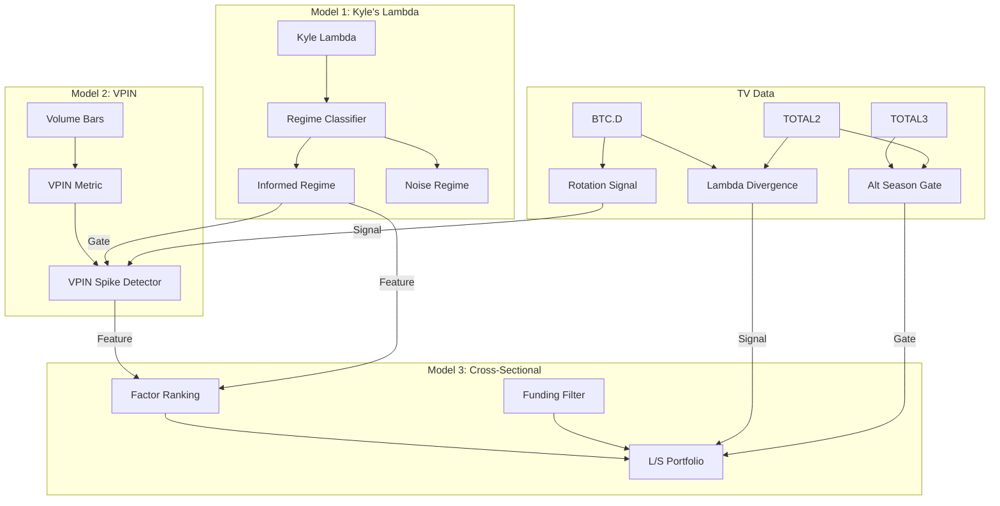

# Architect → Coder: Market Microstructure Alpha Models

## 1. Context Retrieved

### Prior Research (from automem/memoir)
- **OHLCV indicator space is exhausted**: 14 indicators tested across BTC 1h, composite score plateaus at 0.60–0.66. All standard TA models (RSI, BB, MACD, KAMA, squeeze, etc.) are arbitraged at 1h frequency.
- **Prior liquidity research** (hypothesis_liquidity_models.ipynb): TFI, FRM, OID already explored. TFI ranked #1 (zero data cost, klines already have taker fields), FRM #2 (marginal signal Sharpe +0.91), OID #3 (30-day API limit).
- **Key prior finding**: `taker_buy_base_asset_volume` is already in kline data but was being filtered out at `df = df[OHLCV_COLUMNS]`. The liquidity notebook fixed this.
- **Architecture decision (2026-05-27)**: 3 model tiers planned — (1) threshold models (SB, MR), (2) feature-engineered scoring models, (3) alt-data regime features. This handoff implements tier 2+3.
- **Multi-TP parity gap**: v7 per-asset params were tuned against multi-TP backtest but production uses single-exit. Not blocking for research notebooks, but backtest methodology must use consistent exit logic.
- **TV Index data available**: BTC.D, TOTAL2, TOTAL3 at 1h, 1358 bars each from 2026-04-01. The TV interceptor can fetch more indices.

### What Makes These Models Different From Prior Work
| Dimension | Prior TFI/FRM/OID | New VPIN / Kyle / Cross-Sectional |
|-----------|------------------|------------------------------------|
| Bar construction | Time bars (1h fixed) | Volume bars (VPIN), time bars reframed as regime (Kyle) |
| Signal logic | Threshold on ratio | Information-theoretic (VPIN), price-impact physics (Kyle), cross-sectional ranking (CS) |
| Regime awareness | None | Kyle's Lambda IS the regime gate |
| Universe | Single-asset (BTC, ETH) | Single-asset (VPIN, Kyle) + multi-asset (CS) |
| TV integration | Not used | Core component — BTC.D rotation, TOTAL3/TOTAL2 regime gate |
| Theoretical basis | Empirical ratio thresholds | Easley-López de Prado-O'Hara (2012), Kyle (1985), Barra factor model |

---

## 2. Objective

Build 3 research notebooks, one per model, each structured as a hypothesis validation pipeline:

1. **Notebook 1: `research/hypothesis_kyle_lambda.ipynb`** — Kyle's Lambda as regime classifier
2. **Notebook 2: `research/hypothesis_vpin.ipynb`** — VPIN informed trading detection  
3. **Notebook 3: `research/hypothesis_cross_sectional.ipynb`** — Cross-sectional factor neutral with funding squeeze

Each notebook must:
- Reuse existing data-fetch functions from `hypothesis_liquidity_models.ipynb`
- Integrate TradingView index data as a core component (not afterthought)
- Define testable hypotheses with GO/NO-GO quantitative criteria
- Run backtests with consistent exit logic (single TP/SL, not multi-TP)
- Report: forward return correlation, quintile analysis, equity curve, Sharpe, max drawdown, number of trades, win rate, profit factor
- Conclude with a binary GO/NO-GO verdict per hypothesis

---

## 3. Incremental Build Order & Rationale

### Build Order: Kyle → VPIN → Cross-Sectional

| Order | Model | Why This Order |
|-------|-------|----------------|
| 1st | Kyle's Lambda | Simplest formula (|ΔP|/√V). Produces regime classification reused by Models 2+3. Minimal data deps — OHLCV already available. |
| 2nd | VPIN | Requires volume bucketization (new paradigm). Uses taker_buy_base already in data. Kyle's regime gate enhances VPIN signals. |
| 3rd | Cross-Sectional | Most complex — needs multi-symbol universe (15-20 pairs). Consumes Kyle regime + VPIN informed flow as input features. Needs funding rate across universe. |

**Data dependency graph:**
```
OHLCV + taker_buy ──┬── Kyle Lambda ──┬── VPIN (enhanced)
                    │                 │
TV indices ─────────┤                 ├── Cross-Sectional
                    │                 │
Funding Rate ───────┘─────────────────┘
OI History ─────────────────────────────┘
L/S Ratio ──────────────────────────────┘
```

---

## 4. Model 1: Kyle's Lambda — Price Impact Regime Classifier

### Notebook: `research/hypothesis_kyle_lambda.ipynb`

### 4.1 Theoretical Foundation

Kyle (1985) models price impact as: the permanent price change per unit of order flow. In practice:

$$\lambda_t = \frac{|\Delta P_t|}{\sqrt{V_t}}$$

Where:
- $\Delta P_t = \text{close}_t - \text{close}_{t-1}$ (log returns also acceptable: $\ln(P_t / P_{t-1})$)
- $V_t$ = volume in base currency at bar $t$

**Interpretation:**
- **High λ** → market is thin/informed → small volume moves price → trend-following regime
- **Low λ** → market is liquid/noise-dominated → volume absorbed without impact → mean-reversion regime

### 4.2 Computation Steps

```
Cell 1: Setup + imports (reuse from liquidity notebook)
Cell 2: Fetch BTCUSDT + ETHUSDT 1h data (start_date='2025-06-01') via fetch_ohlcv_full()
Cell 3: Load TV index data (BTC.D, TOTAL2, TOTAL3) from CSV
Cell 4: Compute Kyle's Lambda
```

**Kyle's Lambda computation:**

```python
def compute_kyle_lambda(df, smooth=24, lookback=100):
    out = df.copy()
    # Raw lambda
    abs_ret = np.abs(np.log(out['close'] / out['close'].shift(1)))
    root_vol = np.sqrt(out['volume'].replace(0, np.nan))
    out['kyle_raw'] = abs_ret / root_vol
    
    # Smoothed (rolling median more robust than mean to outliers)
    out['kyle_lambda'] = out['kyle_raw'].rolling(smooth, min_periods=smooth//2).median()
    
    # Z-score for regime classification
    roll_mean = out['kyle_lambda'].rolling(lookback, min_periods=lookback//2).mean()
    roll_std = out['kyle_lambda'].rolling(lookback, min_periods=lookback//2).std()
    out['kyle_z'] = (out['kyle_lambda'] - roll_mean) / roll_std.replace(0, np.nan)
    
    # Regime classification
    out['kyle_regime'] = 'neutral'
    out.loc[out['kyle_z'] > 1.0, 'kyle_regime'] = 'informed'      # trend-follow
    out.loc[out['kyle_z'] < -0.5, 'kyle_regime'] = 'noise'         # mean-revert
    
    # Signed lambda: direction * magnitude
    net_taker = out['taker_buy_base'] - (out['volume'] - out['taker_buy_base'])
    out['kyle_signed'] = np.sign(net_taker) * out['kyle_lambda']
    
    return out
```

**TV Integration — Lambda Divergence:**

```python
def compute_lambda_divergence(btc_df, tv_total2):
    """Compare λ regimes between BTC and altcoin aggregate.
    Divergence reveals rotation timing:
    - BTC λ↑ + TOTAL2 λ↓ → money flowing from alts to BTC
    - BTC λ↓ + TOTAL2 λ↑ → money flowing from BTC to alts
    """
    # Compute pseudo-λ for TOTAL2 (no taker data, use |ΔP|/√V proxy)
    tv = tv_total2.copy()
    tv['ret'] = np.abs(np.log(tv['close'] / tv['close'].shift(1)))
    tv['root_vol'] = np.sqrt(tv['volume'].replace(0, np.nan))
    tv['lambda_total2'] = (tv['ret'] / tv['root_vol']).rolling(24).median()
    
    # Merge on timestamp, compute divergence
    merged = btc_df[['kyle_lambda']].join(tv[['lambda_total2']], how='inner')
    
    # Normalize both to z-scores before comparing
    for col in ['kyle_lambda', 'lambda_total2']:
        m = merged[col].rolling(100).mean()
        s = merged[col].rolling(100).std()
        merged[f'{col}_z'] = (merged[col] - m) / s.replace(0, np.nan)
    
    merged['lambda_divergence'] = merged['kyle_lambda_z'] - merged['lambda_total2_z']
    # Positive divergence → BTC impact rising vs alts → BTC accumulation
    # Negative divergence → alts more impacted → alt rotation
    return merged
```

### 4.3 Hypotheses & GO/NO-GO Criteria

| ID | Hypothesis | Test | GO Criterion | NO-GO |
|----|-----------|------|-------------|-------|
| H1 | Kyle λ classifies regime: high-λ periods have higher absolute forward returns than low-λ | Compare mean |fwd_12h| in λ_z > 1 vs λ_z < -0.5 | Ratio > 1.3× (high-λ periods 30%+ more volatile) | Ratio < 1.1× |
| H2 | Signed λ predicts direction: kyle_signed > 0 + kyle_regime='informed' → positive fwd returns | Conditional return in informed regime by signed λ direction | Win rate > 55% at 12h horizon, |r| > 0.03 | WR < 52% or |r| < 0.02 |
| H3 | λ as regime gate improves TFI: TFI signal filtered by kyle_regime='informed' beats unfiltered TFI | Compare Sharpe of TFI-only vs TFI+Kyle-filtered | Sharpe improvement > 20% | Sharpe improvement < 5% |
| H4 | λ divergence (BTC vs TOTAL2) predicts BTC.D direction | Correlation of lambda_divergence with BTC.D 12h change | |r| > 0.05, directional accuracy > 54% | |r| < 0.02 |

### 4.4 Backtest Methodology

**Strategy 1: Kyle Regime-Gated Directional**
```
Entry LONG:  kyle_regime == 'informed' AND kyle_signed > 0 AND RSI < 70
Entry SHORT: kyle_regime == 'informed' AND kyle_signed < 0 AND RSI > 30
Exit: ATR-based TP (2×ATR) / SL (1.5×ATR) — single exit, not multi-TP
Cooldown: 6 bars
```

**Strategy 2: Kyle Mean-Reversion (noise regime)**
```
Entry LONG:  kyle_regime == 'noise' AND RSI < 35
Entry SHORT: kyle_regime == 'noise' AND RSI > 65
Exit: Same ATR-based TP/SL
```

Report for each: trade count, win rate, avg PnL, cumulative PnL, Sharpe (annualized), max drawdown, profit factor. Run on BTC + ETH.

### 4.5 Notebook Cell Structure

| Cell | Type | Content |
|------|------|---------|
| 1 | MD | Title, thesis, regime theory, hypotheses table |
| 2 | Code | Setup: imports, reuse `fetch_ohlcv_full`, Binance client, TV CSV loader |
| 3 | Code | Fetch BTC + ETH 1h data (start_date='2025-06-01') |
| 4 | Code | Load TV indices from CSV, align timestamps |
| 5 | Code | `compute_kyle_lambda()` — raw λ, smoothed, z-score, regime, signed λ |
| 6 | Code | Diagnostic plots: λ time series, regime distribution, regime duration histogram |
| 7 | Code | **H1 test**: |fwd_return| by regime (informed vs noise vs neutral) |
| 8 | Code | **H2 test**: signed λ direction vs fwd return — correlation + quintile analysis |
| 9 | Code | `compute_lambda_divergence()` — BTC λ vs TOTAL2 pseudo-λ |
| 10 | Code | **H4 test**: λ divergence vs BTC.D rate of change |
| 11 | Code | Backtest: regime-gated directional (informed regime) |
| 12 | Code | Backtest: regime-gated mean-reversion (noise regime) |
| 13 | Code | **H3 test**: TFI + Kyle filter vs TFI alone (reuse compute_tfi + backtest_tfi from liquidity notebook, add kyle_regime filter) |
| 14 | Code | Cross-asset validation: ETH |
| 15 | Code | Equity curves + regime overlay plot |
| 16 | MD | GO/NO-GO verdict table, parameter sensitivity notes |

### 4.6 Parameters to Sweep (after GO)

| Parameter | Default | Sweep Range | Notes |
|-----------|---------|-------------|-------|
| smooth | 24 | [8, 12, 24, 48] | λ smoothing window |
| lookback | 100 | [50, 100, 200] | Z-score normalization window |
| regime_threshold_high | 1.0 | [0.5, 0.75, 1.0, 1.5] | Z cutoff for 'informed' |
| regime_threshold_low | -0.5 | [-1.0, -0.5, -0.25] | Z cutoff for 'noise' |
| atr_tp | 2.0 | [1.5, 2.0, 2.5, 3.0] | TP multiplier |
| atr_sl | 1.5 | [1.0, 1.5, 2.0] | SL multiplier |

---

## 5. Model 2: VPIN — Volume-Synchronized Probability of Informed Trading

### Notebook: `research/hypothesis_vpin.ipynb`

### 5.1 Theoretical Foundation

Easley, López de Prado, O'Hara (2012): VPIN estimates the probability that trading activity is driven by informed traders rather than noise.

**Key innovation over TFI:** VPIN uses **volume bars** (equal volume buckets), not time bars. This is critical because:
- Informed traders cluster their activity in volume, not time
- A 1h bar with 500 BTC traded and a 1h bar with 50 BTC traded are NOT comparable
- Volume bars normalize for market participation rate

### 5.2 Computation Steps

**Step 1: Construct Volume Bars**

```python
def make_volume_bars(df, bucket_size):
    """Convert time-bar OHLCV into volume-synchronized bars.
    
    Args:
        df: OHLCV DataFrame with 'volume', 'taker_buy_base', standard OHLCV columns.
        bucket_size: Target volume per bar (e.g., median hourly volume × 1).
    
    Returns:
        DataFrame where each row represents exactly `bucket_size` base-currency volume.
    """
    bars = []
    cum_vol = 0.0
    cum_buy = 0.0
    bar_open = df['open'].iloc[0]
    bar_high = -np.inf
    bar_low = np.inf
    bar_start_ts = df.index[0]
    
    for i in range(len(df)):
        row = df.iloc[i]
        remaining = row['volume']
        buy_remaining = row['taker_buy_base']
        
        while remaining > 0:
            space = bucket_size - cum_vol
            fill = min(space, remaining)
            buy_fill = buy_remaining * (fill / remaining) if remaining > 0 else 0
            
            cum_vol += fill
            cum_buy += buy_fill
            bar_high = max(bar_high, row['high'])
            bar_low = min(bar_low, row['low'])
            remaining -= fill
            buy_remaining -= buy_fill
            
            if cum_vol >= bucket_size * 0.999:  # tolerance
                bars.append({
                    'start_ts': bar_start_ts,
                    'end_ts': df.index[i],
                    'open': bar_open,
                    'high': bar_high,
                    'low': bar_low,
                    'close': row['close'],
                    'volume': cum_vol,
                    'taker_buy': cum_buy,
                    'taker_sell': cum_vol - cum_buy,
                })
                # Reset
                cum_vol = 0.0
                cum_buy = 0.0
                bar_open = row['close']
                bar_high = -np.inf
                bar_low = np.inf
                bar_start_ts = df.index[i]
    
    vbars = pd.DataFrame(bars)
    vbars.index = pd.to_datetime(vbars['end_ts'])
    return vbars
```

**Step 2: Compute VPIN**

$$\text{VPIN}_n = \frac{\sum_{i=n-N+1}^{n} |V^B_i - V^S_i|}{\sum_{i=n-N+1}^{n} V_i}$$

Where:
- $V^B_i$ = taker buy volume in volume bar $i$ (we have this! `taker_buy_base`)
- $V^S_i$ = taker sell volume = $V_i - V^B_i$
- $N$ = lookback in volume bars (e.g., 50)

```python
def compute_vpin(vbars, n_buckets=50):
    """Compute VPIN over rolling window of N volume bars."""
    out = vbars.copy()
    out['order_imbalance'] = np.abs(out['taker_buy'] - out['taker_sell'])
    
    out['vpin'] = (
        out['order_imbalance'].rolling(n_buckets, min_periods=n_buckets//2).sum() /
        out['volume'].rolling(n_buckets, min_periods=n_buckets//2).sum()
    )
    
    # VPIN rate of change (spike detection)
    out['vpin_roc'] = out['vpin'].pct_change(5)
    
    # VPIN z-score
    roll_mean = out['vpin'].rolling(200, min_periods=50).mean()
    roll_std = out['vpin'].rolling(200, min_periods=50).std()
    out['vpin_z'] = (out['vpin'] - roll_mean) / roll_std.replace(0, np.nan)
    
    return out
```

**Step 3: Map back to time bars for backtesting**

```python
def map_vpin_to_time(df_time, vpin_df):
    """Forward-fill VPIN values into time bars for backtest alignment.
    
    Critical: Use as-of merge (merge_asof) to avoid look-ahead bias.
    VPIN at volume bar close time T is only available at T, 
    so time bars at t < T should NOT see it.
    """
    vpin_series = vpin_df[['vpin', 'vpin_z', 'vpin_roc']].copy()
    vpin_series.index = pd.to_datetime(vpin_series.index, utc=True)
    result = pd.merge_asof(
        df_time, vpin_series,
        left_index=True, right_index=True,
        direction='backward'  # Only use VPIN values from the past
    )
    return result
```

**Step 4: TV Integration — VPIN + BTC.D Rotation Signal**

```python
def compute_vpin_rotation_signal(btc_vpin_df, btc_d_df, alt_df):
    """VPIN spike on altcoin + BTC.D falling → alt rotation signal.
    
    Logic: When informed traders are active on an altcoin (high VPIN)
    AND Bitcoin dominance is declining (money leaving BTC for alts),
    the informed flow is likely alt-accumulation.
    """
    # BTC.D rate of change
    btc_d = btc_d_df.copy()
    btc_d['btc_d_roc_12'] = btc_d['close'].pct_change(12)  # 12h RoC
    btc_d['btc_d_falling'] = btc_d['btc_d_roc_12'] < -0.002  # > 0.2% decline
    
    # Merge alt VPIN with BTC.D
    merged = alt_df.join(btc_d[['btc_d_roc_12', 'btc_d_falling']], how='left')
    merged['btc_d_falling'] = merged['btc_d_falling'].ffill()
    merged['btc_d_roc_12'] = merged['btc_d_roc_12'].ffill()
    
    # Rotation signal: VPIN spike + BTC.D falling
    merged['alt_rotation_signal'] = (
        (merged['vpin_z'] > 1.5) &    # Informed flow on alt
        (merged['btc_d_falling'])       # BTC dominance declining
    ).astype(int)
    
    return merged
```

### 5.3 Hypotheses & GO/NO-GO Criteria

| ID | Hypothesis | Test | GO Criterion | NO-GO |
|----|-----------|------|-------------|-------|
| H1 | Volume bars reveal structure invisible to time bars: VPIN distribution is NOT simply a rescaled version of TFI | Compare: correlation(VPIN, TFI) < 0.7 AND VPIN has lower autocorrelation | Correlation < 0.7 (genuinely different signal) | Correlation > 0.85 (redundant with TFI) |
| H2 | VPIN spike precedes volatility expansion: Mean |fwd_return| in 12h after VPIN_z > 2 is significantly higher than unconditional | Compare conditional vs unconditional mean |fwd_12h| | Ratio > 1.5× (VPIN spikes predict vol expansion) | Ratio < 1.2× |
| H3 | VPIN direction is informative: High VPIN + net taker buy → positive fwd return | Signed VPIN signal (VPIN_z > 1.5, direction from net taker) vs fwd_12h | WR > 55%, |r| > 0.04 | WR < 52% |
| H4 | VPIN + BTC.D rotation signal works on alts: alt_rotation_signal predicts positive alt fwd return | Backtest rotation signal on ETHUSDT | WR > 55%, positive expectancy | WR < 52% |
| H5 | VPIN + Kyle regime beats VPIN alone: Filter VPIN entries by kyle_regime='informed' | Compare Sharpe of VPIN-only vs VPIN+Kyle | Sharpe improvement > 15% | Sharpe improvement < 5% |

### 5.4 Critical Implementation Notes

1. **Volume bar bucket_size selection**: Use `median(hourly_volume) × 1` as default. Sweep [0.5×, 1×, 2×, 4×] median.
2. **Look-ahead bias**: `merge_asof(direction='backward')` is MANDATORY when mapping VPIN to time bars.
3. **VPIN vs TFI redundancy check**: Run H1 FIRST. If VPIN ≈ TFI (correlation > 0.85), the volume-bar paradigm adds nothing for this data and the model is NO-GO immediately.
4. **Bucket_size affects signal frequency**: Larger buckets → fewer volume bars → smoother VPIN → fewer signals. Track trade count.

### 5.5 Backtest Methodology

**Strategy 1: VPIN Breakout (informed flow)**
```
Entry LONG:  vpin_z > 1.5 AND net_taker_buy_ratio > 0.55 AND RSI < 70
Entry SHORT: vpin_z > 1.5 AND net_taker_buy_ratio < 0.45 AND RSI > 30
Exit: ATR-based TP (2.5×ATR) / SL (1.5×ATR)
Cooldown: 6 bars
```

**Strategy 2: VPIN + Kyle Regime Combo**
```
Entry: Same as Strategy 1, but ONLY when kyle_regime == 'informed'
```

**Strategy 3: VPIN + BTC.D Rotation (for alts)**
```
Entry LONG on ALT: vpin_z > 1.5 AND btc_d_roc_12 < -0.002 (alt rotation)
Entry SHORT on ALT: vpin_z > 1.5 AND btc_d_roc_12 > 0.002 (BTC flight)
Exit: Same ATR-based
```

### 5.6 Notebook Cell Structure

| Cell | Type | Content |
|------|------|---------|
| 1 | MD | Title, VPIN theory, Easley et al. citation, volume-bar concept, hypotheses |
| 2 | Code | Setup + imports + load Kyle results from notebook 1 (or recompute) |
| 3 | Code | Fetch BTC + ETH 1h data via `fetch_ohlcv_full()` |
| 4 | Code | Load TV indices from CSV |
| 5 | Code | `make_volume_bars()` — construct volume-synchronized bars |
| 6 | Code | Volume bar diagnostics: bars/day distribution, median bar duration, comparison with time bars |
| 7 | Code | `compute_vpin()` on volume bars |
| 8 | Code | `map_vpin_to_time()` — as-of merge back to time bars |
| 9 | Code | Compute TFI on same data for redundancy comparison |
| 10 | Code | **H1 test**: VPIN vs TFI correlation, autocorrelation comparison |
| 11 | Code | **H2 test**: VPIN spike → volatility expansion analysis |
| 12 | Code | **H3 test**: Signed VPIN directional signal quality |
| 13 | Code | `compute_vpin_rotation_signal()` — integrate BTC.D |
| 14 | Code | **H4 test**: Rotation signal on ETH |
| 15 | Code | Backtest Strategy 1: VPIN breakout |
| 16 | Code | Load/recompute Kyle λ, compute kyle_regime |
| 17 | Code | **H5 test**: Backtest Strategy 2: VPIN + Kyle regime combo |
| 18 | Code | Backtest Strategy 3: VPIN + BTC.D rotation on ETH |
| 19 | Code | Equity curves, VPIN time-series with regime overlay |
| 20 | MD | GO/NO-GO verdict, bucket_size sensitivity, next steps |

### 5.7 Parameters to Sweep (after GO)

| Parameter | Default | Sweep Range | Notes |
|-----------|---------|-------------|-------|
| bucket_size_mult | 1.0 | [0.5, 1.0, 2.0, 4.0] | Multiple of median hourly volume |
| n_buckets | 50 | [20, 35, 50, 75, 100] | VPIN lookback in volume bars |
| vpin_entry_z | 1.5 | [1.0, 1.5, 2.0, 2.5] | Z-score threshold for entry |
| btc_d_roc_thresh | -0.002 | [-0.005, -0.002, -0.001] | BTC.D decline threshold for rotation |
| atr_tp | 2.5 | [2.0, 2.5, 3.0] | TP multiplier |
| atr_sl | 1.5 | [1.0, 1.5, 2.0] | SL multiplier |

---

## 6. Model 3: Cross-Sectional Factor Neutral with Funding Squeeze

### Notebook: `research/hypothesis_cross_sectional.ipynb`

### 6.1 Theoretical Foundation

This model exploits **liquidation cascade mechanics** in crypto futures. When leveraged positions crowd one side of a market (visible via extreme funding rates), the eventual squeeze/cascade creates predictable cross-sectional return dispersion.

**Key structural edge:**
- Funding rates are publicly observable → the crowd's positioning is visible
- Extreme funding = overleveraged crowd → liquidation cascade WILL happen
- By going contrarian on funding AND ranking by momentum/OI factors, we select which assets will benefit most from the cascade
- TOTAL3/TOTAL2 ratio gates alt-season vs alt-winter → only trade when dispersion regime is favorable

### 6.2 Universe Selection

```python
UNIVERSE = [
    'BTCUSDT', 'ETHUSDT', 'BNBUSDT', 'SOLUSDT', 'XRPUSDT',
    'DOGEUSDT', 'ADAUSDT', 'AVAXUSDT', 'DOTUSDT', 'LINKUSDT',
    'MATICUSDT', 'UNIUSDT', 'ATOMUSDT', 'LTCUSDT', 'NEARUSDT',
    'APTUSDT', 'ARBUSDT', 'OPUSDT', 'SUIUSDT', 'INJUSDT',
]
# 20 liquid altcoins on Binance Futures
# Filter at runtime: remove any with < 30 days funding history or < $10M daily volume
```

### 6.3 Computation Steps

**Step 1: Fetch universe data**

```python
def fetch_universe_data(symbols, timeframe='4h', start_date='2025-06-01'):
    """Fetch OHLCV + taker for entire universe. Returns dict of DataFrames."""
    universe = {}
    for sym in symbols:
        try:
            df = fetch_ohlcv_full(sym, timeframe, start_date)
            if len(df) > 200:  # Minimum data requirement
                universe[sym] = df
            time.sleep(0.1)
        except Exception as e:
            print(f"  SKIP {sym}: {e}")
    print(f"\nUniverse: {len(universe)} / {len(symbols)} symbols loaded")
    return universe
```

**Step 2: Fetch funding rates for universe**

```python
def fetch_universe_funding(symbols, start_date='2025-06-01'):
    """Fetch funding rates for entire universe."""
    funding = {}
    for sym in symbols:
        try:
            fr = fetch_funding_rate(sym, start_date)
            if len(fr) > 50:
                funding[sym] = fr
            time.sleep(0.15)
        except Exception as e:
            print(f"  SKIP {sym}: {e}")
    return funding
```

**Step 3: Compute Cross-Sectional Factors (every 4h)**

$$\text{momentum}_{i,t} = \frac{P_{i,t}}{P_{i,t-k}} - 1 \quad (k = 24 \text{ bars} = 96\text{h})$$

$$\text{oi\_change}_{i,t} = \frac{\text{OI}_{i,t} - \text{OI}_{i,t-6}}{\text{OI}_{i,t-6}}$$

$$\text{funding\_z}_{i,t} = \frac{f_{i,t} - \bar{f}_{i,30d}}{\sigma_{f_{i,30d}}}$$

```python
def compute_cross_sectional_factors(universe, funding, oi=None):
    """Compute factor scores for each symbol at each timestamp.
    
    Returns panel DataFrame: (timestamp, symbol) → (momentum, oi_change, funding_z, tfi)
    """
    panels = []
    
    for sym, df in universe.items():
        factors = pd.DataFrame(index=df.index)
        factors['symbol'] = sym
        
        # Factor 1: Momentum (96h = 24 bars at 4h)
        factors['momentum'] = df['close'].pct_change(24)
        
        # Factor 2: TFI (reuse from prior work)
        factors['tfi'] = (df['taker_buy_base'] / df['volume'].replace(0, np.nan)).ewm(span=5).mean()
        
        # Factor 3: Funding rate z-score
        if sym in funding:
            fr = funding[sym][['fundingRate']].copy()
            # Resample funding (8h) to 4h bars via forward-fill
            fr_resampled = fr.resample('4h').ffill()
            factors = factors.join(fr_resampled, how='left')
            factors['fundingRate'] = factors['fundingRate'].ffill()
            fr_mean = factors['fundingRate'].rolling(90, min_periods=30).mean()  # ~30 days at 8h
            fr_std = factors['fundingRate'].rolling(90, min_periods=30).std()
            factors['funding_z'] = (factors['fundingRate'] - fr_mean) / fr_std.replace(0, np.nan)
        else:
            factors['funding_z'] = np.nan
        
        # Factor 4: OI change (if available — only last 30 days)
        factors['oi_change'] = np.nan  # Populated when OI data is fetched
        
        panels.append(factors)
    
    panel = pd.concat(panels).reset_index()
    panel = panel.rename(columns={'dt': 'timestamp'} if 'dt' in panel.columns else {})
    return panel
```

**Step 4: Cross-Sectional Ranking & Portfolio Construction**

```python
def construct_ls_portfolio(panel, n_long=5, n_short=5):
    """Rank assets cross-sectionally and construct long/short portfolio.
    
    Composite score = mean of within-cross-section percentile ranks.
    Long top quartile, short bottom quartile.
    
    FUNDING FILTER: Only long where funding is NEGATIVE (shorts are crowded → squeeze UP).
                    Only short where funding is POSITIVE (longs are crowded → squeeze DOWN).
    """
    portfolios = []
    
    for ts, group in panel.groupby(panel.index):
        if len(group) < 10:  # Need minimum universe size
            continue
        
        g = group.dropna(subset=['momentum', 'funding_z'])
        if len(g) < 10:
            continue
        
        # Rank each factor (percentile within cross-section)
        g['mom_rank'] = g['momentum'].rank(pct=True)
        g['tfi_rank'] = g['tfi'].rank(pct=True)
        
        # Composite: equal-weight average of factor ranks
        g['composite'] = g[['mom_rank', 'tfi_rank']].mean(axis=1)
        
        # Sort by composite
        g = g.sort_values('composite', ascending=False)
        
        # CONTRARIAN FUNDING FILTER
        # Top composite + negative funding → long (shorts crowded, squeeze up)
        long_candidates = g.head(n_long * 2)
        longs = long_candidates[long_candidates['funding_z'] < -0.5].head(n_long)
        
        # Bottom composite + positive funding → short (longs crowded, squeeze down)
        short_candidates = g.tail(n_short * 2)
        shorts = short_candidates[short_candidates['funding_z'] > 0.5].head(n_short)
        
        for _, row in longs.iterrows():
            portfolios.append({'ts': ts, 'symbol': row['symbol'], 'side': 'long', 
                             'composite': row['composite'], 'funding_z': row['funding_z']})
        for _, row in shorts.iterrows():
            portfolios.append({'ts': ts, 'symbol': row['symbol'], 'side': 'short',
                             'composite': row['composite'], 'funding_z': row['funding_z']})
    
    return pd.DataFrame(portfolios)
```

**Step 5: TV Integration — Alt Season/Winter Regime Gate**

```python
def compute_alt_season_regime(total3_df, total2_df):
    """TOTAL3/TOTAL2 ratio as alt-season regime gate.
    
    TOTAL3 = Total crypto market cap excl BTC & ETH
    TOTAL2 = Total crypto market cap excl BTC
    
    Ratio = TOTAL3 / TOTAL2 ≈ proportion of alt cap outside ETH
    Rising ratio → pure altcoin rally (alt-season)
    Falling ratio → ETH dominates alts (alt-winter, only large caps move)
    """
    t3 = total3_df[['close']].rename(columns={'close': 'total3'})
    t2 = total2_df[['close']].rename(columns={'close': 'total2'})
    
    merged = t3.join(t2, how='inner')
    merged['alt_ratio'] = merged['total3'] / merged['total2']
    
    # Regime from ratio trend
    merged['alt_ratio_sma'] = merged['alt_ratio'].rolling(48).mean()  # 48h SMA
    merged['alt_season'] = merged['alt_ratio'] > merged['alt_ratio_sma']  # Above SMA = alt season
    
    # Rate of change for conviction
    merged['alt_ratio_roc'] = merged['alt_ratio'].pct_change(24)  # 24h RoC
    
    return merged
```

**Step 6: Combined Strategy**

```
Every 4h rebalance:
1. Compute alt_season_regime from TOTAL3/TOTAL2
2. IF alt_season == False → SKIP (no cross-sectional trades, go flat)
3. IF alt_season == True:
   a. Rank universe by composite factor score
   b. Apply contrarian funding filter
   c. Equal-weight long top 5, short bottom 5
   d. Hold for 4h, then rebalance
4. P&L: sum of (side × 4h return) / N for each leg
```

### 6.4 Hypotheses & GO/NO-GO Criteria

| ID | Hypothesis | Test | GO Criterion | NO-GO |
|----|-----------|------|-------------|-------|
| H1 | Cross-sectional momentum factor is predictive: Top quintile outperforms bottom quintile in 4h forward returns | Quintile portfolio analysis (Fama-MacBeth style) | Top - Bottom spread > 0.1% per 4h, t-stat > 2.0 | Spread < 0.05% or t-stat < 1.5 |
| H2 | Contrarian funding overlay adds alpha: Funding-filtered portfolio beats unfiltered | Compare Sharpe of filtered vs unfiltered | Sharpe improvement > 25% | Sharpe improvement < 5% |
| H3 | Funding extremes predict reversal: Assets with |funding_z| > 2 have subsequent funding mean-reversion within 24h | Mean-reversion rate of extreme funding | > 70% of extreme funding events revert within 24h | < 55% |
| H4 | Alt-season gate improves strategy: Restricting trades to alt_season=True periods improves Sharpe | Compare gated vs ungated portfolio | Sharpe improvement > 20% or max DD reduction > 30% | No improvement |
| H5 | Combined model beats individual components: Full pipeline (factors + funding filter + alt-season gate) vs each component alone | Sharpe comparison across 4 variants | Full pipeline has highest Sharpe and lowest max DD | Any component alone beats the full pipeline |
| H6 | VPIN/Kyle features from Models 1-2 add value to factor model: Adding VPIN_z or kyle_regime as factor improves cross-sectional prediction | Factor IC (information coefficient) for VPIN_z | IC > 0.03 for VPIN_z as cross-sectional factor | IC < 0.01 |

### 6.5 Critical Implementation Notes

1. **Rebalance frequency**: 4h. Each rebalance is a full re-rank. P&L = sum of position returns between rebalances.
2. **Transaction costs**: Apply 0.04% per trade (Binance Futures taker fee) on EACH leg at EACH rebalance. Report gross AND net Sharpe.
3. **OI data limitation**: Binance only provides last 30 days of OI history. Use OI as enrichment when available, not as required factor. Factor model must work WITHOUT OI.
4. **Funding rate alignment**: Funding is every 8h, strategy is 4h. Forward-fill funding to 4h bars. NEVER interpolate.
5. **Survivorship bias**: Only use symbols that existed for the full sample period. Drop any pair that was listed mid-period.
6. **Look-ahead bias in ranking**: Rank uses ONLY information available at rebalance time. Forward returns are computed AFTER the rank.
7. **Min universe**: If fewer than 10 symbols pass data quality at a rebalance, SKIP that period.

### 6.6 Backtest Methodology

**Portfolio P&L Calculation:**

```python
def backtest_cross_sectional(portfolios, universe, fee_bps=4):
    """Backtest L/S portfolio with transaction costs.
    
    P&L per rebalance = (1/N_long) × Σ(ret_long) - (1/N_short) × Σ(ret_short) - fees
    """
    results = []
    prev_positions = set()
    
    for ts in sorted(portfolios['ts'].unique()):
        pf = portfolios[portfolios['ts'] == ts]
        longs = pf[pf['side'] == 'long']['symbol'].tolist()
        shorts = pf[pf['side'] == 'short']['symbol'].tolist()
        
        # Get 4h forward returns
        long_ret = []
        for sym in longs:
            if sym in universe:
                idx = universe[sym].index.get_indexer([ts], method='nearest')[0]
                if idx + 1 < len(universe[sym]):
                    ret = (universe[sym]['close'].iloc[idx+1] / universe[sym]['close'].iloc[idx]) - 1
                    long_ret.append(ret)
        
        short_ret = []
        for sym in shorts:
            if sym in universe:
                idx = universe[sym].index.get_indexer([ts], method='nearest')[0]
                if idx + 1 < len(universe[sym]):
                    ret = (universe[sym]['close'].iloc[idx+1] / universe[sym]['close'].iloc[idx]) - 1
                    short_ret.append(-ret)  # Short P&L
        
        # Gross portfolio return
        gross = 0.0
        if long_ret:
            gross += np.mean(long_ret)
        if short_ret:
            gross += np.mean(short_ret)
        
        # Transaction costs (turnover-based)
        current_positions = set(longs + shorts)
        turnover = len(current_positions - prev_positions) + len(prev_positions - current_positions)
        cost = turnover * fee_bps / 10000
        prev_positions = current_positions
        
        net = gross - cost
        results.append({'ts': ts, 'gross': gross, 'net': net, 'n_long': len(longs), 
                       'n_short': len(shorts), 'turnover': turnover})
    
    return pd.DataFrame(results).set_index('ts')
```

### 6.7 Notebook Cell Structure

| Cell | Type | Content |
|------|------|---------|
| 1 | MD | Title, factor neutral theory, funding squeeze mechanics, hypotheses |
| 2 | Code | Setup + imports + load Kyle/VPIN results (or recompute) |
| 3 | Code | Define universe (20 symbols), fetch 4h OHLCV for all |
| 4 | Code | Fetch funding rates for universe |
| 5 | Code | Fetch OI for universe (30-day limitation noted) |
| 6 | Code | Load TV indices, compute `alt_season_regime()` |
| 7 | Code | `compute_cross_sectional_factors()` — build panel |
| 8 | Code | **H1 test**: Quintile portfolio analysis — momentum factor spread + t-stat |
| 9 | Code | **H3 test**: Funding mean-reversion from extremes |
| 10 | Code | `construct_ls_portfolio()` without funding filter |
| 11 | Code | `construct_ls_portfolio()` WITH contrarian funding filter |
| 12 | Code | **H2 test**: Compare filtered vs unfiltered Sharpe |
| 13 | Code | Apply alt_season gate, **H4 test** |
| 14 | Code | Compute VPIN_z and kyle_regime for universe (from Models 1+2), add as factors, **H6 test** |
| 15 | Code | `backtest_cross_sectional()` — full pipeline with transaction costs |
| 16 | Code | **H5 test**: Compare full pipeline vs individual components |
| 17 | Code | Diagnostics: turnover, max position concentration, holding period distribution |
| 18 | Code | Equity curve (gross vs net), drawdown plot, monthly returns heatmap |
| 19 | MD | GO/NO-GO verdict, factor contribution decomposition, production feasibility |

### 6.8 Parameters to Sweep (after GO)

| Parameter | Default | Sweep Range | Notes |
|-----------|---------|-------------|-------|
| rebalance_freq | 4h | [2h, 4h, 8h] | Higher freq = more turnover cost |
| momentum_lookback | 24 bars (96h) | [12, 24, 48] | Factor lookback |
| funding_z_thresh | 0.5 | [0.5, 1.0, 1.5, 2.0] | Contrarian filter aggressiveness |
| n_long / n_short | 5 / 5 | [3, 5, 7] | Portfolio concentration |
| alt_season_sma | 48 | [24, 48, 96] | TOTAL3/TOTAL2 regime SMA |
| fee_bps | 4 | [2, 4, 6] | Sensitivity to cost assumptions |

---

## 7. Cross-Model Connections



### Connection Details

| From | To | How | Why |
|------|----|-----|-----|
| Kyle regime | VPIN entry filter | Only take VPIN breakout signals when kyle_regime='informed' | High-λ validates that price IS responding to flow — filters noise VPIN spikes |
| Kyle regime | CS factor model | kyle_regime per asset as additional cross-sectional factor | Assets in 'informed' regime have stronger factor momentum |
| VPIN_z | CS factor model | Add VPIN_z as factor in cross-sectional ranking | Informed flow intensity predicts subsequent cross-sectional return dispersion |
| BTC.D | Kyle notebook | Lambda divergence (BTC λ vs TOTAL2 pseudo-λ) | Reveals capital rotation timing between BTC and alts |
| BTC.D | VPIN notebook | Alt rotation signal (VPIN spike + BTC.D falling) | Identifies when informed flow on alts coincides with BTC dominance decline |
| TOTAL3/TOTAL2 | CS notebook | Alt-season/winter regime gate | Only run cross-sectional strategy when altcoin dispersion is high |

---

## 8. Data Requirements Summary

| Data Source | Symbols | Timeframe | History Needed | Fetch Method | Notes |
|-------------|---------|-----------|----------------|-------------|-------|
| Binance OHLCV + taker | BTC, ETH | 1h | 12 months (2025-06-01) | `fetch_ohlcv_full()` | Models 1, 2 |
| Binance OHLCV + taker | 20 altcoins | 4h | 12 months | `fetch_ohlcv_full()` | Model 3 |
| Binance Funding Rate | BTC, ETH, 20 alts | 8h | 12 months | `fetch_funding_rate()` | Models 2, 3 |
| Binance OI History | BTC, ETH, 20 alts | 1h | Last 30 days only | `fetch_oi_hist()` | Model 3 (enrichment, not required) |
| Binance L/S Ratio | BTC, ETH | 1h | Last 30 days only | `fetch_ls_ratio()` | Optional validation |
| TV BTC.D | — | 1h | 1358 bars from 2026-04-01 | CSV at `data/tv_index/` | Models 1, 2 |
| TV TOTAL2 | — | 1h | 1358 bars from 2026-04-01 | CSV at `data/tv_index/` | Models 1, 3 |
| TV TOTAL3 | — | 1h | 1358 bars from 2026-04-01 | CSV at `data/tv_index/` | Model 3 |

### Data Gap: TV index overlap

TV data starts 2026-04-01. Binance data starts 2025-06-01. Models 1 and 2 should test core hypothesis on full 12-month Binance data first, THEN test TV-enhanced hypotheses on the 2-month overlap period. Model 3 also affected but less critical since alt-season regime is a gate, not a factor.

**Recommendation:** If the TV interceptor can fetch BTC.D/TOTAL2/TOTAL3 data back to 2025-06-01, do it. This would give 12 months of TV overlap. If not, document the reduced sample size for TV-dependent hypotheses.

---

## 9. Acceptance Criteria

### Per Notebook
- [ ] All hypotheses tested with clear GO/NO-GO verdict
- [ ] Backtest uses single TP/SL exit (not multi-TP) for consistency with production
- [ ] Transaction costs modeled (at minimum: 0.04% per trade for futures taker)
- [ ] Cross-asset validation on at least 1 additional symbol
- [ ] Equity curve plotted with drawdown
- [ ] No look-ahead bias (verified via as-of merge, forward-fill only)
- [ ] Signal correlation with existing models (SB, Momentum, MR, TFI, FRM) reported

### Cross-Notebook
- [ ] Kyle regime can be imported/recomputed in VPIN notebook
- [ ] Kyle regime + VPIN_z can be imported/recomputed in CS notebook
- [ ] TV data loading is consistent across notebooks (same CSV reader, same timestamp alignment)
- [ ] Final summary cell in each notebook states which hypotheses passed and whether the model is GO for promotion to ScoringModel

---

## 10. Validation Checklist

- [ ] Volume bar construction produces correct bucket sizes (assert total volume matches)
- [ ] VPIN values are in [0, 1] range
- [ ] Kyle λ is non-negative
- [ ] No NaN propagation in regime classification (NaN → 'neutral', never np.nan)
- [ ] Funding rate z-score handles missing funding history gracefully (short history → NaN, not crash)
- [ ] Cross-sectional ranking uses only point-in-time data (no future data in factor computation)
- [ ] OI data absence does not crash Model 3 (OI is optional enrichment)
- [ ] Backtest cooldown prevents overlapping entries
- [ ] ATR is computed before entry signal generation (not circular)
- [ ] TV CSV timestamps are timezone-aware UTC and align correctly with Binance timestamps

---

## 11. Explicit Non-Goals

- **NOT building production ScoringModel implementations** — these are research notebooks only. ScoringModel promotion is a separate handoff if hypotheses pass.
- **NOT implementing IndicatorRegistry-compatible indicators** — batch/update parity is a post-research concern.
- **NOT optimizing parameters** — default parameters only. Optuna sweeps are a separate step after GO.
- **NOT deploying to Docker pipeline** — no Valkey streams, no TimescaleDB integration.
- **NOT resolving multi-TP parity gap** — backtests use single TP/SL consistently.
- **NOT fetching data from new external sources** — only Binance API (already integrated) and TV CSV (already stored).

---

## 12. Risks

| Risk | Severity | Mitigation |
|------|----------|------------|
| VPIN ≈ TFI redundancy | HIGH | Test H1 (VPIN vs TFI correlation) FIRST. If > 0.85, skip VPIN model immediately. |
| TV data only 2 months | MEDIUM | Test core hypotheses on 12-month Binance data first. TV enhancement is overlay, not foundation. |
| OI 30-day API limit | LOW | OI is optional enrichment in Model 3. Factor model must work without it. |
| Cross-sectional turnover costs | HIGH | Report gross AND net Sharpe. If net Sharpe < 0.5 × gross, rebalance frequency too high. |
| Altcoin universe survivorship | MEDIUM | Only include pairs that existed for full sample period. Document any exclusions. |
| Kyle λ → 0 in high-volume low-volatility periods | LOW | Use smoothed median, not mean. Handle division-by-zero via `.replace(0, np.nan)`. |
| Funding rate API rate limits | LOW | Add `time.sleep(0.15)` between calls. 20 symbols × funding fetch ≈ 3 seconds. |

---

## 13. Shared Utility Functions

The following functions from `hypothesis_liquidity_models.ipynb` should be **copy-pasted into each new notebook** (not imported — notebooks must be self-contained for kernel independence):

1. `fetch_ohlcv_full(symbol, timeframe, start_date, end_date)` — OHLCV with taker columns
2. `fetch_funding_rate(symbol, start_date, end_date)` — funding rate history
3. `fetch_oi_hist(symbol, period, start_date, end_date, days)` — OI (30-day limit)
4. `fetch_ls_ratio(symbol, period, start_date, end_date, days)` — long/short ratio
5. `compute_tfi(df, smooth)` — taker flow imbalance (for redundancy comparison)
6. `add_fwd_returns(df, horizons)` — forward return computation
7. `backtest_tfi(df, ...)` → generalize to `backtest_signal()` with configurable entry conditions

**New shared utility to create:**
```python
def load_tv_index(name='BTC_D', timeframe='1h'):
    """Load TradingView index data from CSV."""
    path = f'../data/tv_index/{name}_{timeframe}.csv'
    df = pd.read_csv(path, parse_dates=['datetime'])
    df['dt'] = pd.to_datetime(df['datetime'], utc=True)
    df = df.set_index('dt').sort_index()
    df = df[['open', 'high', 'low', 'close', 'volume']].apply(pd.to_numeric, errors='coerce')
    return df
```

---

*This handoff is complete and actionable. The coder agent should implement the three notebooks in order (Kyle → VPIN → Cross-Sectional), running each to GO/NO-GO verdict before starting the next.*
