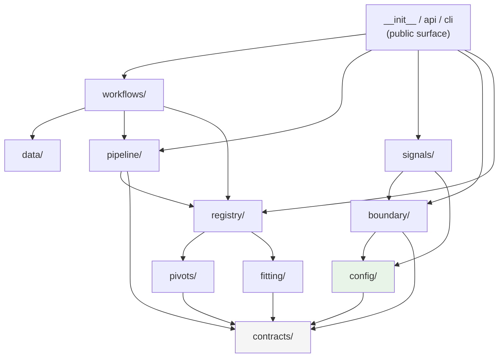
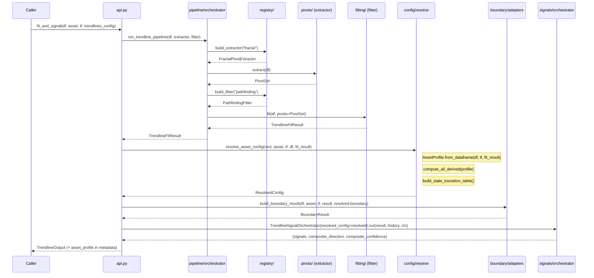
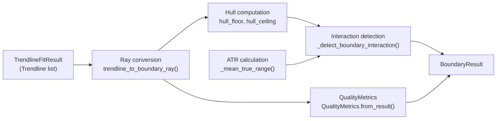
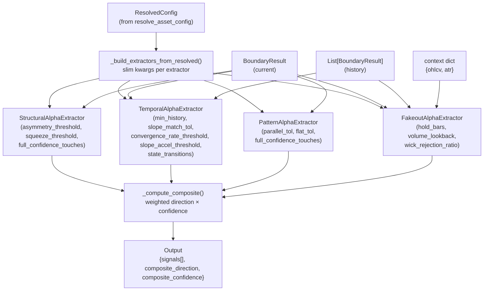
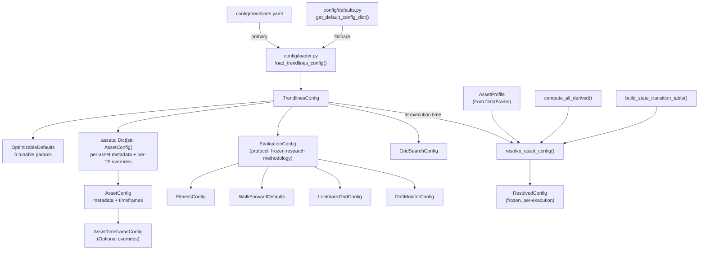

# Trendlines Architecture

## Layer Model

```
┌─────────────────────────────────────────────────────┐
│  Public surface   __init__.py  api.py  cli.py        │
├─────────────────────────────────────────────────────┤
│  Workflows        workflows/  (optimization, drift)  │
├──────────────────────────┬──────────────────────────┤
│  Data pipeline   data/   │  Signals    signals/      │
├──────────────────────────┤                           │
│  Boundary        boundary/│                           │
├──────────────────────────┴──────────────────────────┤
│  Pipeline orchestration   pipeline/                  │
├─────────────────────────────────────────────────────┤
│  Registry                 registry/                  │
├───────────────────────────────┬─────────────────────┤
│  Pivots          pivots/      │  Fitting  fitting/   │
├───────────────────────────────┴─────────────────────┤
│  Config          config/                             │
├─────────────────────────────────────────────────────┤
│  Contracts       contracts/                          │
└─────────────────────────────────────────────────────┘
```

## Point-in-Time Identity

`contracts/identity.py` is the shared identity seam. It canonicalises source values, computes
source/config/checkpoint/content/revision SHA-256 IDs, and maps extractor finality to snapshot
finality. Pipeline and facade stages depend on this seam; boundary and history only carry typed
identity contracts. No stage re-hashes the source frame.

Component identity uses canonical registry names and resolved parameters for named components,
constructor state for built-in dataclass components, and the explicit
`trendline_identity_payload()` protocol for custom components. Unsupported values fail closed;
identity never falls back to `repr()`, `str()` of arbitrary objects, process hashes, or memory
addresses.

Source identity is either `COMPUTED` from model-visible frame content or `PROVIDED` by an upstream
manifest after horizon/column validation. `as_of` is always the last supplied frame row. History
ordering and revision replacement are intentionally deferred to L1-B2.

## Dependency Graph



**Key rule:** Arrows point in the direction of import. No arrow may reverse direction. The
`contracts/` and `config/` layers sit at the bottom; nothing in them imports from layers above.

## Dependency Rules (Enforcement)

These rules are AST-enforced by 15 test functions in
`app/trendlines/tests/test_import_boundaries.py`.

| Layer | May import from | May NOT import from |
|-|-|-|
| `contracts/` | stdlib, numpy, pandas | everything in trendlines |
| `config/` | `contracts/`, stdlib | `registry/`, `pipeline/`, `fitting/`, `pivots/`, `signals/`, `boundary/`, `workflows/` |
| `pivots/` | `contracts/`, `config/` | `fitting/`, `registry/`, `pipeline/`, `boundary/`, `signals/` |
| `fitting/` | `contracts/`, `config/` | `registry/`, `pipeline/`, `boundary/`, `signals/` |
| `registry/` | `pivots/`, `fitting/`, `contracts/` | `pipeline/`, `boundary/`, `signals/`, `workflows/` |
| `pipeline/` | `registry/`, `contracts/`, `config/` | `boundary/`, `signals/`, `workflows/` |
| `boundary/` | `contracts/`, `config/` | `signals/`, `registry/`, `pipeline/`, `workflows/` |
| `signals/` | `boundary/`, `config/` | `data/`, `pivots/`, `fitting/`, `contracts/`, `registry/`, `pipeline/`, `workflows/` |
| `data/` | `contracts/`, `config/`, stdlib | `pivots/`, `fitting/`, `registry/`, `pipeline/`, `workflows/` |
| `workflows/` | `data/`, `pipeline/`, `registry/`, `config/` | `app.alpha`, `signals/` (directly) |
| any module | — | `app.alpha`, geometry compatibility code |

## Full Pipeline Flow



## BoundaryResult Internal Flow



## Signal Aggregation Flow



## Config Hierarchy



## Canonical Seams

These are the stable integration points. Prefer these over importing internals.

| Operation | Function / Class |
|-|-|
| Build extractor | `build_extractor(name, **kwargs)` |
| Build fitter | `build_fitter(name, **kwargs)` |
| Run extract→fit | `run_trendline_pipeline(df, extractor, fitter, ...)` |
| Run from config | `execute_trendline_pipeline(df, config)` |
| **Resolve config** | `resolve_asset_config(root, asset, tf, df, fit_result)` → `ResolvedConfig` |
| Adapt to boundary | `build_boundary_result_from_trendline_result(df, asset, tf, result, config)` |
| Run native signals | `TrendlineSignalOrchestrator(resolved_config=...).run(result, history, ctx)` |
| Full facade | `fit_and_signal(df, asset, tf, trendlines_config=...)` → `TrendlineOutput` |
| Resolve auto-split | `resolve_trendline_auto_split_spec(timeframe, asset_class, ...)` |
| Build temporal manifest | `build_temporal_split_manifest(spec, n_bars)` |
| Promote optimization result | `apply_pipeline_optimization_to_config(result, base_config)` |
| **Optimize params** | `optimize_trendlines(df, asset, tf, config)` → `TrendlinesOptimizationResult` |

## Optimization Layer

The `optimization/` submodule provides Bayesian hyperparameter optimization
(Optuna TPE + walk-forward CV) for the 5 optimizable params plus component
search grids.

**Two-stage design:**

1. **Trendlines optimization** (this module) — optimizes **geometric quality**:
   how well trendlines fit, survive, and predict touch reactions.
2. **Alpha optimization** (`app/alpha/optimization/`) — optimizes **trade quality**
   using pre-optimized trendline params as fixed inputs.

**Architecture:**

```
optimization/
  __init__.py          # Public exports
  models.py            # Config, Results, Weights, Trial dataclasses
  optimizer.py         # TrendlinesOptimizer (Optuna TPE + WF-CV)
  oscillator.py        # OscillatorOptimizationConfig + oscillator pipeline factory
  walk_forward.py      # WalkForwardValidator (delegates to data/temporal)
  benchmarks/
    _tolerance.py      # Shared ATR-based penetration tolerance: max(|slope|×tol, ATR×frac)
    longevity.py       # Tier 1: Line survival ratio (35%)
    touch_accuracy.py  # Tier 2: Touch-reaction accuracy (25%)
    penetration_gate.py# Tier 3: Penetration rate (GATE)
    pivot_density.py   # Tier 4: Pivot density per 100 bars (CONSTRAINT)
    fold_stability.py  # Tier 5: Cross-fold variance (15%)
```

**Fitter selection:** The optimizer injects `config.fitter` (default `"ensemble"`) into
every trial's params. The ensemble fitter runs all 3 sub-fitters on the same pivots,
deduplicates by slope/intercept similarity, and yields up to 6 lines per fold.

**Oscillator optimization:** `OscillatorOptimizationConfig` extends the base config
with oscillator-appropriate search ranges and walk-forward windows. The oscillator
pipeline factory also uses the ensemble fitter.

**Objective formula:**

```
score = (w1·longevity + w2·touch_accuracy + w5·fold_stability)
        × gate_mult(pen_rate)
        × constraint_mult(pivot_density)
```

## Design Rules

1. Keep extractor logic separate from fitter logic. Never move pivot extraction back into fitters.
2. Keep native trendline signals (`signals/`) separate from downstream cross-domain confluence
   (`app/alpha/`). Never import from `app.alpha` inside `app/trendlines/`.
3. Prefer small decorator-registered plugins over direct construction scattered across files.
   Register new extractors with `@register_extractor(...)` and fitters with `@register_fitter(...)`.
4. Keep optimization search grids attached to the registered component surface (via
   `register_extractor(..., search_grid=[...])`) rather than hardcoding them in workflow logic.
5. Keep data contracts deterministic, replayable, and free of connector-specific behavior.
6. All layers must be independently importable. No circular imports.
7. Enforce layer direction with `app/trendlines/tests/test_import_boundaries.py`.
