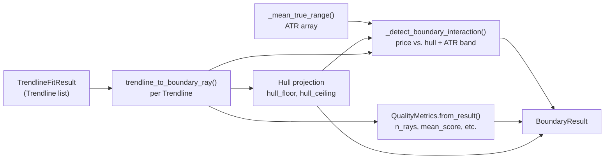

# Boundary

The boundary layer converts the raw output of a trendline fitter (`TrendlineFitResult`) into a
structured, geometry-annotated snapshot (`BoundaryResult`) that downstream consumers — the signal
layer and `app/alpha/` — can reason about without knowing anything about pivot indices or fitting
algorithms.

## Overview



## Contracts

### Ray (`boundary/contracts.py`)

A trendline projected into timestamp + price space, suitable for rendering and consumer use.

| Field | Type | Description |
|-|-|-|
| `start_time` | `pd.Timestamp` | Timestamp at line start bar |
| `end_time` | `pd.Timestamp` | Timestamp at line end bar |
| `start_price` | `float` | Price value at start |
| `end_price` | `float` | Price value at end |
| `slope` | `float` | Price change per bar (`slope_per_bar` property alias) |
| `intercept` | `float` | Linear intercept: `value_at(bar) = slope × bar + intercept` |
| `touch_count` | `int` | Effective touch count (after declustering) |
| `is_support` | `bool` | True = support, False = resistance |
| `kernel` | `str` | Source identifier, e.g. `"trendlines:pathfinding"` |
| `score` | `float` | Fitter quality score (higher = better) |
| `r_squared` | `float` | R² of the fitted line |
| `metadata` | `dict` | `raw_touch_count`, `effective_touch_count`, source, extractor |

Methods:
- `value_at(bar_index: float) -> float` — evaluates the line equation
- `project(bars_ahead: int) -> float` — forward projection from `end_price`
- `to_dict()` — full serialization (timestamps → ISO strings)

Properties: `slope_per_bar` (alias for `slope`), `raw_touch_count`, `effective_touch_count`.

### QualityMetrics (`boundary/contracts.py`)

Aggregate quality of the boundary snapshot.

| Field | Type | Description |
|-|-|-|
| `n_support_rays` | `int` | Active support ray count |
| `n_resistance_rays` | `int` | Active resistance ray count |
| `mean_score` | `float` | Average score across all rays |
| `mean_touch_count` | `float` | Average effective touch count |
| `mean_r_squared` | `float` | Average R² |
| `hull_width_atr` | `float` | `(hull_ceiling - hull_floor) / mean_ATR` |

Computed by `QualityMetrics.from_result(support_rays, resistance_rays, hull_floor, hull_ceiling, mean_atr)`.
All fields rounded (score: 4dp, touch_count: 2dp, r_squared: 4dp, hull_width: 4dp).

### BoundaryResult (`boundary/contracts.py`)

The primary output of the boundary layer.

| Field | Type | Description |
|-|-|-|
| `asset` | `str` | Asset identifier (e.g. `"BTCUSDT"`) |
| `timeframe` | `str` | Timeframe (e.g. `"1h"`) |
| `timestamp` | `datetime` | Snapshot time (last bar timestamp) |
| `active_support_rays` | `List[Ray]` | All fitted support rays |
| `active_resistance_rays` | `List[Ray]` | All fitted resistance rays |
| `convex_hull_floor` | `float` | Max support ray value at current bar (`np.nan` if none) |
| `convex_hull_ceiling` | `float` | Min resistance ray value at current bar (`np.nan` if none) |
| `interaction` | `str` | Current interaction label (see below) |
| `is_valid` | `bool` | True when both support and resistance rays exist |
| `quality_metrics` | `QualityMetrics \| None` | Aggregate quality snapshot |
| `metadata` | `dict` | Source, adapter config, trendline method |

Properties:
- `best_support` → `Ray` with max score from `active_support_rays`, or `None`
- `best_resistance` → `Ray` with max score from `active_resistance_rays`, or `None`

## Interaction Labels

| Label | Condition |
|-|-|
| `"STRUCTURAL_BREAKDOWN"` | `close < hull_floor - tolerance` |
| `"STRUCTURAL_BREAKOUT"` | `close > hull_ceiling + tolerance` |
| `"GEOMETRIC_BOUNCE_SUPPORT"` | `close ≈ best_support.value_at(bar)` within tolerance |
| `"GEOMETRIC_BOUNCE_RESISTANCE"` | `close ≈ best_resistance.value_at(bar)` within tolerance |
| `"NONE"` | No specific interaction |

Tolerance = `interaction_tolerance_atr × mean_ATR` (default: `0.25 × ATR`).

Direction mapping (`BOUNDARY_INTERACTION_DIRECTION`):

| Interaction | Direction |
|-|-|
| `GEOMETRIC_BOUNCE_SUPPORT` | +1.0 |
| `STRUCTURAL_BREAKOUT` | +1.0 |
| `GEOMETRIC_BOUNCE_RESISTANCE` | -1.0 |
| `STRUCTURAL_BREAKDOWN` | -1.0 |
| `"NONE"` | 0.0 |

## Adapter (`boundary/adapters.py`)

### `trendline_to_boundary_ray(line, index, extractor_name, kernel_prefix) -> Ray`

Converts one `Trendline` into a `Ray`.

```
method = line.method or "line"
kernel = f"{kernel_prefix}:{method}"    # e.g. "trendlines:pathfinding"

start_time = index[line.start_index]    # pd.DatetimeIndex lookup
end_time   = index[line.end_index]
start_price = line.value_at(line.start_index)
end_price   = line.value_at(line.end_index)
```

The `kernel` field is used by the signal layer for ray persistence matching (same kernel = same
logical line across snapshots).

### `build_boundary_result_from_trendline_result(df, asset, timeframe, trendline_result, trendline_config, ...) -> BoundaryResult`

Full adapter pipeline:

```
1. Validate df (DatetimeIndex, OHLC columns, non-empty)
2. Resolve config params:
     interaction_tolerance_atr ← trendlines_config.boundary or explicit param
     atr_window                ← trendlines_config.boundary or explicit param
3. Convert each support/resistance Trendline → Ray via trendline_to_boundary_ray()
4. Compute hull:
     hull_floor   = max(ray.value_at(last_bar) for ray in support_rays)
     hull_ceiling = min(ray.value_at(last_bar) for ray in resistance_rays)
5. Compute ATR array = _mean_true_range(df, window=atr_window)
6. Detect interaction = _detect_boundary_interaction(price, support, resistance, hull, atr)
7. Build QualityMetrics.from_result(...)
8. Return BoundaryResult
```

## Touch Declustering (`boundary/touches.py`)

### TouchDeclusterConfig

| Field | Default | Description |
|-|-|-|
| `min_bars_between_touches` | `0` | Minimum gap in bars between counted touches |

### TouchDiagnostics

| Field | Type | Description |
|-|-|-|
| `raw_touch_count` | `int` | Total raw touch indices before declustering |
| `effective_touch_count` | `int` | Touch count after gap enforcement |
| `raw_touch_indices` | `tuple[int, ...]` | All detected touches |
| `effective_touch_indices` | `tuple[int, ...]` | Retained touches after gap |
| `min_bars_between_touches` | `int` | Gap used |

### `decluster_touch_indices(indices, config, min_bars_between_touches) -> TouchDiagnostics`

Greedy declustering: sorts indices, then greedily keeps only those where
`index - last_kept ≥ min_bars_between_touches`. Returns `TouchDiagnostics`.

```python
from app.trendlines.boundary import TouchDeclusterConfig, decluster_touch_indices

diag = decluster_touch_indices(
    indices=[0, 1, 2, 10, 11, 20],
    config=TouchDeclusterConfig(min_bars_between_touches=3),
)
# diag.effective_touch_indices = (0, 10, 20)
# diag.effective_touch_count = 3
```

Used by `app/indicators/fractal_channel.py` to deduplicate touch points before line scoring.

## Confluence Gate (`boundary/policy.py`)

### ConfluenceGateConfig

Controls whether the `app/alpha/` confluence layer gates trendline signals on oscillator agreement.
This config object is consumed by `signals/quality.py` and `app/alpha/_runtime/confluence.py`.

| Field | Default | Description |
|-|-|-|
| `operating_mode` | `"coarse_gate"` | One of: `coarse_gate`, `soft_weight`, `score_only` |
| `enabled` | `False` | Whether the gate is active |
| `apply_to_interactions` | `()` | Interaction labels the gate applies to (empty = all) |
| `min_agreement_ratio` | `0.5` | Fraction of oscillators that must agree |
| `min_agreeing_oscillators` | `1` | Minimum count of agreeing oscillators |
| `threshold_mode` | `"absolute"` | One of: `absolute`, `quantile` |
| `min_price_support_score` | `0.0` | Score threshold for support direction gate |
| `min_price_resistance_score` | `0.0` | Score threshold for resistance direction gate |

Method: `applies_to(interaction: str) -> bool` — True when enabled and interaction matches.

| Mode | Behavior when gate passes |
|-|-|
| `coarse_gate` | `base + scale × agreement_ratio` (ignores quality_score) |
| `soft_weight` | Blends agreement ratio with quality_score |
| `score_only` | Returns quality_score directly, ignores oscillator count |

### RayTrackerConfig

Optional config for tracking ray persistence across snapshots (used by `app/alpha/` ray tracker).

| Field | Default | Description |
|-|-|-|
| `enabled` | `False` | Activate tracking |
| `slope_tolerance` | `0.0` | Slope match tolerance |
| `level_distance_atr` | `0.0` | Max ATR distance for level match |
| `max_gap_bars` | `0` | Max bars between appearances before tracking resets |
