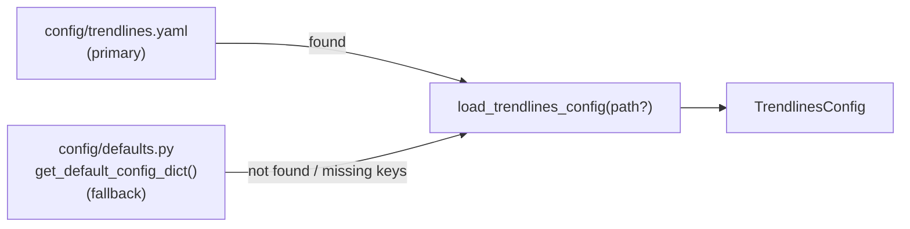
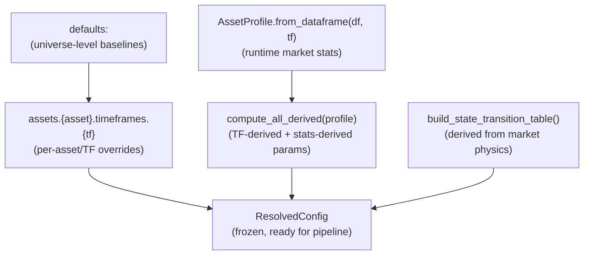
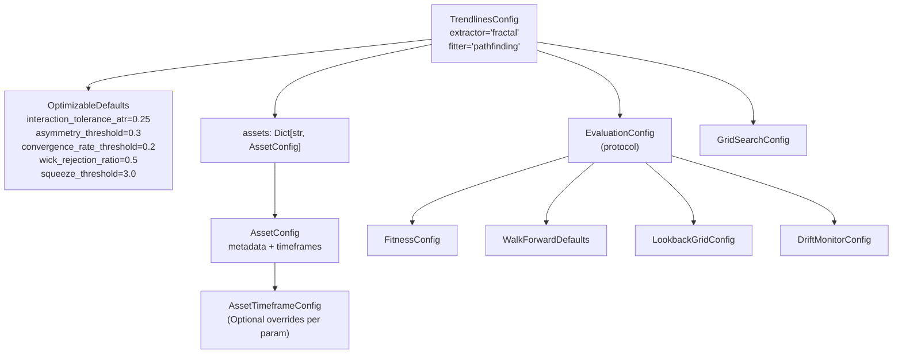

# Config

The config layer provides a fully typed, frozen, hashable, and serializable configuration tree
for trendlines. Parameters are organized into four tiers:

| Tier | Where | Optimized? | Example |
|-|-|-|-|
| **Hardcoded** | Module-level constants in signal extractors | Never | `_SCORE_BLEND_WEIGHT = 0.6` |
| **Derived** | Computed at runtime from `AssetProfile` | Never | `hold_bars`, `atr_window`, `parallel_tol` |
| **Optimizable** | `trendlines.yaml` under `defaults:` and `assets:` | Per-asset/TF | `interaction_tolerance_atr` |
| **Protocol** | `trendlines.yaml` under `protocol:` | Never | `walk_forward`, `fitness` |

## Loading



```python
from app.trendlines.config import load_trendlines_config, TrendlinesConfig

cfg = load_trendlines_config()       # Load from default YAML
cfg = load_trendlines_config("/path/to/custom.yaml")

# Construct programmatically
cfg = TrendlinesConfig()
```

## Config Resolution Flow

For a given `(asset, timeframe)` pipeline execution, params are resolved in order:



```python
from app.trendlines.config import load_trendlines_config, resolve_asset_config

cfg = load_trendlines_config()
resolved = resolve_asset_config(cfg, asset="BTCUSDT", timeframe="1h", df=df, fit_result=fit_result)
# resolved.signals, resolved.boundary, resolved.profile are all populated
```

## Full Config Hierarchy



## TrendlinesConfig (root)

**File:** `config/base_config.py`

| Field | Type | Default | Description |
|-|-|-|-|
| `extractor` | `str` | `"fractal"` | Default extractor registry name |
| `fitter` | `str` | `"pathfinding"` | Default fitter registry name |
| `defaults` | `OptimizableDefaults` | see below | Universe-level baselines for optimizable params |
| `assets` | `Dict[str, AssetConfig]` | `{}` | Per-asset metadata + per-TF overrides |
| `protocol` | `EvaluationConfig` | `EvaluationConfig()` | Frozen research methodology |
| `search_grids` | `GridSearchConfig` | `GridSearchConfig()` | Component sweep grids |
| `signal_default_weight` | `float` | `1.0` | Default signal aggregation weight |
| `signal_weights` | `Dict[str, float]` | `{}` | Per-extractor weight overrides |

## OptimizableDefaults

**File:** `config/base_config.py`

The 5 genuinely tunable params. These are the universe-level baselines.

| Field | Default | Controls | Tier |
|-|-|-|-|
| `interaction_tolerance_atr` | `0.25` | Boundary touch-zone width (ATR units) | Per-asset/TF |
| `asymmetry_threshold` | `0.3` | Min combined asymmetry for sr_asymmetry signal | Per-universe |
| `convergence_rate_threshold` | `0.2` | Hull convergence speed for temporal signal | Per-universe |
| `wick_rejection_ratio` | `0.5` | Min wick/ATR for fakeout wick rejection | Per-universe |
| `squeeze_threshold` | `3.0` | Hull width (ATR) below which squeeze fires | Per-universe |

## AssetConfig & AssetTimeframeConfig

**File:** `config/base_config.py`

| Dataclass | Field | Type | Description |
|-|-|-|-|
| `AssetConfig` | `metadata` | `Dict[str, Any]` | Asset classification: `{asset_class, universe, exchange}` |
| | `timeframes` | `Dict[str, AssetTimeframeConfig]` | Per-TF optimized overrides |
| `AssetTimeframeConfig` | 5 Optional fields | `float \| None` | Same names as OptimizableDefaults. `None` = use default |

Example YAML:
```yaml
assets:
  BTCUSDT:
    metadata:
      asset_class: crypto
      universe: major
      exchange: binance
    timeframes:
      1h:
        interaction_tolerance_atr: 0.25
      4h:
        interaction_tolerance_atr: 0.20
```

## AssetProfile (runtime)

**File:** `config/asset_profile.py`

Computed once from the DataFrame at the facade entrypoint. Fails loud if data is insufficient.

| Field | Type | Computed from |
|-|-|-|
| `tf_minutes` | `int` | Timeframe string |
| `bar_duration_hours` | `float` | `tf_minutes / 60` |
| `mean_atr` | `float` | Rolling ATR of OHLC |
| `mean_price` | `float` | Mean close price |
| `n_bars` | `int` | DataFrame length |
| `median_touch_count` | `float` | Fit result lines (0.0 if unavailable) |
| `mean_slope_abs` | `float` | Mean absolute slope (0.0 if unavailable) |
| `slope_diff_std` | `float` | Std of slope diffs (0.0 if unavailable) |
| `hull_width_atr_p20` | `float` | 20th percentile hull width (0.0 if unavailable) |

## ResolvedConfig

**File:** `config/resolve.py`

Frozen config for a single `(asset, timeframe)` execution. Built by `resolve_asset_config()`.

| Field | Type | Description |
|-|-|-|
| `extractor` | `str` | Pipeline extractor |
| `fitter` | `str` | Pipeline fitter |
| `signals` | `ResolvedSignalConfig` | All signal params (optimizable + derived) |
| `boundary` | `BoundaryAdapterConfig` | Boundary params (resolved) |
| `protocol` | `EvaluationConfig` | Frozen research methodology |
| `search_grids` | `GridSearchConfig` | Component grids |
| `profile` | `AssetProfile` | Runtime asset stats |
| `asset` | `str` | Resolved asset name |
| `timeframe` | `str` | Resolved timeframe |
| `asset_metadata` | `Dict` | Asset classification from config |

## ResolvedSignalConfig

**File:** `config/resolve.py`

| Field | Source | Default | Description |
|-|-|-|-|
| `asymmetry_threshold` | Optimizable | `0.3` | Min asymmetry for signal |
| `squeeze_threshold` | Optimizable | `3.0` | Hull squeeze threshold |
| `convergence_rate_threshold` | Optimizable | `0.2` | Convergence speed threshold |
| `wick_rejection_ratio` | Optimizable | `0.5` | Wick rejection threshold |
| `min_history` | Derived | `3` | Min bars of history for temporal |
| `slope_match_tol` | Derived | `0.05` | Slope matching tolerance |
| `slope_accel_threshold` | Derived | `0.01` | Slope acceleration gate |
| `hold_bars` | Derived | `3` | Fakeout lookback bars |
| `volume_lookback` | Derived | `20` | Volume z-score lookback |
| `parallel_tol` | Derived | `0.02` | Parallel channel tolerance |
| `flat_tol` | Derived | `0.01` | Flat line tolerance |
| `full_confidence_touches_structural` | Derived | `5.0` | Structural touch normalizer |
| `full_confidence_touches_pattern` | Derived | `8.0` | Pattern touch normalizer |
| `state_transitions` | Derived | 14 entries | State transition table |

## Derived Params

**File:** `config/derive.py`

All derivation functions are pure: `AssetProfile → number`. Called by `resolve_asset_config()`.

| Function | Input | Target wall-clock | Description |
|-|-|-|-|
| `derive_hold_bars` | `tf_minutes` | 3h | Fakeout hold window in bars |
| `derive_volume_lookback` | `tf_minutes` | 20h | Volume z-score lookback |
| `derive_min_history` | `tf_minutes` | 6h | Temporal min history depth |
| `derive_atr_window` | `tf_minutes` | 14 days | ATR rolling window |
| `derive_consecutive_penetration_bars` | `tf_minutes` | 3h | Walk-forward penetration bars |
| `derive_forward_lookahead_bars` | `tf_minutes` | 3h | Touch reaction confirmation |
| `derive_parallel_tol` | `mean_atr / mean_price` | — | ATR-normalized slope tolerance |
| `derive_flat_tol` | `mean_atr / mean_price` | — | ATR-normalized flat tolerance |
| `derive_full_confidence_touches` | `median_touch_count` | — | Touch count normalizer |
| `derive_slope_match_tol` | `mean_slope_abs` | — | Ray persistence tolerance |
| `derive_slope_accel_threshold` | `slope_diff_std` | — | Acceleration gate |

## State Transitions (derived)

**File:** `config/state_transitions.py`

The 14-entry `{(from, to): (direction, confidence)}` table is derived from:
1. `INTERACTION_DIRECTION` — market physics (a bounce off support is always bullish)
2. Three archetype confidences: `conf_reversal=0.85`, `conf_continuation=0.65`, `conf_fade=0.45`

`build_state_transition_table()` computes direction algebraically and classifies each pair
into reversal/continuation/fade. Replaces the 28-scalar `StateTransitionsConfig`.

## Protocol Config (frozen)

**File:** `config/evaluation_config.py`

Research methodology — set once, never optimized. Accessed via `TrendlinesConfig.protocol`.

### FitnessConfig

| Field | Default | Controls |
|-|-|-|
| `slope_tolerance` | `0.25` | Multiplier for slope-based penetration tolerance |
| `min_tolerance_atr_frac` | `0.1` | ATR-based floor for penetration tolerance (10% of ATR) |
| `consecutive_penetration_bars` | `3` | Bars before line expiry |
| `forward_lookahead_bars` | `3` | Touch reaction confirmation |
| `touch_accuracy_floor` | `0.01` | Min accuracy before fitness → 0 |
| `pivot_count_min` | `5` | Absolute minimum pivots (safety floor) |
| `pivot_density_min` | `2.0` | Density (pivots/100bars) below which score = 0 |
| `pivot_density_optimal_lo` | `8.0` | Start of optimal density range |
| `pivot_density_optimal_hi` | `25.0` | Peak of optimal density range |
| `line_count_penalty_threshold` | `6` | Lines above → penalty |
| `line_count_penalty_factor` | `0.1` | Penalty per line |

### WalkForwardDefaults

| Field | Default |
|-|-|
| `train_bars` | `2160` (~90 days at 1h) |
| `test_bars` | `720` (~30 days at 1h) |
| `step_bars` | `720` |
| `purge_bars` | `24` (embargo gap) |

### TrendlinesOptimizationConfig

**File:** `optimization/models.py`

Key fields beyond the search space ranges:

| Field | Default | Description |
|-|-|-|
| `fitter` | `"ensemble"` | Fitter injected into every trial fold. The ensemble pools 3 sub-fitters for 6 lines/fold |
| `max_penetration_rate` | `0.55` | Per-fold pen gate threshold |
| `min_tolerance_atr_frac` | `0.1` | ATR floor for penetration tolerance |
| `lookback_fractions` | `(0.3, 0.5, 0.7, 1.0)` | Categorical search space for train-window fraction |
| `density_min` | `2.0` | Density (pivots/100bars) below which constraint fails |
| `density_optimal_lo` | `8.0` | Start of optimal density range |
| `density_optimal_hi` | `25.0` | End of optimal density range |

### OscillatorOptimizationConfig

**File:** `optimization/oscillator.py`

Extends `TrendlinesOptimizationConfig` with oscillator-appropriate defaults:

| Field | Default | Difference from price |
|-|-|-|
| `interaction_tolerance_atr` | `(0.5, 3.0)` | Wider range — oscillator ATR is small |
| `train_bars` | `500` | Smaller windows (oscillator data is denser) |
| `test_bars` | `150` | |
| `step_bars` | `150` | |

Signal params (asymmetry, convergence, wick, squeeze) are fixed at defaults — not optimized for oscillators.
| `min_train_bars` | `1440` |

### LookbackGridConfig

| Field | Default |
|-|-|
| `fractions` | `(0.4, 0.6, 0.8)` |
| `min_bars` | `20` |

### DriftMonitorConfig

| Field | Default |
|-|-|
| `threshold` | `0.15` |

## GridSearchConfig (`config/search_grid_config.py`)

| Config | Fields |
|-|-|
| `FractalSearchGrid` | `left_windows=(3,5,7,10)`, `right_windows=(3,5,7,10)` |
| `RDPSearchGrid` | `epsilon_atr_values=(0.2,0.3,0.5,0.8,1.0)`, `min_segment_bars_values=(1,3,5)` |
| `PathfindingSearchGrid` | `pivot_windows=(2,3,5)` |
| `LeastSquaresSearchGrid` | `pivot_windows=(2,3,5)`, `residual_thresholds=(0.3,0.5,0.8)` |
| `RansacSearchGrid` | `pivot_windows=(2,3)`, `residual_thresholds=(0.3,0.5)`, `max_cut_fractions=(0.1,0.2)` |

## Overriding Config

```python
from dataclasses import replace
from app.trendlines.config import TrendlinesConfig, OptimizableDefaults

cfg = replace(
    TrendlinesConfig(),
    extractor="rdp_zigzag",
    defaults=replace(OptimizableDefaults(), squeeze_threshold=2.0),
)
```

## Hardcoded Constants (in signal modules, not in config)

The following are architecture constants embedded as module-level `_CONST` values:

| Module | Constants |
|-|-|
| `signals/structural.py` | `_BASE_INTERACTION_CONFIDENCE`, `_SCORE_BLEND_WEIGHT`, `_STRUCTURAL_INTERACTION_MULTIPLIER`, `_SQUEEZE_CONFIDENCE_LO/HI`, `_SCORE_DIFF_THRESHOLD`, `_SQUEEZE_DIRECTION_NUDGE` |
| `signals/temporal.py` | `_CONVERGENCE_CONF_LO/HI`, `_PERSISTENCE_DIFF_THRESHOLD`, `_PERSISTENCE_CONF_LO/SPAN`, `_SLOPE_ACCEL_BASE/MULT` |
| `signals/patterns.py` | `_QUALITY_WEIGHT`, `_BLEND_BASE/QUALITY/TOUCH` |
| `signals/quality.py` | `_PRICE_BLEND_W`, `_AGREEING_BLEND_W`, `_CONF_AGREEMENT_BASE/SCALE`, `_OSC_WEIGHTS` (pending hardcode) |
