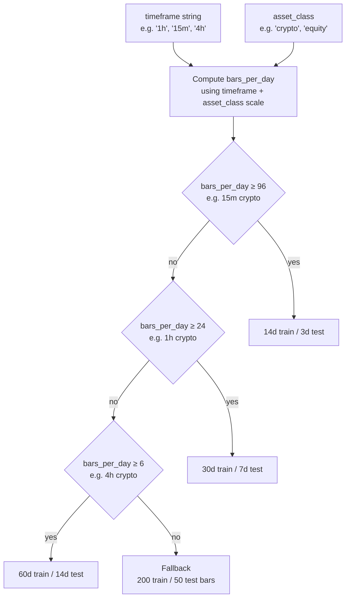

# Data

The data layer (`app/trendlines/data/`) owns source-agnostic dataset contracts, walk-forward
temporal split policies, and deterministic artifact persistence. It has no knowledge of specific
data sources, fitting algorithms, or signals.

## Design Principles

- **Source-agnostic**: Data contracts describe what is needed, not where it comes from.
  Loaders are injected at runtime via `load_dataset(...)`.
- **Deterministic**: Every split and manifest is hashed so replays produce identical results.
- **Geometry-free**: No pivot, fitting, or signal imports anywhere in this layer.

## Dataset Contracts (`data/contracts.py`)

### TrendlineDataRequest

Describes a dataset selection request.

| Field | Type | Default | Description |
|-|-|-|-|
| `asset` | `str` | — | Asset identifier (e.g. `"BTCUSDT"`) |
| `timeframes` | `tuple[str, ...]` | — | Timeframe identifiers (e.g. `("1h", "4h")`) |
| `source` | `str` | `"binance"` | Data source connector name |
| `lookback_days` | `int \| None` | `None` | Rolling lookback window |
| `start_date` | `str \| None` | `None` | ISO date string |
| `end_date` | `str \| None` | `None` | ISO date string |
| `price_fields` | `tuple[str,...]` | `("open","high","low","close")` | OHLC column names |

### TrendlineDatasetManifest

Resolved dataset identity — frozen snapshot of what was actually loaded.

| Field | Type | Description |
|-|-|-|
| `request` | `TrendlineDataRequest` | Original request |
| `bar_counts` | `dict[str, int]` | `{timeframe: n_bars}` for each loaded timeframe |
| `columns` | `tuple[str, ...]` | Actual columns in the loaded data |
| `artifact_ref` | `TrendlineArtifactRef \| None` | Where results are persisted |
| `manifest_hash` | `str` | SHA-256 hash of request + bar_counts for deterministic replay |

### TrendlineArtifactRef

Reference to a persisted artifact.

| Field | Type | Description |
|-|-|-|
| `artifact_root` | `str` | Base directory for artifact storage |
| `relative_path` | `str` | Path relative to root |
| `label` | `str` | Human-readable artifact label |
| `content_type` | `str` | e.g. `"application/json"` |
| `semantics_version` | `str` | Versioning tag (e.g. `"2026-04-08-v1"`) |

## Temporal Splits (`data/temporal.py`)

Walk-forward cross-validation splits the dataset into non-overlapping train/test folds with
an embargo (purge) gap between them.

### WalkForwardSplit

A single fold.

| Field | Type | Description |
|-|-|-|
| `fold_id` | `int` | Zero-based fold index |
| `train_start` | `int` | Inclusive start bar of training window |
| `train_end` | `int` | Exclusive end bar of training window |
| `test_start` | `int` | Inclusive start bar of test window (after purge) |
| `test_end` | `int` | Exclusive end bar of test window |

### WalkForwardValidator

Generates the sequence of splits for a dataset of length `n_bars`.

```python
from libs.models.trendlines.data.temporal import WalkForwardValidator

validator = WalkForwardValidator(
    train_bars=2160,    # ~90 days at 1h
    test_bars=720,      # ~30 days at 1h
    step_bars=720,      # step forward by one test window per fold
    purge_bars=24,      # 1-day embargo between train end and test start
    min_train_bars=1440,
)

splits = validator.get_splits(n_bars=len(df))
for split in splits:
    train_df = df.iloc[split.train_start:split.train_end]
    test_df  = df.iloc[split.test_start:split.test_end]
```



```mermaid
gantt
    title Walk-Forward Fold Layout (conceptual)
    dateFormat X
    axisFormat %s

    section Fold 0
    Train    :0, 2160
    Purge    :crit, 2160, 2184
    Test     :2184, 2904

    section Fold 1
    Train    :720, 2880
    Purge    :crit, 2880, 2904
    Test     :2904, 3624
```

Default values (from `WalkForwardDefaults` in `config/evaluation_config.py`):

| Field | Default | Approx. at 1h |
|-|-|-|
| `train_bars` | `2160` | 90 days |
| `test_bars` | `720` | 30 days |
| `step_bars` | `720` | 30 days (non-overlapping) |
| `purge_bars` | `24` | 1 day embargo |
| `min_train_bars` | `1440` | 60 days minimum |

### Auto-Split Policy (`resolve_trendline_auto_split_spec`)

When train/test sizes are not specified, the system selects appropriate defaults based on the
asset's timeframe and asset class.



Asset class scaling factors: `crypto=1.0`, `equity=0.27` (trading hours only), `fx=1.0`,
`commodity=0.96`.

## Temporal Split Manifests

A `TemporalSplitManifest` is an immutable, hashable description of the full walk-forward split
used for a given optimization run.

```python
from libs.models.trendlines.data.temporal import build_temporal_split_manifest

manifest = build_temporal_split_manifest(spec=split_spec, n_bars=len(df))
# manifest.spec_hash — deterministic SHA-256 of (spec_params, n_bars)
# manifest.splits   — List[WalkForwardSplit]
```

Used by the optimization workflow to guarantee that re-running with the same manifest produces
identical train/test indices.

## Artifact Persistence (`data/artifacts.py`)

### `write_dataset_manifest(manifest, path) -> None`
### `read_dataset_manifest(path) -> TrendlineDatasetManifest`
### `write_temporal_split_manifest(manifest, path) -> None`

All persistence is JSON-based. Manifests round-trip cleanly via `to_dict()` / `from_dict()`.

```python
from libs.models.trendlines.data.artifacts import write_temporal_split_manifest, read_dataset_manifest

write_temporal_split_manifest(manifest, "/tmp/my_splits.json")
# Later:
loaded = read_dataset_manifest("/tmp/my_dataset_manifest.json")
```

## Data Fetchers (`data/fetchers.py`)

Injected loader contracts. These are **protocol definitions**, not concrete implementations.
Concrete loaders live in connector-specific packages outside `app/trendlines/`.

```python
class TrendlineDataLoader(Protocol):
    def load_dataset(
        self,
        request: TrendlineDataRequest,
    ) -> dict[str, pd.DataFrame]:
        """Returns {timeframe: DataFrame} for each requested timeframe."""
        ...
```

`load_dataset(...)` is the only connector-specific call in the pipeline. The manifest is built
from its output: `manifest = assemble_dataset_manifest(request, loaded_data)`.

## Workflow Integration

The data layer is consumed by the optimization workflow:

```
workflows/pipeline/workflow.py
    → resolve_trendline_auto_split_spec(timeframe, asset_class)
    → WalkForwardValidator(train_bars, test_bars, step_bars, purge_bars)
    → splits = validator.get_splits(n_bars)
    → For each split: train on split.train, evaluate on split.test
```

The `TrendlineDatasetManifest` is written to disk after each optimization run so the exact
dataset and splits used can be reproduced.
