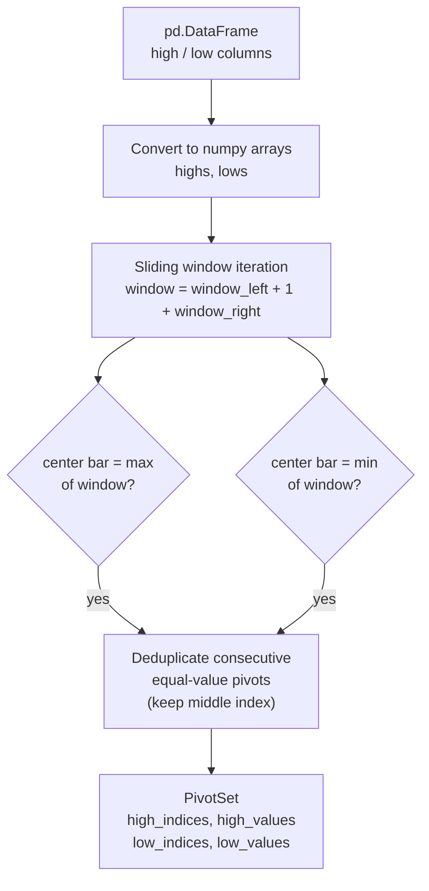
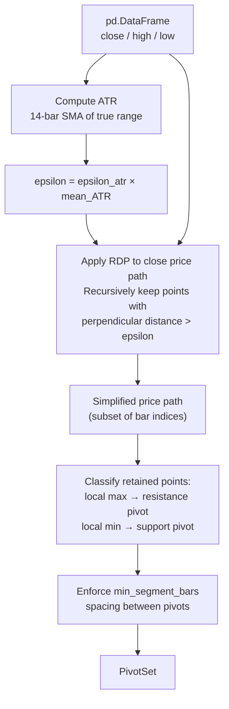

# Pivots

Pivot extractors convert raw OHLC price data into a `PivotSet` — the set of swing high and
swing low bar indices that fitters use as anchor points.

## Registry

```python
from libs.models.trendlines import build_extractor, list_extractors

list_extractors()   # ("fractal", "rdp_zigzag")

extractor = build_extractor("fractal", window_left=5, window_right=5)
pivot_set = extractor.extract(df)
```

## Adding a New Extractor

1. Create `src/libs/models/trendlines/pivots/my_extractor.py`
2. Implement and decorate:
   ```python
   from libs.models.trendlines.pivots.base import register_extractor
   from libs.models.trendlines.contracts import PivotSet

   @register_extractor(
       name="my_extractor",
       search_grid=[
           {"extractor": {"name": "my_extractor", "params": {"param": v}}}
           for v in (1, 2, 3)
       ],
   )
   class MyExtractor:
       def __init__(self, param: int = 2):
           self.param = param

       def extract(self, df: pd.DataFrame) -> PivotSet:
           ...
   ```
3. Import the module somewhere in `pivots/__init__.py` to trigger registration
4. Declare search grid in the decorator; the registry surfaces it to the workflow engine

## Extractor 1 — Fractal (`pivots/fractal.py`)

### Algorithm

Identifies local price extrema using a symmetric sliding window. This is the O(n) version of the
classic Williams Fractal indicator.



**Step-by-step:**

1. Convert `df["high"]` and `df["low"]` to NumPy arrays.
2. Iterate each bar `i` from `window_left` to `n - window_right - 1`.
3. **Swing high**: bar `i` is a high pivot if `high[i] == max(high[i-L : i+R+1])`.
4. **Swing low**: bar `i` is a low pivot if `low[i] == min(low[i-L : i+R+1])`.
5. **Deduplication**: consecutive bars sharing the same extreme value are collapsed to their
   midpoint index (avoids flat-top / flat-bottom duplicates). An equal-price run is emitted
   only after the run closes and its final member satisfies `window_right` confirmation.
6. Return `PivotSet` with separated high and low index arrays.

### Parameters

| Parameter | Default | Description |
|-|-|-|
| `window_left` | `3` | Bars to the left of the candidate bar |
| `window_right` | `3` | Bars to the right of the candidate bar |

Larger windows → fewer, more significant pivots. Smaller windows → more pivots, noisier lines.

### Finality and confirmation

An ordinary fractal pivot becomes available after `window_right` bars close to its right.
An equal-price plateau has an additional closure delay: the equal run must end first, then
the final plateau bar must satisfy the same `window_right` confirmation. Once emitted, fractal
pivots are append-only under future bar arrival. Completed plateaus retain the existing
midpoint representation, using the upper middle member for an even-sized group.

### Search Grid

```python
left_windows  = (3, 5, 7, 10)
right_windows = (3, 5, 7, 10)
# Cartesian product → 16 combinations
```

From `config/search_grid_config.py` → `FractalSearchGrid`. Exposed by `get_extractor_search_grid("fractal")`.

### Example

```python
extractor = build_extractor("fractal", window_left=5, window_right=3)
pivots = extractor.extract(df)
print(pivots.n_highs, pivots.n_lows)   # e.g. 8, 9
print(pivots.is_valid())               # True if >= 2 total pivots
```

## Extractor 2 — RDP Zigzag (`pivots/rdp_zigzag.py`)

### Algorithm

Uses the **Ramer-Douglas-Peucker (RDP)** path simplification algorithm scaled to ATR to
identify significant swing points. Unlike fractal, this adapts its sensitivity to current
volatility.



**RDP recursion detail:**

1. Start with the full close-price array as a polyline.
2. For each segment (start, end), find the bar with maximum perpendicular distance to the
   straight line between start and end.
3. If `max_distance > epsilon`: split the segment at that bar, recurse on both halves.
4. If `max_distance ≤ epsilon`: discard all intermediate points in the segment.
5. The retained points form a simplified representation of significant directional moves.

**ATR scaling:** `epsilon = epsilon_atr × mean_ATR`. Higher `epsilon_atr` → coarser simplification,
fewer pivots. Lower → finer, more pivots.

**Minimum segment spacing:** After RDP, adjacent pivots closer than `min_segment_bars` bars apart
are pruned (keeps the higher/lower extreme of each cluster).

### Parameters

| Parameter | Default | Description |
|-|-|-|
| `epsilon_atr` | `0.5` | RDP threshold as a multiple of ATR |
| `min_segment_bars` | `3` | Minimum bars between consecutive pivots |
| `atr_window` | `14` | Rolling window for ATR computation |

### Search Grid

```python
epsilon_atr_values      = (0.2, 0.3, 0.5, 0.8, 1.0)
min_segment_bars_values = (1, 3, 5)
# Cartesian product → 15 combinations
```

From `config/search_grid_config.py` → `RDPSearchGrid`.

### Comparison vs. Fractal

| Aspect | Fractal | RDP Zigzag |
|-|-|-|
| Complexity | O(n × window) | O(n log n) amortized |
| Volatility adaptation | No — fixed window | Yes — epsilon scales with ATR |
| Noise sensitivity | Sensitive to equal-value pivots | Robust — uses geometric distance |
| Typical use | Short to medium windows | Medium to long lookbacks |

## PivotSet Contract

Defined in `contracts/contracts.py`.

```python
@dataclass
class PivotSet:
    high_indices: np.ndarray   # shape (n_highs,), dtype=int64
    high_values:  np.ndarray   # shape (n_highs,), dtype=float64
    low_indices:  np.ndarray   # shape (n_lows,),  dtype=int64
    low_values:   np.ndarray   # shape (n_lows,),  dtype=float64

    @property
    def n_highs(self) -> int: ...
    @property
    def n_lows(self) -> int: ...
    @property
    def total_pivots(self) -> int: ...
    def is_valid(self, min_pivots: int = 2) -> bool: ...
```

Extractors must always return a `PivotSet` — even on edge cases. An empty `PivotSet` (zero
highs and lows) is valid output; fitters handle graceful degradation downstream.
