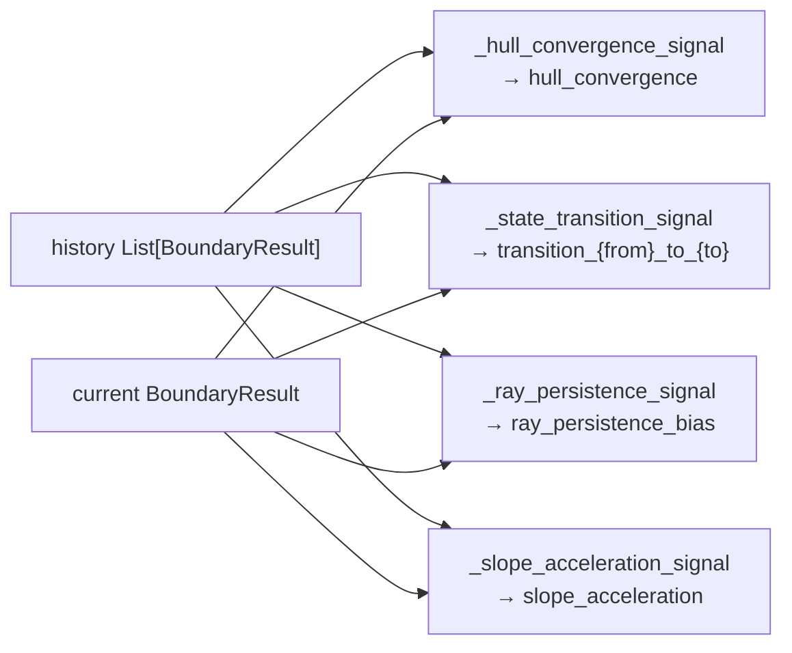
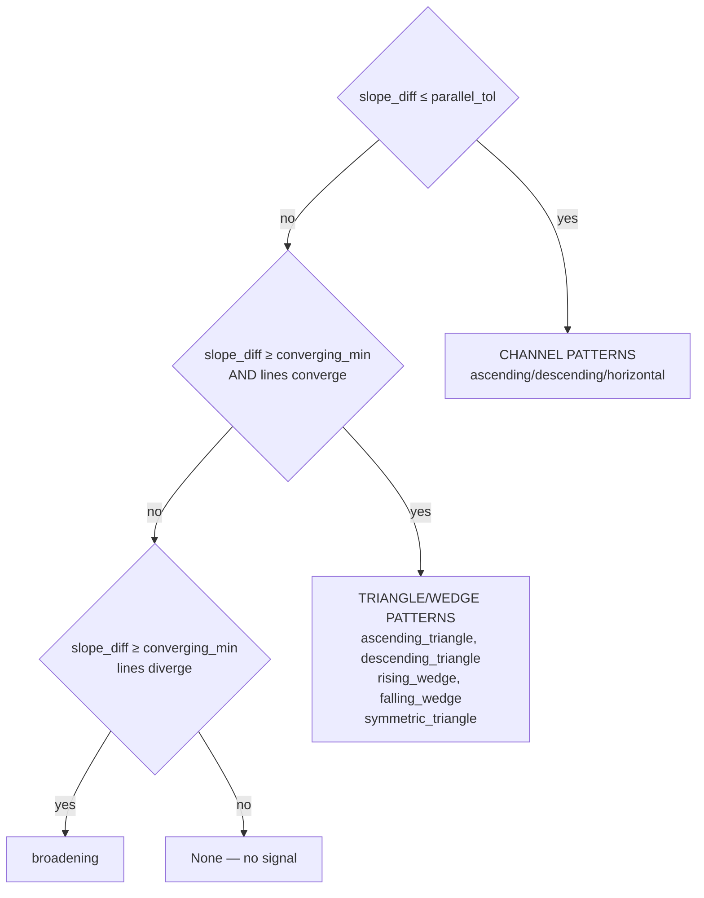

# Signals

The signals layer extracts directional alpha signals from a `BoundaryResult` snapshot.
It is owned entirely by `app/trendlines/signals/` and has no dependency on `app/alpha/`.

## Core Contracts (`signals/base.py`)

### AlphaSignal

| Field | Type | Constraint | Description |
|-|-|-|-|
| `name` | `str` | — | Unique signal identifier (e.g. `"interaction_geometric_bounce_support"`) |
| `direction` | `float` | clamped `[-1.0, 1.0]` | Positive = bullish, negative = bearish, 0 = neutral |
| `confidence` | `float` | clamped `[0.0, 1.0]` | Signal conviction |
| `source` | `str` | — | Extractor name (used for weight lookup) |
| `timeframe` | `str` | — | Timeframe this signal applies to |
| `metadata` | `dict` | — | Extractor-specific diagnostic context |

Properties: `is_long`, `is_short`, `strength` (= `abs(direction) × confidence`).
Serialized via `.to_dict()` (rounds floats to 4 decimals, includes computed `strength`).

### BaseAlphaExtractor

Abstract base class. All extractors implement:

```python
def extract(
    result: BoundaryResult,
    history: Optional[List[BoundaryResult]],
    context: Optional[Dict[str, Any]],
) -> List[AlphaSignal]:
    ...
```

Extractors return zero or more signals per call. An empty list is valid.

## TrendlineSignalOrchestrator (`signals/orchestrator.py`)

Runs all extractors and aggregates results into a composite signal.

### Construction

```python
from libs.models.trendlines.signals import TrendlineSignalOrchestrator
from libs.models.trendlines.config import TrendlinesConfig
from libs.models.trendlines.config.resolve import resolve_asset_config

# Preferred: from ResolvedConfig (per-asset/TF resolved params)
resolved = resolve_asset_config(TrendlinesConfig(), "BTCUSDT", "1h", df)
orch = TrendlineSignalOrchestrator(resolved_config=resolved)

# Legacy: from TrendlinesConfig (uses defaults only)
orch = TrendlineSignalOrchestrator(trendlines_config=TrendlinesConfig())

# With custom weights (source_name → float)
orch = TrendlineSignalOrchestrator(
    resolved_config=resolved,
    weights={"structural": 1.5, "fakeout": 0.5},
)
```

Default extractors (in order): `StructuralAlphaExtractor`, `TemporalAlphaExtractor`,
`PatternAlphaExtractor`, `FakeoutAlphaExtractor`.

### `.run(result, history, context) -> dict`

| Output key | Type | Description |
|-|-|-|
| `signals` | `List[AlphaSignal]` | All signals across all extractors |
| `composite_direction` | `float` | Weighted aggregate direction |
| `composite_confidence` | `float` | Weighted aggregate confidence |
| `signal_count` | `int` | Total signals emitted |
| `by_source` | `dict[str, List[dict]]` | Signals grouped by extractor source name |

### Composite Aggregation

```
For each signal:
    weight = weights.get(signal.source, default_weight)
    weighted_dir  += signal.direction  × signal.confidence × weight
    weighted_conf += signal.confidence × weight
    total_weight  += weight

composite_direction  = clamp(weighted_dir  / total_weight, -1, 1)
composite_confidence = clamp(weighted_conf / total_weight,  0, 1)
```

Extractor exceptions are caught and logged; that extractor contributes `[]` for that call.

## Extractor 1 — Structural (`signals/structural.py`)

Examines the **current** `BoundaryResult` geometry. Up to 3 signals per call.
Does not use history.

Params (via `ResolvedSignalConfig` kwargs): `asymmetry_threshold`, `squeeze_threshold`,
`full_confidence_touches`. Architecture constants are hardcoded as module-level `_CONST` values.

### Signal: `interaction_{state}`

Fires when `result.interaction != "NONE"`.

```
direction = interaction_direction(result.interaction)   # ±1.0 from boundary/contracts.py

if best_line exists:
    touch_factor = clamp(best_line.touch_count / full_confidence_touches)
    confidence   = score_blend_weight × best_line.score + (1 - score_blend_weight) × touch_factor
    if "STRUCTURAL" in interaction:
        confidence *= structural_interaction_multiplier
else:
    confidence = base_interaction_confidence
```

Metadata: `{interaction, best_score, best_touches}`.

### Signal: `hull_squeeze`

Fires when `hull_width_atr < squeeze_threshold`. Indicates the price is compressed.

```
squeeze_ratio = 1.0 - (hull_width_atr / squeeze_threshold)
confidence    = squeeze_confidence_lo + (squeeze_confidence_hi - squeeze_confidence_lo) × squeeze_ratio
direction     = ±squeeze_direction_nudge if score(support) - score(resistance) > score_diff_threshold
                else 0.0
```

### Signal: `sr_asymmetry`

Fires when support/resistance balance is skewed.

```
count_asym = (n_support_rays - n_resistance_rays) / total_rays
score_asym = best_support.score - best_resistance.score
combined   = 0.5 × count_asym + 0.5 × score_asym

if |combined| >= asymmetry_threshold:
    direction  = sign(combined)
    confidence = clamp(|combined|)
```

## Extractor 2 — Temporal (`signals/temporal.py`)

Tracks **changes over history**. Requires `len(history) >= min_history`. Up to 4 signals.

Params (via `ResolvedSignalConfig` kwargs): `min_history`, `slope_match_tol`,
`convergence_rate_threshold`, `slope_accel_threshold`, `state_transitions` (dict).
Architecture constants are hardcoded as module-level `_CONST` values.



### Signal: `hull_convergence`

Detects whether the hull (support + resistance envelope) is tightening.

```
widths = [h.quality_metrics.hull_width_atr for h in recent history if > 0]
diffs  = [widths[i+1] - widths[i] for i in range(len-1)]
if mean(diffs) >= 0: return None   # not converging

convergence_rate = |mean(diffs)| / max(widths[0], 1e-9)
confidence = lo + (hi - lo) × clamp(convergence_rate / convergence_rate_threshold)
direction  = 0.0 (signals compression, not direction)
```

### Signal: `transition_{from}_to_{to}`

Fires on state-machine transitions. Looks up `(prev_interaction, curr_interaction)` in
`StateTransitionsConfig.as_dict()` for `(direction, confidence)`.

```
prev_state = history[-1].interaction
curr_state = result.interaction
if prev_state == curr_state: return None
lookup (prev_state, curr_state) → (direction, confidence)
```

14 transitions are configured. Unknown transitions produce no signal.

### Signal: `ray_persistence_bias`

Measures which side (support vs. resistance) has more persistent rays across history.

```
window        = last (min_history + 2) BoundaryResults from history
s_persist     = count_persistent_rays(support, window, slope_match_tol)
r_persist     = count_persistent_rays(resistance, window, slope_match_tol)
s_ratio       = s_persist / len(result.active_support_rays)
r_ratio       = r_persist / len(result.active_resistance_rays)
diff          = s_ratio - r_ratio

if |diff| < persistence_diff_threshold: return None
direction   = sign(diff)        # positive = support more persistent = bullish bias
confidence  = lo + span × |diff|
```

A ray "persists" if it appears in ≥ 50% of the window with matching kernel and similar slope.

### Signal: `slope_acceleration`

Detects whether support or resistance slopes are accelerating (steepening).

```
s_slopes = [h.best_support.slope for h in history if best_support exists]
r_slopes = [h.best_resistance.slope for h in history if best_resistance exists]
s_accel  = mean(diffs(s_slopes))   # series_acceleration()
r_accel  = mean(diffs(r_slopes))
combined = s_accel + r_accel       # both steepening up = bullish

if |combined| < slope_accel_threshold: return None
direction   = sign(combined)
confidence  = clamp(slope_accel_base + slope_accel_multiplier × |combined|)
```

## Extractor 3 — Pattern (`signals/patterns.py`)

Classifies the geometric shape formed by the support + resistance line pair. Emits one signal.

Params (via `ResolvedSignalConfig` kwargs): `parallel_tol`, `flat_tol`,
`full_confidence_touches`. Architecture constants (`_QUALITY_WEIGHT`, `_BLEND_*`) are
hardcoded as module-level `_CONST` values.

### Pattern Classification

```
s_slope = best_support.slope
r_slope = best_resistance.slope
slope_diff = |s_slope - r_slope|
```



| Pattern | Direction | Base Confidence | Condition |
|-|-|-|-|
| `ascending_channel` | +1.0 | 0.6 | both lines rising, slope_diff ≤ tol |
| `descending_channel` | -1.0 | 0.6 | both lines falling |
| `horizontal_channel` | 0.0 | 0.5 | both lines flat |
| `ascending_triangle` | +1.0 | 0.75 | resistance flat, support rising |
| `descending_triangle` | -1.0 | 0.75 | support flat, resistance falling |
| `rising_wedge` | -0.7 | 0.6 | both rising, converging (bearish compression) |
| `falling_wedge` | +0.7 | 0.6 | both falling, converging (bullish compression) |
| `symmetric_triangle` | ±0.3 | 0.65 | converging from opposite slopes (sign = mean slope) |
| `broadening` | 0.0 | 0.45 | diverging — neither flat, not converging |

### Confidence Calculation

```
quality_factor = quality_weight × (best_support.score + best_resistance.score) / 2
touch_factor   = clamp(total_touches / full_confidence_touches)
confidence     = base_conf × (blend_base + blend_quality × quality_factor + blend_touch × touch_factor)
```

## Extractor 4 — Fakeout (`signals/fakeout.py`)

Detects false breakouts and wick rejections. Uses history, context, and optionally volume.

Params (via `ResolvedSignalConfig` kwargs): `hold_bars`, `volume_lookback`,
`wick_rejection_ratio`.

### Signal: `false_breakout` / `false_breakdown`

Fires when price has re-entered the hull after a recent breakout.

```
if current interaction is in BREAKOUT_STATES: return None   # still in breakout

scan last hold_bars backwards for BREAKOUT_STATES:
    if found at position i:
        bars_since = i + 1
        direction  = -1.0 if was BREAKOUT else +1.0   # reversal
        confidence = 1.0 - (bars_since / (hold_bars + 1))  # decays with time
```

### Signal: `wick_rejection_support` / `wick_rejection_resistance`

Fires when the candle wick pierces a hull boundary but the close reverses.
Requires `context["ohlcv"]` and `context["atr"] > 0`.

```
up_penetration   = max(0, high - hull_ceiling)
down_penetration = max(0, hull_floor - low)
wick_ratio_up    = up_penetration / atr
wick_ratio_down  = down_penetration / atr

Resistance rejection: wick_ratio_up >= wick_rejection_ratio AND close <= hull_ceiling
    → direction=-1.0, confidence=clamp(wick_ratio_up)

Support rejection: wick_ratio_down >= wick_rejection_ratio AND close >= hull_floor
    → direction=+1.0, confidence=clamp(wick_ratio_down)
```

### Signal: `low_volume_breakout` / `low_volume_breakdown`

Fires when a breakout occurs on suspiciously low volume.
Requires volume data to be trustworthy (checked via `volume_is_trustworthy(context)`).

```
z_score = (current_volume - mean(last volume_lookback bars)) / std(...)
if z_score > 0: return None   # above-average volume = suspicious not relevant here

direction  = -0.5 if STRUCTURAL_BREAKOUT else +0.5   # fade the suspected-fake breakout
confidence = clamp(|z_score|)
```

### Signal: `confirmed_breakout` / `confirmed_breakdown`

Fires when the same breakout direction is seen repeatedly in recent history (retest pattern).

```
threshold = max(hold_bars // 2, 1)
breakout_count  = count STRUCTURAL_BREAKOUT in last hold_bars window
breakdown_count = count STRUCTURAL_BREAKDOWN in last hold_bars window

if STRUCTURAL_BREAKOUT and breakout_count >= threshold:
    direction=+1.0, confidence=breakout_count/hold_bars, name="confirmed_breakout"
```

## Quality Module (`signals/quality.py`)

Stateless helper functions using hardcoded constants. Not called by the extractors directly —
called by `app/alpha/` confluence layer.

### `blended_quality_score(price_quality, agreeing_qualities) -> float`

```
mean_agreeing = mean(agreeing_qualities)
result = _PRICE_BLEND_W × clamp(price_quality)
       + _AGREEING_BLEND_W × clamp(mean_agreeing)
return clamp(result)
```

### `confluence_confidence(gate_config, gate_applies, agreement_ratio, quality_score, agreeing_oscillators) -> float | None`

Returns `None` when the gate blocks a signal. Three modes:
- `coarse_gate`: `base + scale × agreement_ratio` (ignores quality_score)
- `soft_weight`: `scale × (base + scale × agreement_ratio) + base × quality_score`
- `score_only`: `quality_score` (ignores oscillator agreement)

When `gate_applies=True`, first checks `agreeing_oscillators >= min_agreeing_oscillators` and
`agreement_ratio >= min_agreement_ratio`; returns `None` if either fails.

### `oscillator_quality_for_direction(osc, price_dir) -> float`

4-factor quality score for an oscillator direction context:

```
weights = _OSC_WEIGHTS   # (w0, w1, w2, w3) = (0.5, 0.25, 0.15, 0.10)
result  = w0 × base_score
        + w1 × touch_component
        + w2 × fit_component (r_squared)
        + w3 × activation (normalized_magnitude normalized to touch_count)
return clamp(result)
```

## Constants (`signals/constants.py`)

```python
BULLISH_INTERACTIONS = frozenset({"GEOMETRIC_BOUNCE_SUPPORT", "STRUCTURAL_BREAKOUT"})
BEARISH_INTERACTIONS = frozenset({"GEOMETRIC_BOUNCE_RESISTANCE", "STRUCTURAL_BREAKDOWN"})
BREAKOUT_STATES      = frozenset({"STRUCTURAL_BREAKOUT", "STRUCTURAL_BREAKDOWN"})
INSIDE_STATES        = frozenset({"NONE", "GEOMETRIC_BOUNCE_SUPPORT", "GEOMETRIC_BOUNCE_RESISTANCE"})
```

`STATE_TRANSITIONS` is empty at module level — values come from `build_state_transition_table()`
in `config/state_transitions.py`, injected by the orchestrator at construction time.

## Utils (`signals/utils.py`)

| Function | Signature | Description |
|-|-|-|
| `volume_is_trustworthy` | `(context) -> bool` | Checks `context["volume_is_trustworthy"]` key |
| `z_score` | `(current, values) -> float` | `(x - mean) / std`, 0.0 on zero-std |
| `series_acceleration` | `(series) -> float` | Mean of first differences |
| `has_matching_ray` | `(target, candidates, tol) -> bool` | Kernel match + slope within tol |
| `count_persistent_rays` | `(current, window, is_support, tol) -> int` | Rays appearing in ≥50% of window |
