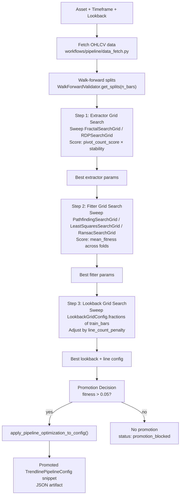

# Workflows

The workflows layer (`app/trendlines/workflows/`) owns optimization, promotion, and monitoring
for the trendlines pipeline. It consumes data contracts, the pipeline, and the registry — but
does not depend on the signal or boundary layers directly.

## Research Foundation Roadmap

The canonical research path is deliberately separate from optimization and promotion:

```text
L2-A1  data and YAML-resolved configuration preparation
L2-A2  causal replay, diagnostics, and evidence APIs
L2-B   thin notebook and TVLC presentation
L2-D1  causal adequacy scope, identities, metrics, and null definitions
L2-D2  structural stability measurements
L2-D3  causal interaction utility measurements
L2-D4  frozen naive/null comparison
L2-D5  multi-window, multi-asset, and sensitivity robustness
```

L2-A1 returns validated frames, source/dataset identities, and fully explicit pipeline configs.
It does not run pivots, fitters, signals, replay, optimization, holdout evaluation, or promotion.
Synthetic smoke mode is network-free. Binance research requires explicit event and knowledge
bounds and uses the current native ingestion adapter through an application-side bridge.

### Causal Replay and Evidence (L2-A2)

Canonical research replay consumes prepared data/configuration only. It slices exact prefixes,
uses each prefix's final availability as query knowledge time, and calls only public boundary or
signal facades in explicit `RESEARCH` mode. `record_every` controls evidence density, never
execution: skipped positions still update boundary revision history and influence later signals.

Replay diagnostics expose snapshot, authoritative pivot-count, fitted-line, active-ray, and native
signal rows with stable IDs. Selected pivot inspection is separate, explicit, and limited to one
recorded position. Future-row invariance compares compatible causal scope and shared source,
checkpoint, stage identities, serialized content, and replay-point identity; independently
truncated preparations may have different parent dataset and preparation IDs. Replay-point content
digests detect post-identity mutation.

Evidence bundles are deterministic sorted JSON and content-addressed. Snapshot rows bind exact
replay coordinates to point/content IDs. Every pivot-count, line, ray, and signal row binds that
same coordinate and has a recomputed row evidence ID. Read validation checks row reassignment,
stale geometry IDs, duplicate IDs, per-coordinate counts/ordinals, replay-spec coordinate
coverage, and summary execution counts. Bundles are written only by an explicit persistence
call and reject stale hashes plus semantically contradictory selection, diagnostic rows,
summaries, and bounds on read. L2-A2 does not fetch data, optimize parameters, access holdouts,
persist SQLite, create notebooks, or render TVLC/Plotly views.

### Package-local L2-B viewer

The first presentation layer lives under
`libs.models.trendlines.research_viewer`, not under `src/apps`. The notebook imports
that package explicitly and consumes only one validated evidence bundle. The viewer
does not duplicate replay, model, history, data-fetch, configuration, or diagnostic
logic. Its strict payload keeps model `source_id`/prefix identities separate from
`display_window_id`, which identifies only candles shown on the chart.

The loopback server validates the exact two-file bundle before binding, rejects
non-loopback hosts, traversal, symlinked files, unknown paths, non-canonical JSON,
and cached responses. The notebook synthetic smoke path makes zero provider calls.
Explicit Binance use remains research-only and requires an authorized injected
loader. L2-B itself does not use real Binance data.

## Causal adequacy foundation (L2-D1)

The package-local adequacy foundation freezes evaluation windows and recorded
coordinates before any quality study runs. It requires causal-prefix-only
availability, binds event and availability timestamps to replay identities,
records study-level minimum warm-up and prior-executed-prefix requirements, and
uses explicit treatment for invalid outputs. Fitted lines and boundary rays
remain separate observation units. Windows must intersect replay-recorded
positions; no points are synthesized.

Metric definitions declare phase, unit, direction, description, and whether
future rows are required. Unambiguous utility directions are explicit; raw
geometry/event counts remain descriptive. Decision thresholds are finite,
explicit study inputs covering an ordered subset of selected metrics, with
minimum observation floors; L2-D1 never evaluates them. Baseline contracts
name naive/null geometry families, seeds and repetitions where needed, preserved
attributes, and reject any future-data policy. Baselines are defined only here;
they are not generated or executed.

`TrendlineAdequacyCohort` content-addresses prepared dataset/source and
availability identities together with configuration, replay specification, and
study scope. Replay scope is immutable and self-checked against cohort ID.
Observation collection first invokes canonical replay-point integrity validation,
then validates point event time, complete-bar availability, checkpoint source
horizon, boundary known-at, and signal knowledge metadata. It emits compact
descriptive counts only, retaining invalid points while excluding them from
geometry eligibility counts. No adequacy outcome, promotion status, parameter
tuning, provider call, or model change is part of L2-D1.

## Pipeline Optimization Workflow

### Overview

The optimization workflow finds the best extractor/fitter hyperparameter combination for a
given asset and timeframe using a 3-step greedy sweep evaluated via walk-forward cross-validation.



### Step 1 — Extractor Grid Search (`evaluation.py`: `search_pipeline_parameters`)

For each combination in the extractor's search grid:
```
score = evaluate_pivot_count(extractor_params, walk_forward_splits)
      = pivot_density_score × (1 / (1 + std_piv / mean_piv))
```

Pivot scoring uses **density** (pivots per 100 bars) rather than absolute counts, making the
constraint portable across timeframes and training window sizes:

- `pivot_density_min=2.0`: below this, score=0 (not enough structure).
- `[density_optimal_lo=8.0, density_optimal_hi=25.0]`: optimal range, score=1.0.
- Above `density_optimal_hi`: tent decay reaches 0 at 2× the upper bound.

Stability = inverse of coefficient of variation across folds (consistent pivot counts preferred).

> **Note:** Expected density should still be interpreted with awareness of timeframe, volatility
> regime, and pivot window. The density guardrail is a sanity check — not a tight constraint.
> Adaptive pivot invalidation (ATR-based reversal thresholds) may further improve pivot quality
> in future iterations.

### Step 2 — Fitter Grid Search

Runs the full `extract → fit → evaluate_trendlines_on_forward()` fitness computation for each
fitter hyperparameter combination. Selects the combination with highest `mean_fitness` across
walk-forward folds.

### Step 3 — Lookback Grid Search

Tests a range of lookback windows as fractions of `train_bars` (default: 0.4×, 0.6×, 0.8× of
train_bars, capped at `min_bars=20`). Applies a line count penalty:

```
if total_lines > line_count_penalty_threshold (6):
    penalty = max(0.3, 1.0 - (total_lines - 6) × line_count_penalty_factor)
else:
    penalty = 1.0

adjusted_fitness = mean_fitness × penalty
```

This discourages configurations that produce too many lines (overfitting signal).

## Fitness Function (`evaluation.py`: `evaluate_trendlines_on_forward`)

The fitness function measures how useful the fitted lines are for forward prediction.

```
fitness = mean_longevity × (1 - mean_penetration_rate) × max(touch_accuracy, touch_accuracy_floor)
```

### Component Definitions

**Penetration tolerance** (shared by all tiers): The band around a projected line within which
price is NOT considered to penetrate. Uses the larger of slope-based or ATR-based tolerance:

```
tolerance = max(|slope| × slope_tolerance, ATR × min_tolerance_atr_frac)
```

The ATR floor (`min_tolerance_atr_frac=0.1` by default) ensures flat or gentle trendlines
still have a meaningful tolerance band proportional to the asset's volatility, preventing
spuriously high penetration rates on volatile assets with near-horizontal S/R lines.

**Longevity** (`0.0 – 1.0`): Fraction of test bars that a line survives before expiry.
A line expires when it has `consecutive_penetration_bars=3` consecutive bars with `close`
penetrating the line beyond the tolerance band.

```
longevity = (expiry_bar - start_bar) / n_test_bars
```

**Penetration rate** (`0.0 – 1.0`): Average fraction of test bars where `close` is on the
wrong side of the line beyond the tolerance band.

```
penetration_rate = n_penetration_bars / n_test_bars
```

**Touch accuracy** (`0.0 – 1.0`): On each touch (price within the tolerance band in the test
window), checks whether the price moved in the expected direction over the next
`forward_lookahead_bars=3` bars.

```
touch_accuracy = confirmed_direction_touches / total_touches
```

`touch_accuracy_floor=0.01` prevents fitness from collapsing to exactly 0 due to no touches.

### Worked Example

```
A line survives 600 of 720 test bars → longevity = 0.833
Price penetrates on 72 bars → penetration_rate = 0.1
8 of 10 touch events confirm direction → touch_accuracy = 0.8

fitness = 0.833 × (1 - 0.1) × max(0.8, 0.01) = 0.833 × 0.9 × 0.8 = 0.600
```

## Promotion Logic (`workflows/common/promotion.py`)

### `decide_pipeline_promotion(result, fitness_threshold=0.05) -> WorkflowPromotionDecision`

```
if n_windows <= 0:
    status = "failed_no_windows"
    should_promote = False

elif best_fitness > TRENDLINE_PIPELINE_PROMOTION_FITNESS_THRESHOLD (0.05):
    status = "promotion_recommended"
    should_promote = True

else:
    status = "promotion_blocked"
    should_promote = False
```

`WorkflowPromotionDecision` fields:

| Field | Type | Description |
|-|-|-|
| `status` | `str` | `promotion_recommended` / `promotion_blocked` / `failed_no_windows` |
| `should_promote` | `bool` | Whether to apply the config |
| `selected_candidate` | `dict \| None` | Best hyperparameter combination found |
| `reason` | `str` | Human-readable explanation |
| `metadata` | `dict` | `best_fitness`, `n_windows`, `temporal_split_locked=True` |

### `apply_pipeline_optimization_to_config(result, base_config) -> TrendlinePipelineConfig`

Merges the promoted hyperparameters into the base config. Called by the CLI after a successful
promotion decision.

## Bayesian Optimization (`optimization/optimizer.py`)

The Bayesian optimizer (`TrendlinesOptimizer`) runs Optuna-based hyperparameter search with
a 5-tier composite objective evaluated via walk-forward cross-validation.

### Fitter Selection

The optimizer uses the `fitter` field in `TrendlinesOptimizationConfig` (default: `"ensemble"`)
to select the fitter for each trial fold. The ensemble fitter pools lines from all three
registered fitters (pathfinding, least-squares, RANSAC) and deduplicates near-identical lines,
yielding up to 3 support + 3 resistance lines per fold instead of the 1+1 from any single fitter.

### Fold Aggregation

Boolean metrics (`passed_penetration_gate`, `passed_pivot_constraint`) use **robust aggregation**
instead of unanimous `all()`:

1. **Pass-rate check**: ≥ 70% of folds must pass individually.
2. **Tail-risk check**: 90th percentile of per-fold pen_rate must be ≤ 0.6.

This prevents a single volatile fold (flash crash, regime break) from killing an otherwise good
trial, while still catching configurations that hide catastrophic folds behind a simple majority.

Numeric metrics (longevity, touch_accuracy, pen_rate, etc.) are averaged across folds.

## Workflow Contracts (`workflows/common/contracts.py`)

```python
@dataclass
class WorkflowExperimentSpec:
    asset: str
    timeframe: str
    workflow_kind: str
    run_id: str
    metadata: dict

@dataclass
class PipelineOptimizationSpec(WorkflowExperimentSpec):
    workflow_kind: str = "pipeline_optimization"
```

Semantics version: `"2026-04-08-v1"` — identifies the contract schema for artifact replay.

## Drift Monitor (`workflows/monitoring/drift_monitor.py`)

Compares current pipeline metrics against a stored baseline to detect performance degradation.

### `compare(current_metrics, baseline_metrics, threshold=0.15) -> DriftReport`

For each metric:
- **Higher-is-better** (longevity, touch_accuracy, fitness): flag drift if
  `(current - baseline) / baseline < -threshold`
- **Lower-is-better** (penetration_rate): flag drift if
  `(current - baseline) / baseline > +threshold`

`threshold=0.15` (15% degradation) by default. Overridable via `DriftMonitorConfig`.

```python
from libs.models.trendlines.workflows.monitoring.drift_monitor import compare

report = compare(
    current_metrics={"fitness": 0.42, "longevity": 0.70},
    baseline_metrics={"fitness": 0.58, "longevity": 0.83},
    threshold=0.15,
)
print(report.has_drift)     # True
print(report.drifted_keys)  # ["fitness", "longevity"]
```

Default baseline file: `"trendlines_boundary_baseline.json"` (written by the optimization workflow).

## CLI (`cli.py`)

```
python -m libs.models.trendlines.cli --help

Subcommands:
  pipeline-opt    Run full optimization sweep for an asset/timeframe
  drift-monitor   Compare current metrics against baseline
```

### `pipeline-opt`

```
python -m libs.models.trendlines.cli pipeline-opt \
    --asset BTCUSDT \
    --timeframes 1h \
    --lookback-days 120 \
    --extractor fractal \
    --fitter pathfinding
```

Runs the 3-step optimization, writes the promoted config snippet and temporal split manifest
to the artifact directory.

### `drift-monitor`

```
python -m libs.models.trendlines.cli drift-monitor \
    --asset BTCUSDT \
    --timeframe 1h \
    --baseline trendlines_boundary_baseline.json \
    --threshold 0.15
```

Loads the baseline, fetches current data, runs the pipeline, and reports any drifted metrics.

## Research Lab Workbench

The full notebook workbench lives in `research/trendlines_research_lab.ipynb` and
uses the explicit package-local `libs.models.trendlines.research_lab` layer. It
supports synthetic smoke, injected/local frames, and explicitly authorized
Binance research requests through the existing source-agnostic preparation APIs.

The workbench runs multi-timeframe causal replay, builds per-timeframe evidence,
opens package-local TVLC viewers, and exposes deterministic Pandas tables for
sources, resolved YAML configuration, replay points, pivots, lines, rays, native
signals, knowledge-time history, comparisons, timings, and explicit exports.
Navigation selects an already recorded position and does not execute replay again.
Viewer/server lifecycle is owned by the lab session; the final notebook cell
closes all viewers and removes temporary bundles.

The notebook is read-only with respect to YAML and has no Plotly, RegimeV2,
retired connector, notebook-owned model loop, or notebook-owned chart JavaScript.
Adequacy metrics and oscillator trendlines are intentionally deferred.

Research-lab lifecycle is terminal after `TrendlineResearchLabSession.close()`:
selection and viewer-opening operations fail closed, repeated close is safe, and
owned viewer servers plus temporary bundle roots are removed. Provider-call
counts are resolved from `provider_calls` after preparation, with `calls` only
as an explicit compatibility seam; Binance runs without truthful accounting are
rejected. Notebook viewers use explicit per-timeframe IFrame display calls, and
navigation replaces the selected viewer without replay. Presentation timing is
kept outside research identity. Explicit export tables expand viewer directories
into manifest/payload files and report byte lengths plus lowercase SHA-256
digests.

## Workflow File Map

```
workflows/
├── common/
│   ├── contracts.py       # WorkflowExperimentSpec, PipelineOptimizationSpec
│   └── promotion.py       # decide_pipeline_promotion, apply_pipeline_optimization_to_config
├── pipeline/
│   ├── workflow.py        # Top-level pipeline-opt entrypoint and argument parsing
│   ├── engine.py          # Orchestrates 3-step search loop
│   ├── evaluation.py      # Fitness function, search_pipeline_parameters
│   ├── temporal_spec.py   # Lookback grid, auto-split resolution
│   ├── data_fetch.py      # Data loading with pagination (Binance limit=1000)
│   └── support.py         # Config snippet generation and apply helpers
└── monitoring/
    └── drift_monitor.py   # Metric drift comparison and reporting
```
